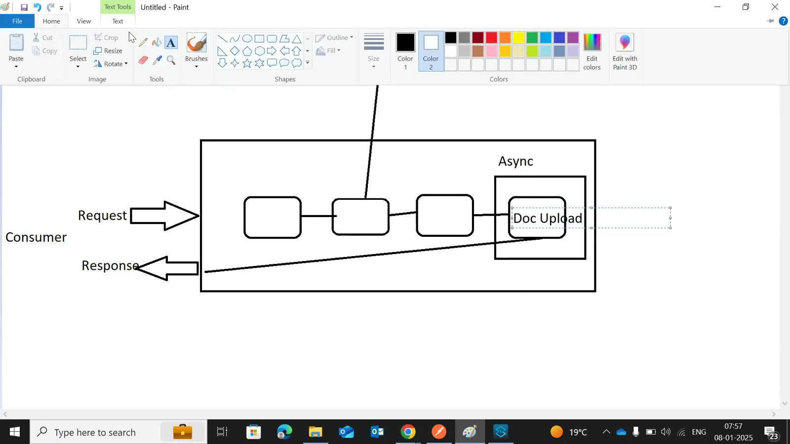
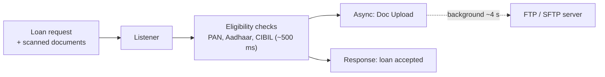
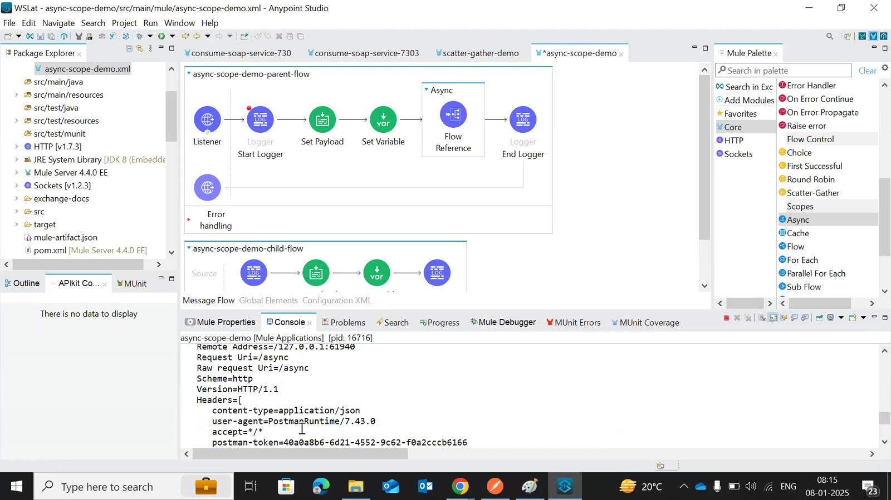
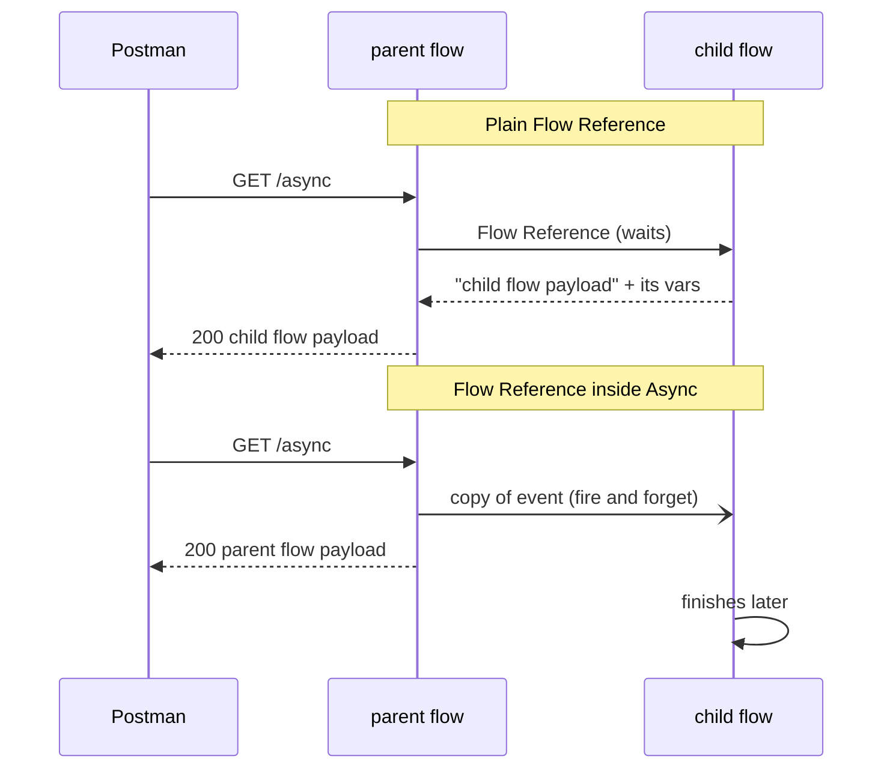
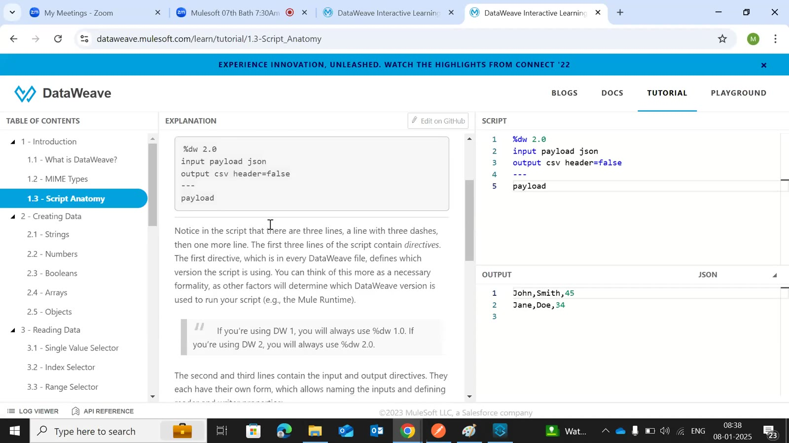
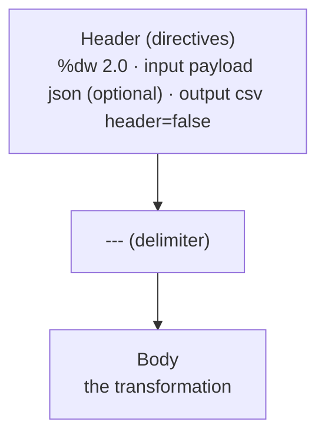
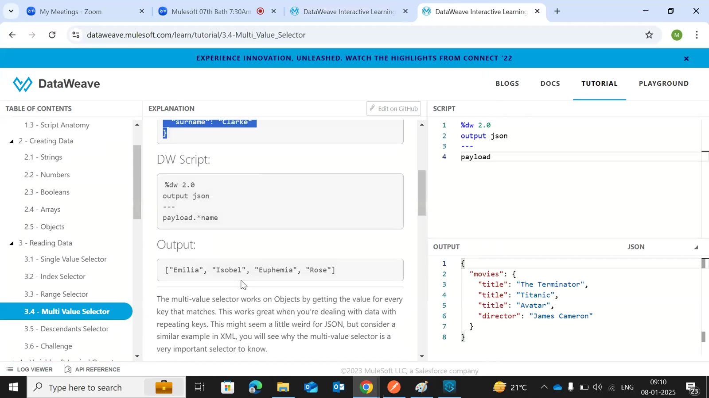

# Day 43 — Detailed Notes: Async Scope and DataWeave Basics (Playground, Anatomy, Selectors)

> **Watch alongside:**
> - The Async demo is short: compare the Postman response with a plain Flow Reference ("child flow payload") and with the Flow Reference inside Async ("parent flow payload").
> - The DataWeave half follows the Playground tutorial — script anatomy, MIME types and the five selectors. The instructor stresses that `.` and `[n]` are what you'll use most.

> **Video-verified:** written from the cleaned transcript and the class recording (8 Jan 2025). Slide images: [slides/day43](../slides/day43/).

---

## 1. Why Async

- Synchronous = the caller waits for every step.
- Asynchronous = the slow upload runs independently; the consumer gets the response at once.

---

## 2. Flow Reference vs. Async

- Async: Core → Scopes, or Wrap in → Async; it can hold several processors.
- Two flows with the same listener path → **"Already exists a listener matching that path and methods"**; remove the child's listener or use different paths.
- Port 8081 busy on a remote desktop → change the port.
- Async errors don't reach the consumer — use a queue/logs; design for **reliability**.

---

## 3. DataWeave Script Anatomy

- DataWeave = expression language for transformations and enrichment; we write 2.0.
- Default MIME type is **Java** — convert only when needed.
- `skipNullOn="everywhere"` removes nulls in JSON/XML output (error on CSV); empty strings aren't skipped.
- Playground is online — avoid sensitive payloads; use Preview / evaluate expression instead.

---

## 4. Selectors

| Selector | Syntax | Example | Notes |
|---|---|---|---|
| Single value | `.` | `payload.age` | First match only |
| Index | `[n]` | `payload[2]`, `payload[-1]` | From 0; negatives from the end |
| Range | `[a to b]` | `payload[0 to 1]` → ["prod", "qa"] | `-` means subtraction, not range |
| Multi-value | `.*` | `payload.*name`, `payload.movies.*title` | Array, current level only |
| Descendants | `..` | `payload..echo` | Any depth |

- Most used: single value + index combined (e.g. `payload[2][0][0].age`).
- Wrong paths return null.

---

## Quick Recap
- Async scope = fire and forget; the parent doesn't wait and doesn't get the child's payload or variables.
- Use it for slow side tasks like document uploads, with proper error handling for reliability.
- A DataWeave script is header (directives) + `---` + body; `input` is optional; default type is Java.
- `skipNullOn` drops nulls in JSON/XML.
- Selectors: `.`, `[n]`, `[a to b]`, `.*`, `..` — the first two cover most needs.
