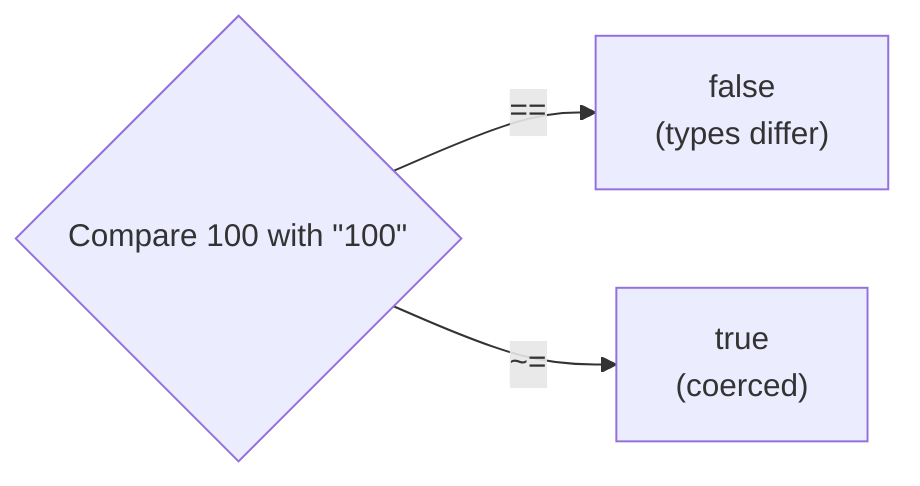
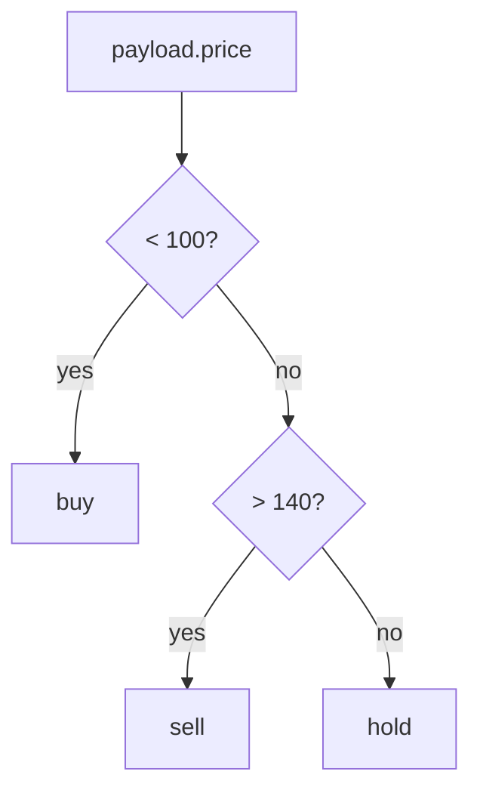

# Day 44 — Detailed Notes: DataWeave Variables, Operators, default, if/else, match, filter and filterObject

> **Watch alongside:**
> - A Playground session following the DataWeave tutorial. The parts worth replaying are `==` vs `~=` (including the `typeOf` trap) and `default` fixing the "Unable to call ++ with (String, Null)" error.
> - filter and filterObject are shown side by side so you remember which works on arrays and which on objects.

> **Video-verified:** written from the cleaned transcript and the class recording (9 Jan 2025). Slide images: [slides/day44](../slides/day44/).

---

## 1. Script Variables


```dataweave
var test = payload
var demo = test.message
---
{ var1: test.message, var2: demo }
```

- Declared with `var` in the header; used by name; scope = this script only.
- Good for shortening long repeated paths.

---

## 2. Equality and Logic




- `"1" == 1`, `"true" == true`, `|2020-01-01| == "2020-01-01"` → false; with `~=` → true.
- `typeOf(x) == "Number"` is always false — `typeOf` returns a type; use `~=`.
- `!`/`not`, `and`, `or` as usual.

---

## 3. default and ++


| Expression | Result |
|---|---|
| `payload.test1 ++ payload.test2` (test2 missing) | Error: Unable to call ++ with (String, Null) |
| `payload.test1 ++ (payload.test2 default "")` | Works |
| `payload.number1 + (payload.number2 default 0)` | Sum with 0 |
| `obj1 ++ obj2` | Merged object |

---

## 4. if / else if / match



- `if ((payload.price < 100) and payload.action == "buy") "buy" else "hold"` — strings are case sensitive.
- `do` gives a locally scoped variable — rare.
- `match { case "buy" -> … case "hold" -> "Hold asset" else -> "Invalid input" }` — like switch; rare.

---

## 5. filter vs. filterObject


| | filter | filterObject |
|---|---|---|
| Input / output | Array → array | Object → object |
| Lambda args | `(item, index)` / `$`, `$$` | `(value, key, index)` / `$`, `$$`, `$$$` |
| Class example | `payload filter ((item, index) -> isEven(item))` → [2,4,6,8,10] | `payload filterObject (value, key) -> key ~= "age"` |

- `payload filter ($.salary > 50000)` → Ramesh and Mahesh.
- In filterObject, `key == "age"` returns `{}` — keys are type **Key**; use `~=` or `key as String`.
- Argument order is fixed by the function (item first).

---

## Quick Recap
- `var` = script-scoped variable used by name.
- `~=` coerces types; `==` doesn't — watch `typeOf` comparisons.
- `default` supplies a value when a field is null; `++` joins strings, arrays and objects.
- if / else if / else for conditions; `match` for switch-style cases.
- filter for arrays, filterObject for objects; `$` / `$$` shorthands.
