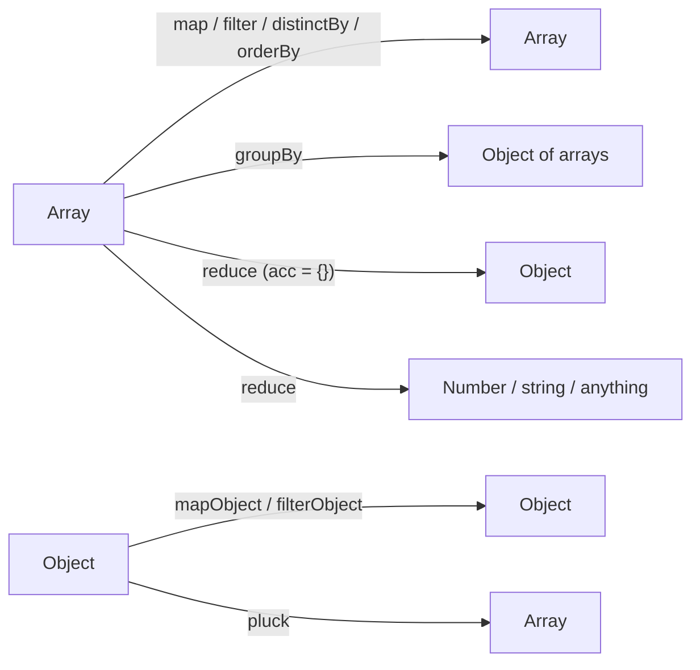
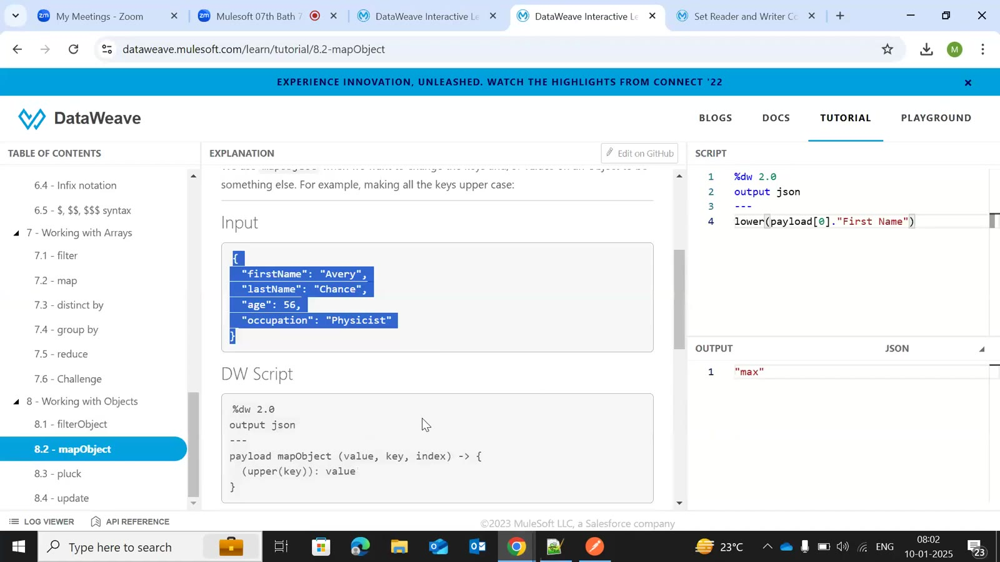
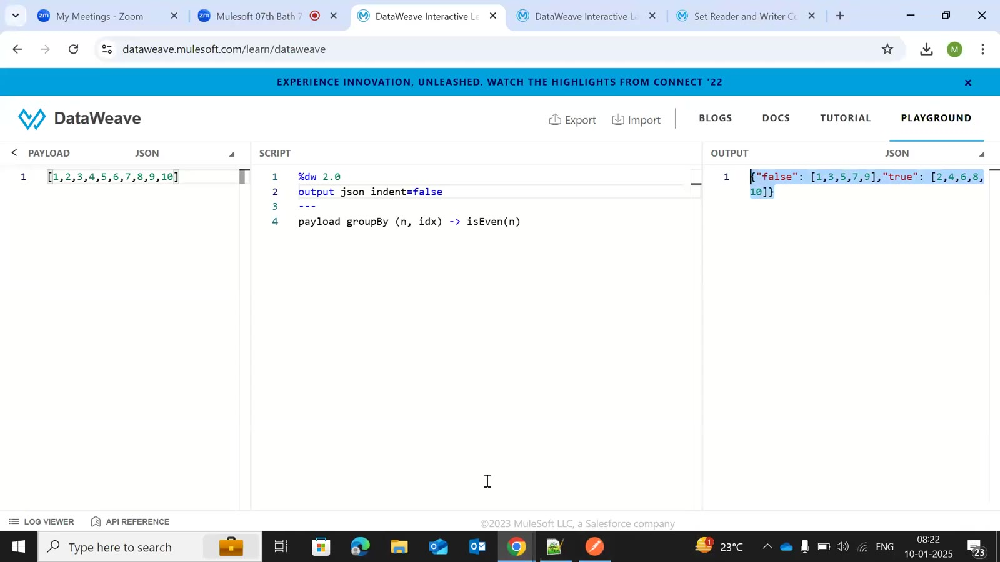
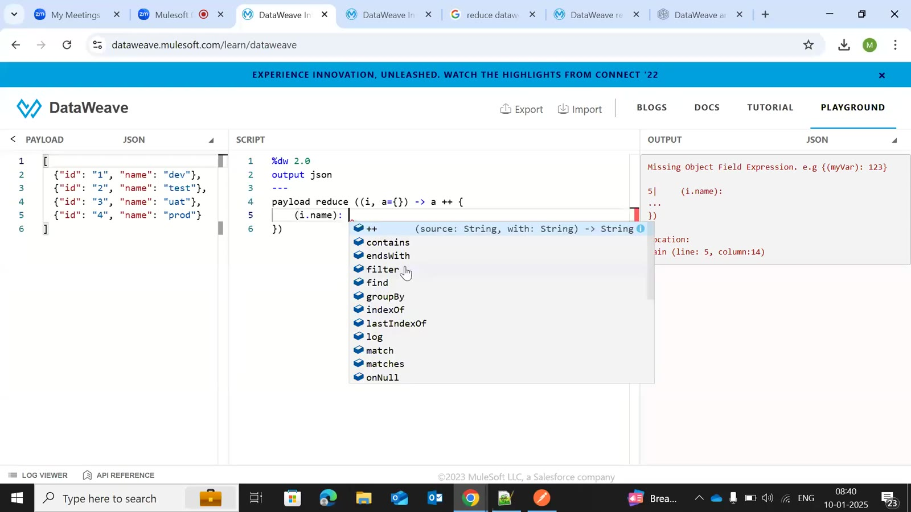
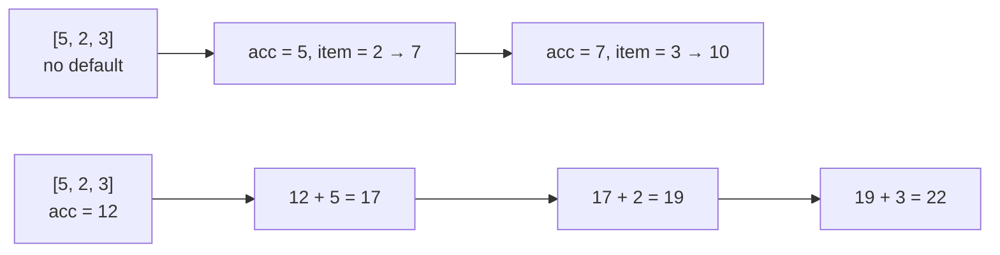
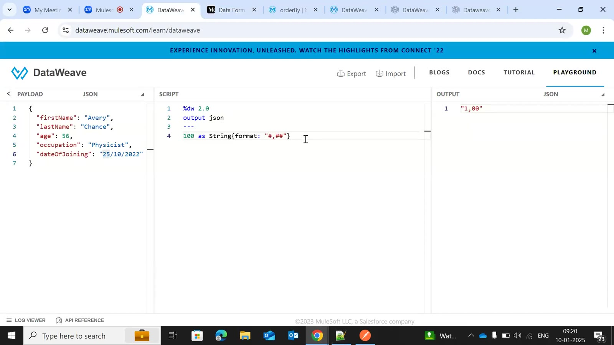
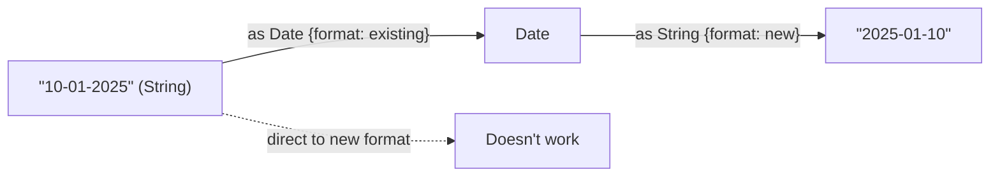

# Day 45 — Detailed Notes: map, mapObject, distinctBy, groupBy, reduce, orderBy, pluck, update, Dates and Numbers

> **Watch alongside:**
> - The Playground session that covers the array and object functions you'll use most. Watch the reduce part twice — the accumulator rules (first item by default, or your own start value) are what interviewers check.
> - Remember the two conversions: array → object with **reduce**, object → array with **pluck**.

> **Video-verified:** written from the cleaned transcript and the class recording (10 Jan 2025). Slide images: [slides/day45](../slides/day45/).

---

## 1. Which Function for Which Shape

---

## 2. map and mapObject

| Function | Example | Result |
|---|---|---|
| map | `payload map ((item, index) -> item + 1)` | [2,3,4,5,6] |
| map | `payload map { "value": $, "index": $$ }` | array of objects |
| mapObject | `payload mapObject (value, key, index) -> { (upper(key)): value }` | keys upper case |

- `(key)` in parentheses = the real key; without them it's the literal text "key".
- `indent=false` prints JSON on one line — handy when keeping the expected output in the Playground during an interview.

---

## 3. distinctBy and groupBy

- `payload distinctBy $.id` — drop duplicates.
- `payload groupBy (n, idx) -> isEven(n)` → `{"false": [1,3,5,7,9], "true": [2,4,6,8,10]}`.
- Calendar events grouped by `dayOfWeek`.

---

## 4. reduce

- `payload reduce ((item, acc = {}) -> acc ++ { (item.name): item.id })` — array → object.
- `acc = []` + `acc ++ [value.country ++ "-" ++ value.capital]` — array → array; without `[]` you get "++ with Object, String".

---

## 5. orderBy, pluck, update

| Function | Example | Note |
|---|---|---|
| orderBy | `payload orderBy ((item, index) -> item.age)` | `-$.age` for descending; can't order by a whole object |
| pluck | `payload pluck (v, k, idx) -> {(k): v}` | object → array |
| update | `case age at .age -> age + 1`, `.status!` | modify or add a field; rarely used |

---

## 6. Dates and Numbers

- `now()`; `>> "IST"` / `>> "GMT"`; CloudHub servers use **UTC**.
- `MM` month (caps), `dd`/`yy` small, `MMM` month name.
- `price as Number as String {format: "###.00"}` → "100.00"; `#` vs `0` in patterns.

---

## Quick Recap
- map/mapObject transform arrays/objects; dynamic keys need parentheses.
- distinctBy removes duplicates; groupBy returns an object of arrays.
- reduce loops with an accumulator — first item by default — and can return any type; array → object is the classic use.
- orderBy sorts (minus = descending); pluck turns an object into an array; update changes fields.
- Dates: convert the string using its own format first, then reformat; CloudHub is UTC.
- Numbers are formatted by converting to String with a format pattern.
