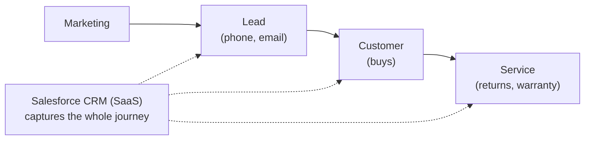
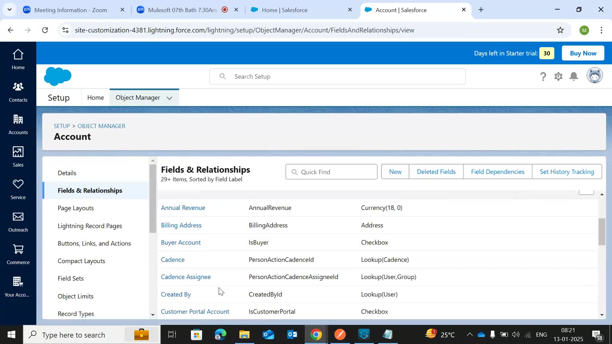
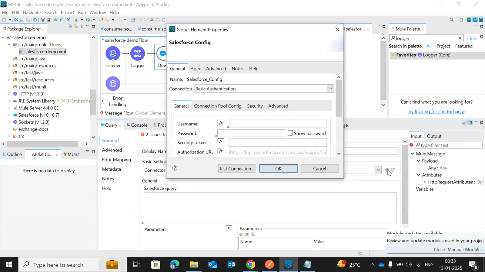
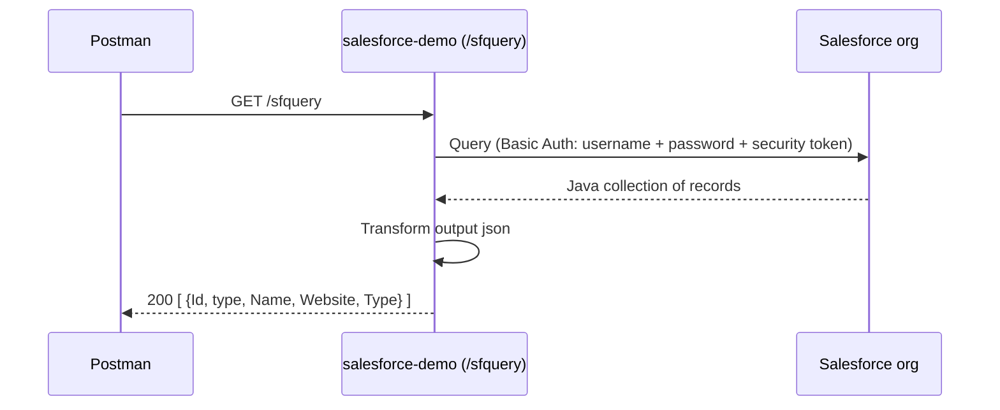
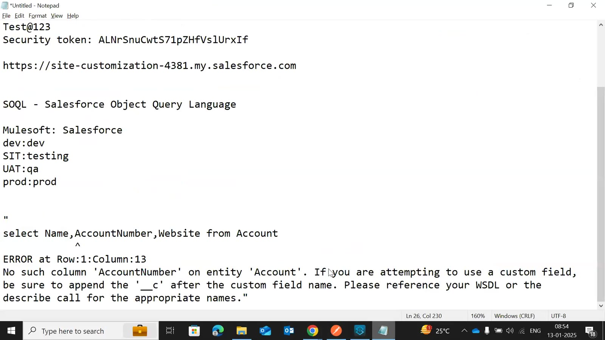
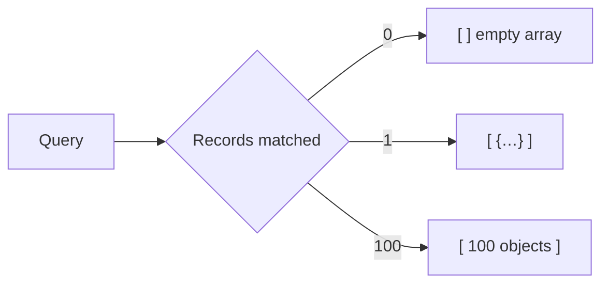
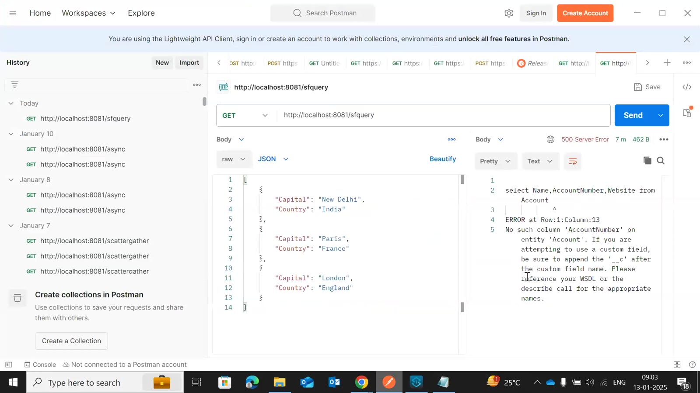

# Day 46 — Detailed Notes: Salesforce Connector Part 1 — CRM, Objects, Basic Auth and a SOQL Query

> **Watch alongside:**
> - The first half sets up a free Salesforce trial org and explains the vocabulary — object, field, record, standard vs. custom (`__c`). Use the Salesforce team's words when you talk to them.
> - The second half connects from Studio with **Basic Authentication** (username, password, security token) and runs a SOQL query. Notice that `select *` isn't allowed and that the result is always an array.

> **Video-verified:** written from the cleaned transcript and the class recording (13 Jan 2025). Slide images: [slides/day46](../slides/day46/). Credentials shown are from the expired 2025 trial org, as displayed in class.

---

## 1. Salesforce in One Picture

| Database | Salesforce |
|---|---|
| Table | Object (standard / custom `__c`) |
| Column | Field |
| Row | Record |
| SQL SELECT | SOQL Query |
| INSERT | Create |

---

## 2. The Trial Org and Object Manager

- developer.salesforce.com → free 30-day trial → verify email → change password.
- Gear → Advanced Setup → **Object Manager** → Account → **Fields & Relationships**.
- Always use the **API name** of objects and **field names** — labels are only for display.
- Data types include Name, Text, Lookup, Currency, Number, **Picklist** (like an enum).
- Profile → Settings → **Reset My Security Token**.

---

## 3. Connecting from Mule

- *Screen notes:* username `mcp292519-0cah@force.com`, password `Test@123`, security token `ALNrSnuCwtS71pZHfVslUrxIf`, org `https://site-customization-4381.my.salesforce.com`.
- Connection types: Basic Authentication, OAuth v2.0, **OAuth JWT**, OAuth SAML, OAuth Username Password — ask the Salesforce team which one.
- Use a **service account** and **property files** per environment (Mule SIT/UAT may map to Salesforce "testing"/QA).
- **Connection pooling:** connections kept ready (door left open for a known guest) — automatic for HTTP and Salesforce, configure it for Database.

---

## 4. SOQL and Results

- `select Name, AccountNumber, Website from Account` — list fields; no `*`.
- Error **SALESFORCE:INVALID_INPUT** "No such column 'AccountNumber'…" even though the field exists — queried Name, Website, Type instead; for such cases ask the Salesforce team.

---

## Quick Recap
- Salesforce is the leading SaaS CRM and owns MuleSoft; we integrate with it, the Salesforce team builds on it.
- Objects (standard / custom `__c`), fields and records replace tables, columns and rows.
- Basic Authentication needs username, password and security token, kept in property files.
- SOQL is like SQL but needs explicit field names (API names).
- Query results are Java arrays of records — empty when nothing matches.
- Next: creating and updating records.
