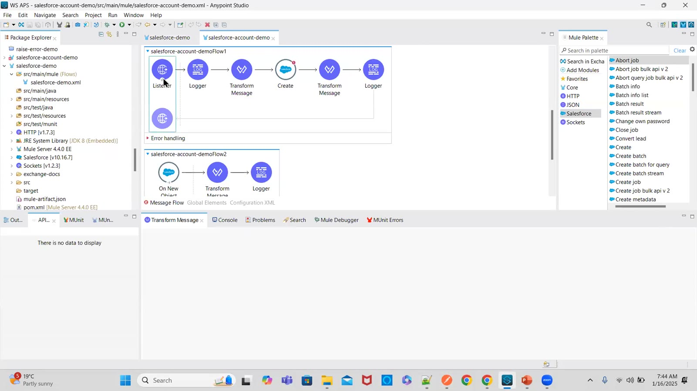
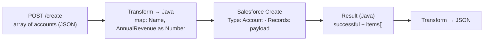
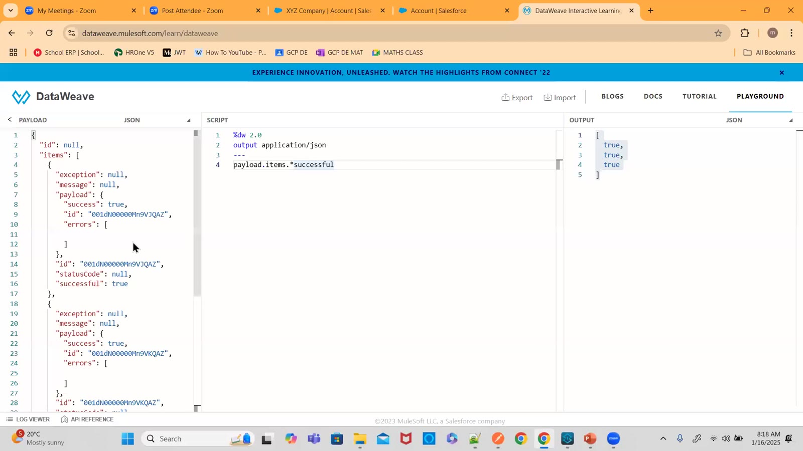
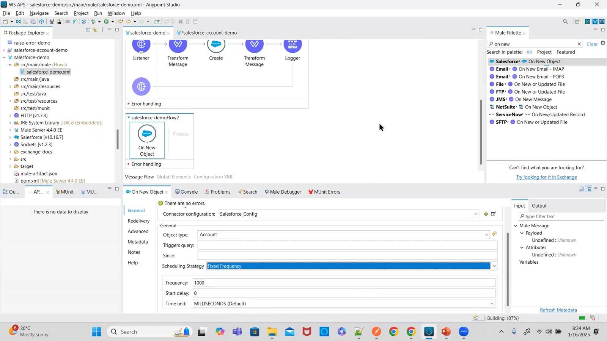
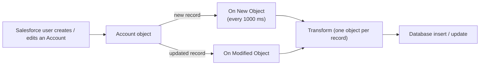
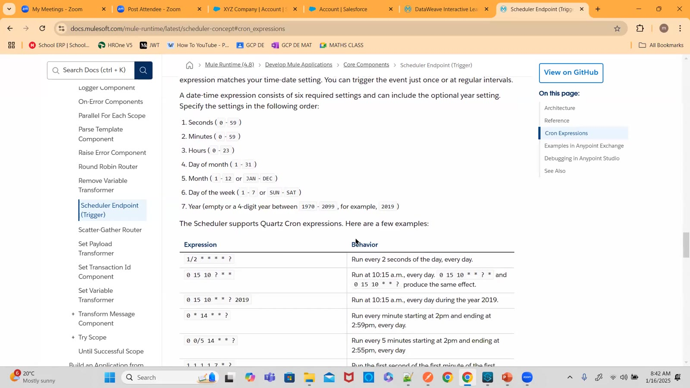
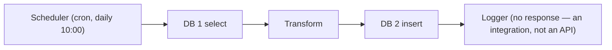

# Day 47 — Detailed Notes: Salesforce Create, Upsert, On New / On Modified Object and the Scheduler

> **Watch alongside:**
> - Create is easy once the Transform outputs **Java** with Salesforce field names. The useful parts are the **200-record limit** and reading `payload.successful` vs `payload.items[n].successful` for partial failures.
> - The second half moves to **source** operations — On New Object / On Modified Object — and the Scheduler with fixed frequency and cron, ending with the difference between an integration and an API.

> **Video-verified:** written from the cleaned transcript and the class recording (16 Jan 2025). Slide images: [slides/day47](../slides/day47/).

---

## 1. Creating Accounts

- Use the Salesforce team's **mapping sheet** (mandatory/optional fields).
- **Java** output avoids date-type conflicts; convert strings to numbers with `as Number`.
- Keep the mapping in a separate Transform so you can log what you send.

**200-record limit:**

| Option | Notes |
|---|---|
| Source sends ≤ 200 | Easiest |
| Batches | For Each with a batch size |
| Bulk Create Job | Returns a job ID; check status later |

---

## 2. Reading the Result

| Expression | Value |
|---|---|
| `payload.successful` | true only if every record succeeded |
| `payload.items.successful` | e.g. [true, false, true] |
| `payload.items[0].successful` | first record |

- "abcde" for Annual Revenue → **INVALID_TYPE_ON_FIELD_IN_RECORD** on that record only.
- An over-limit Currency value gave a misleading **SALESFORCE:CONNECTIVITY** — Test Connection passed, so it's data; ask the Salesforce team to check their logs.
- **Upsert** = update if the record exists, else create; Update and Delete also exist.

---

## 3. Polling Sources

- Records arrive **one object at a time** (55 fields for A Company).
- Use reconnection **forever** on sources (not on Create).
- Alternative: **Scheduler** + Query + remember the last sequence number in an Object Store.

---

## 4. Scheduling

| Strategy | Example |
|---|---|
| Fixed frequency | Every 5 hours — 10:00, 15:00, 20:00…; start delay 1 h → 11:00, 16:00… |
| Cron | `0 0 20 * * ?` = every day 8 PM; `0/15 * * * * ?` = every 15 s |

- Cron positions: seconds, minutes, hours, day of month, month, day of week, year.
- Set the time zone (`Asia/Kolkata`) — CloudHub uses its region's zone otherwise.
- Use an online cron generator.

---

## Quick Recap
- Create needs Salesforce field names, Java output and correct types; max 200 records per call.
- `payload.successful` covers all records; `items[n].successful` shows each.
- Upsert updates or inserts.
- On New Object / On Modified Object poll an object and deliver one record at a time.
- Scheduler: fixed frequency (with start delay) or cron with a time zone.
- A scheduled DB-to-DB or Salesforce-to-DB flow is an integration; an API responds to a consumer.
