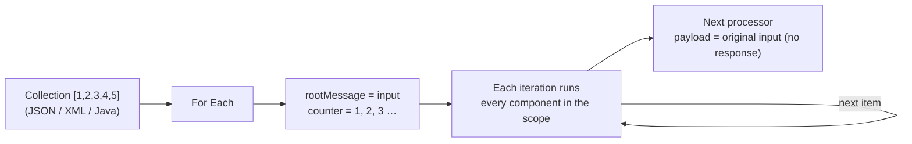
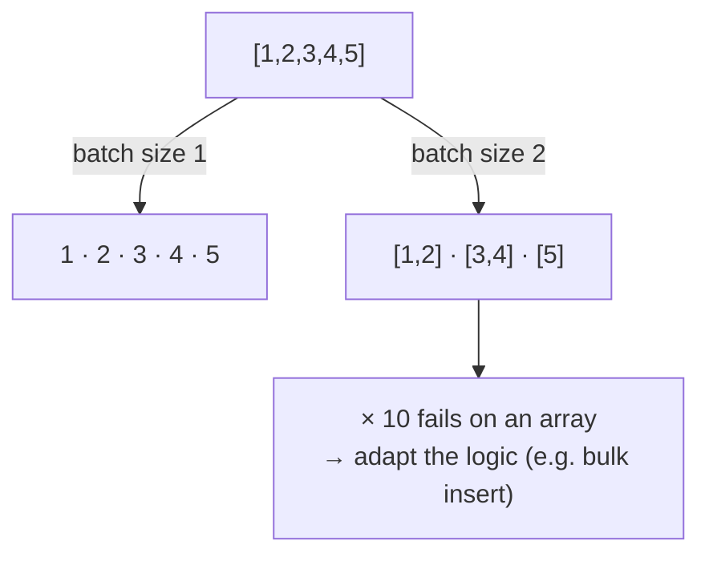
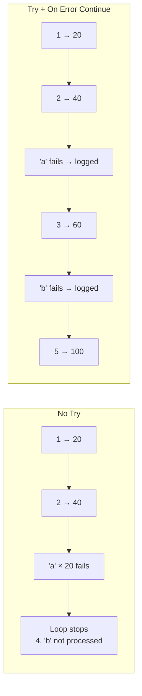
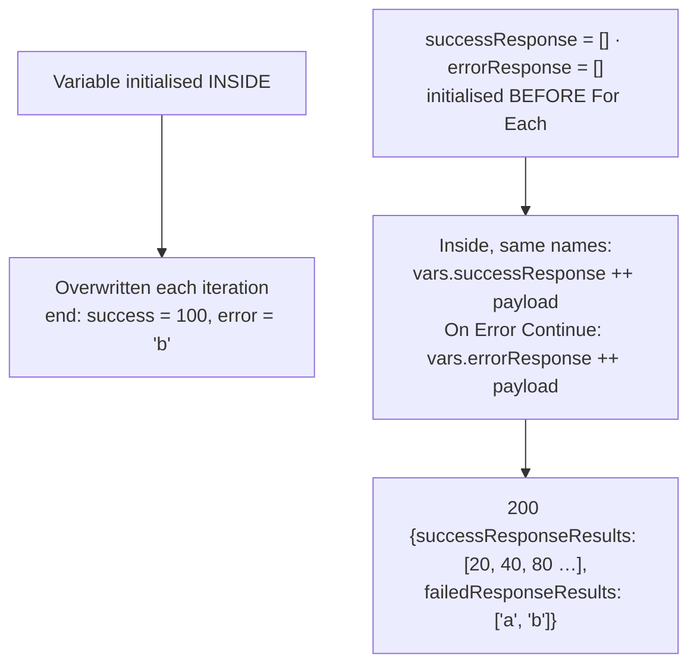
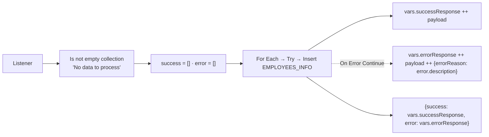

# Day 48 — Detailed Notes: The For Each Scope

> **Watch alongside:**
> - A whole session on one scope, deliberately slow. The simple `[1,2,3,4,5] × 20` demo shows what happens inside For Each: the two hidden variables, the payload coming back unchanged, the loop stopping on `"a"`, and how to collect results.
> - The employee-insert design is introduced here but run on Day 49 — read the two days together.

> **Video-verified:** written from the cleaned transcript and the class recording (17 Jan 2025). Slide images: [slides/day48](../slides/day48/) — e.g. [For Each flow](../slides/day48/04-foreach-flow.jpg), [config](../slides/day48/07-foreach-config.jpg), [batch size](../slides/day48/09-drawing-batch-size.jpg), [counter and rootMessage](../slides/day48/10-drawing-counter-root.jpg), [multiply error](../slides/day48/19-multiply-error.jpg), [final response](../slides/day48/22-postman-success-error.jpg).

---

## 1. How For Each Works

- Sequential, in array order; one operation or many per item.
- Use cases: each employee → DB insert (and Salesforce Create — wrap the object in an array; max 200 per call).
- Alternatives depend on the scenario: bulk insert, splitting into batches, Scatter-Gather when there's no dependency.

---

## 2. Configuration and Batch Size

| Setting | Default |
|---|---|
| Collection | `#[payload]` (or e.g. `vars.employees`) |
| Counter Variable Name | `counter` (starts at 1) |
| Batch Size | `1` |
| Root Message Variable Name | `rootMessage` |

- `counter` and `rootMessage` exist only during the loop; rootMessage holds the Collection's value (payload or a variable).

---

## 3. Errors Inside the Loop

*Screen:* "You called the function '\*' with these arguments: 1: String ("a") 2: Number (20)".

---

## 4. Collecting Results

| Propagation | After For Each |
|---|---|
| Payload | Same as before |
| Outside var modified inside | Modified |
| Var created inside | Visible, last iteration's value |
| counter / rootMessage | Removed |

*"There's no response from For Each — initialise two variables and aggregate the responses with the same variables inside."*

---

## 5. The Employee-Insert Design (run on Day 49)

> **Instructor's suggestion:** understand the business scenario first — data volume, steps — then map it to components.

---

## Quick Recap
- **For Each** iterates a collection sequentially and runs every component in the scope per item.
- It has **no response**; the payload after it is the **original** (kept in `rootMessage`).
- Config: Collection (`#[payload]`), **counter**, **Batch Size** (default 1), **rootMessage**.
- Batch size > 1 → each iteration gets an **array**.
- An error **stops** the loop; **Try + On Error Continue** keeps it going.
- Collect results in arrays **initialised before** the loop and accumulated with `++` under the same names.
- A variable created inside is visible outside with its last value.
