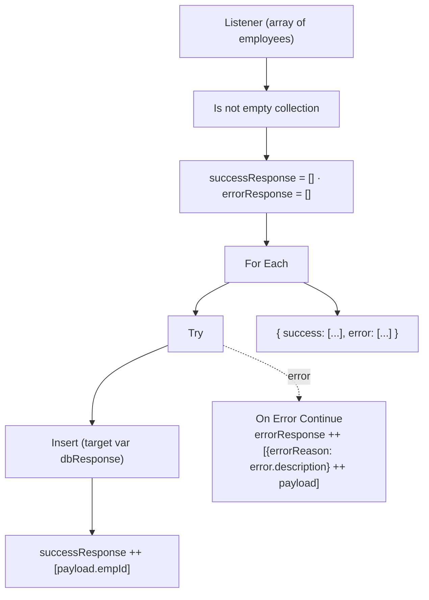
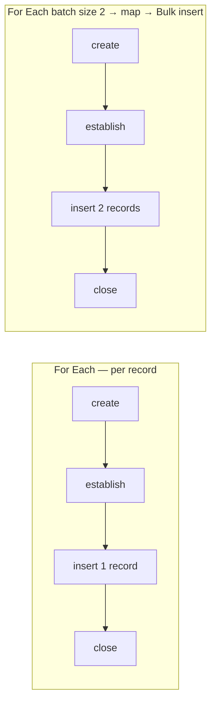
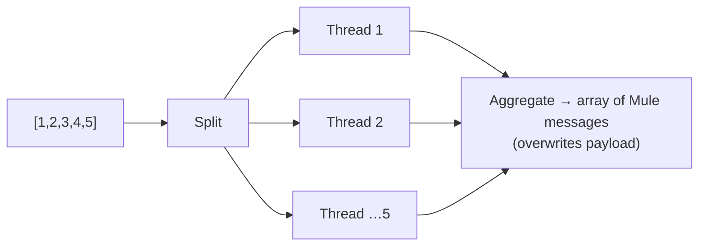
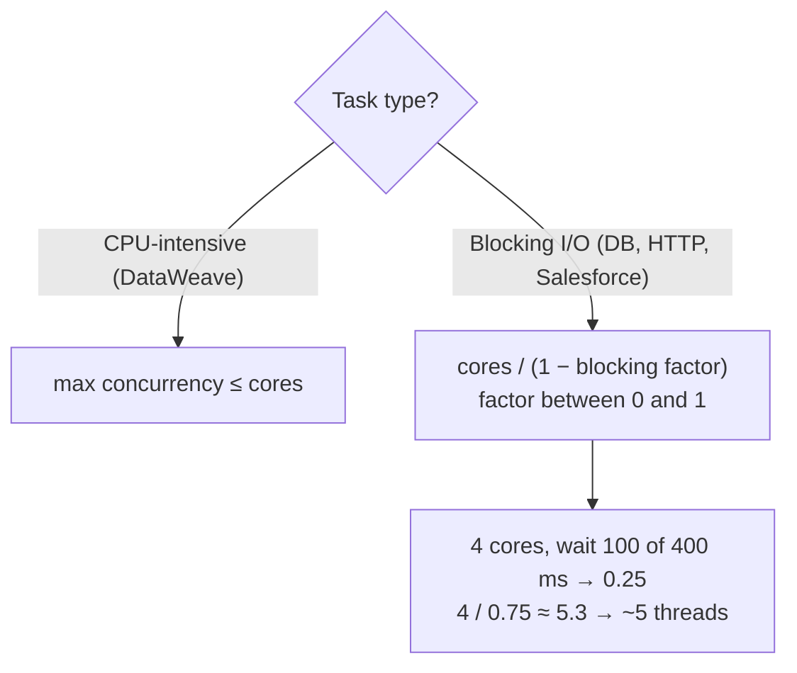

# Day 49 — Detailed Notes: For Each with a DB Insert, Bulk Insert, and Parallel For Each

> **Watch alongside:**
> - The first half is a realistic For Each: insert an array of employees and return which IDs succeeded and which failed. The second half introduces Parallel For Each and compares the two point by point.
> - The comparison table in section 4 is the interview material, and so is the max-concurrency formula at the end.

> **Video-verified:** written from the cleaned transcript and the class recording (18 Jan 2025). Slide images: [slides/day49](../slides/day49/) — e.g. [For Each DB flow](../slides/day49/01-foreach-db-flow.jpg), [duplicate error](../slides/day49/12-duplicate-error.jpg), [bulk insert](../slides/day49/13-bulk-insert-flow.jpg), [single vs multi](../slides/day49/20-drawing-single-vs-multi.jpg), [PFE output](../slides/day49/25-pfe-output.jpg), [blocking calc](../slides/day49/29-drawing-blocking-calc.jpg).

---

## 1. For Each Insert with Success/Error Collection

- The insert response only shows **affected rows** — keep the record via a **target variable** (or rootMessage / a variable).
- Run 1: `{"success": [1000, 1001, 1002, 1003], "error": []}`.
- Run 2: `{"success": [1004, 1005, 1006], "error": [… "Duplicate entry '1003' for key 'employees_info.PRIMARY'"]}`.
- Early mistake: "Cannot coerce Array ([]) to Number" — the expression saw the whole array, not one record.
- Test with the volumes in the **non-functional requirements** (e.g. 5,000–10,000 records).

---

## 2. Bulk Insert

- `map` renames keys to DB names (`empId` → `emp_id` …) for every object in the batch.
- 4 records → 2 calls; 9 → 5; 3 → 2 (the second is an array of one).

---

## 3. For Each Propagation (Recap)

| After the scope | For Each |
|---|---|
| Payload | Same as input (kept in **rootMessage**) |
| Existing var modified inside | Modified |
| New var created inside | Available |
| counter, rootMessage | Removed |

---

## 4. Parallel For Each vs. For Each

| | For Each | Parallel For Each |
|---|---|---|
| Threads | Single | Multiple (like Scatter-Gather) |
| Time (100 × 150 ms) | ~15 s | ~a fifth with 5 threads |
| Payload after | Unchanged | **Overwritten** (aggregated) unless Target is set |
| Error without Try | Stops, propagates | Waits for running threads, then propagates |
| Memory | Less | More — stores every response |
| Existing var modified inside | Modified | **Unmodified** |
| New var inside | Available | **Not accessible** (500 "Expecting Array or Object but got Null") |

- Processing order is random (logs: 4, b, 5, 1, a); the output array came in the order given.
- A failing element (`"a" * 10`) keeps its error text in that element's payload; others succeed (Try/On Error Continue inside).
- Too much data for memory → **batch processing**.

---

## 5. Max Concurrency

*"You should say we don't give 100 or 200 randomly; we go according to the formula."*

**Assignment:** 100 records through For Each and Parallel For Each in run mode; compare the times.

---

## Quick Recap
- For Each + **Try / On Error Continue** inserts records one by one and collects success IDs and error reasons.
- Keep the record with a **target variable** — the insert only returns affected rows.
- **Bulk insert** (For Each batch size + `map`) saves a connection lifecycle per record.
- For Each: payload unchanged, modified vars come out, new vars available.
- **Parallel For Each**: multi-threaded, aggregated output overwrites payload, more memory; outside vars unmodified, inside vars hidden; on error waits then propagates.
- **Max concurrency**: ≤ cores for CPU work; cores / (1 − blocking factor) for I/O.
