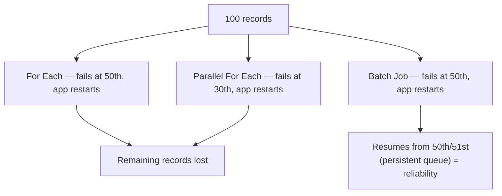
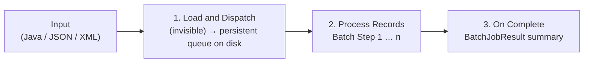
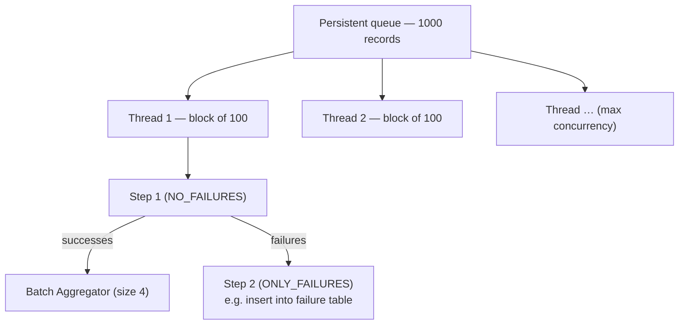
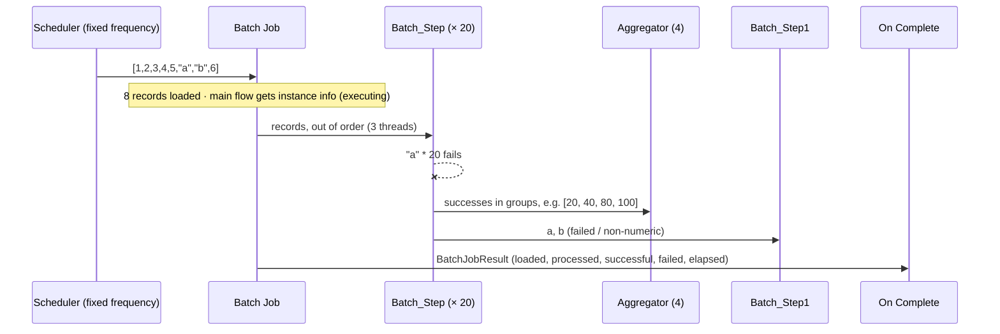
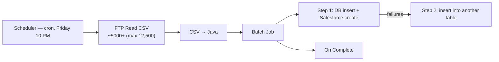

# Day 50 — Detailed Notes: Batch Processing — Phases, Components, Properties and On Complete

> **Watch alongside:**
> - The agenda lists the Async scope, but the class covered sync vs. async only in drawings and spent the session on batch processing.
> - The demo is tiny (eight values, two of them letters) on purpose — watch the records come out of order, the letters fail, the aggregator group the successes in fours, and On Complete report the counts.

> **Video-verified:** written from the cleaned transcript and the class recording (20 Jan 2025). Slide images: [slides/day50](../slides/day50/) — e.g. [restart drawing](../slides/day50/04-drawing-restart.jpg), [batch job diagram](../slides/day50/06-batch-job-diagram.jpg), [job properties](../slides/day50/09-batch-job-props.jpg), [step filters](../slides/day50/10-batch-step-filters.jpg), [On Complete payload](../slides/day50/17-on-complete-payload.jpg), [use case](../slides/day50/21-drawing-friday-job.jpg).

---

## 1. Why Batch

| | For Each | Parallel For Each | Batch |
|---|---|---|---|
| Threads | 1 | Many | Many |
| Mode | Sync | Sync | **Async** |
| Output | None | Aggregated responses | **Summary only** |

- Use batch when data is **larger than memory** or **reliability** matters.

---

## 2. The Three Phases

- In-memory queues are wiped on restart; **persistent** ones (disk) aren't.

---

## 3. Threads, Blocks and Steps

| Setting | Default / meaning |
|---|---|
| Max Failed Records | **-1** = never stop; 0 = stop at first failure |
| Batch Block Size | **100** — leave unless performance-tested |
| Max Concurrency | Parallel threads |
| Job Instance Id | Auto; custom via `#[ ]` |
| Accept Expression | Filter, e.g. accept only numbers (`isNumber`) |
| Accept Policy | **NO_FAILURES** (default), ONLY_FAILURES, ALL |
| Aggregator size | Groups successes; failures never reach it |

---

## 4. The Demo

- *Screen:* "Total Records processed: 8. Successful records: 7. Failed Records: 1"; in the run discussed aloud, 6 succeeded and 2 failed.
- The main flow's payload isn't overwritten — it's asynchronous.

---

## 5. Use Case — Friday 10 PM Customer File

- Batch fits: huge data, automatic error handling, reliability for customer data.
- EDI files → Anypoint Partner Manager / X12 connector (licensed, rare — manufacturing, healthcare).

---

## Quick Recap
- Batch = **asynchronous**, multi-threaded, **reliable** processing for data larger than memory.
- Phases: **Load and Dispatch** (persistent queue) → **Process Records** (steps) → **On Complete** (summary).
- Components: **Batch Job**, **Batch Step**, **Batch Aggregator** (inside a step only).
- **Max Failed Records -1**, **block size 100**, **max concurrency** = threads.
- **Accept Expression** filters; **Accept Policy** NO_FAILURES / ONLY_FAILURES / ALL.
- The aggregator receives only successes; On Complete gives **BatchJobResult** counts.
- A **Scheduler** (fixed frequency or cron) can trigger the batch flow.
