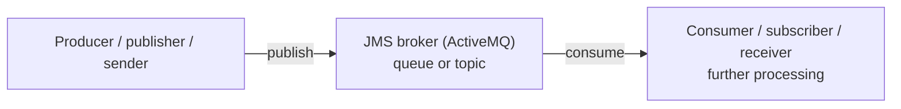
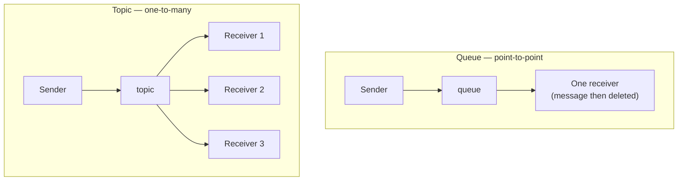
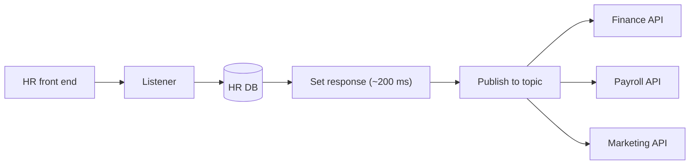
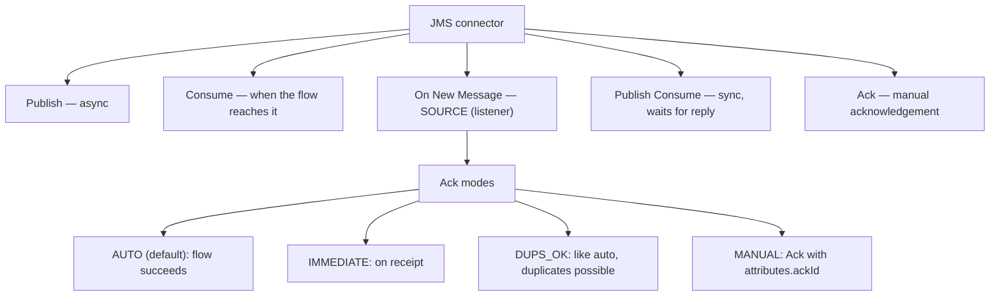
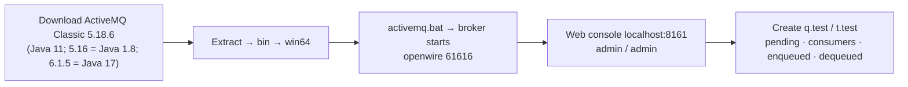
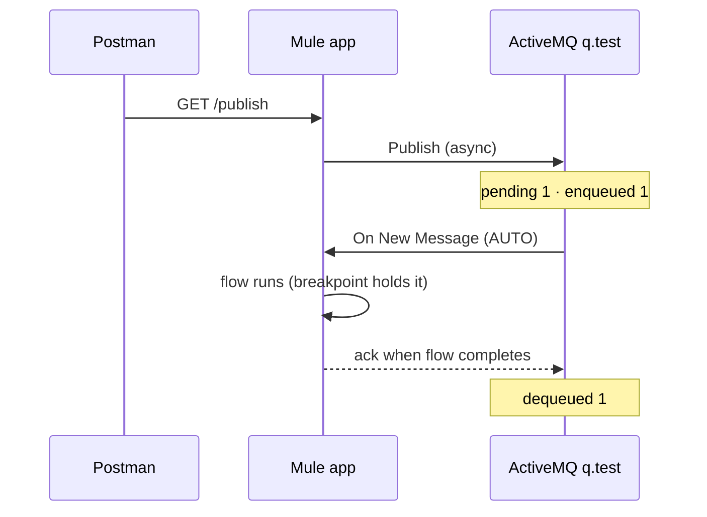
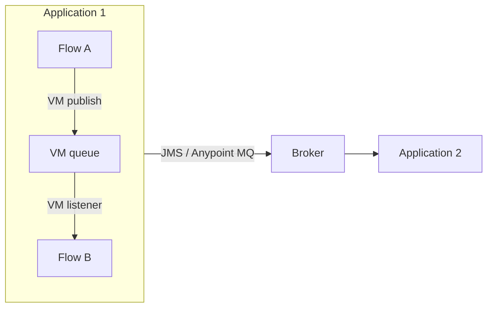

# Day 51 — Detailed Notes: JMS with ActiveMQ — Queues, Topics, Operations, Acknowledgement Modes and VM

> **Watch alongside:**
> - The first hour is concepts and drawings (broker, queue vs. topic, decoupling, the new-employee design exercise); the second half is ActiveMQ installation and the JMS connector.
> - The thing to watch in the demo is the ActiveMQ console counters — pending, enqueued, dequeued — changing (or not) as the acknowledgement mode changes.

> **Video-verified:** written from the cleaned transcript and the class recording (21 Jan 2025). Slide images: [slides/day51](../slides/day51/) — e.g. [overview drawing](../slides/day51/01-drawing-jms-overview.jpg), [operations](../slides/day51/06-drawing-operations.jpg), [web console](../slides/day51/16-web-console-login.jpg), [JMS config](../slides/day51/25-jms-config-broker-url.jpg), [ack modes](../slides/day51/29-ack-mode-dropdown.jpg), [manual ack](../slides/day51/30-manual-ack.jpg).

---

## 1. The Broker Model

- **JMS = Java Messaging Service**; brokers: RabbitMQ, **ActiveMQ** (open source), Kafka, IBM MQ, Anypoint MQ (licensed, cloud-only).
- **Decoupled** (no producer–consumer connection) and **asynchronous** (producer sends and forgets).
- Message = **headers + body** → in Mule, **attributes + payload**.
- Examples: Salesforce customer → SAP/DB/microservice; logs → queue → ELK; orders → queue → SAP (message waits if SAP is down; kept ~7–10 days).

---

## 2. Queue vs. Topic

---

## 3. Design Exercise — New Employee

| Approach | Note |
|---|---|
| Sequential calls | ~1150 ms total |
| Scatter-Gather | Parallel, still waits |
| **Publish to topic** | Fast response, no dependency, republish from DB if it fails |

- Batch processing is for **huge** volumes; one new employee is a single record — the topic gives near real-time delivery.

---

## 4. JMS Operations and Ack Modes

- Most used: **AUTO** and **MANUAL**. Publish vs. Publish Consume is a certification topic.
- *Drawing:* failed messages can go to a **DLQ**.

---

## 5. ActiveMQ Setup

- Console actions: **Send To** (test message), **Delete** (queue), **Purge** (messages), **Pause**.

---

## 6. The JMS Connector

| Item | Value |
|---|---|
| Module | Add Modules → **JMS** |
| Connection | **ActiveMQ Connection** (Generic for other brokers) |
| Libraries | **ActiveMQ client** (mandatory); broker, KahaDB optional |
| Broker URL | `tcp://localhost:61616` |
| Publish | Destination `q.test`, type Queue, JSON body |
| On New Message | Queue consumer, reconnection **forever** |

- ActiveMQ **auto-creates** a queue you publish to; Anypoint MQ says "destination not found".
- Ask the messaging team for broker URL, credentials, queue/topic names.
- A string payload holding JSON → `read(payload, "application/json")`; `write` does the reverse (e.g. JSON into a text DB column).

---

## 7. VM vs. Brokers

- **VM** = intra-app only; JMS brokers / Anypoint MQ = inter-app.

---

## Quick Recap
- **JMS** decouples systems with asynchronous messages through a broker; ActiveMQ is the free one used in class.
- **Queue** = one consumer; **topic** = every subscriber.
- Operations: **Publish** (async), **Consume**, **On New Message** (source), **Publish Consume** (sync), **Ack**.
- Ack modes: **AUTO** (default), **IMMEDIATE**, **DUPS_OK**, **MANUAL** (`attributes.ackId`).
- ActiveMQ 5.18.6: console `localhost:8161` (admin/admin), broker `tcp://localhost:61616`, ActiveMQ client library.
- ActiveMQ auto-creates queues — use exact names.
- `read`/`write` convert between strings and structured data.
- **VM** connector = same operations, within one application only.
