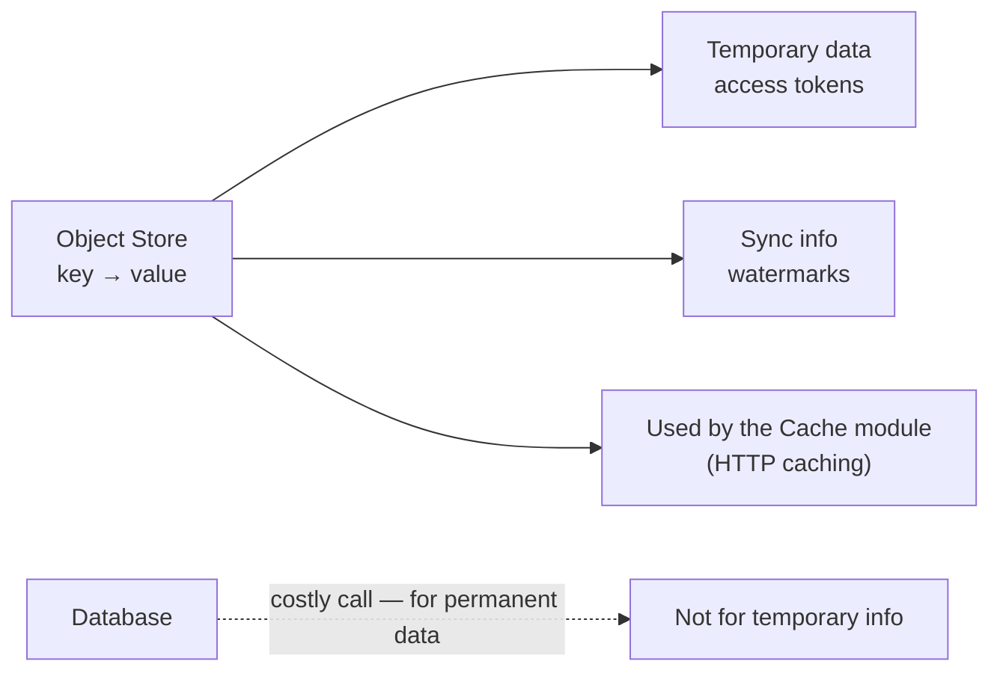
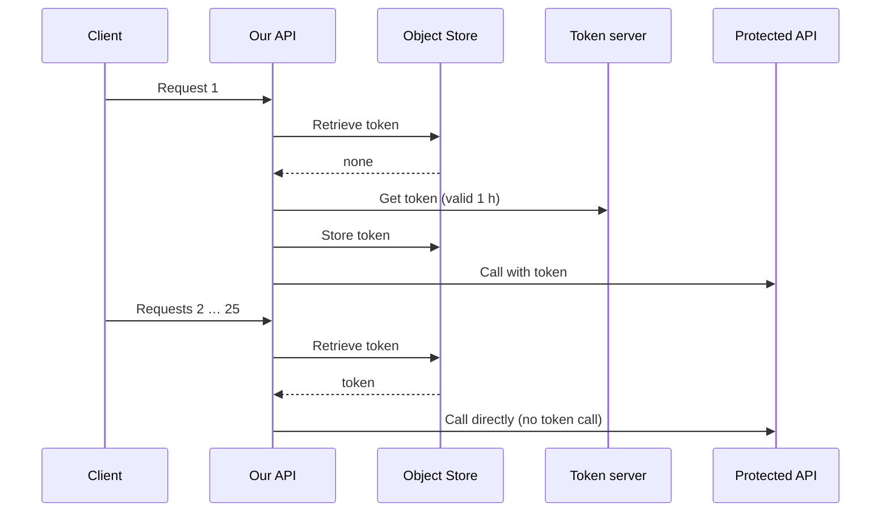
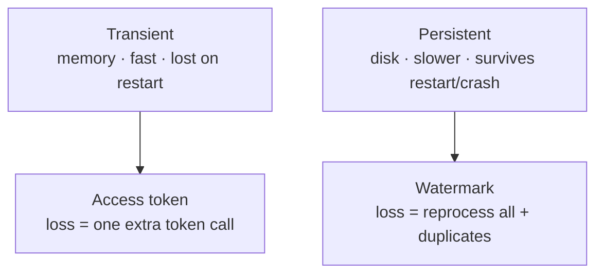
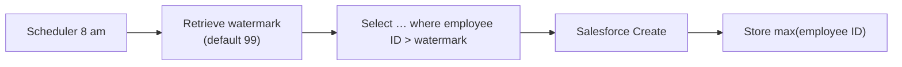

# Day 52 — Detailed Notes: The Object Store — Access Tokens, Watermarking, Transient vs. Persistent

> **Watch alongside:**
> - A short theory session. The whole idea fits in two use cases: cache a 1-hour access token so 25 requests make one token call, and remember the last processed employee ID so each daily run picks up only new rows.
> - The key decision is storage type — transient for the token, persistent for the watermark — and the reasoning is "what does it cost me if this value disappears on restart?"

> **Video-verified:** written from the cleaned transcript and the class recording (22 Jan 2025). Slide images: [slides/day52](../slides/day52/) — [what is Object Store](../slides/day52/01-what-is-object-store.jpg) and the drawings.

---

## 1. What It Is

- A generic concept; MuleSoft provides it as a component.

---

## 2. Use Case 1 — Access Token

- A **variable** won't do — it dies when its request ends.
- **Expiry:** "invalid token" → Try / **On Error Continue** → Flow Reference to the token sub-flow → store → retry.

---

## 3. Transient vs. Persistent

*"If it's persistent, from disk space; if transient, from memory. Since it's in memory... fast."*

---

## 4. Use Case 2 — Watermarking

| Day | Watermark | Picks up | Stores |
|---|---|---|---|
| 25 Jan | 99 (default) | 100–104 | 104 |
| 26 Jan | 104 | 105–108 | 108 |
| 27 Jan | 108 | 109–111 | 111 |

- Re-inserting an existing ID fails (unique primary key) — so only new rows must go.
- Transient here: a 10 pm restart resets to 99 → **duplicates**. So **persistent**.

---

## Quick Recap
- The **Object Store** is key-value storage for temporary/sync data; cheaper than a database call.
- **Access token:** store once, reuse for its validity; handle expiry with Try → On Error Continue → regenerate.
- Variables live for one request only — they can't share a token.
- **Transient** = memory (fast, lost on restart); **persistent** = disk (slower, kept).
- **Watermarking:** Retrieve (default) → Select `> watermark` → Create → Store max.
- Token → **transient**; watermark → **persistent**.
- Cache and HTTP caching use an object store underneath.
