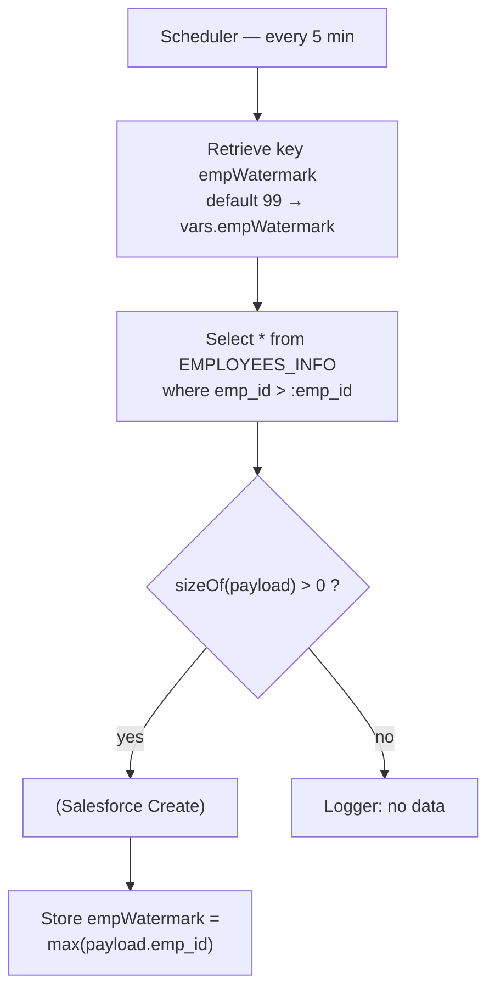
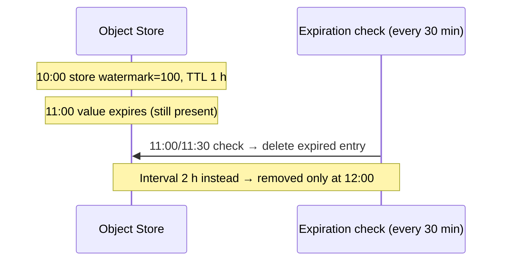
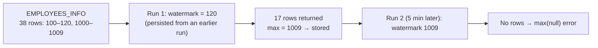

# Day 53 — Detailed Notes: Watermarking with the Object Store

> **Watch alongside:**
> - A short, single-demo session: the Object Store remembers the last employee ID so each scheduled run picks up only new rows.
> - Watch for the two surprises — the first run used **120**, not the default 99, because the store is persistent; and the second run failed with `max(null)` until a Choice was added.

> **Video-verified:** written from the cleaned transcript and the class recording (23 Jan 2025). Slide images: [slides/day53](../slides/day53/) — e.g. [watermark flow](../slides/day53/02-watermark-flow.jpg), [Object Store config](../slides/day53/03-object-store-config.jpg), [watermark select](../slides/day53/05-select-watermark.jpg), [max null error](../slides/day53/11-max-null-error.jpg), [Choice fix](../slides/day53/12-choice-not-empty.jpg).

---

## 1. The Watermark Flow

- Use case: DB employees → Salesforce, only new ones each run.
- Object Store comes from **Add Modules**; only **Store** and **Retrieve** are needed (others: Clear, Contains, Remove, Retrieve All, Retrieve All Keys).

---

## 2. Object Store Configuration

| Setting | Meaning |
|---|---|
| Persistent | Default **on**; off = transient. Watermarks need persistent |
| Max entries | Cap on the number of entries |
| Entry TTL | How long a value is valid |
| Expiration interval | How often expired values are deleted |

- Keep the **interval shorter than the TTL**.
- Watermark: leave expiry at defaults (instructor: "around 30 days", not sure). Tokens: TTL of 1–2 hours.

---

## 3. The Run

- Persistence survived the redeploy — that's why 120 came, not 99.
- The watermark column must be **sequential and incremental** (gaps are fine).

---

## 4. The Null Error

*Screen:* "You called the function 'max' with these arguments: 1: Null (null) — but it expects … Array".

- Empty payload → `payload.emp_id` is null.
- Fix: **Choice** `#[sizeOf(payload) > 0]` → Store; default → log "no data".
- `isEmpty(payload)` is the better emptiness check — `sizeOf` loads the whole payload.

**Homework:** build the access-token use case with a **transient** store (uncheck Persistent).

---

## Quick Recap
- Watermarking = **Retrieve** (with default) → Select `> watermark` → process → **Store** `max(id)` under the same key.
- Object Store is **persistent by default** — the value survives redeploys.
- **Entry TTL** = validity; **expiration interval** = cleanup; keep interval < TTL.
- Use an **incremental** column for the watermark.
- Guard `max()` with a **Choice** on payload size — empty payload → null error.
- Next week: DataWeave leftovers, CI/CD, AWS S3, one-way/two-way TLS, CloudHub 1.0 vs 2.0.
