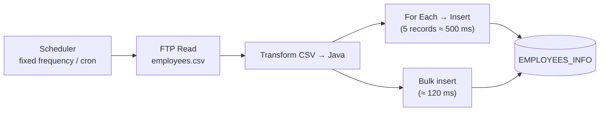
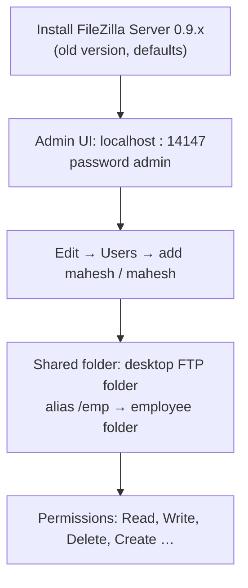
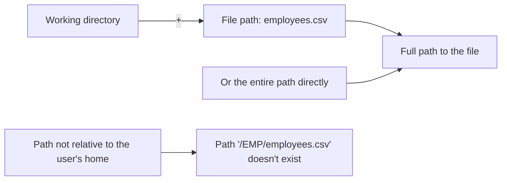
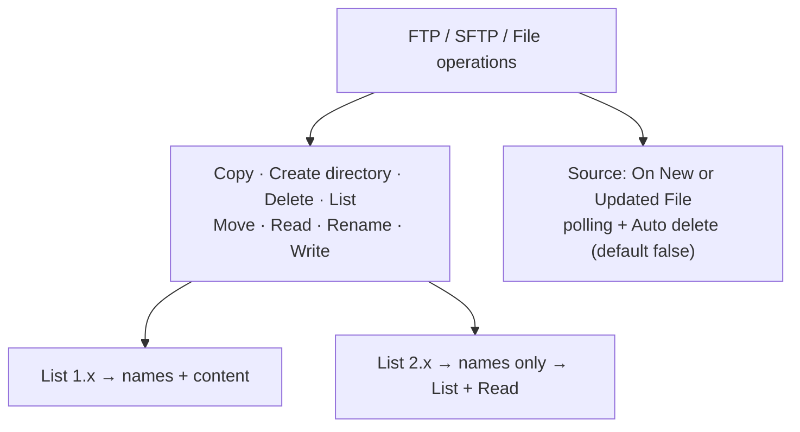
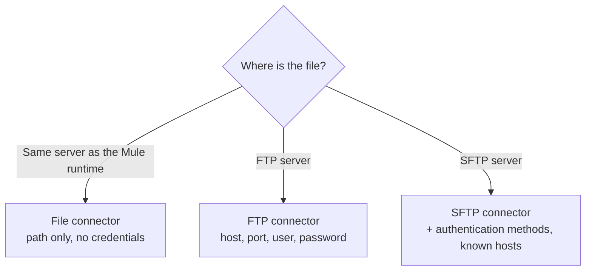

# Day 54 — Detailed Notes: FTP with FileZilla — CSV into the Database, DB Rows to a File, File / SFTP Connectors

> **Watch alongside:**
> - Most of the time goes into setting up a local FTP server (FileZilla) and getting the path right. In real projects the FTP team gives you host, port, user and folder — you only build the flow.
> - The three flows are the pattern to keep: FTP → For Each insert, FTP → Bulk insert, and DB → Write file. The last one's Excel output broke in class; CSV was suggested instead.

> **Video-verified:** written from the cleaned transcript and the class recording (24 Jan 2025). Slide images: [slides/day54](../slides/day54/) — e.g. [requirement drawing](../slides/day54/01-drawing-ftp-sync.jpg), [FileZilla users](../slides/day54/08-filezilla-users.jpg), [FTP flow](../slides/day54/10-ftp-flow.jpg), [FTP config](../slides/day54/14-ftp-config.jpg), [path error](../slides/day54/13-path-not-exist.jpg), [write flow](../slides/day54/19-write-flow.jpg).

---

## 1. The Requirement

- FTP = **File Transfer Protocol**; files are read periodically and sent to other systems.
- DB server stores data; FTP server stores files. A separate team runs the FTP server.

---

## 2. FileZilla Server Setup (Practice Only)

- Other FTP servers: Cerberus, CompleteFTP, Titan, Core FTP, Files.com, Globalscape; WinSCP/SolarWinds push files.
- Setting up FTP servers is the FTP team's job, not ours.

---

## 3. CSV and the FTP Config

- **CSV:** header row + one row per record; separators comma (usual), pipe or tab; headers are there 99% of the time.

| FTP Config field | Value |
|---|---|
| Working Directory | `EMP` |
| Transfer mode / Passive | BINARY / True |
| Host / Port | localhost / **21** |
| User / Password | mahesh / mahesh |

- FileZilla's log confirms the connection: `USER`, `PASS`, `230 Logged on`, `RETR employees.csv`.
- *"Servers behave differently — some take slashes, some don't."*
- Insert query: `insert into EMPLOYEES_INFO values (:emp_id,:emp_name,:emp_status,:emp_salary,:emp_designation)`.

---

## 4. FTP Operations

- After processing a file, **Move** (or Delete) it.
- Create directory needs **Create** permission for the user.

---

## 5. DB Rows to a File

| Mode | Day 1 | Day 2 | Day 3 |
|---|---|---|---|
| Overwrite (full select) | 100 written | 150 replace 100 | 250 replace 150 |
| Append (delta only) | 100 written | +50 → 150 | +100 → 250 |

- Append needs **delta data** — watermarking / object store; `select *` + Append repeats rows.
- The Excel (xlsx) output needed "repair" in Excel — **use CSV** if Excel fails.

**Ask first:** volume, frequency/cron, FTP user for MuleSoft (SPOC), port opened from the Mule server.

---

## 6. File vs. FTP vs. SFTP

*"Learn one connector and you get three — like with JMS you also got VM."*

---

## Quick Recap
- **FTP** integrations read/write files on a server on a schedule; File, FTP and SFTP share the same operations.
- **FileZilla Server** for practice: admin 14147 / admin, user mahesh / mahesh, FTP port 21, alias `/emp`.
- Flow 1: Scheduler → **FTP Read** → CSV to **Java** → **For Each** insert; Flow 2: **Bulk insert**.
- Path = working directory + file name (or full path); getting it wrong gives "Path … doesn't exist".
- Operations include **List** (1.x names+content, 2.x names only), **Move**, **Write**, and the **On New or Updated File** source.
- Flow 3: DB **Select** → transform → FTP **Write**; Overwrite vs **Append** (use delta data).
- **File** = local to the runtime; **FTP** = FTP server; **SFTP** = secure FTP server.
