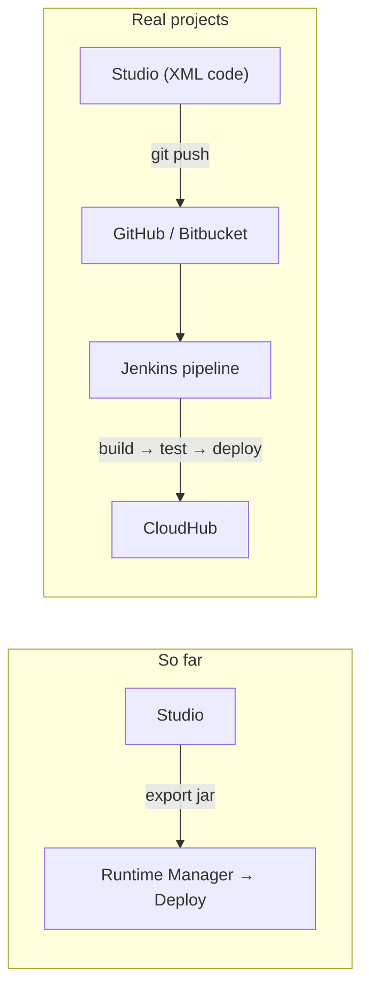
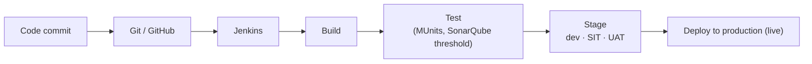
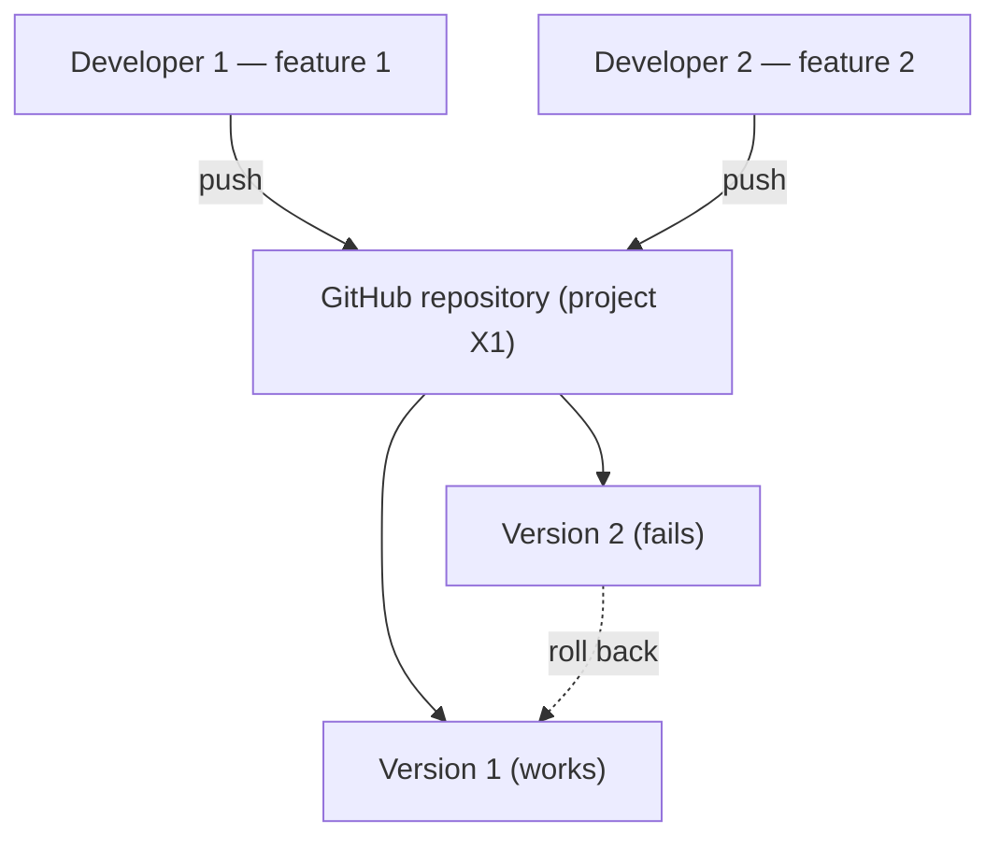
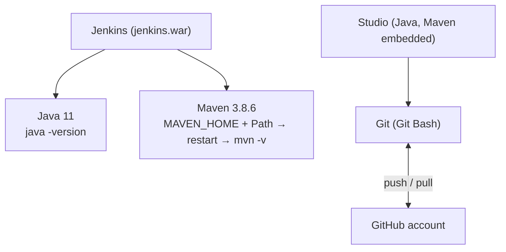
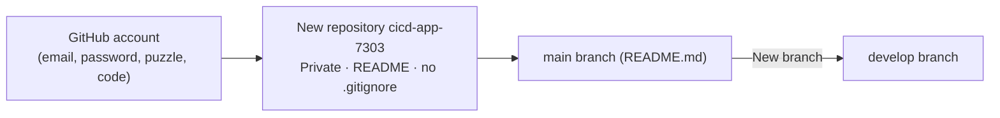

# Day 55 — Detailed Notes: CI/CD with Jenkins — Concepts, Software Setup and the GitHub Repository

> **Watch alongside:**
> - This is the theory and setup day of the Jenkins module. Nothing is deployed yet — the goal is to understand why code goes through a repository and a pipeline, and to get Java, Maven, Jenkins, Git and a GitHub repository ready.
> - Keep the instructor's notes file (download links, the `java -jar jenkins.war` commands and the pom.xml plugin) handy — it's used in the next sessions.

> **Video-verified:** written from the cleaned transcript and the class recording (3 Feb 2025). Slide images: [slides/day55](../slides/day55/) — e.g. [CI/CD pipeline](../slides/day55/03-cicd-pipeline.jpg), [drawing](../slides/day55/04-drawing-cicd-steps.jpg), [download links](../slides/day55/08-download-links.jpg), [environment variables](../slides/day55/12-env-variables.jpg), [new repository](../slides/day55/19-new-repository.jpg).

---

## 1. From Manual Jar Upload to a Pipeline

- The pipeline is built by the **DevOps team**; Jenkins needs connections to GitHub, a repository and CloudHub.
- If any step fails, the pipeline stops.

---

## 2. The Pipeline Stages

- **Staging** environments bridge development and live; the public uses only production.
- **CI:** merge often, automated tests catch bugs early.
- **CD:** a change that passes all checks goes live automatically.

---

## 3. Why a Code Repository

- Save and share centrally; collaborate; **version management** (Studio just overwrites).
- Main project files: `pom.xml`, `mule-artifact.json`, `src/main/mule` XMLs, `src/main/resources`.

---

## 4. Software and Setup

| Item | Detail |
|---|---|
| Java | JDK 11 from TechSpot (no Oracle login); MuleSoft moved 1.8 → 11 → 17 (CloudHub 2.0) |
| Maven | `apache-maven-3.8.6-bin.zip` → `D:\Softwares\apache-maven-3.8.6`; **system** variables |
| Jenkins | 2.479.3 LTS, Generic Java package (.war) |
| Run Jenkins | `java -jar jenkins.war` (port 8080) · `java -jar jenkins.war --httpPort=8899` |
| Git | 2.48.1 for Windows; adds **Git Bash** to the right-click menu |

- Versions must be **compatible** with the Jenkins version.

---

## 5. GitHub Repository and Branches

- One repository per project, named like the API (e.g. `hr-employees-sys-api`), usually created by **DevOps**.
- `.gitignore` lists files Git shouldn't push.
- Branch-per-environment pattern: `develop` → dev, `qa` → SIT, `main`/`master` → production.

*"First be very strong in your main subject — MuleSoft. Once you're a pro in MuleSoft, you can dig deeper into these technologies."*

---

## Quick Recap
- Real deployments go through a **CI/CD pipeline** (Jenkins), not manual jar uploads.
- Pipeline: **commit → build → test → stage → deploy**; a failing step stops it; SonarQube may enforce a quality threshold.
- A Studio project is XML code kept in **GitHub/Bitbucket/GitLab** for sharing, collaboration and versioning.
- Jenkins needs **Java 11** and **Maven 3.8.6** (MAVEN_HOME + Path, restart, `mvn -v`).
- Jenkins runs with `java -jar jenkins.war` (8080) or `--httpPort=8899`.
- **Git** moves code between local and GitHub; **Git Bash** runs the commands.
- Repository **cicd-app-7303** (private, README) with a **develop** branch was created.
