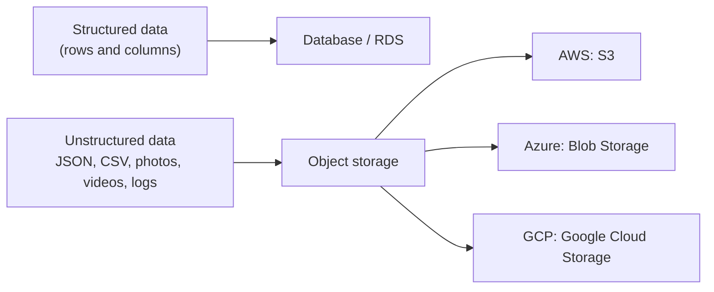
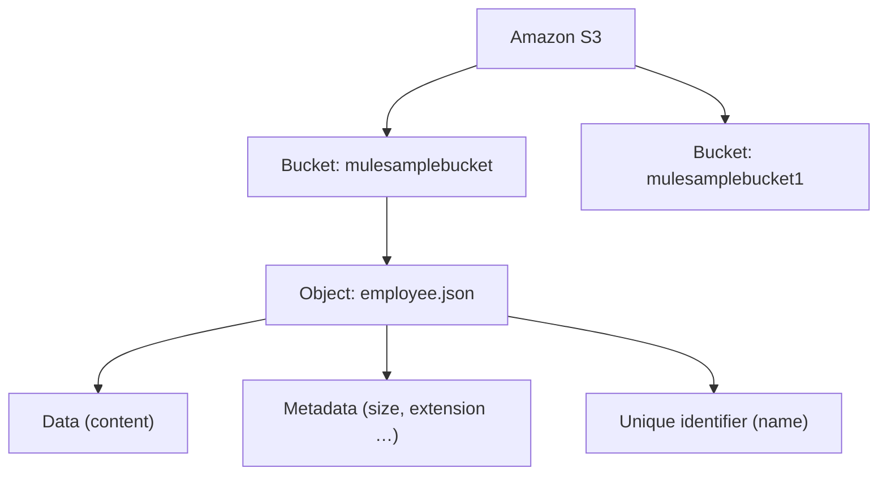
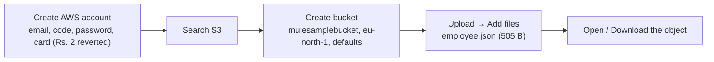
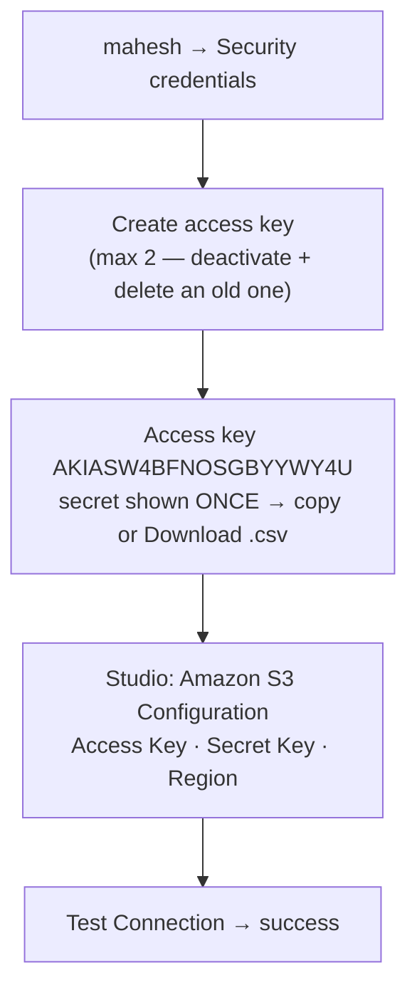
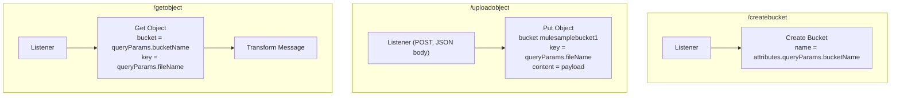
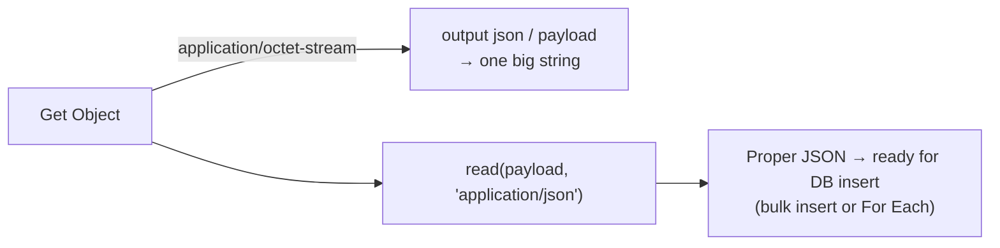
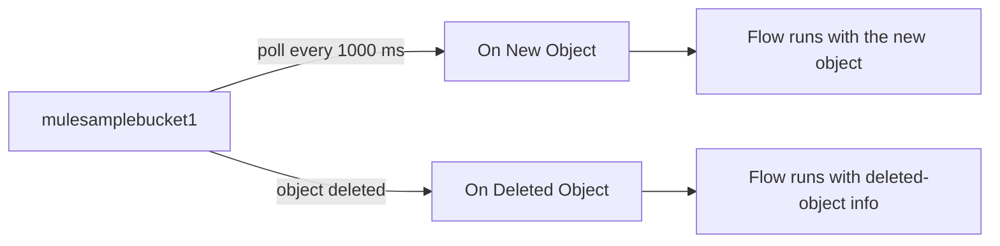

# Day 57 — Detailed Notes: Amazon S3 and the Amazon S3 Connector (Create Bucket, Put Object, Get Object)

> **Watch alongside:**
> - The concept is small: S3 stores files (objects) in containers (buckets). Everything in Mule is just three operations against that model, authenticated with an access key and secret key.
> - The one real gotcha is at the end: **Get Object** returns binary, so the JSON comes out as one string until you `read()` it.

> **Video-verified:** written from the cleaned transcript and the class recording (8 Feb 2025). Slide images: [slides/day57](../slides/day57/) — e.g. [buckets and objects](../slides/day57/03-s3-buckets-objects.jpg), [create access key](../slides/day57/17-create-access-key.jpg), [S3 configuration](../slides/day57/20-s3-config-test.jpg), [Put Object](../slides/day57/24-put-object-config.jpg), [Get Object flow](../slides/day57/28-get-object-flow.jpg).

---

## 1. What S3 Is

- **S3 = Amazon Simple Storage Service** — cloud-based object storage, a ready-made AWS service.

---

## 2. Buckets and Objects

- A bucket is like a folder; an object is any file in it.
- Same name twice → use a different name or overwrite.

---

## 3. Console Walkthrough

**Use case:** a daily FTP file into S3 → **Scheduler → FTP Read → S3 Put Object**. Buckets are usually created by the AWS team, not by us.

---

## 4. Access Keys and Connector Config

- After **Done** the secret can't be retrieved — only deleted and recreated.
- The region must match the bucket's region — ask the AWS team.
- In projects the AWS/S3 team gives you the access key, secret, bucket name and permissions.

---

## 5. The Three Demo Flows

| Request | Result |
|---|---|
| `GET /createbucket?bucketName=mulesamplebucket1` | New bucket visible in the console |
| `POST /uploadobject?fileName=employee.json` + JSON body | Object uploaded; response has eTag, versionId, AES256 encryption (as a Java object) |
| `GET /getobject?fileName=employee.json&bucketName=mulesamplebucket1` | File content |

---

## 6. The Get Object Challenge

*"The Amazon S3 connector gave us data in binary — octet-stream — format. What's the underlying data format? JSON."*

---

## 7. Sources: On New Object / On Deleted Object

Other operations to try on your own: Copy Object, Delete Object(s), Delete Bucket, List Buckets, List Objects.

---

## Quick Recap
- **S3** is AWS object storage for unstructured data; Azure has **Blob Storage**, GCP has **GCS**.
- **Buckets** hold **objects**; an object is data + metadata + unique name.
- The connector authenticates with an **access key + secret key + region**; the secret is shown only once.
- **Create Bucket**, **Put Object** (object key = file name, content = payload) and **Get Object** were demoed with query-param-driven names.
- Get Object returns **octet-stream** — use `read(payload, 'application/json')`.
- **On New Object** / **On Deleted Object** are polling sources on a bucket.
