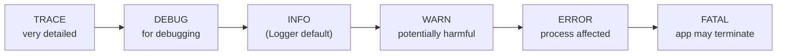
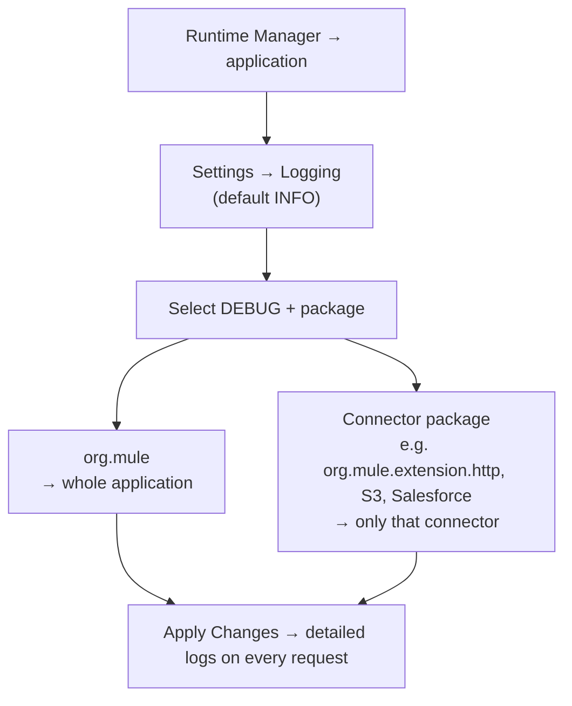
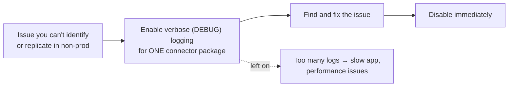
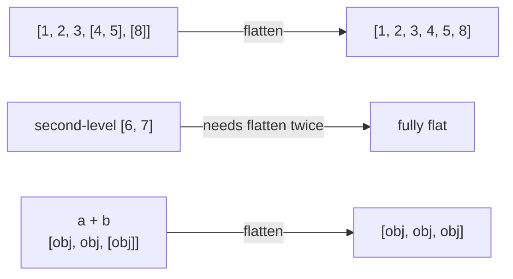
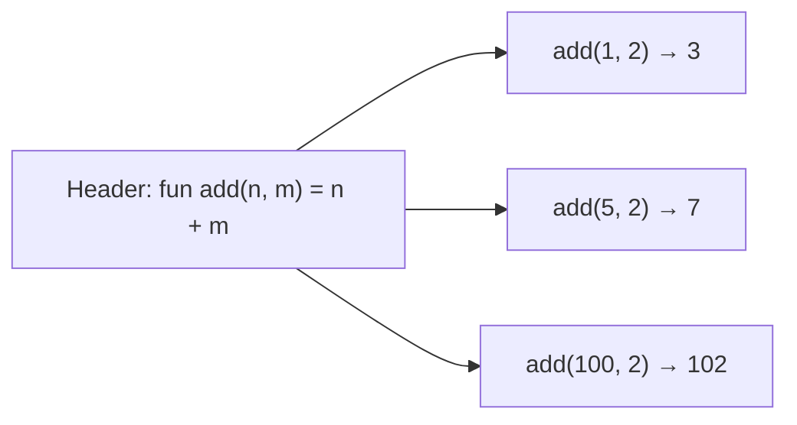
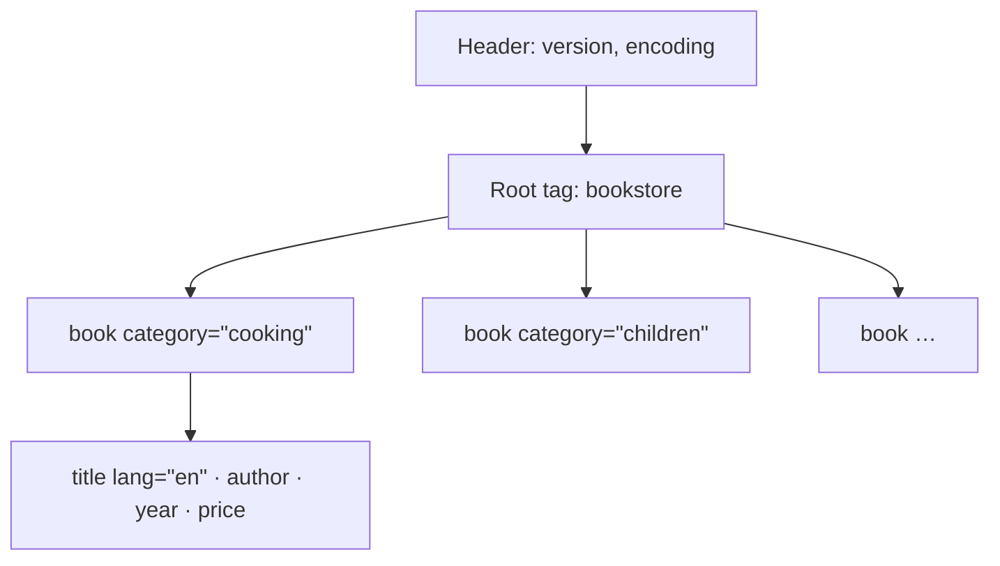
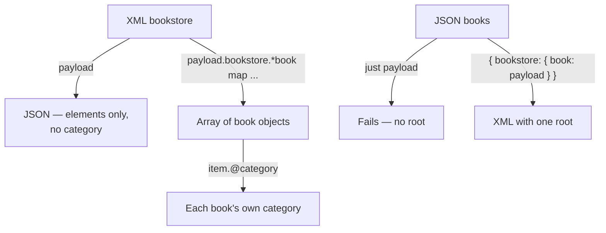
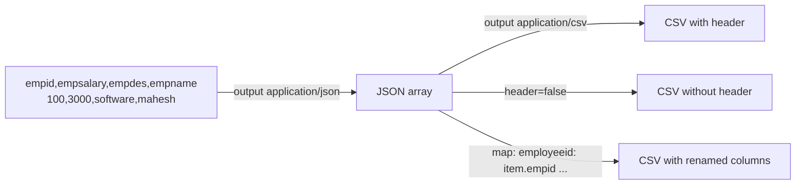

# Day 58 — Detailed Notes: Logging Levels, Verbose Logging, and DataWeave flatten, flatMap, Custom Functions, XML and CSV

> **Watch alongside:**
> - The agenda slide says "Consume SOAP Webservice", but the class actually cleared the pending-topics list: logging levels, verbose logging, and DataWeave transformations.
> - Two demos didn't work live — `flatMap` and writing the bookstore `category` as an XML attribute. The instructor promised to send working scripts; the notes show only the documented syntax that appeared on screen.

> **Video-verified:** written from the cleaned transcript and the class recording (9 Feb 2025). Slide images: [slides/day58](../slides/day58/) — e.g. [log levels](../slides/day58/04-log-levels-hierarchy.jpg), [flatten](../slides/day58/09-dw-flatten.jpg), [custom function](../slides/day58/15-custom-function.jpg), [XML root error](../slides/day58/20-xml-root-error.jpg), [CSV output](../slides/day58/27-csv-output.jpg).

---

## 1. Logging Levels and the Hierarchy



- Selecting a level prints **that level and everything to its right**.
- INFO → INFO + WARN + ERROR. DEBUG → DEBUG + INFO + WARN + ERROR. TRACE → everything.
- The Logger dropdown has DEBUG, ERROR, INFO, TRACE, WARN — no FATAL.
- Warnings are usually ignored; errors are what we focus on.
- On one Logger: level ERROR prints only on errors; choose **INFO** to print every time.

*"Whatever level we select, everything below it is printed."*

---

## 2. Debug Logs on a Deployed App



- Copy the package name from the **connector's configuration**.
- Detailed logs show inputs, connections, even access keys and secrets.
- *Screen:* `log4j2.xml` also has commented-out loggers (HTTP wire logging, DEBUG categories) that can be enabled.

---

## 3. Verbose Logging



- **Verbose logging = detailed logging.**
- Normally stay at INFO; DEBUG is usually enough; TRACE is rare.

---

## 4. flatten and flatMap



- `flatten` removes only the **first level** of sub-arrays.
- **flatMap = map + flatten**. Tooltip on screen:

```text
flatMap(items: Array<T>, mapper: (item: T, index: Number) -> Array<R>): Array<R>
```

- The class attempt `arr flatMap $.empDesignation` / empId failed: *"Expecting type Array but got … empId 100"* — the mapper returned an object/value, not an array.
- The docs example on screen: `[[1,5],[0.5,1.5]] flatMap (value, index) -> value`.
- The docs cookbook script (`myExternalFunction` returning `[]`, `[{name: 3}, {name:5}]` or `[data]`, then `myData flatMap ((item, index) -> myExternalFunction(item))`) was pasted, but not explained to the end.
- **Status:** the instructor said he'd show flatMap properly later and send the script.

---

## 5. Custom Functions



- `fun` + name + parameters + `=` + expression.
- Declare in the header, reuse anywhere in the body — for anything repetitive.

---

## 6. XML Structure



- Books are **siblings** (same level, same parent).
- Attributes = metadata, in the opening tag, values in **double quotes**.
- JSON is more popular (lightweight, easy for JavaScript); XML is a rarer requirement.

---

## 7. XML ↔ JSON



- `payload.bookstore.book.@category` returns only the **first** book's category ("cooking" for all).
- Two roots → *"Trying to output second root, bookstore, while writing Xml"*.
- Writing attributes (blog Method 2, on screen):

```dataweave
name @(lastName: person.LastName, age: person.Age): person.name
```

- **Status:** the bookstore version (category as an attribute of `book`) failed in class; a hard-coded `@(category: "C")` put "C" on every book. Script promised later.

---

## 8. CSV ↔ JSON



*"Most important is JSON. Very rarely we get CSV, and XML sometimes"* — but XML attributes and CSV appear in a question or two on the certification.

---

## Quick Recap
- Log levels: **TRACE < DEBUG < INFO < WARN < ERROR < FATAL**; a level prints itself and everything more severe; INFO is the default.
- Debug a deployed app via **Runtime Manager → Settings → Logging**, with `org.mule` (whole app) or one connector's package.
- **Verbose logging** slows the app — enable for one connector, briefly, then disable.
- `flatten` removes one level of nesting; `flatMap` = map + flatten (class demo failed; script promised).
- Custom function: `fun add(n, m) = n + m`.
- XML: one root, elements, double-quoted attributes; read attributes with `item.@category` over `*book`.
- JSON → XML needs a single root; attributes with `@( … )` (bookstore demo failed; script promised).
- CSV: `output application/csv`, `header=false`, rename keys in a `map`.
- Pending: CI/CD with Jenkins, one-way/two-way TLS, CloudHub 1.0 vs 2.0.
