# Interview Preparation Part 1 — Detailed Notes: Résumé, Cover Letter, Self-Introduction, and Web Services / HTTP Q&A

> **Watch alongside:**
> - The first half is a walk through one "ideal" MuleSoft résumé. Each point is there to match the keywords recruiters search for, and to steer the interviewer toward topics you can answer.
> - The second half covers the three opening questions (tell me about yourself, your project, your roles and responsibilities), then web services, parameters, HTTP methods and status codes.

> **Video-verified:** written from the cleaned transcript and the class recording (30 Mar 2024). Slide images: [slides/interview-part1](../slides/interview-part1/).

---

## 1. Why the Résumé Comes First

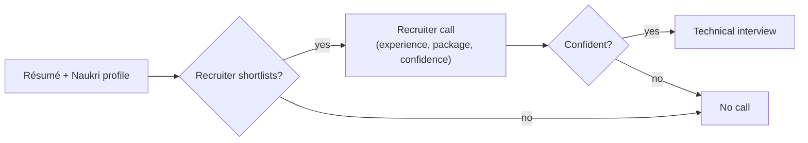

- In a good market any MuleSoft résumé gets calls; in a tough market the résumé has to stand out.
- A recruiter spends **1–2 minutes** on a résumé.
- Two mistakes to avoid:
  - copy-pasting without knowing what belongs in a résumé;
  - repeating the same point several times.
- Interview Q&A is covered **topic by topic** (web services today, RAML and API Manager next).

---

## 2. Résumé Section Map

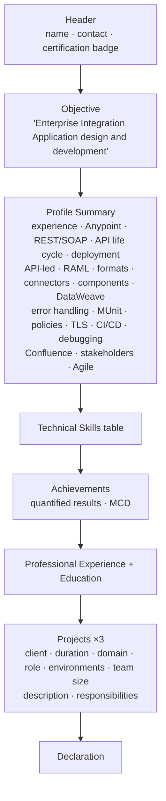

| Section | Key point from class |
|---|---|
| Header | Relevant certifications **at the top**, so certified candidates stand out at a glance |
| Objective | Say "enterprise integration", not just MuleSoft — open to Boomi and other integration work |
| Profile summary | Total vs relevant experience first; then each MuleSoft area, one point at a time |
| Technical skills | A table for recruiters with no time; RAML under ESB skills (a modeling language) |
| Achievements | Rare on résumés; quantified (40%, 20%); have the explanation ready |
| Projects | At least two MuleSoft projects; dates consistent with experience; reworded responsibilities |

---

## 3. Profile Summary — Keywords and Why

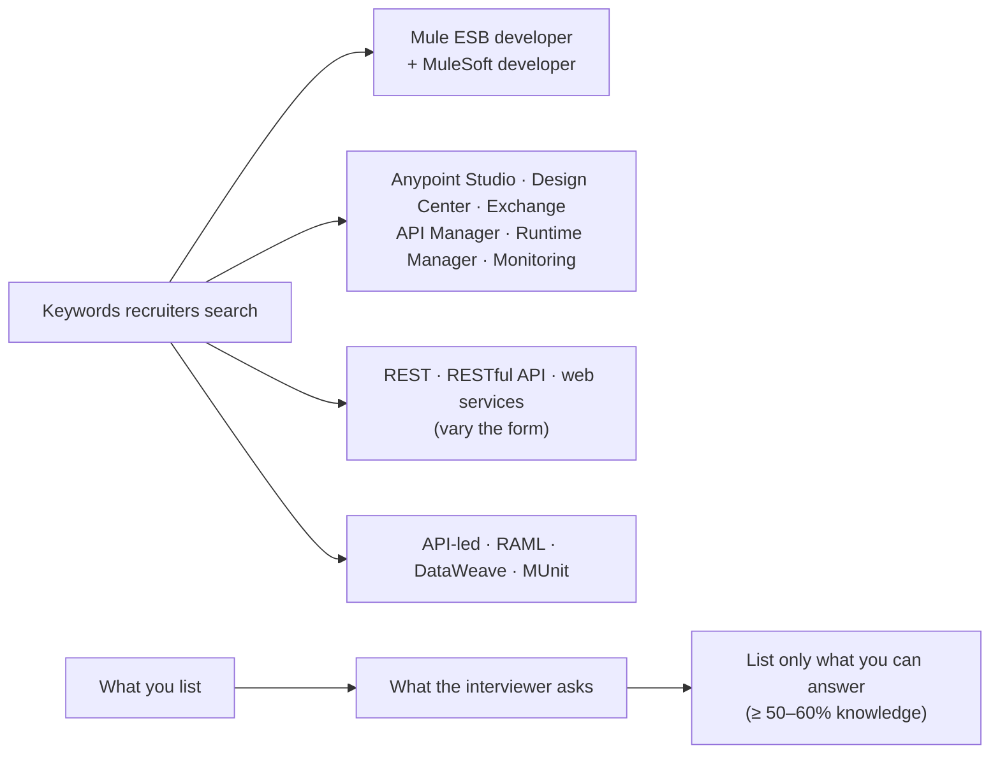

| Point | Why it's there |
|---|---|
| 5+ yrs total, 3+ as **Mule ESB developer**, 2 as Mainframes | Both keywords; clear relevant vs total experience |
| MuleSoft platform: **Studio, Design Center, Exchange, API Manager, Runtime Manager, Monitoring** | Matches any of these in a job description; most résumés never name them |
| Solid understanding of **REST and SOAP** | Understanding, not implementation; expect "when REST vs SOAP" |
| Each phase of the **API life cycle** (gather → design → implement → test → secure → deploy → monitor) | Top-level view before module details |
| Designing, developing, managing **REST APIs** on **Anypoint Platform** | Repeats the life cycle with REST and platform keywords |
| **CloudHub**, on-prem, hybrid deployments | CloudHub first — most widely used; add RTF only if you know it |
| System / process / experience APIs, **API-led** | Invites API-led questions you can answer |
| RESTful design, specs in **RAML** | Adds the RAML keyword; vary REST wording |
| **JSON, XML, CSV** | JSON 80–90% of the time |
| Connectors: HTTP, DB, **JMS, VM**, **FTP, File, SFTP**, Salesforce, **Web Service Consumer** | Similar connectors grouped; WSC shows SOAP consumption; exactly what the project used |
| Components: APIkit Router, Choice, Batch, Scatter-Gather, For Each, Parallel For Each, Cache, Validation, error handlers, Object Store, Scheduler | Same set as MCD Level 1 topics; tells the interviewer where to ask |
| **DataWeave** | Every interview includes 2–3 Playground problems on screen share |
| Error handling: **Try scope, On Error Continue/Propagate**, custom handlers | Always 1–2 questions; know global / flow / component strategies |
| **MUnit** recording and writing | "Powerful words" for a simple fact; AI tools can help word it |
| Policies: OAuth 2.0, Basic Auth, Client ID (+ Rate Limiting, HTTP Caching) | Keeps policy questions within these |
| One-way / two-way SSL (**mutual TLS**) | Prepares for keystore / truststore / HTTPS questions |
| CI/CD: Jenkins, Bitbucket, GitHub | Honest answer if you haven't built pipelines (DevOps team builds; you deploy and debug) |
| Problem-solving and debugging | Which layer failed, why, logs, fix |
| Confluence documentation | Rarely asked; covers job descriptions that mention it |
| Managers, leads, BAs, QA, clients (and architects) | Integration needs constant cross-team follow-up |
| Communication, Agile | Technical and non-technical stakeholders; Agile experience |

- Keep at least **70–80%** of these points; drop the weak ones and add them later.
- Asked about something not listed? Say you haven't used it and are **willing to learn**. Don't bluff.

---

## 4. Technical Skills and Achievements

| Category | Skills |
|---|---|
| ESB Skills | Mule ESB, Design Center, Exchange, Runtime Manager, Anypoint Studio, API Manager, Anypoint Monitoring, RAML |
| Programming | DataWeave |
| Web Services | REST, SOAP |
| RDBMS | Oracle, MySQL |
| Data Formats | JSON, XML, CSV |
| CI/CD Tools | Jenkins, Bitbucket, GitHub, Jira |
| Documentation | Confluence |

- **ESB** = Enterprise Service Bus — MuleSoft is one because it does **orchestration, transformation and enrichment**.

**Achievements (sample résumé):**

- Caching + parallel processing → **40%** less processing time (1000 ms → 600 ms).
- Introduced the **MUnit recorder** to a team writing tests by hand → **20%** less development effort.
- MCD Level 1.

**Why and how:**

- Numbers make the achievement concrete.
- Only keep a point you can explain in detail.
- Team awards (star of the quarter) and awards from other technologies fit here too.

---

## 5. Project Block

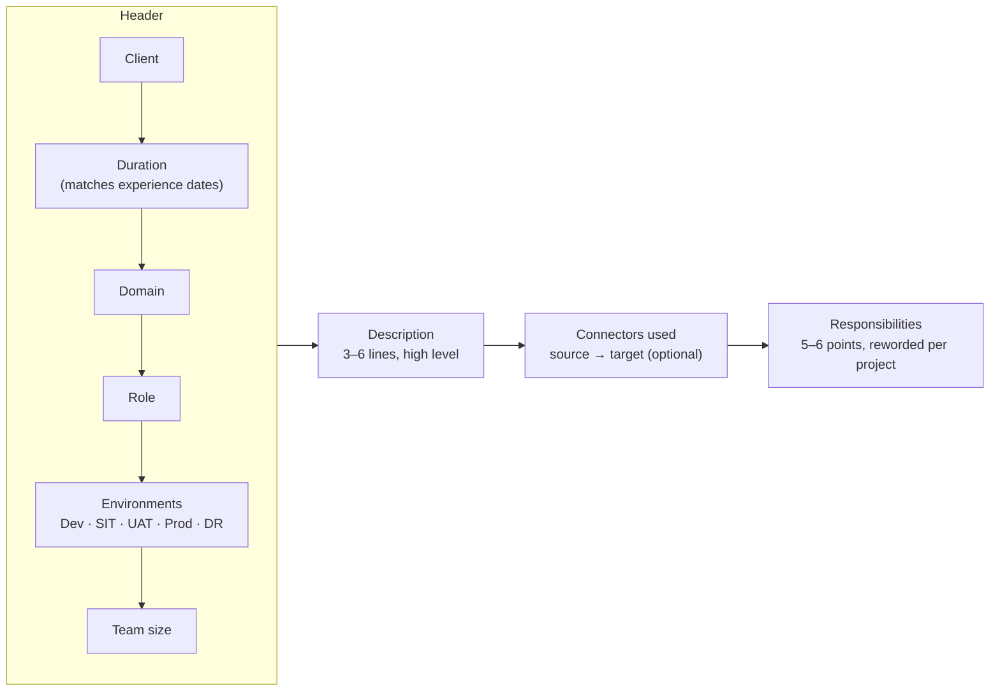

| Project | Client / domain | Role | Description |
|---|---|---|---|
| #1 | ABC Bank — Banking and Financial Services (Jan 2022 – date, team 10) | MuleSoft Developer | Digital Lending: partners (Google Pay, Flipkart, Amazon, CRED, Ola…) offer BNPL, personal and vehicle loans — completely paperless |
| #2 | XYZ — Retail (Jan 2021 – Jan 2022, team 3) | MuleSoft Developer | Loyalty program connected to point-of-sale systems; automatic rewards at checkout |
| #3 | BCD Bank — Financial Services (Nov 2018 – Dec 2020, team 30) | Mainframes Developer | Non-MuleSoft project, listed with full details |

- **DR** (disaster recovery) is listed for the banking project — critical for banks. Explaining it well can impress.
- Responsibilities: development, best-practice code (error handling, logging, security), testing with QA, security (OAuth2, Basic Auth, Client ID, encryption), troubleshooting, code reviews, sharing new MuleSoft knowledge, banking regulations, POCs, documentation.
- **Don't claim mentoring juniors in your first project.**

---

## 6. Recruiter Call, Package and Cover Letter

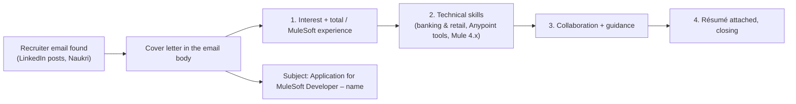

**Cover letter:**

- Change the recruiter's name for every email.
- Leave out the mentoring line if you aren't confident about it.

**Recruiter call:**

- Answer in full sentences: "I am receiving 5 LPA", not "5 lakhs".
- Practice written answers to the common questions.

**Package (instructor's view at the time):**

- Rule of thumb: years × 2–4 LPA.
- Hikes of about 25–35% on the current salary.
- Early in your career, take less salary and learn the work first.

**Profiles:**

- Naukri: complete every segment; update it daily, 2–3 times if possible; a group can share and rotate one premium subscription.
- LinkedIn: use the free premium month only once you're fully prepared.

**Unexplained rejections:**

- **Ghost recruitment** — jobs posted only to show presence in the market.
- Positions put on hold after the client cancels the requirement.
- Keep going: persistence and consistency matter.

**Entry-level jobs:**

- Job portals and referrals.
- Apisero (NTT Data), Wishworks (Coforge), startups and small companies.

---

## 7. The Three Opening Questions

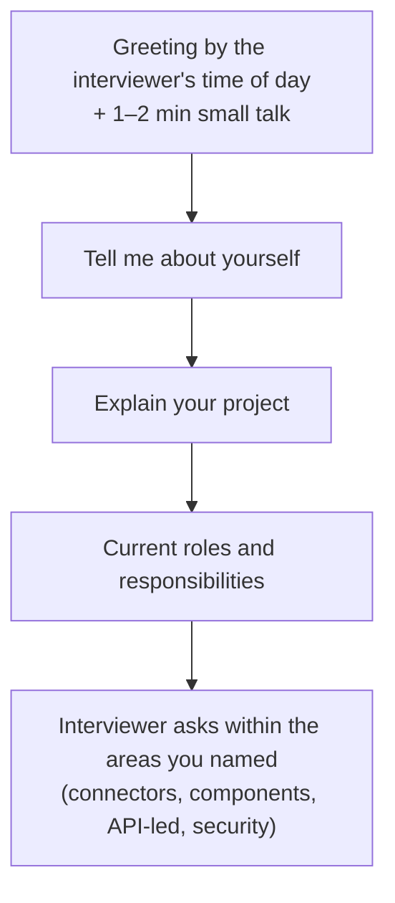

**Tell me about yourself — order:**

1. Total experience
2. Relevant experience
3. Certification
4. Projects and domains (say "**end-to-end implementations**" — a single API is also called a "project" in MuleSoft)
5. Runtime (4.4) and Studio (7.12) versions
6. Connectors and components
7. API-led, RAML in Design Center, Studio, MUnit
8. CI/CD; CloudHub / on-prem / hybrid
9. Postman, Bitbucket, Jenkins

- Not confident explaining a project? Stop after this general overview.
- **MCD Level 2** helps you stand out — but earn it honestly, not from dumps.

**Explain your project — Transaction and Loyalty Management:**

- Updates the backend **Salesforce** whenever a customer transaction is initiated.
- A **scheduler** runs at midnight: it fetches the previous day's transactions, calculates points with a third-party loyalty API and inserts them into the DB.
- Customers claim coupons with their points; tables are updated after a claim.
- **API-led** — experience, process and system APIs; 7 APIs and 2 integrations (give your real numbers).
- **Two-way SSL + OAuth 2.0** on the experience API; **HTTPS + Client ID Enforcement** between internal APIs.
- **80% MUnit** coverage.
- Source: the front end. Targets: Salesforce and the database.

---

## 8. Roles and Responsibilities Flow

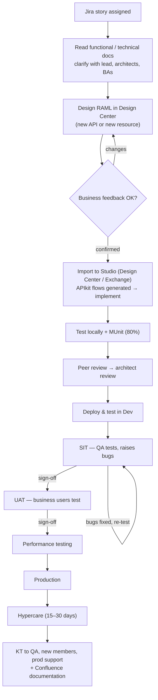

- Enhancements to existing APIs follow the same flow.
- Remembering 5–6 steps and saying them confidently is enough.

---

## 9. API, Web Service, REST and SOAP

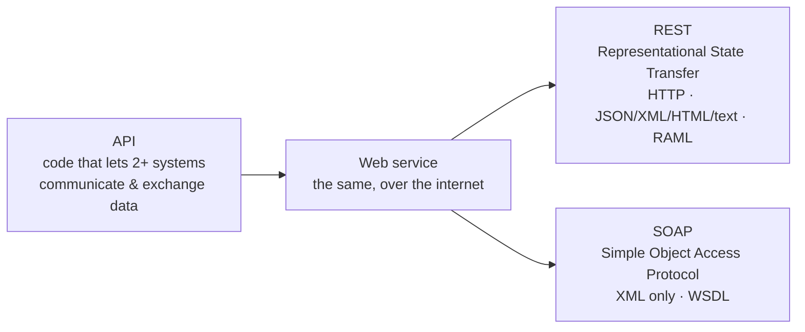

| | SOAP | REST |
|---|---|---|
| Nature | Protocol | Architectural pattern |
| Contract | WSDL | RAML |
| Formats | XML only | JSON, XML, HTML, plain text |
| Bandwidth | More (heavy XML tags) | Less (light JSON) |
| Uses the other? | Cannot use REST | Can use SOAP or HTTP |
| Exposes logic via | Service interfaces (operations) | URIs |
| Security | Defines its own | Inherits from the transport layer |
| Caching | Not possible | Possible |
| Preference | Less (complex) | More popular |

**When to choose which:**

- **REST** for simplicity, flexibility and **caching**.
- **SOAP** for **strong security and standardized communication**, and complex implementations.

**How to answer:**

- 3–4 points are enough.
- Start with the abbreviations.

---

## 10. Query vs URI Parameters

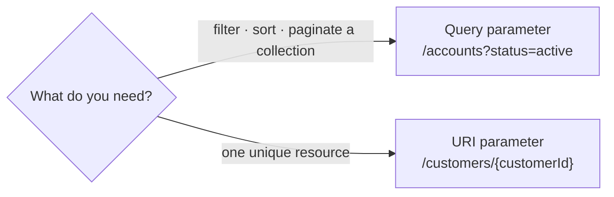

- Query parameters go **after `?`** at the end of the URL.
- URI parameters (URI was expanded in class as "Unique Resource Identifier") sit **in the path** in curly braces.
- Examples:
  - All active accounts → filter → query parameter.
  - Employee 100, or a customer's loan details by customer ID → URI parameter.
- Experienced developers still mix these up — keep one example of each ready.

---

## 11. HTTP Methods

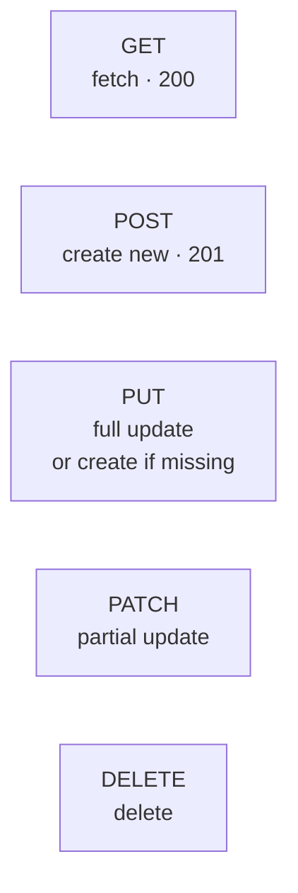

- **POST vs PUT:** POST always creates a new resource; PUT replaces an existing one or creates it if absent.
- **PUT vs PATCH:** PUT updates the whole resource; PATCH updates only part of it.
- Following these meanings isn't mandatory, but it's the best practice and widely followed — it avoids confusion for API consumers.
- **Student question:** setting a status code without the HTTP Listener's error response.
  - Every response carries a **status code + reason phrase** (e.g. 200 OK).
  - The **MuleSoft default error handler** fills both in when you don't.
  - Whether another component can set it was left open.

---

## 12. HTTP Status Code Families

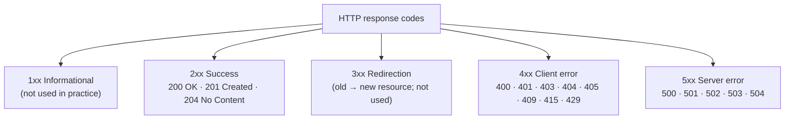

| Code | Class example |
|---|---|
| 400 Bad Request | Request in an undesired format / missing parameters |
| 401 Unauthorized | Wrong credentials |
| 403 Forbidden | Understood, but this consumer isn't allowed that resource |
| 404 Not Found | Resource not on the server |
| 405 Method Not Allowed | GET sent where only POST is defined (or vice versa) |
| 409 Conflict | Creating a customer with a duplicate customer ID |
| 415 Unsupported Media Type | XML or CSV sent where JSON is expected |
| 429 Too Many Requests | Rate Limiting policy exceeded |
| 500 Internal Server Error | Database or underlying system down |
| 501 Not Implemented | Server doesn't support the functionality |
| 502 Bad Gateway | Gateway gets no response from the upstream server |
| 503 Service Unavailable | App not running; locally with Autodiscovery on — disable the gatekeeper or comment out the Autodiscovery ID |
| 504 Gateway Timeout | Upstream slower than the gateway's timeout (e.g. 300 ms) |

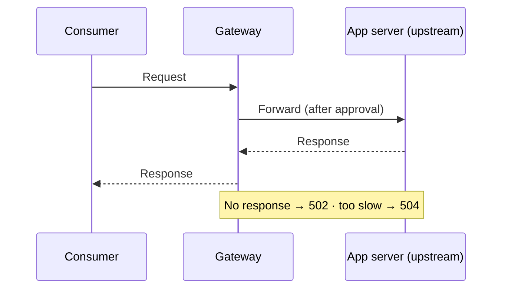

- If asked, explain 3–4 codes confidently — but know all of them (409 and 429 come up directly).

---

## 13. Next Session — RAML Questions

- What is RAML? (RESTful API Modeling Language; YAML-based; Design Center supports RAML 1.0 and 0.8.)
- Traits (reusable, like functions — common properties for HTTP methods), resource types, libraries — and the differences.
- Fragments; reusability, modularity and consistency; data types.
- Restricting extra or number of properties; security in RAML; multiple request data types and formats.
- baseUri; RAML version (current and latest); Swagger/OAS.
- The same method twice on one path; methods RAML supports; sharing the spec for testing.
- API Manager questions follow.

---

## Quick Recap

- Résumé = header (certs on top) → objective (enterprise integration) → profile summary → skills table → achievements → experience/education → projects → declaration.
- Every profile-summary point is a keyword for recruiters *and* a signal to the interviewer — list only what you can answer, and keep 70–80% of the ideal points.
- Use Mule ESB *and* MuleSoft, name all Anypoint components, vary keyword forms.
- Achievements: quantified and explainable. Projects: ≥2 MuleSoft, matching dates, DR for banking, 5–6 reworded responsibilities, no mentoring in your first project.
- Cover letter: four short paragraphs, personalised name, clear subject.
- Opening questions: tell me about yourself → explain your project → roles and responsibilities (Jira → RAML → Studio → MUnit → reviews → SIT → UAT → performance → Prod → hypercare → KT).
- REST vs SOAP: pattern vs protocol, RAML vs WSDL, many formats vs XML, light vs heavy, transport security vs own security, caching vs none.
- Query params filter/sort/paginate; URI params identify one resource.
- POST creates, PUT replaces or creates, PATCH partially updates.
- Status codes: 2xx success, 4xx client, 5xx server; know 409, 415, 429, 502, 503, 504 specifically.
