# Interview Preparation Part 2 — Detailed Notes: RAML, API Manager and Policies, OAuth 2.0 / JWT, Error Handling, and DataWeave Q&A

> **Watch alongside:**
> - The instructor reads through his prep text files topic by topic. He gives the model answer for each question, then explains it.
> - Order: the 19 RAML questions deferred from Part 1 (with an Exchange public-portal demo) → API Manager, gateway and proxy → policies → OAuth 2.0 and JWT (using the project-class OAuth deck) → error handling (with two drawings) → DataWeave functions.

> **Video-verified:** written from the cleaned transcript and the class recording (31 Mar 2024). Slide images: [slides/interview-part2](../slides/interview-part2/).

---

## 1. RAML Reuse Building Blocks

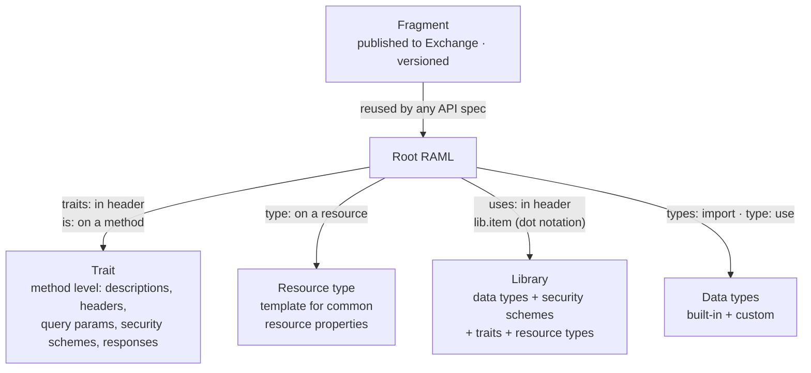

| Question | Answer from class |
|---|---|
| What is RAML? | RESTful API Modeling Language — YAML-based, describes RESTful APIs, designs the API spec (API contract); Design Center supports 1.0 and 0.8 |
| Trait | Reusable like a function; common properties for **HTTP methods**; `is` keyword |
| Resource type | Template for common properties of **resources**; `type` keyword |
| Library | Collection of data types, security schemes, resource types (and traits); `uses:` + dot notation |
| Fragment | Reusable across **any** spec via Exchange; versionable; **not an independent API spec** |
| Why use them | Readability, reusability (less redundancy), modularity, consistency |

- **Start with the abbreviation** — it buys time to recall the rest.
- **0.8 vs 1.0:** you've only used 1.0, the latest, and you don't have 0.8 exposure.
- Remember above all: traits, resource types, libraries, fragments, data types, security schemes.

---

## 2. Data Types and Validation Keywords

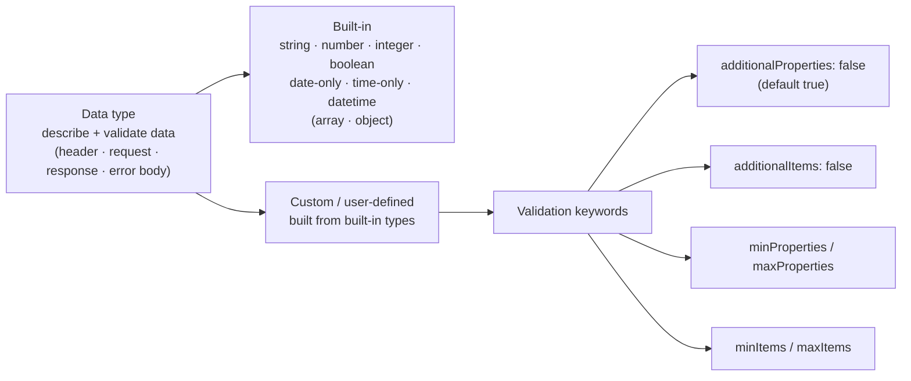

- Date / time types are rarely used — JSON has no date type.
- In practice: string, number, integer, boolean (and enum).
- Class example: an object with salary, designation and one more field, sent with an extra `status: active`. With `additionalProperties: false` it's **rejected**.
- `minProperties: 3`, `maxProperties: 5` → fewer than 3 or more than 5 are rejected. Use both min and max for a range.

---

## 3. Bodies, Security and Other RAML Answers

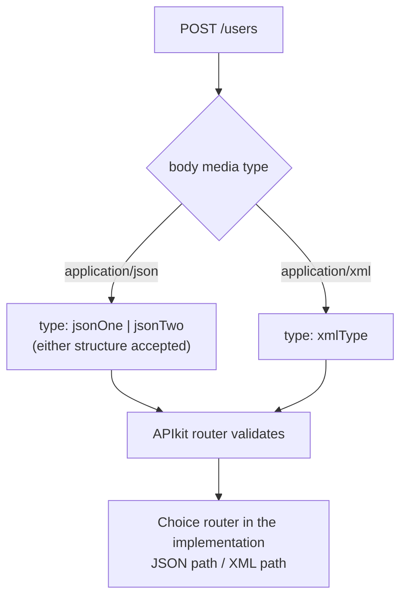

| Question | Answer from class |
|---|---|
| Multiple request data types / formats | List them under `body`; nothing listed = any data |
| Two JSON structures | Pipe: `jsonOne \| jsonTwo` |
| Accept null for a string | `type: string \| nil` — `nil`, lowercase |
| Security in RAML | Security schemes; `securedBy` at root = all resources, at a resource = that one; **resource level wins** |
| Mandatory field | `title` |
| baseUri | Optional base URL; URL = baseUri + resource path; dummy during design, real after; shows in mocking/docs/"Try it"; version (`v1`) often included |
| RAML version | 1.0, the latest (since ~2016) |
| Swagger / OAS | Swagger = old name of OAS (Open API Specification). "No — but ready to learn and contribute, as I know RAML" |
| Same method twice on one path | No — unique methods per resource. Parent and child paths can each have GET |
| Methods RAML supports | GET, POST, PUT, PATCH, DELETE, HEAD, OPTIONS |

```yaml
/users:
 post:
   body:
     application/json:
       type: jsonOne | jsonTwo
     application/xml:
       type: xmlType
```

- The 5-consumers-JSON / 5-consumers-XML case is tricky; the instructor hasn't needed it in a real project.

---

## 4. Sharing an API Spec for Testing

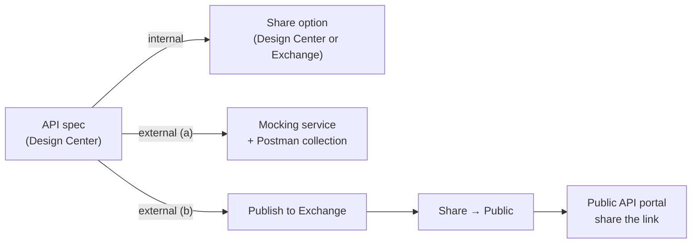

- **Demo:** Exchange asset → **Share** → **Public** → save → the asset appears in the developer portal ("Welcome to your developer portal!").
- Anyone with the portal link can test an asset there; the demo asset had no resources, so it couldn't be tested.
- The portal is a collection of APIs: make 5 of 10 public and only those 5 appear.

---

## 5. API Autodiscovery

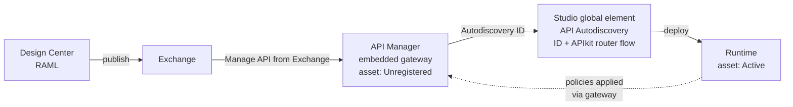

- **API Manager:** an Anypoint Platform component that manages policies, alerts, clients and SLAs. Short form: "manage policies and clients".
- **Autodiscovery:** an ID that pairs the deployed app with its API Manager asset.
- Point it at the **flow containing the APIkit router** — not a random flow.

---

## 6. API Gateway vs API Proxy

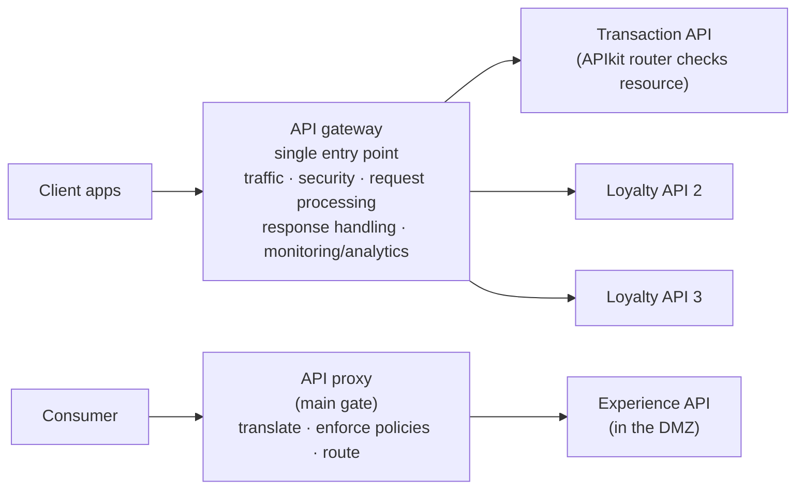

| | API gateway | API proxy |
|---|---|---|
| Scope | **Many APIs** — central hub | **One API** |
| Features | Traffic management, monitoring, analytics, versioning | Translate requests, enforce policies, route traffic |
| 100 APIs | One gateway | 100 proxies |

- **Security-guard analogy:** the gateway checks visitors at the main gate; the **APIkit router** decides which room they can enter.
- Gateways named on the slide: Apigee, MuleSoft Embedded (the default), MuleSoft Flex, Kong, Tyk; AWS offers one too. It's fine to say you've only used MuleSoft's.
- A Client ID violation never reached the app logs in the project classes — the gateway rejected it.
- The gateway routes to **APIs**, not nodes; a load balancer handles nodes.
- Asked of 5-year candidates — know the difference.

---

## 7. Security Policies

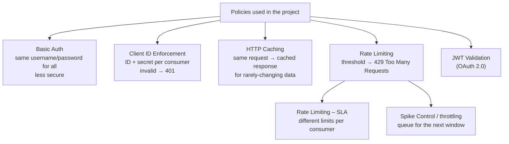

| Question | Answer from class |
|---|---|
| Basic Auth vs Client ID | Both secure the API. Basic Auth: same credentials for all, less secure. Client ID: different ID/secret per consumer, more control |
| HTTP Caching | Serves repeated requests from cache → better performance, less load on the source |
| Rate Limiting | e.g. 100/hour; the 101st request → **429**; accepted again after the window |
| Different limits per consumer | Yes (e.g. 500/day vs 1000/day) — the SLA-based policy |
| Spike Control | Like rate limiting, but **queues** the extra requests |
| Rate Limiting vs throttling | Rate limiting rejects at the threshold; throttling queues, and rejects only after the retries run out |

- If you don't mention OAuth 2.0, expect "did you work on OAuth 2.0?".
- Caching isn't really "security" — it's just one of the policies (a student's question).

---

## 8. OAuth 2.0 — Process and Grant Types

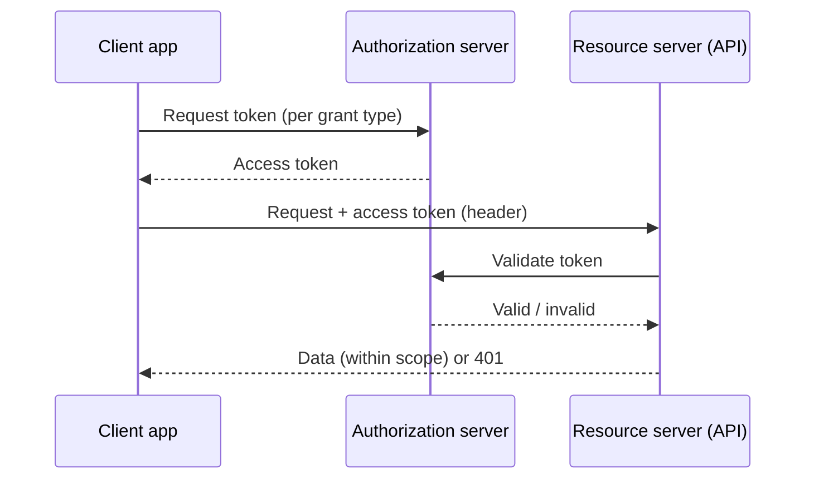

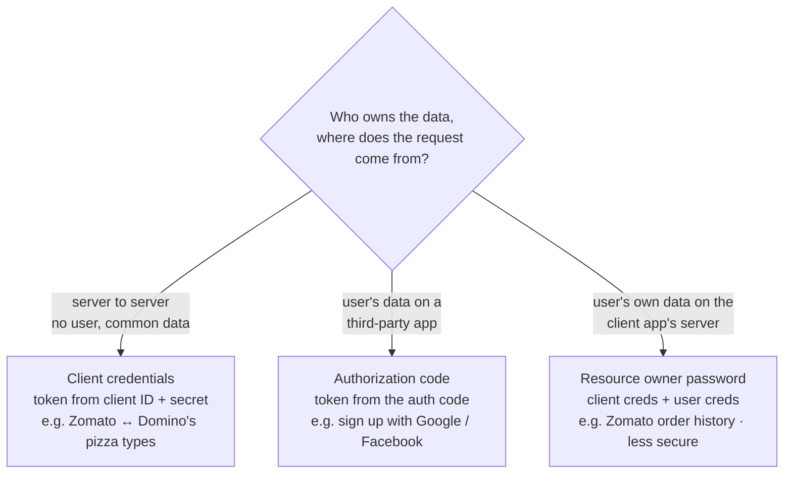

- **Definition (slide):** OAuth 2.0 = Open Authorization — an authorization framework, not an authentication protocol. A user lets an application access their resources hosted on another application, on their behalf, without sharing credentials.
- Never worked on OAuth 1.0? Say so.
- **Scope** limits access, e.g. GET-only on profile details.
- Terms: resource owner, resource server, client, authorization server, grant, redirect URI.
- **OAuth dance (= OAuth flow):** the series of steps to get the token and validate it — redirect to the authorization server, exchange the code for a token, use the token.
- OAuth is mostly applied to **exposed** APIs (experience / proxy): it costs a separate server and more calls.

---

## 9. Authentication, Authorization and OpenID

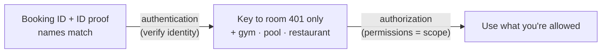

| | Meaning | In OAuth 2.0 |
|---|---|---|
| Authentication | Verifying a user's identity | Happens at the authorization server, **first** |
| Authorization | Granting permission for specific actions | Happens **after** authentication; scope sets the level of access |
| OAuth policy | Authorization only | |
| OpenID Token Enforcement | **Authentication + authorization** | Only requests with valid access tokens get in |

---

## 10. JWT Validation

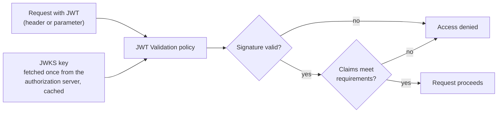

- **JWT** = JSON Web Token: a compact, self-contained JSON object — **header.payload.signature** (jwt.io showed it decoded, "Signature Verified").
- Used mostly on **experience APIs**.
- Plain OAuth validation would call the authorization server for every token (1 lakh requests = 1 lakh calls). JWT Validation skips that.
- **Claims** = the information in the token's payload.

---

## 11. Error Handling — Levels and Global Handler

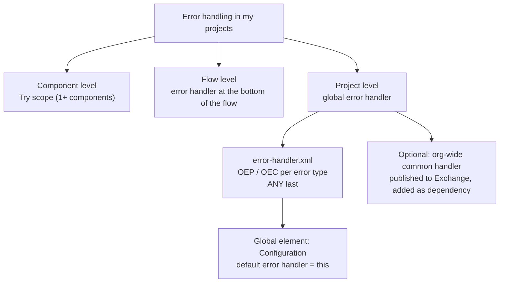

- **Model opening:** "I have implemented error handling… followed global error handling… used On Error Propagate, On Error Continue, Raise Error and Error Handler; Try scope for component level, the flow handler for flow level, otherwise global."
- Error kinds: **system** (system down), **technical** (DataWeave / expression), **business** (e.g. loan age outside 21–60).
- Raise business errors with **Raise Error** or the **Validation module** (which sets the error type and message). The Validation module also answers "raise without error components".
- The handlers are checked **in order**, like a Choice router. **ANY first catches everything**, so it goes last.
- Certification error-handling questions are harder than interview ones.

---

## 12. On Error Continue vs On Error Propagate

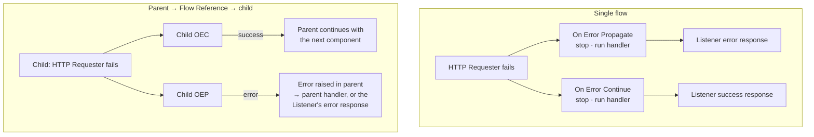

- **Both stop the process** where the error occurred.
- Continue sends a **success** response to the **next level**; Propagate sends an **error** response.
- "Next level" = the parent flow, or the consumer if there's no parent.
- Students first said Continue "keeps the flow going"; the drawings corrected this.
- **Success status code validator** only applies to HTTP — it can't help with, say, a database error.

---

## 13. Continuing After Errors — Try + On Error Continue

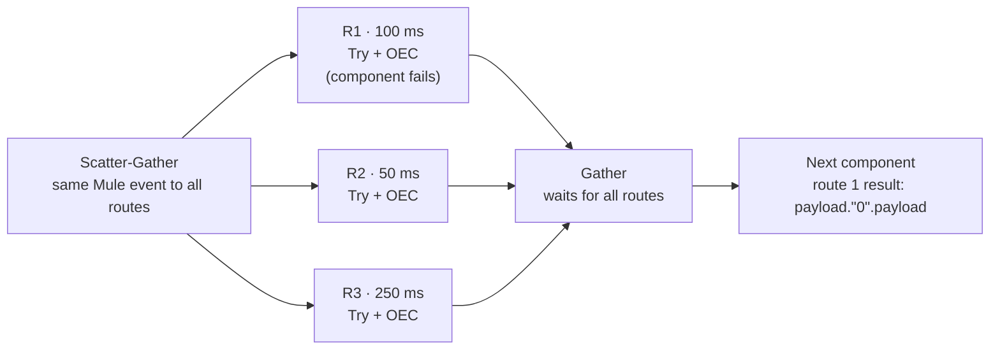

| Where | Default on error | To continue |
|---|---|---|
| Sub-flow | No handler of its own — inherits the parent flow's | Try scope inside the sub-flow (in practice a private flow is used instead) |
| For Each | Stops at the failing item (e.g. item 5 of 10) | Try + On Error Continue **inside** the For Each → items 6–10 still run |
| Parallel For Each | Same | Try + On Error Continue inside it (the slide's "for-each" is a copy-paste slip) |
| Scatter-Gather | All routes finish, then **MULE:COMPOSITE_ROUTING** → stop and propagate | Try + On Error Continue around **every route's** components |

- On Error Continue with no type = ANY.
- **Which route failed?** The failing route stops at that component, and its On Error Continue sets the error response. Read it with `payload."0".payload`.

| | Reconnection strategy | Until Successful |
|---|---|---|
| Where | Connector config (Database, HTTP Requester…) | A scope around the component |
| Retries on | Connectivity errors only | Any error |

---

## 14. DataWeave Answers

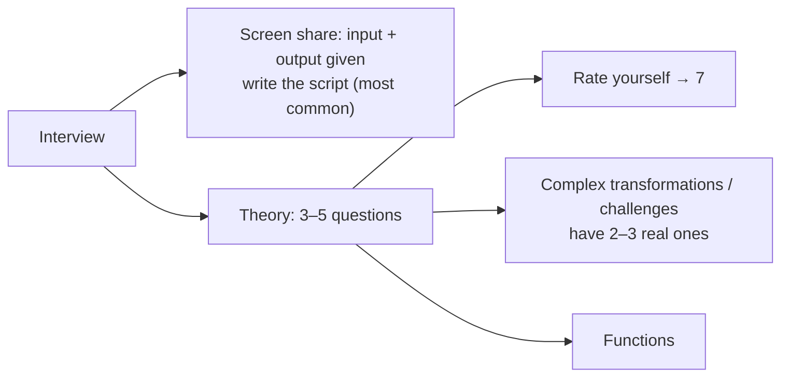

| Function | Answer from class |
|---|---|
| `flatten` | Input array → output array; flattens the **first level** of sub-arrays, omits empty ones; deeper nesting stays |
| `distinctBy` | Removes duplicates; array → unique values, object → unique key-value pairs |
| Remove a key | `payload - "name"` |
| `splitBy` | String → string array by regex; `""` splits every character, `" "` splits words |
| `lookup` | `Mule::lookup(flowName, input, timeoutMs)` — flow or private flow, **not a sub-flow**; default **2000 ms**; passes only the input (a Flow Reference passes the whole Mule event) |
| `read` | Parses a string/binary with a given type — `read(payload, "application/json")` |
| `write` | Serializes to a string — e.g. a JSON object into one DB column |
| `filter` / `filterObject` | Array → array / object → object |
| `reduce` | Computation over an array, or array → object; `$` item, `$$` acc; acc not set → acc = first element, item from the second |

```dataweave
[0,1,2,3,3,2,1,4] distinctBy $                       // [0,1,2,3,4]
payload distinctBy ((value, key) -> "key": value)    // {"a":5,"a":5,"b":6} → {"a":5,"b":6}
[2,3] reduce ((item, acc = 4) -> acc + item)         // 9
```

- **Multipart form data:** a rare requirement (never asked in the instructor's 150+ interviews). If you haven't used it, say so.
- **Practice every function** in the Playground or Studio; a practice set of 15–20 problems was promised.
- **Shown on screen, not discussed:**
  - `default` (`payload.name default "XYZ Bank"`);
  - custom functions with `fun` in the header;
  - `skipNullOn = "everywhere"`;
  - `p('prop')` / `p('secure::prop')`;
  - `isEmpty()`;
  - DataWeave version (slide: latest 2.6.0, using 2.0);
  - lookup can't call a sub-flow.

---

## Quick Recap

- **RAML:** expand the abbreviation first. Trait (method, `is`) / resource type (resource, `type`) / library (collection, `uses:` + dot) / fragment (any spec via Exchange, not independent).
- **Restrictions:** `additionalProperties`/`additionalItems: false`, min/max properties and items, `securedBy` (resource level wins), `typeA | typeB`, `string | nil`.
- baseUri is optional; title is mandatory; RAML 1.0; Swagger/OAS — "no, but ready to learn"; no duplicate methods on one path.
- **Share specs:** Design Center share (internal); mocking + Postman, or the Exchange public portal (external).
- **Autodiscovery** pairs the app with the API Manager asset — the global element must point at the APIkit router flow.
- **Gateway** = many APIs, single entry point; **proxy** = one API, often at the main gate in front of the DMZ.
- Basic Auth (shared, less secure) vs Client ID (per consumer, 401). Caching for stable data. Rate limit → 429. SLA → per-consumer limits. Spike Control / throttling → queue.
- **OAuth 2.0:** an authorization framework. Client credentials (server-to-server), authorization code (third-party sign-up), resource owner password (own data, less secure). Scope limits access.
- OpenID Token Enforcement = authentication + authorization. Authentication comes first.
- **JWT** = header.payload.signature; validated locally with a cached JWKS key, plus a claims check.
- **Error handling:** Try (component), flow handler, global handler via Configuration → default error handler. ANY last. Business errors via Raise Error or the Validation module.
- **On Error Continue vs Propagate:** both stop the process; Continue sends success to the next level, Propagate sends an error.
- **Try + On Error Continue** keeps sub-flows, For Each, Parallel For Each and Scatter-Gather routes going. Scatter-Gather otherwise raises MULE:COMPOSITE_ROUTING.
- Reconnection = connectivity errors only; Until Successful = any error.
- **DataWeave:** rate yourself 7. flatten (first level), distinctBy, `payload - "key"`, splitBy, lookup (no sub-flow, 2000 ms), read/write, filter/filterObject, reduce (`$`, `$$`).
