# Interview Preparation Part 3 — Detailed Notes: DataWeave Q&A (continued), API-led Connectivity, Runtime Manager, Deployment, Clustering and Load Balancers, and HTTPS / TLS

> **Watch alongside:**
> - The instructor reads through his prep text files section by section. He gives the model answer for each question, then explains it.
> - Order:
>   1. The rest of the DataWeave questions (Q12–Q32, with Playground and Studio checks).
>   2. API-led connectivity and the API lifecycle.
>   3. Runtime Manager, scaling and deployment models.
>   4. *(break)*
>   5. Clustering (with a load-balancer drawing).
>   6. URLs, VPC / VPN and load balancers.
>   7. Domain project.
>   8. Deployment methods and logs.
>   9. Keystore / truststore and the TLS handshakes.

> **Video-verified:** written from the cleaned transcript and the class recording (6 Apr 2024). Slide images: [slides/interview-part3](../slides/interview-part3/).

---

## 1. DataWeave — Functions and Variables

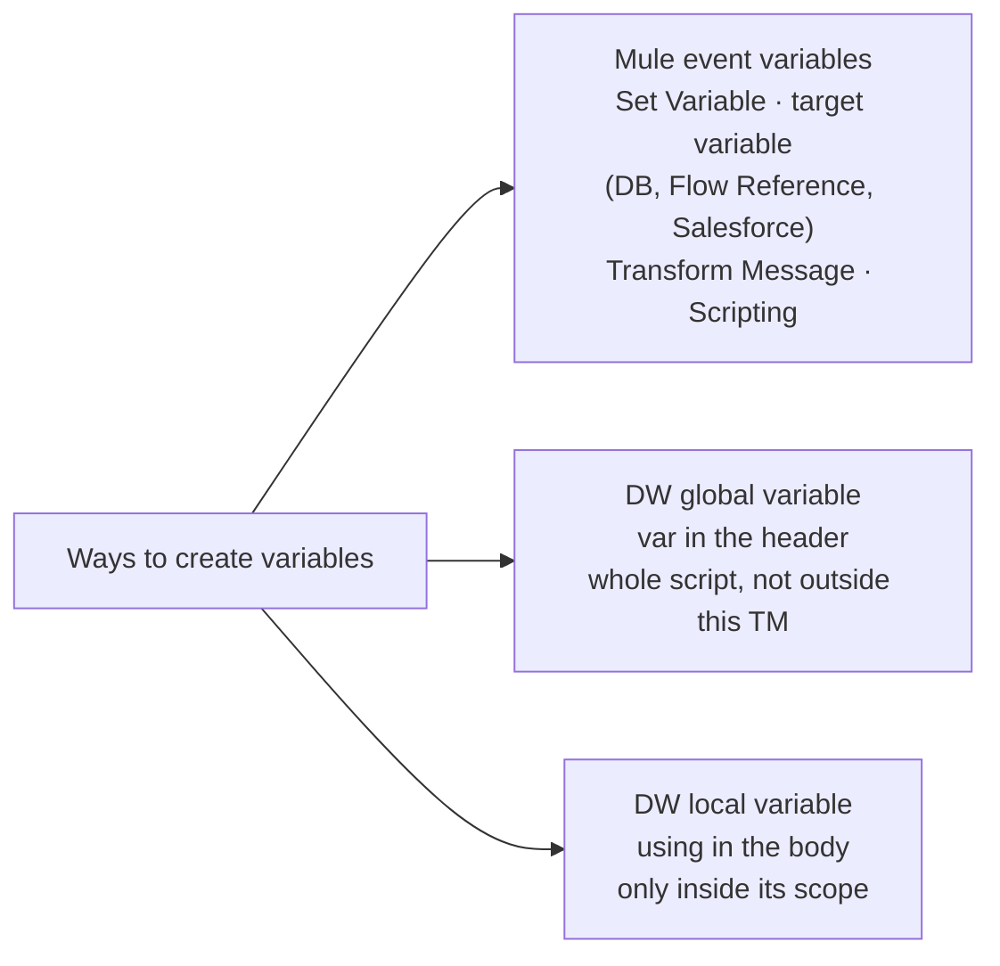

| Question | Answer from class |
|---|---|
| Q12 default | Sets a value when the field is absent / null: `payload.name default "XYZ Bank"` |
| Q13 custom function | `fun myfunction(p1) = upper(p1)` in the header; call `myfunction("Hello")` → "HELLO" |
| Q14 variables | Set Variable, target variables, Transform Message, Scripting, DW global (`var`), DW local (`using`) |

- Part 2 stopped at Q10 (reduce). Q11 (encrypt / decrypt) was skipped; this session starts at Q12.
- Use `default` whenever a missing field would break a concatenation or an expression.

---

## 2. DataWeave — Selectors and Dates

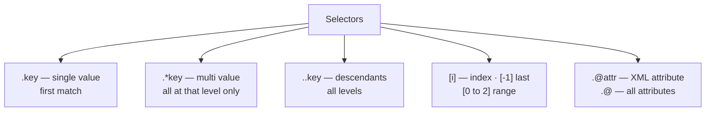

| Expression | Result |
|---|---|
| `now() >> "IST"` | Convert to a time zone (CloudHub default: UTC) |
| `now() as Date` | Date only |
| `as Date {format: "yyyy-MMM-dd"}` | 2021-12-14 → "2021-Dec-14" (MMM = Dec, MM = 12) |
| `now() + \|PT15M\|` / `+ \|P10D\|` | +15 minutes / +10 days (PT = h/m/s, P = y/m/d) |
| `now().year` / `.month` / `.day` | Parts of the date |

- **Dates from JSON are strings.** Parse the string as a Date in its current format, then format it into the target format.
- Copying from the prep file: fix the curly double quotes.

---

## 3. DataWeave — Collection Functions

```mermaid
flowchart LR
    O["Object"] -->|"pluck"| A["Array"]
    A -->|"reduce"| O
    A -->|"map ($ item, $$ index)"| A2["Array"]
    O -->|"mapObject ($ value, $$ key, $$$ index)"| O2["Object"]
    A -->|"joinBy #quot;-#quot;"| Str["String"]
    Str -->|"splitBy"| A
```

| Function | Answer from class |
|---|---|
| `++` (concat) | Appends strings, objects, arrays. `$()` / the object destructor exist but weren't used |
| `pluck` | Iterates an object → array of values |
| pluck vs mapObject | Both iterate an object; pluck → array, mapObject → object |
| map vs mapObject | Array → array vs object → object |
| `joinBy` | Array → string with a separator; the opposite of splitBy |

- **`$` rule:** the lambda's first parameter is `$`, the second `$$`, the third `$$$`.
- **Auto-complete** fills in the map / mapObject syntax for you.
- **Screen-share tip:** paste the given request as the input. Keep the expected response in a `var` in the header, so you can compare without switching screens.
- Core set (10–15 is enough): map, mapObject, distinctBy, splitBy, joinBy, reduce, pluck, filter, filterObject.

---

## 4. DataWeave — Header Options and Utilities

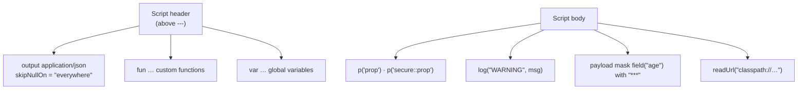

| Question | Answer from class |
|---|---|
| Q21 skip nulls | `skipNullOn = "everywhere"` (or attributes / elements) on the output line. Playground: a missing `name` disappears from the output |
| Q22 data formats | JSON, XML, CSV — 80% of questions are on JSON |
| Q23 version | Using 2.0; the latest is 2.6.0 |
| Q24 config properties | `p('name')`, `p('secure::name')` |
| Q25 log | `log(prefix, value)` — a function, not the Logger component |
| Q26 lookup a sub-flow | No — only a flow or private flow |
| Q28 null check | `isEmpty()` — array, object, string |
| Q29 mask | `payload mask field("age") with "***"` |
| Q30 app / flow name | `app.name`, `flow.name` — Logger only, in Mule 4 |
| Q31 if-else | `if (cond) value else value`; more conditions → `else if`; the final `else` = default |
| Q32 readUrl | Reads a URL or file. The MUnit recorder saves files in src/test/resources and reads them with `readUrl("classpath://…")` |

- **"How do you keep up with updates?"**
  - Meetups (online / offline) and the MuleSoft release notes.
  - Be ready with 2–3 points on CloudHub 2.0 (released around late 2023).
- **The instructor's own interviews:**
  - He interviewed 9½–13-year candidates for a lead role with these exact questions. None cleared the second round.
  - One couldn't explain PUT vs PATCH or REST vs SOAP.
  - Lesson: depth on what you know.

---

## 5. API-led Connectivity

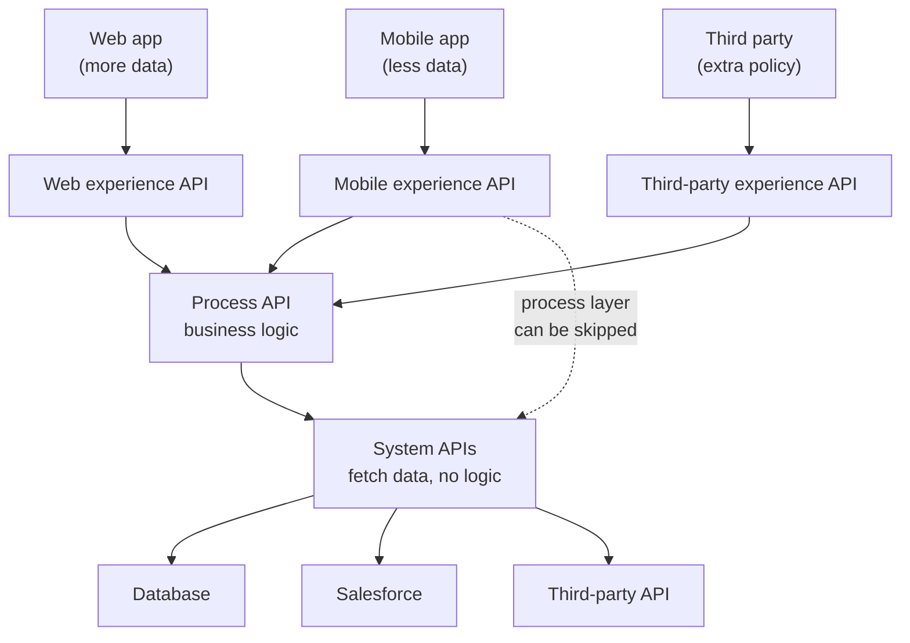

| Question | Answer from class |
|---|---|
| Explain API-led | A MuleSoft best practice, three layers. System = connect and fetch, no logic. Process = business logic. Experience = wrapper exposed to clients, with **all the non-functional policies** |
| Why more experience APIs? | Depends on the requirement: different data (mobile vs web) or different policies (third party vs internal). Same data and policies → one API |
| Advantages | Reusability; a break affects only limited functionality; faster time to market in the long run; easy to maintain (slide) |
| Disadvantages | Three APIs instead of one → more initial time; more vCores → more cost |
| Communication | HTTP Request connector (99%); or publish the API to Exchange as a connector |
| 3 systems, 2 consumers | 3 system + 1 process + 2 experience = **6**; **5** if one experience API serves both |

---

## 6. API Lifecycle

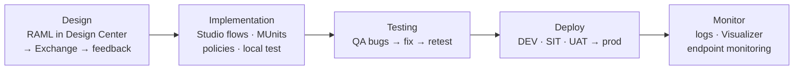

- The instructor was asked this in one of his own recent client interviews.

---

## 7. Runtime Manager, Workers and Scaling

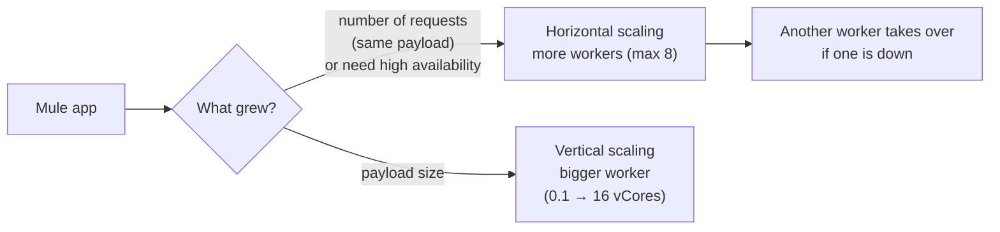

| Question | Answer from class |
|---|---|
| Runtime Manager | Anypoint module to deploy and manage apps (CloudHub, on-prem, RTF). Deploy / undeploy, stop / restart, logs, runtime version, worker size, scaling |
| vCore | Unit of compute capacity (CPU + memory) on CloudHub; max 10 apps per vCore at 0.1 each |
| Worker | A dedicated Mule instance on CloudHub. Capacity, isolation (own container), manageability, locality (US / EU / Asia-Pacific) |
| Apps per worker | 1 |
| Worker sizes | 0.1 – 16 vCores |
| Max workers | 8 |
| Mule runtime | The engine that hosts apps, like an application server; on-premise or cloud; one runtime hosts several apps |

- **Technique:**
  - Only say words you can explain — "RTF" invites an RTF question.
  - Say the ones you know (scaling) to steer the next question.
- **Performance testing** shows when to scale. If the current size copes, change nothing — 0.1 vCore handles 25–30 KB requests.

---

## 8. Deployment Models and Planes

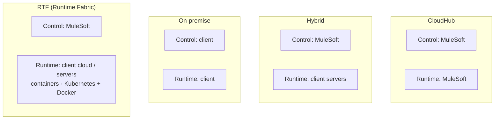

| | Contains |
|---|---|
| **Control plane** | Design Center, Exchange, Management Center — design, deploy, manage |
| **Runtime plane** | Mule runtime server, connectors, supporting services — where apps run |

- Name only the models you've worked on. For RTF: "not yet, but ready to learn".
- **Autoscaling** (the recording says "auto-tuning"): CloudHub adds and removes workers automatically with traffic — an extra licensing cost.

| CloudHub | On-premise |
|---|---|
| MuleSoft runs both planes | The client runs both |
| Max 10 apps per vCore | More apps (40–50 small ones per vCore) |
| No domain project | Domain project possible |
| Little maintenance | More maintenance (servers, patches, OS) — costlier |
| Less control over data | More control, more secure |
| Anypoint MQ (extra cost) | No Anypoint MQ |

- **Student question (RPA posting):** MuleSoft is entering RPA (UiPath leads). There are few RPA-only openings.

---

## 9. Cluster vs Server Group

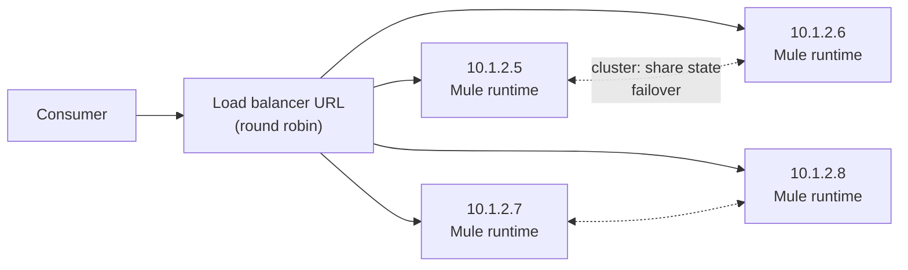

*Drawing:* client → load balancer → four CloudHub workers running T-SAPI; four on-premise servers 10.1.2.5–10.1.2.8.

| | Cluster | Server group |
|---|---|---|
| Definition | Up to 8 servers as one deployment target **and** high-availability unit | A set of servers as one deployment target |
| Nodes aware of each other | Yes — share info, sync status | No — run in isolation |
| If a node fails | Another picks up **where it stopped** | No failover |
| Benefit | High availability + one-step deployment | One-step deployment only |
| Runtime version | Same on all | Same on all |

- **CloudHub:** pick 2+ workers. Clustering, round-robin load balancing and spreading across **data centers** are automatic.
- **Hybrid:**
  1. Install runtimes.
  2. Register the servers in Runtime Manager.
  3. Servers → **Create Cluster** / **Create Group** (cluster type: unicast or multicast).
  4. Deploy to the cluster.
- A cluster uses a shared load balancer by default.
- Never created one? Say so — the instructor hasn't in real projects either.

---

## 10. URLs, VPC, VPN and Load Balancers

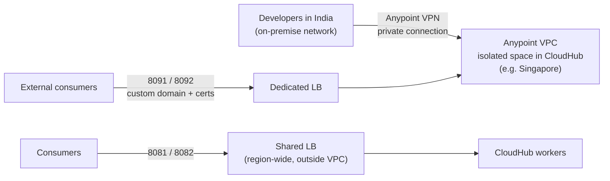

| Question | Answer from class |
|---|---|
| Implementation URL | Generated by CloudHub on deploy (hybrid: server IP + port + path) |
| Proxy URL | The URL of the proxy on top of the API — policies are applied there |
| What to share with consumers | The **load balancer URL** (a domain mapped to the servers) |
| Anypoint VPC | A dedicated, isolated cloud space (extra cost) → dedicated LB, own domain, data control, better performance |
| VPN | A secure private connection between the MuleSoft VPC and the on-premise network |
| Load balancer | Spreads the load across servers / workers; its URL is what's exposed |

| | SLB | DLB |
|---|---|---|
| Default? | Yes, all environments | Optional, in a VPC |
| Ports | 8081 / 8082 | 8091 / 8092 |
| Custom certificates, proxy rules | No | Yes, plus optional two-way auth |
| Domain | — | All apps under one domain |
| Rate limit | Lower, per region → **503** (not 429) | Avoids the SLB limit |

- This is admin / platform work — the platform-architect (MCPA) level.

---

## 11. Domain Project, Deployment and Logs

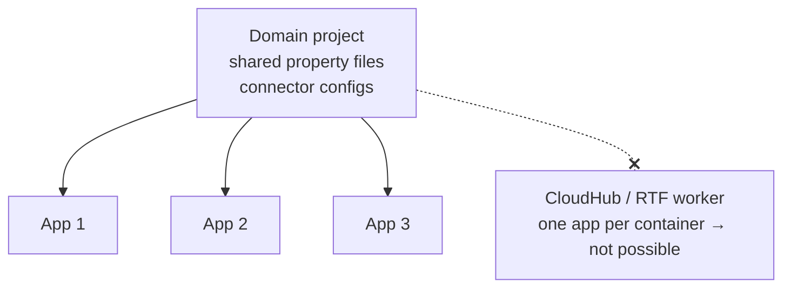

- **Domain project:**
  - a common project for shared resources — like a RAML fragment;
  - never independent;
  - **on-premise only** (the runtime's `domains` folder).
- **In Studio:** New → Mule Domain Project. Then in the app: Properties → Mule Project → select the domain → Apply.

| Ways to deploy | |
|---|---|
| 1 | Export the JAR → import it in Runtime Manager → configure the properties → deploy |
| 2 | Anypoint credentials in Studio → right-click → deploy |
| 3 | Check in to GitHub / Bitbucket → Jenkins CI/CD pipeline (the real-project way) |
| 4 | Drop the JAR into the on-prem runtime → the `.anchor` file confirms deployment |

- **Disable CloudHub logs?**
  - Yes. CloudHub keeps about 100 MB, then archives old logs.
  - For longer retention, send the logs to e.g. Splunk.
  - Only the **system logs** (deployment status, startup) stay in Runtime Manager.

---

## 12. HTTPS / TLS

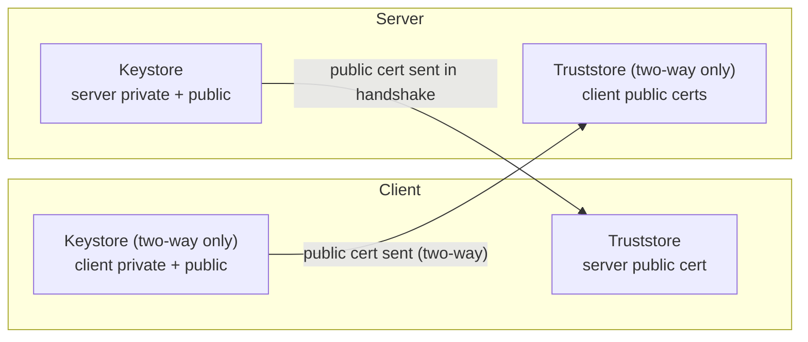

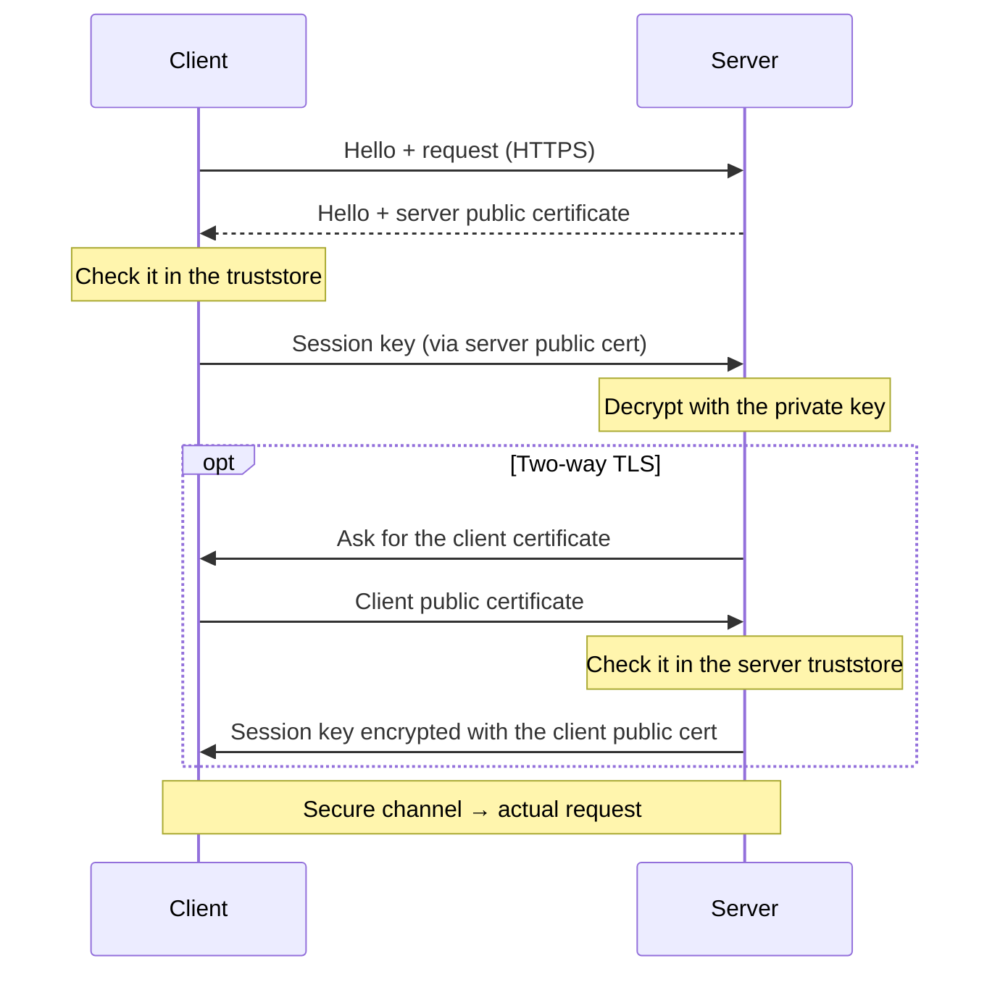

| Question | Answer from class |
|---|---|
| Keystore | Secure container for **private keys + certificates** that identify you |
| Truststore | A "safe box" of **trusted certificates**; used to check the other side's certificate |
| Private key | Secret, owner-only; decrypts incoming, encrypts outgoing |
| Public key | Freely shared; others encrypt with it, only the private key decrypts (lock and key) |
| SSL vs TLS | Both cryptographic protocols. SSL (Netscape, mid-90s) had vulnerabilities; TLS is the improved, more secure version; they're not compatible |
| One-way vs two-way | One-way: the client verifies the server. Two-way (mTLS): both verify |
| Expose HTTPS | `keytool -genkey` → HTTPS on the Listener → keystore in the TLS section |
| Consume HTTPS | HTTPS on the Requester → truststore in the TLS section (file in src/main/resources) |
| Generate certificates | keytool (Java) or OpenSSL; genkey, export, import |
| Symmetric vs asymmetric | One shared key vs a key pair (more secure) |
| Digital certificate | A system's ID card (like Aadhaar), issued by a CA, with an expiry date |
| Self-signed | Signed by yourself, not a CA → unsafe for public apps; OK when both sides agree |

---

## Quick Recap

- **DataWeave:** default; `fun`; six ways to make variables; selectors `.` `.*` `..` `[i]` `.@`; dates (`>>`, format, `|PT15M|`, `|P10D|`, parse strings first); `++`; pluck (object → array); map / mapObject `$`; skipNullOn; `p()`; `log`; lookup (no sub-flow); joinBy; isEmpty; mask; app.name / flow.name; if-else; readUrl.
- **API-led:** system fetches, process applies logic, experience wraps and secures. Extra experience APIs only for different data or policies. 3 systems + 2 consumers → 5–6 APIs.
- **Lifecycle:** design → implementation → testing → deploy → monitor.
- **Runtime Manager:** 1 app per worker, 10 apps per vCore, 0.1–16 vCores, max 8 workers. Horizontal for request volume / high availability; vertical for payload size.
- **Models:** CloudHub, hybrid, on-premise, RTF — split by who runs the control and runtime planes. Autoscaling costs extra.
- **CloudHub vs on-premise:** MuleSoft-managed and limited vs client-managed, flexible, costlier and more control.
- **Cluster vs server group:** both are one deployment target; only a cluster shares state and fails over.
- **SLB vs DLB:** 8081/8082 shared with a lower limit (503) vs 8091/8092 in a VPC with custom certificates and a domain.
- **Domain project:** on-premise only. **Deploy:** JAR upload, Studio, CI/CD, drop into the runtime (`.anchor`). **Logs:** 100 MB; external logging leaves only the system logs.
- **TLS:** keystore = yours, truststore = trusted. One-way vs two-way handshakes. Listener → keystore, Requester → truststore. Symmetric vs asymmetric. CA vs self-signed.
- **Technique:** don't drop terms you can't explain; admit what you haven't done.
