# Day 03 — Slides and On-Screen Drawings

Frames captured from the Day 3 class recording (MuleSoft Telugu Course Day 3, recorded 30 Oct 2024; 14 slides). Repeated and blank frames have been removed. Times are positions in the video.

Notes for this day: [detailed-notes/day03.md](../../detailed-notes/day03.md) · [super-detailed-notes/day03.md](../../super-detailed-notes/day03.md) · [summary](../../day03.md)

| # | Time | Content |
|---|---|---|
| 01 | 0:01 | Agenda for today |
| 02 | 2:57 | What are APIs? (slide definition) |
| 03 | 5:23 | Restaurant analogy — customer, waiter, kitchen (drawing) |
| 04 | 8:13 | ICICI Bank — one API serving Android, iOS and net banking; "All web services are APIs / All APIs are not web services" (drawing) |
| 05 | 22:11 | Technical example — ICICI Bank: `{"acNo":1234,"reqType":"Balcheck"}` → `{"acNo":1234,"Bal":25000}` (drawing) |
| 06 | 22:12 | What are web services? |
| 07 | 23:34 | REST web service (1) — full form, HTTP, formats, RAML |
| 08 | 28:58 | REST web service (2) — RAML contents, fewer resources, caching |
| 09 | 33:43 | JSON ("Light weight") vs XML ("Heavy") — same request written both ways (drawing) |
| 10 | 51:20 | SOAP web service (1) — HTTP/SMTP/UDP, XML only, WSDL; XML request/response sketch |
| 11 | 45:18 | SOAP web service (2) — WSDL contents, more bandwidth, no cache |
| 12 | 48:38 | REST vs SOAP |
| 13 | 50:28 | Real time environments (Dev, SIT, UAT, Preprod, Prod, DR) |
| 14 | 74:53 | Environments explained — API → DB / SFDC, Postman, features f1/f2 (drawing) |
| 15 | 72:09 | Disaster recovery — "Mumbai Data Center" (drawing) |

---

### 01 — Agenda
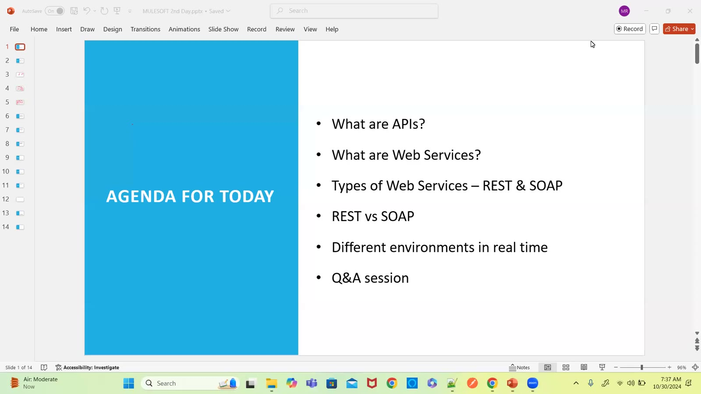

### 02 — What are APIs?
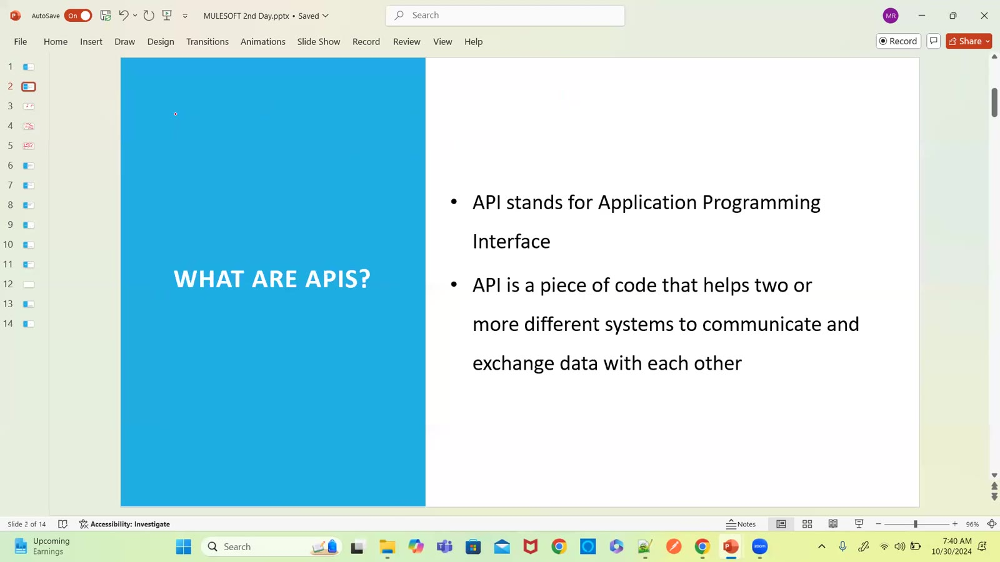

### 03 — Restaurant example
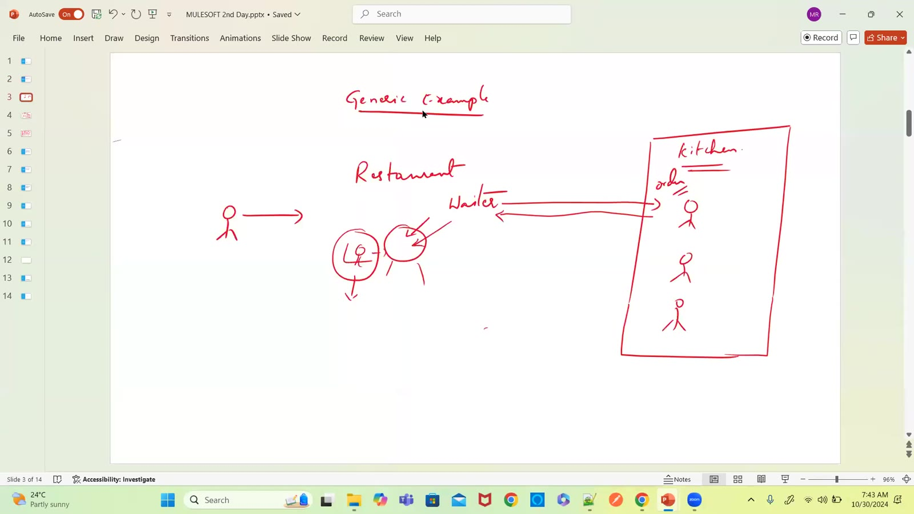

### 04 — ICICI: one API, many front-ends
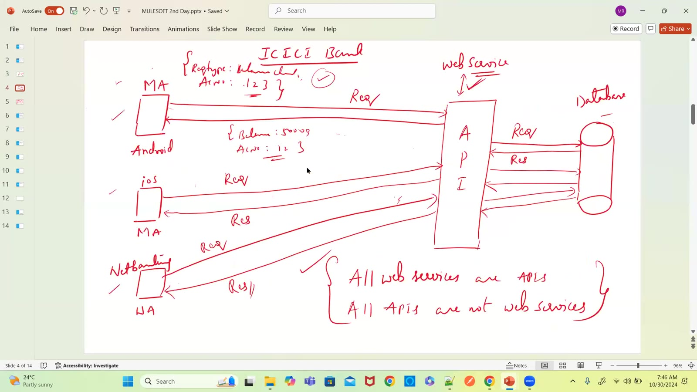

### 05 — Technical example: ICICI balance check
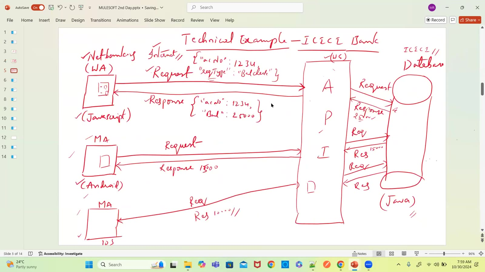

### 06 — What are web services?
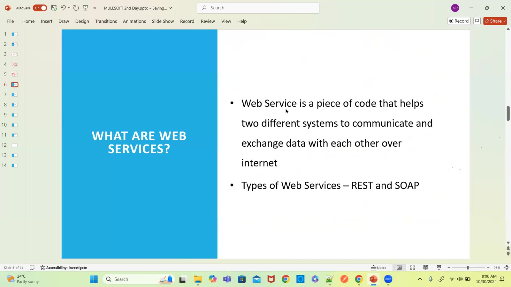

### 07 — REST web service (1)
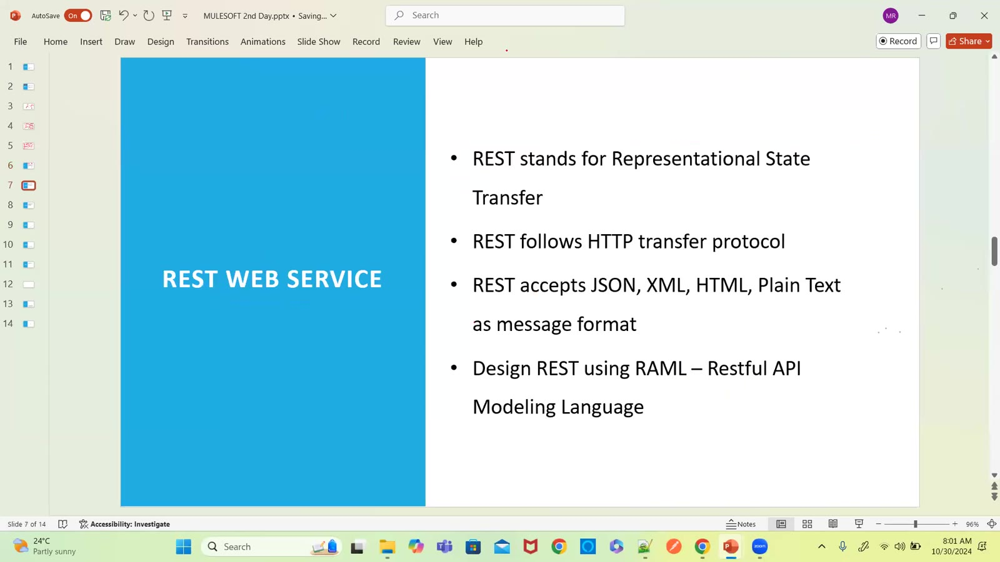

### 08 — REST web service (2)
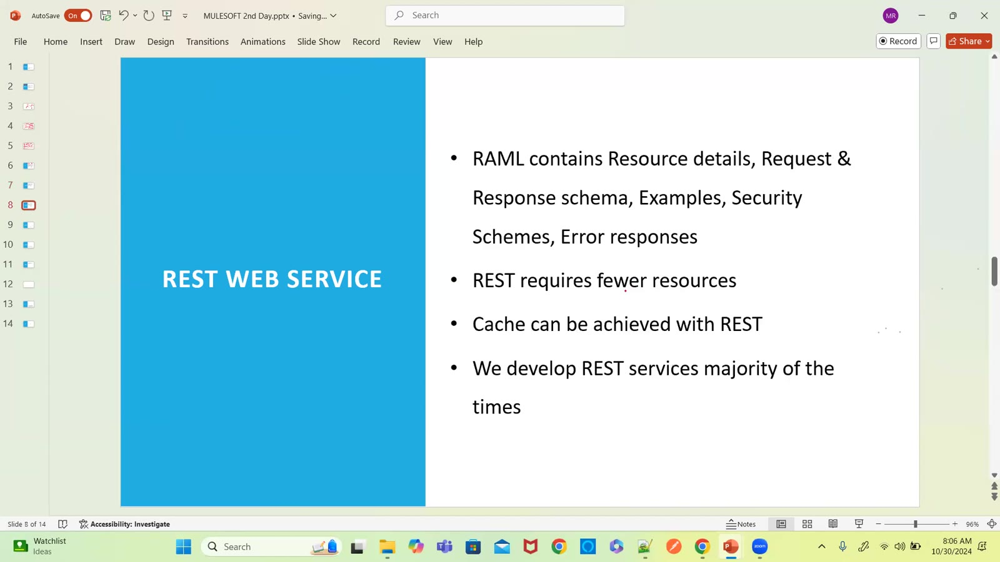

### 09 — JSON vs XML
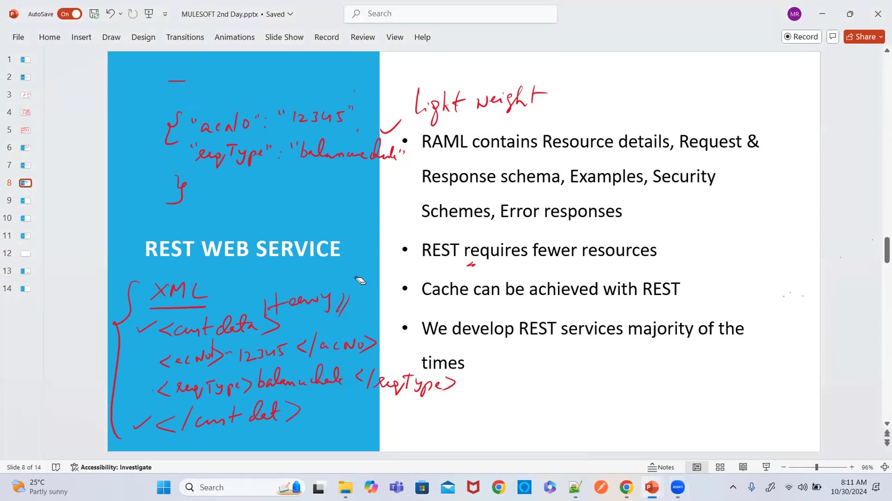

### 10 — SOAP web service (1)
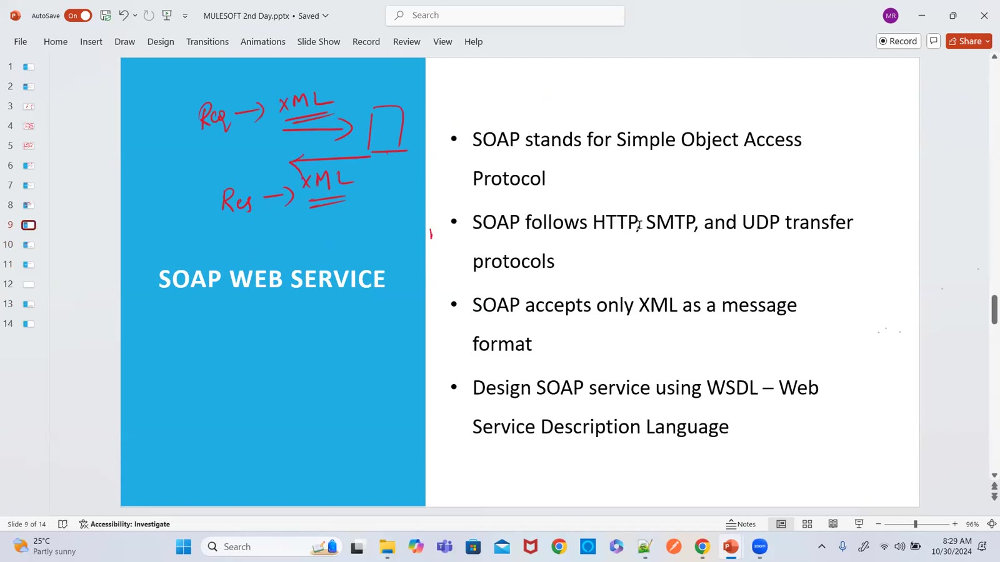

### 11 — SOAP web service (2) — WSDL
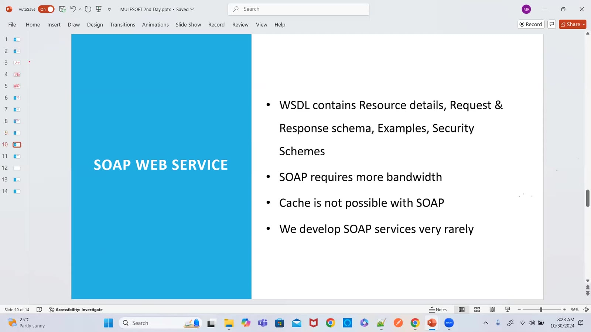

### 12 — REST vs SOAP
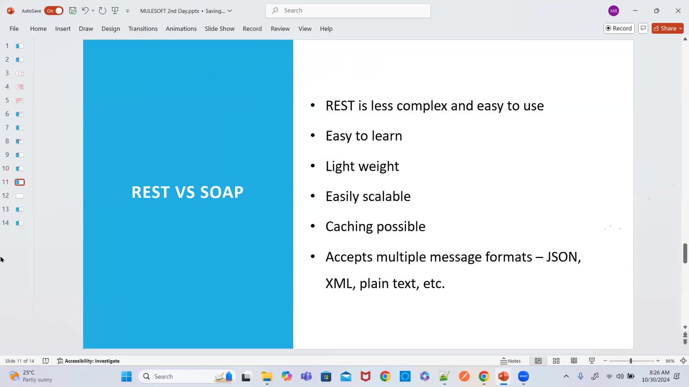

### 13 — Real time environments
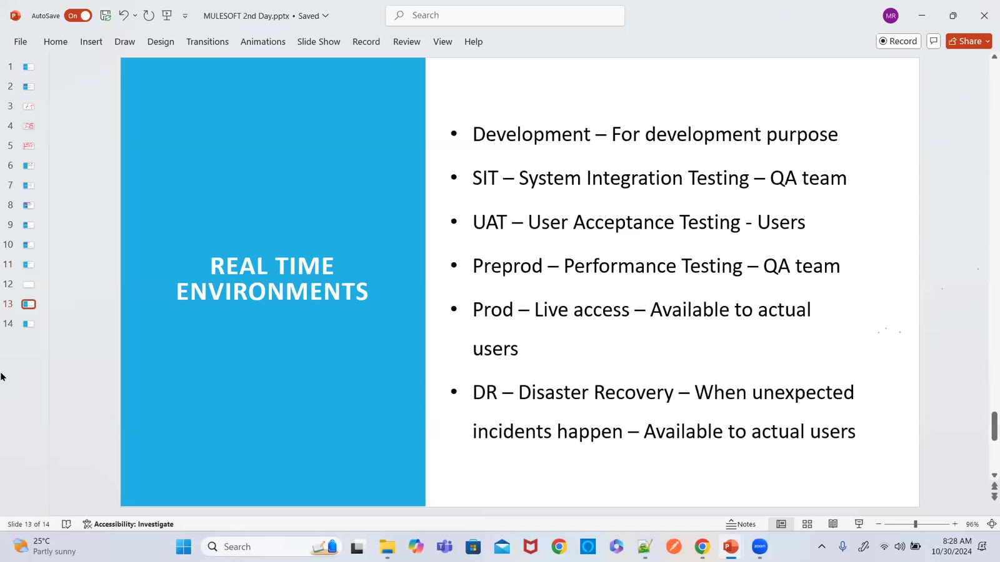

### 14 — Environments explained
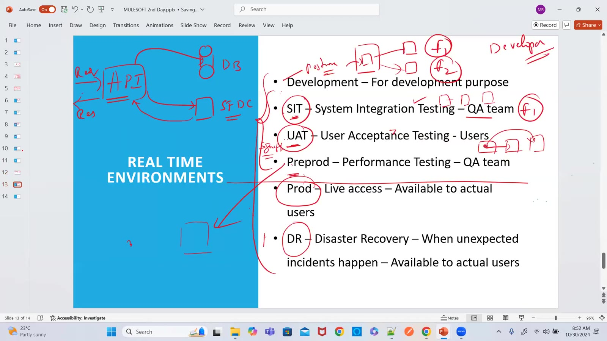

### 15 — Disaster recovery: Mumbai data center
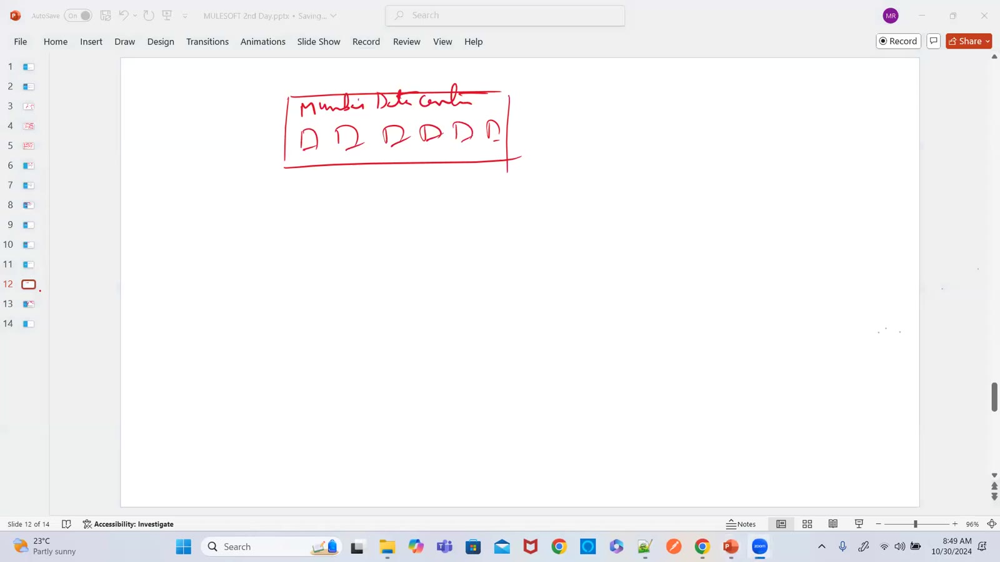
