# Day 05 — Slides and On-Screen Drawings

Frames captured from the Day 5 class recording (MuleSoft Telugu Course Day 5, recorded 5 Nov 2024): the db-select-demo build in Anypoint Studio, MySQL Workbench and Postman. Frames showing the database password are deliberately left out. Repeated and blank frames have been removed. Times are positions in the video.

Notes for this day: [detailed-notes/day05.md](../../detailed-notes/day05.md) · [super-detailed-notes/day05.md](../../super-detailed-notes/day05.md) · [summary](../../day05.md)

| # | Time | Content |
|---|---|---|
| 01 | 0:01 | Agenda — HTTP request, Mule event, demo, debugging, Set Variable |
| 02 | 2:24 | HTTP request — body, headers, query/URI params, URL, method, authorization (drawing) |
| 03 | 25:27 | Consumer → Listener → Logger → DB → Transform → JSON response; Postman; Emp DB (drawing) |
| 04 | 15:41 | HTTP Listener config — HTTP, All Interfaces 0.0.0.0, port 8081 |
| 05 | 43:02 | MySQL Workbench — CREATE TABLE EMPLOYEES_INFO |
| 06 | 43:43 | Workbench — INSERT rows (120 ravi, 104 Dinesh, 101 Hari) and error 1146 |
| 07 | 51:45 | Select — query with :emp_id and input parameter payload.empid |
| 08 | 58:55 | Console — Cannot get connection for jdbc:mysql://localhost:330/mule11 |
| 09 | 63:58 | Postman — 500 Server Error, access denied for user root |
| 10 | 65:52 | Postman — 200 OK, employee 120 returned as an array |
| 11 | 69:43 | Mule Debugger — attributes, correlationId, payload, rootId, vars size 0 |
| 12 | 73:01 | Postman — 500, "Attempted to send invalid data through http response" (no Transform Message) |
| 13 | 68:52 | CloudHub (US) vs Mumbai DC database; on-prem servers (drawing) |
| 14 | 80:13 | Agenda annotated — MuleSoft → REST APIs → HTTP (drawing) |

---

### 01 — Agenda — HTTP request, Mule event, demo, debugging, Set Variable
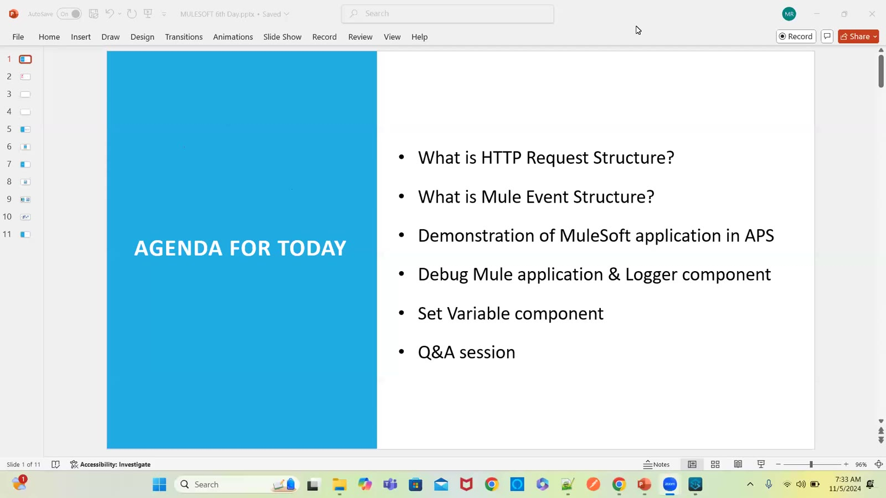

### 02 — HTTP request — body, headers, query/URI params, URL, method, authorization (drawing)
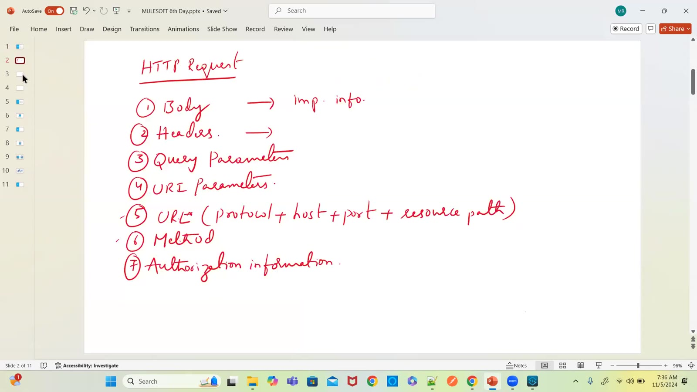

### 03 — Consumer → Listener → Logger → DB → Transform → JSON response; Postman; Emp DB (drawing)
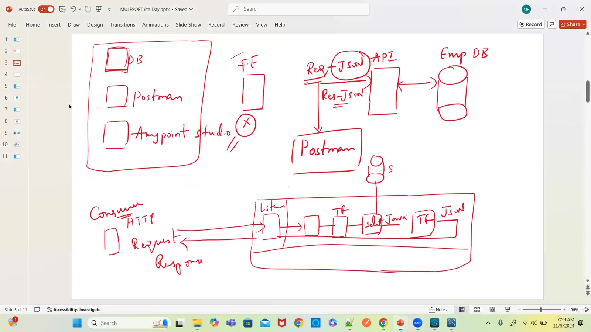

### 04 — HTTP Listener config — HTTP, All Interfaces 0.0.0.0, port 8081
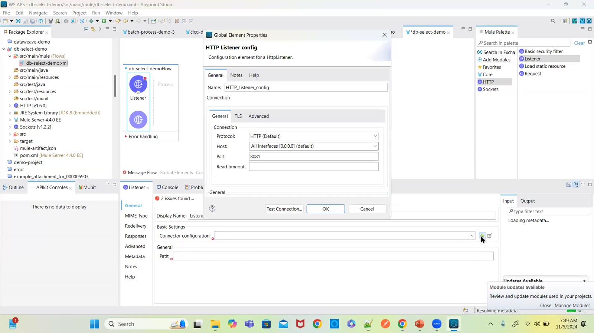

### 05 — MySQL Workbench — CREATE TABLE EMPLOYEES_INFO
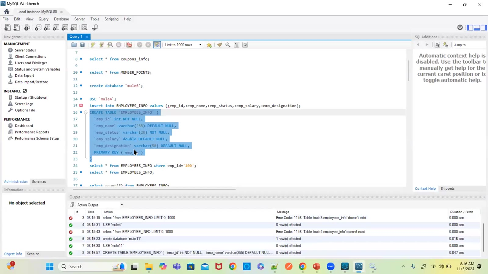

### 06 — Workbench — INSERT rows (120 ravi, 104 Dinesh, 101 Hari) and error 1146
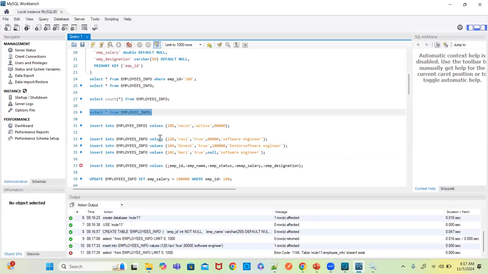

### 07 — Select — query with :emp_id and input parameter payload.empid
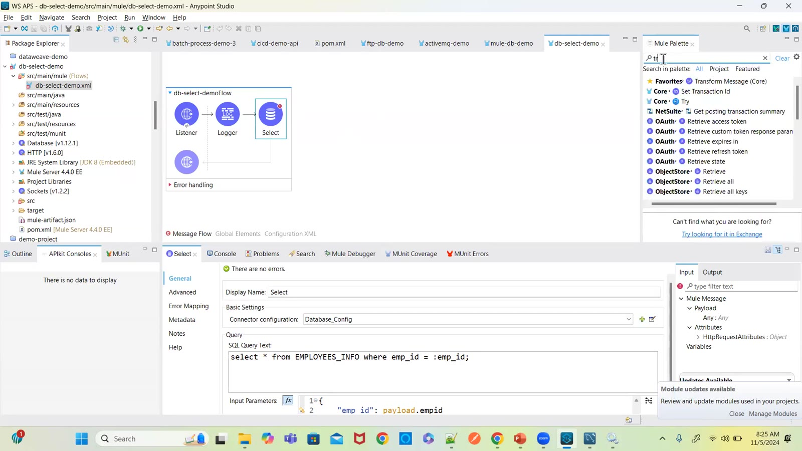

### 08 — Console — Cannot get connection for jdbc:mysql://localhost:330/mule11
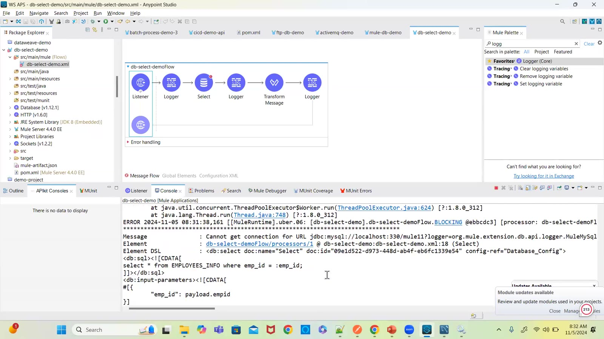

### 09 — Postman — 500 Server Error, access denied for user root
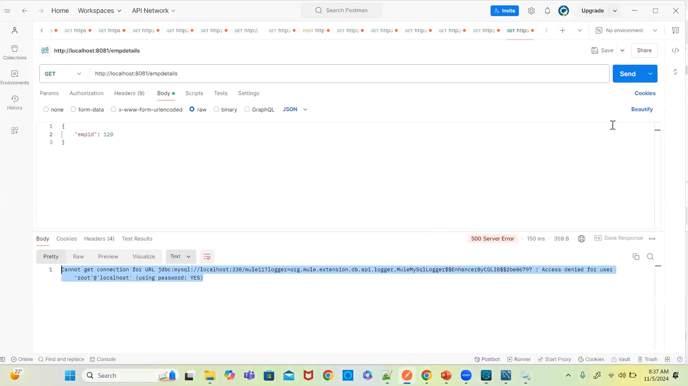

### 10 — Postman — 200 OK, employee 120 returned as an array
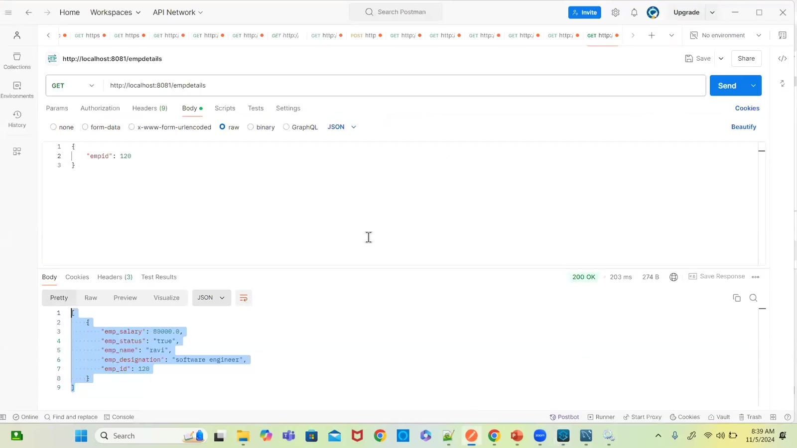

### 11 — Mule Debugger — attributes, correlationId, payload, rootId, vars size 0
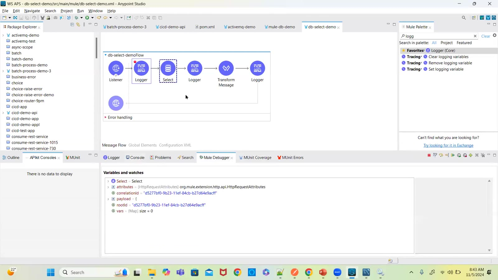

### 12 — Postman — 500, "Attempted to send invalid data through http response" (no Transform Message)
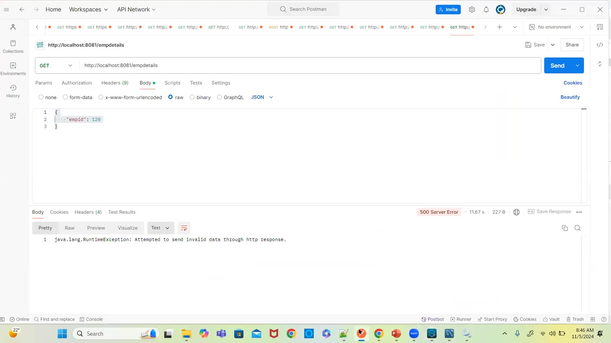

### 13 — CloudHub (US) vs Mumbai DC database; on-prem servers (drawing)
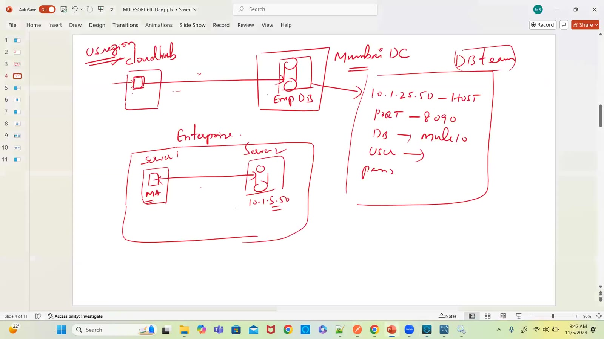

### 14 — Agenda annotated — MuleSoft → REST APIs → HTTP (drawing)
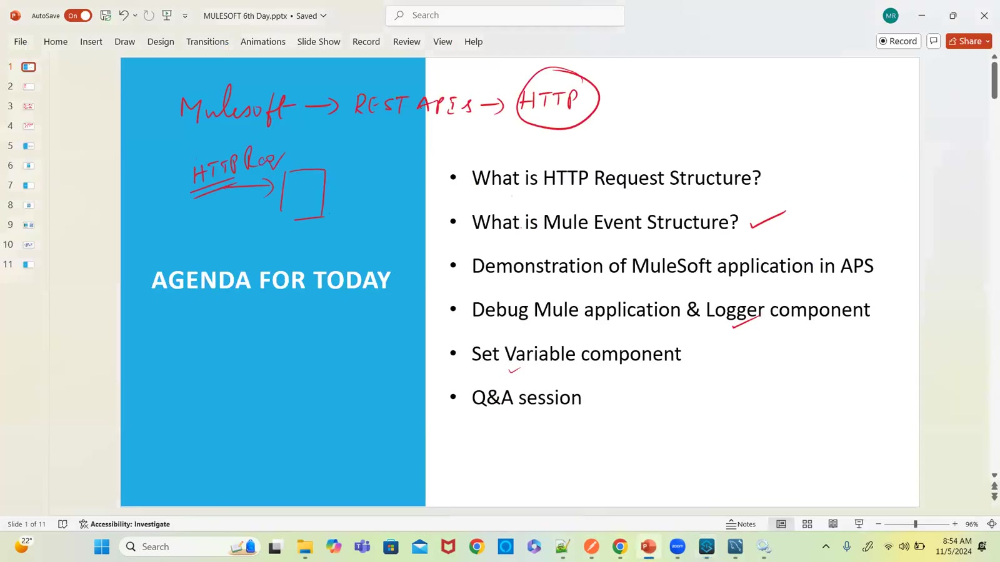

