# Day 08 — Slides and On-Screen Drawings

Frames captured from the Day 8 class recording (MuleSoft Telugu Course Day 8, recorded 11 Nov 2024). Repeated and blank frames have been removed. Times are positions in the video.

Notes for this day: [detailed-notes/day08.md](../../detailed-notes/day08.md) · [super-detailed-notes/day08.md](../../super-detailed-notes/day08.md) · [summary](../../day08.md)

| # | Time | Content |
|---|---|---|
| 01 | 1:20 | Agenda for today |
| 02 | 62:17 | Mule Application/Project → Configuration XML → Flow → orchestration, transformations, enrichments |
| 03 | 63:10 | Mule Configuration XML |
| 04 | 72:56 | Mule Flow — Source, Process and Error handling |
| 05 | 35:27 | POM — core element of a Maven project |
| 06 | 6:15 | hello-world-demo-app in Package Explorer — src/main/mule, resources, test folders, libraries (screen) |
| 07 | 19:11 | src/main/resources/log4j2.xml (screen) |
| 08 | 32:26 | mule-artifact.json — minMuleVersion 4.4.0 (screen) |
| 09 | 37:35 | pom.xml — groupId, artifactId, version, packaging, properties (screen) |
| 10 | 45:52 | pom.xml — build plugins: maven-clean-plugin 3.0.0, mule-maven-plugin (screen) |
| 11 | 48:42 | pom.xml — mule-db-connector 1.12.1 dependency added, repositories (screen) |
| 12 | 50:43 | pom.xml — pluginRepositories: mulesoft-releases (screen) |
| 13 | 67:21 | test.xml Configuration XML — testFlow with Logger and Flow Reference, testFlow1–3 (screen) |
| 14 | 14:00 | Flow Reference — choosing the target flow name (screen) |
| 15 | 67:08 | Global Elements tab — HTTP Listener config (screen) |

---

### 01 — Agenda for today
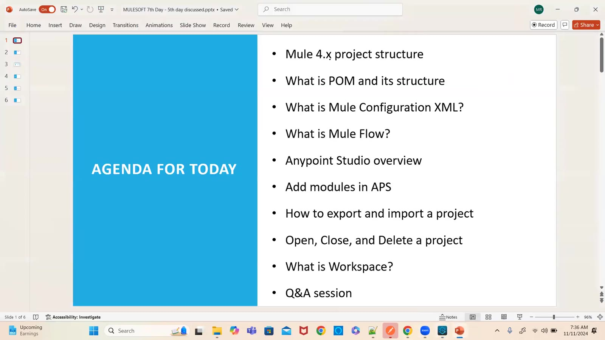

### 02 — Mule Application/Project → Configuration XML → Flow → orchestration, transformations, enrichments
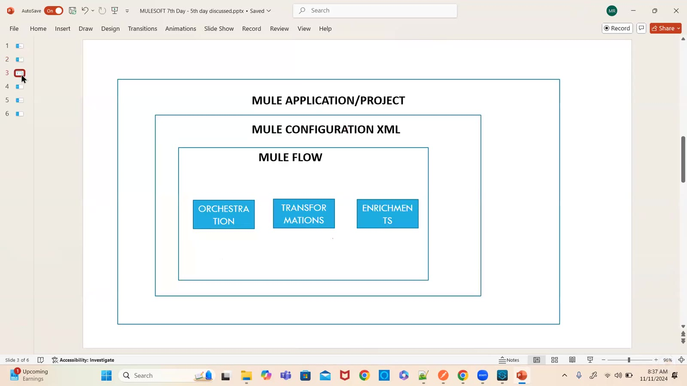

### 03 — Mule Configuration XML
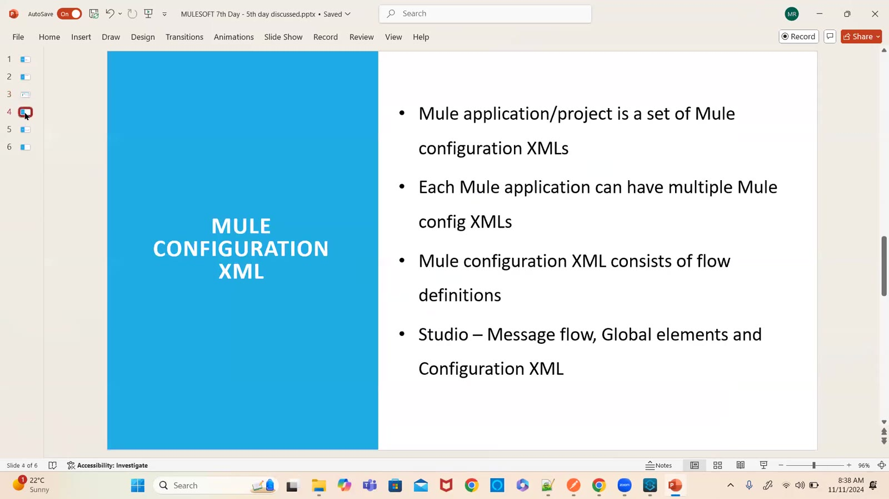

### 04 — Mule Flow — Source, Process and Error handling
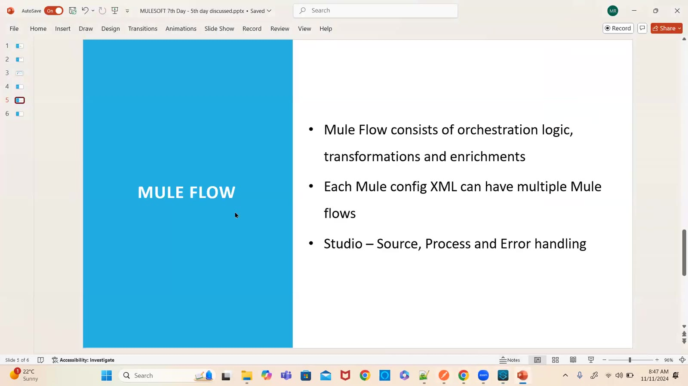

### 05 — POM — core element of a Maven project
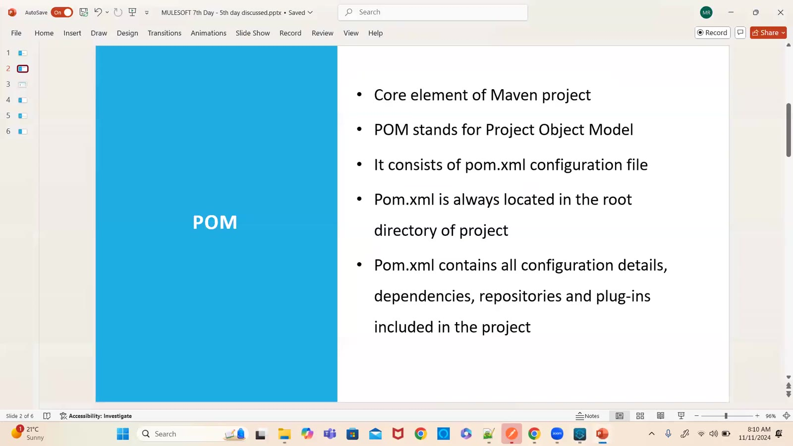

### 06 — hello-world-demo-app in Package Explorer — src/main/mule, resources, test folders, libraries (screen)
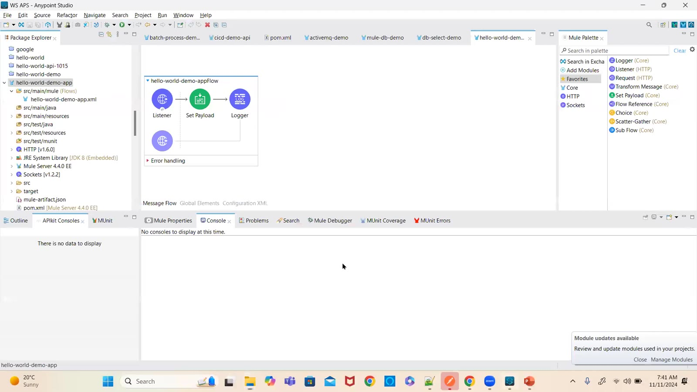

### 07 — src/main/resources/log4j2.xml (screen)
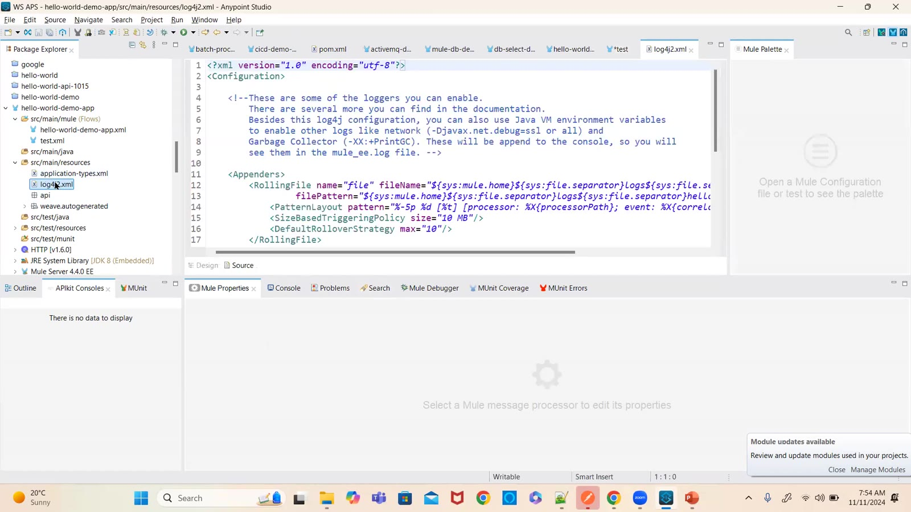

### 08 — mule-artifact.json — minMuleVersion 4.4.0 (screen)
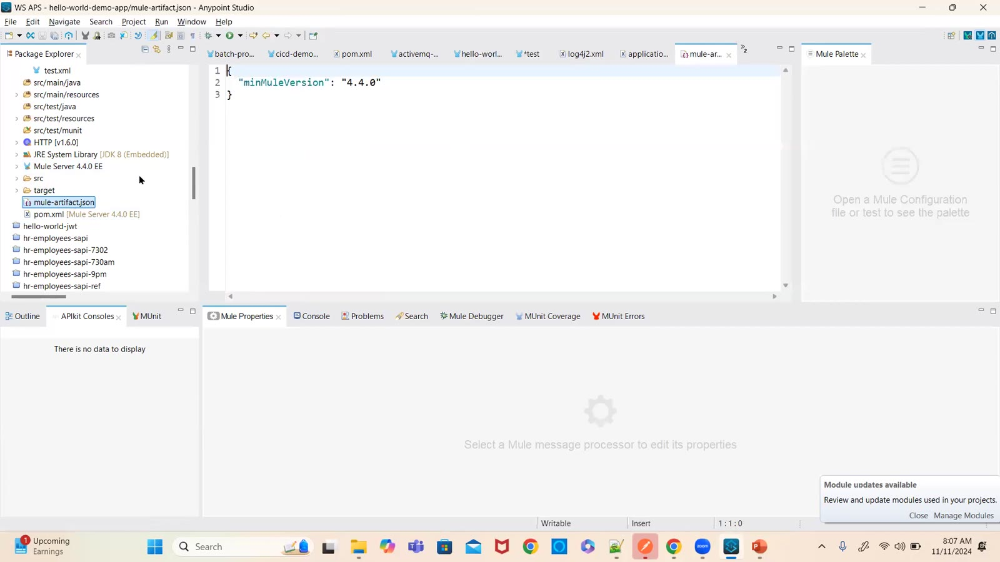

### 09 — pom.xml — groupId, artifactId, version, packaging, properties (screen)
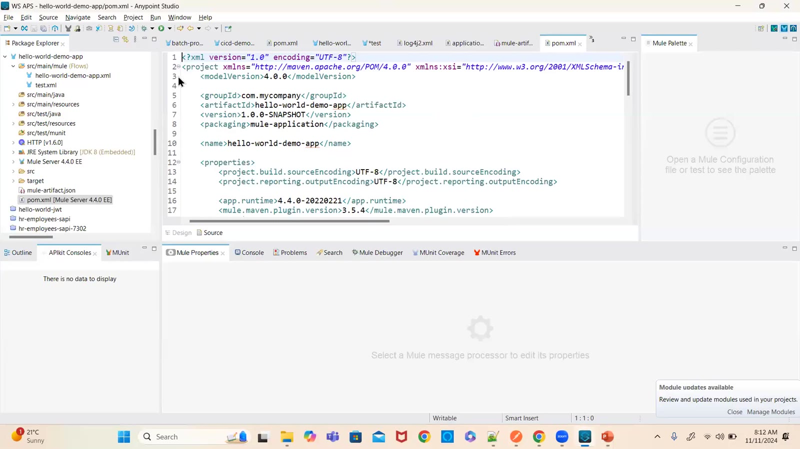

### 10 — pom.xml — build plugins: maven-clean-plugin 3.0.0, mule-maven-plugin (screen)
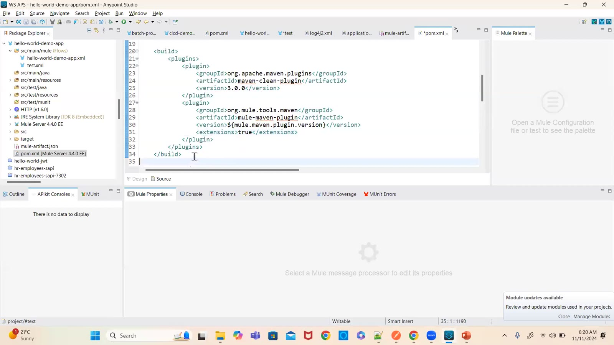

### 11 — pom.xml — mule-db-connector 1.12.1 dependency added, repositories (screen)
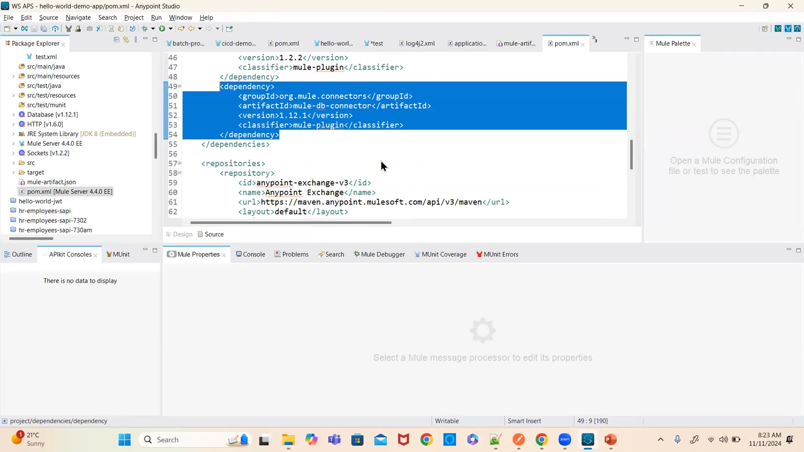

### 12 — pom.xml — pluginRepositories: mulesoft-releases (screen)
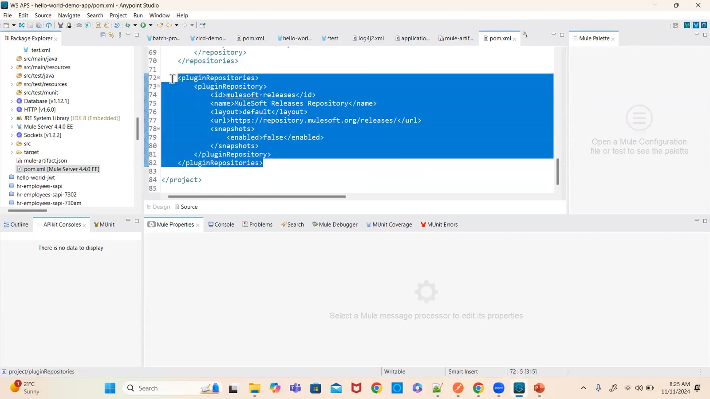

### 13 — test.xml Configuration XML — testFlow with Logger and Flow Reference, testFlow1–3 (screen)
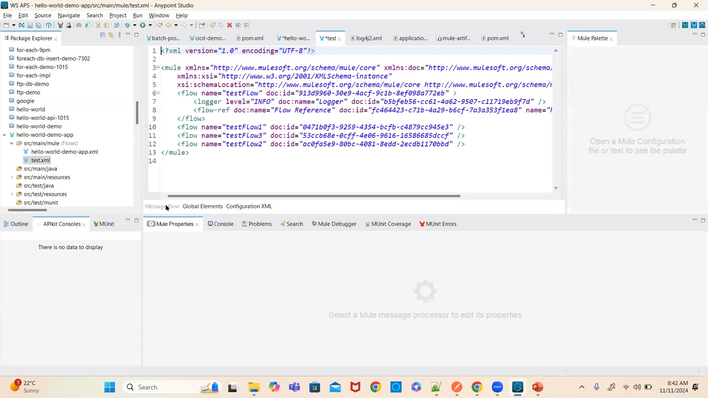

### 14 — Flow Reference — choosing the target flow name (screen)
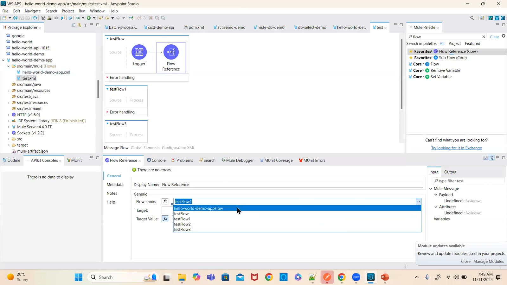

### 15 — Global Elements tab — HTTP Listener config (screen)
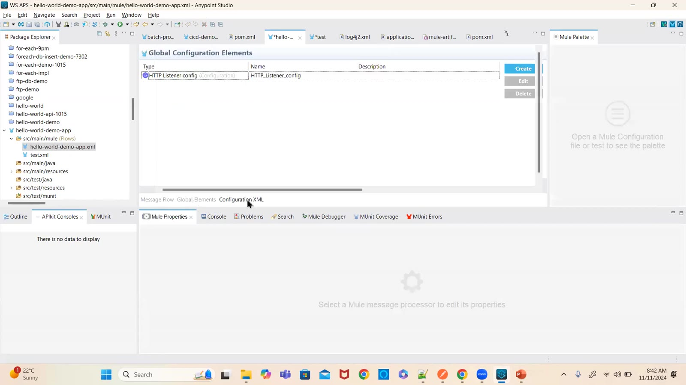

