# Day 09 — Slides and On-Screen Drawings

Frames captured from the Day 9 class recording (MuleSoft Telugu Course Day 9, recorded 13 Nov 2024). The JMS configuration screen is not included because it shows a username and password. Repeated and blank frames have been removed. Times are positions in the video.

Notes for this day: [detailed-notes/day09.md](../../detailed-notes/day09.md) · [super-detailed-notes/day09.md](../../super-detailed-notes/day09.md) · [summary](../../day09.md)

| # | Time | Content |
|---|---|---|
| 01 | 0:01 | Agenda (carried over from Day 08) — export/import, open/close/delete, workspace |
| 02 | 3:50 | Studio layout — Package Explorer, canvas, Mule Palette, properties and bottom tabs (screen) |
| 03 | 4:24 | Project right-click menu — Close Project, Close Unrelated Projects, Delete, Export… (screen) |
| 04 | 9:40 | Delete Resources — "Delete project contents on disk (cannot be undone)" (screen) |
| 05 | 10:23 | New Mule Project dialog — runtimes Mule Server 4.4.0 / 4.3.0 / 4.2.1 EE, location D:\WS APS (screen) |
| 06 | 27:02 | Export → Mule → Anypoint Studio Project to Mule Deployable Archive (screen) |
| 07 | 27:47 | Export Mule Project — JAR file, attach sources, include dependencies (screen) |
| 08 | 29:35 | Import → Anypoint Studio → Packaged mule application (.jar) (screen) |
| 09 | 30:16 | Import — "A project with name activemq-demo already exists" (screen) |
| 10 | 33:48 | Anypoint Studio Launcher — select D:WS Dummy as workspace (screen) |
| 11 | 34:59 | New workspace — empty Package Explorer (screen) |
| 12 | 51:13 | About Anypoint Studio — 7.12.0 (screen) |
| 13 | 51:25 | Help → Install New Software — Available Software (screen) |

---

### 01 — Agenda (carried over from Day 08) — export/import, open/close/delete, workspace
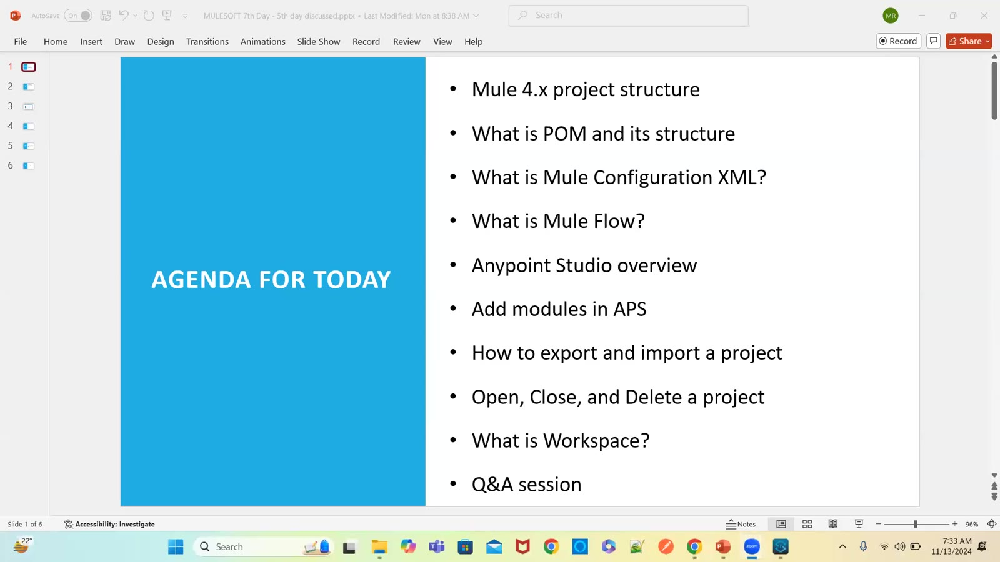

### 02 — Studio layout — Package Explorer, canvas, Mule Palette, properties and bottom tabs (screen)
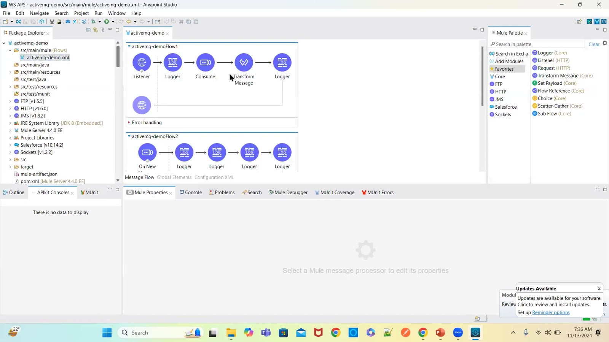

### 03 — Project right-click menu — Close Project, Close Unrelated Projects, Delete, Export… (screen)
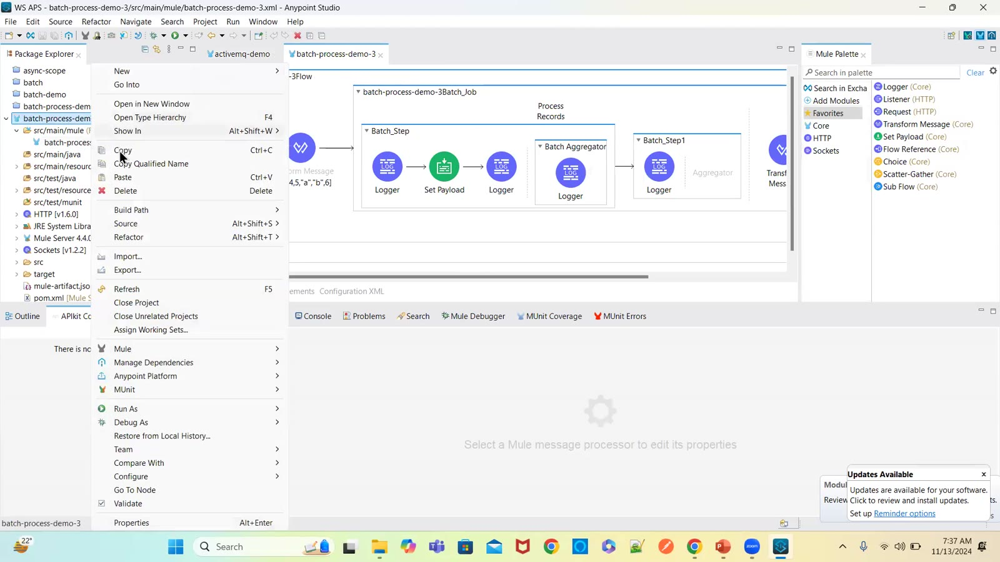

### 04 — Delete Resources — "Delete project contents on disk (cannot be undone)" (screen)
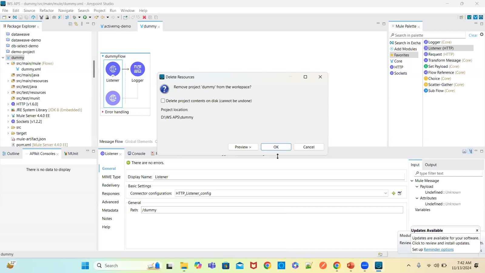

### 05 — New Mule Project dialog — runtimes Mule Server 4.4.0 / 4.3.0 / 4.2.1 EE, location D:\WS APS (screen)
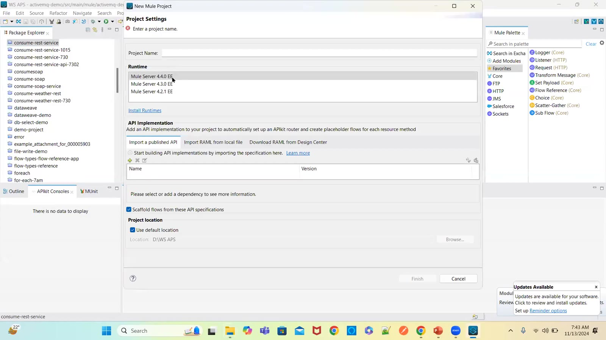

### 06 — Export → Mule → Anypoint Studio Project to Mule Deployable Archive (screen)
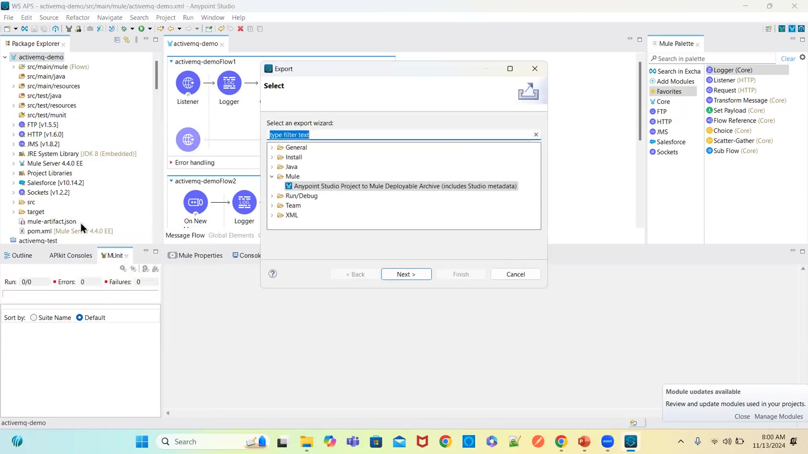

### 07 — Export Mule Project — JAR file, attach sources, include dependencies (screen)
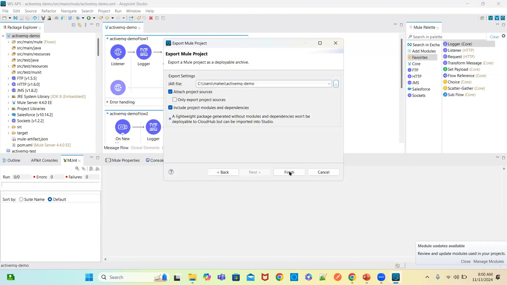

### 08 — Import → Anypoint Studio → Packaged mule application (.jar) (screen)
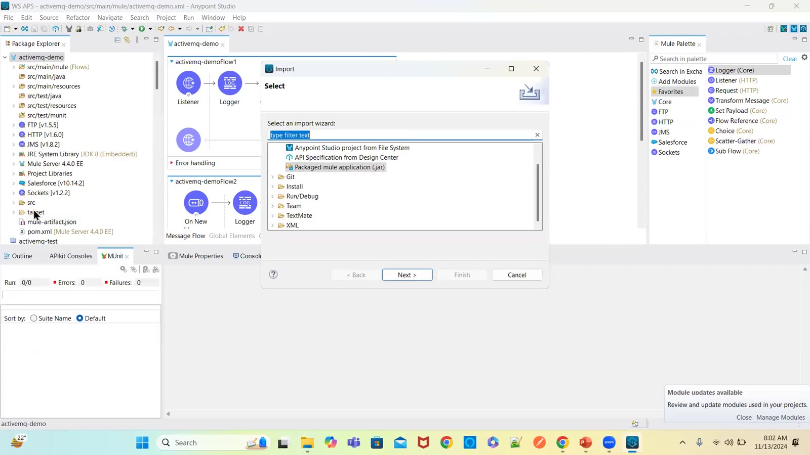

### 09 — Import — "A project with name activemq-demo already exists" (screen)
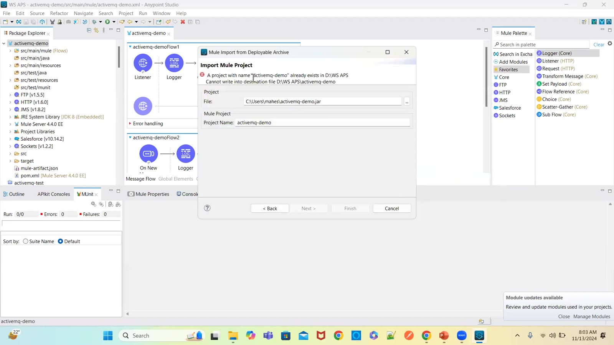

### 10 — Anypoint Studio Launcher — select D:WS Dummy as workspace (screen)
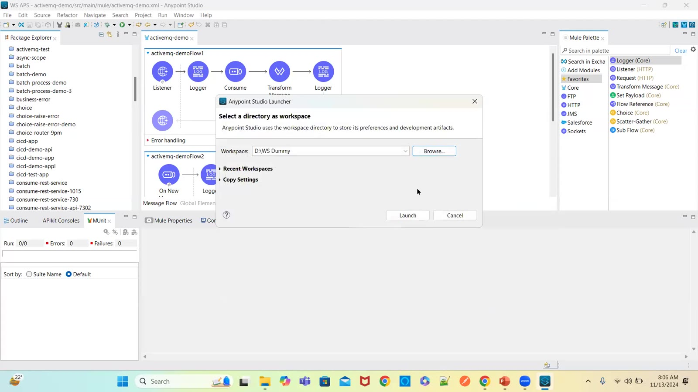

### 11 — New workspace — empty Package Explorer (screen)
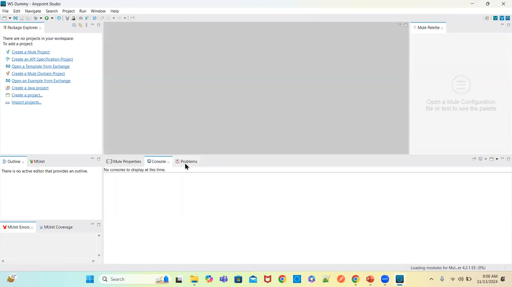

### 12 — About Anypoint Studio — 7.12.0 (screen)
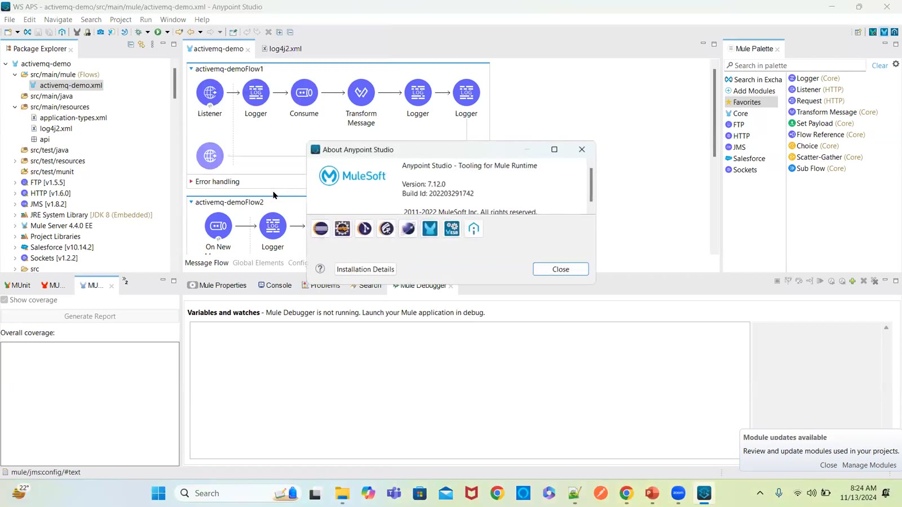

### 13 — Help → Install New Software — Available Software (screen)
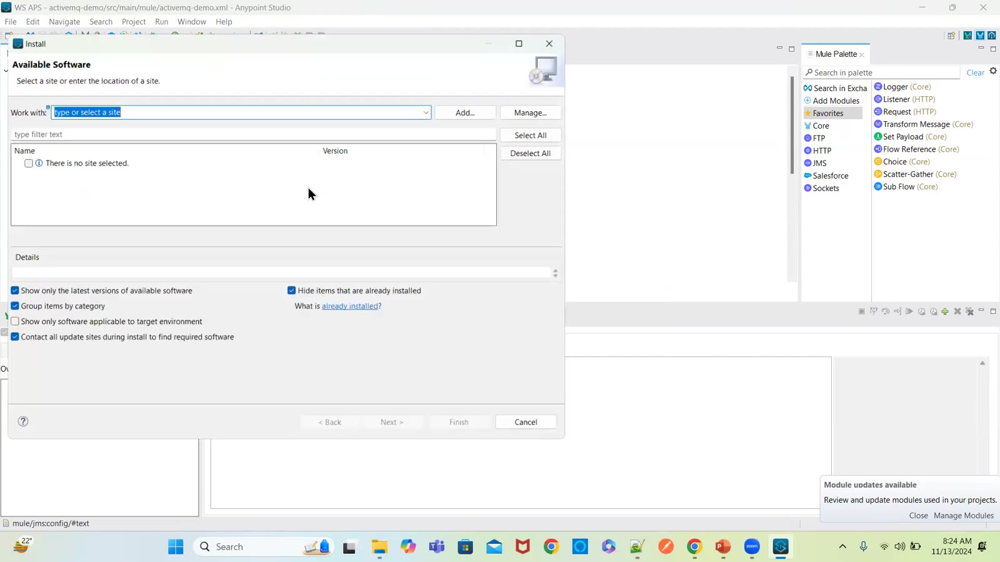

