# Day 10 — Slides and On-Screen Drawings

Frames captured from the Day 10 class recording (MuleSoft Telugu Course Day 10, recorded 14 Nov 2024). Repeated and blank frames have been removed. Times are positions in the video.

Notes for this day: [detailed-notes/day10.md](../../detailed-notes/day10.md) · [super-detailed-notes/day10.md](../../super-detailed-notes/day10.md) · [summary](../../day10.md)

| # | Time | Content |
|---|---|---|
| 01 | 0:01 | URI PARAM — Unique Resource Identifier, path param, /employees/{empid} |
| 02 | 5:16 | Postman → API → DB: employees/101 → 101 details (drawing) |
| 03 | 8:51 | XYZ company employees table — IDs 100/101/102 as URI values; /branches/{branchId}/accounts/{acId} (drawing) |
| 04 | 13:11 | URI PARAM slide with attributes.uriParams.empid written on it |
| 05 | 15:50 | QUERY PARAM — filter, sort, paginate; ?status=active as key=value |
| 06 | 20:14 | Filter — status=active → 45 employees (drawing) |
| 07 | 25:37 | Sort — active employees in asc order; ?status=active&orderBySal=asc (drawing) |
| 08 | 20:31 | Pagination — Flipkart Samsung phones under 20000, 15 per page (drawing) |
| 09 | 58:58 | Limit/offset over 100 results; 5 QP vs 125 QP → APIkit strict validation (drawing) |
| 10 | 39:52 | APIkit Router config — Query parameters / Headers Strict Validations (screen) |
| 11 | 56:06 | createEmpReqDataType.raml — empId, empName, empSalary, active (screen) |
| 12 | 56:25 | headersTraits.raml — transaction-id min/max 20, origin enum (screen) |
| 13 | 63:36 | Next session agenda — Consume REST Service |

---

### 01 — URI PARAM — Unique Resource Identifier, path param, /employees/{empid}
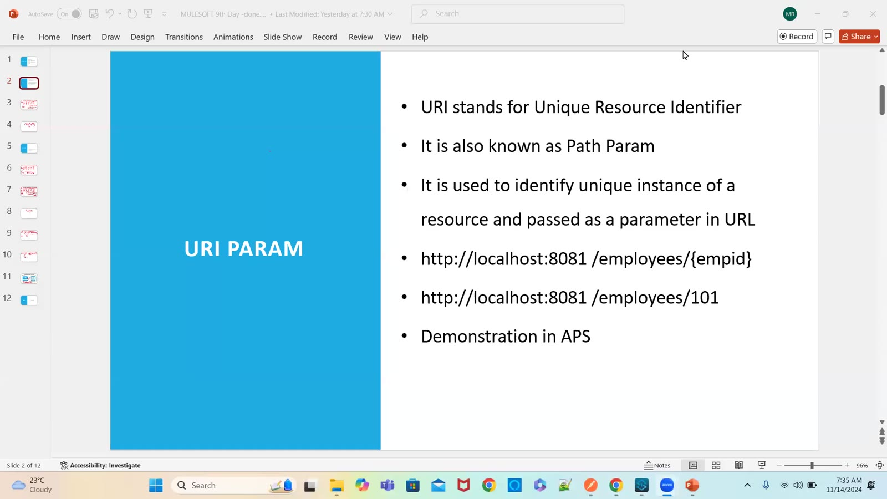

### 02 — Postman → API → DB: employees/101 → 101 details (drawing)
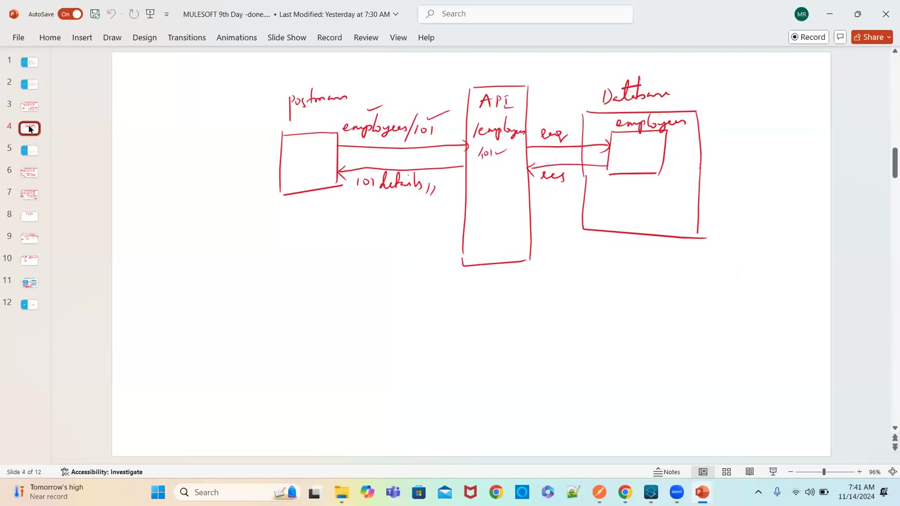

### 03 — XYZ company employees table — IDs 100/101/102 as URI values; /branches/{branchId}/accounts/{acId} (drawing)
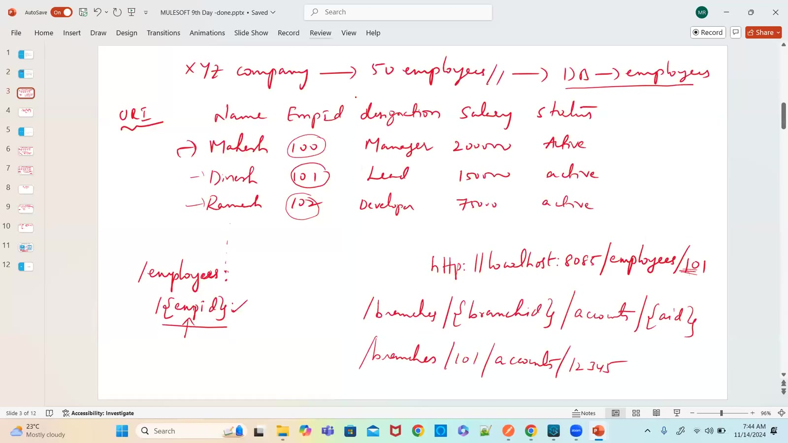

### 04 — URI PARAM slide with attributes.uriParams.empid written on it
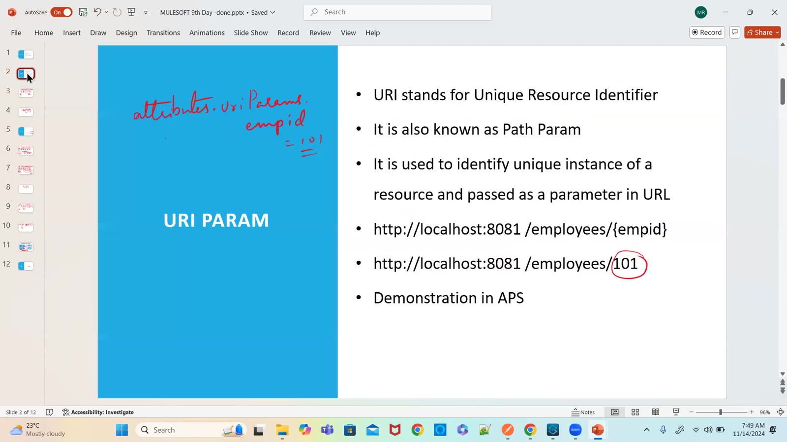

### 05 — QUERY PARAM — filter, sort, paginate; ?status=active as key=value
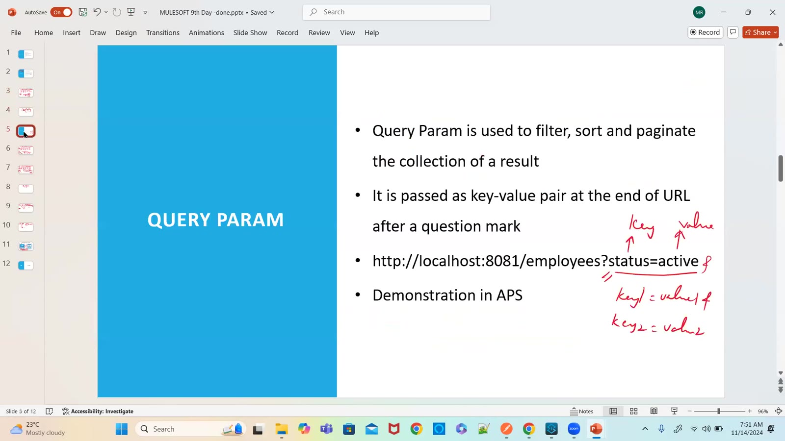

### 06 — Filter — status=active → 45 employees (drawing)
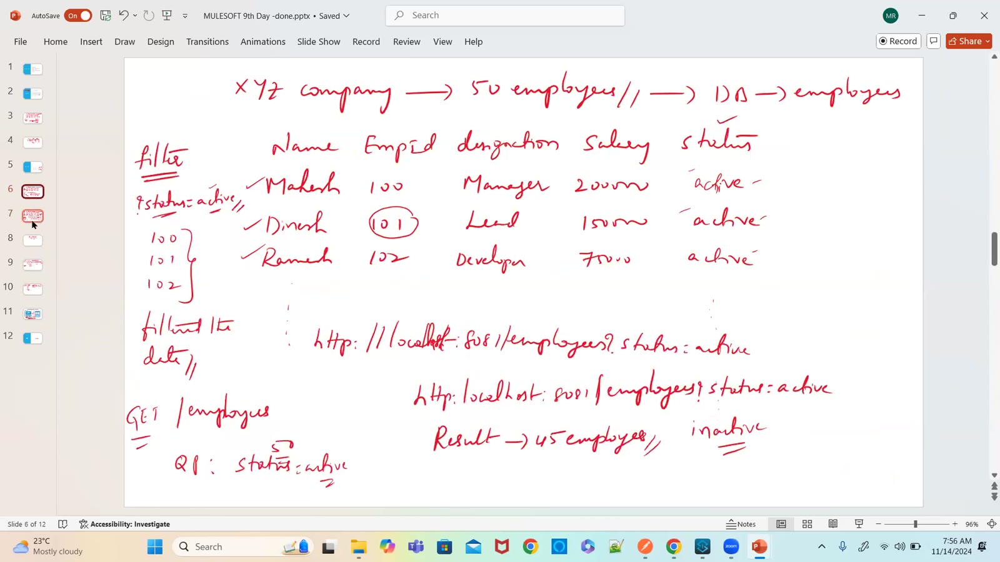

### 07 — Sort — active employees in asc order; ?status=active&orderBySal=asc (drawing)
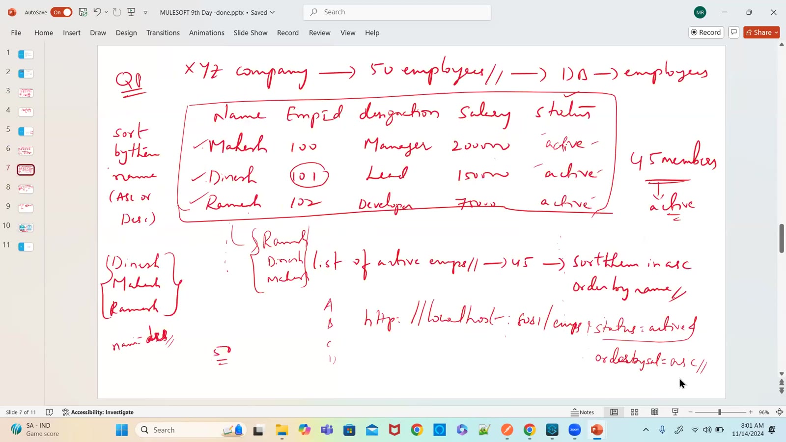

### 08 — Pagination — Flipkart Samsung phones under 20000, 15 per page (drawing)
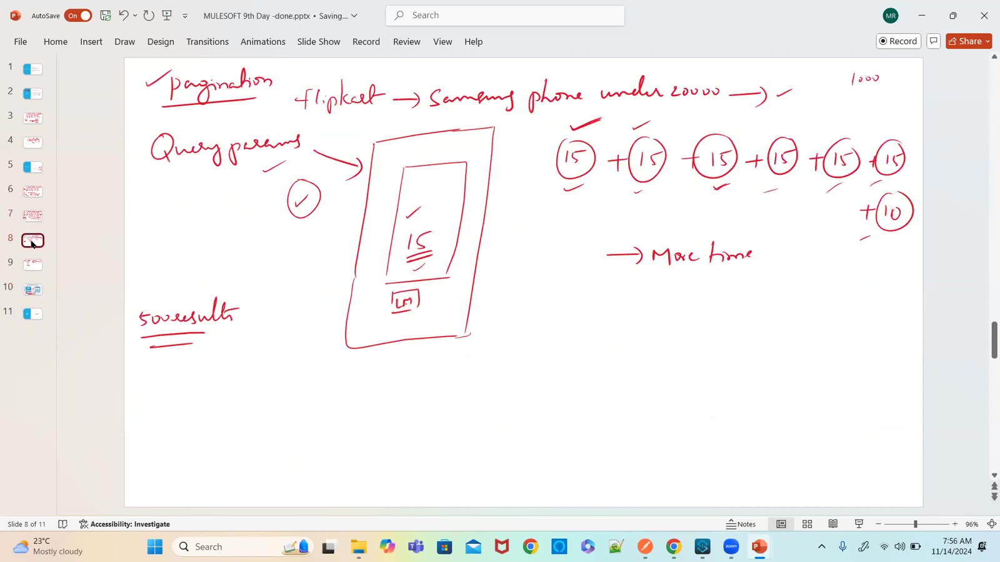

### 09 — Limit/offset over 100 results; 5 QP vs 125 QP → APIkit strict validation (drawing)
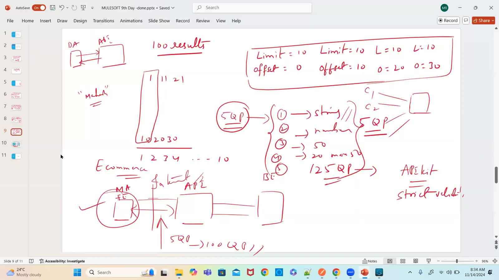

### 10 — APIkit Router config — Query parameters / Headers Strict Validations (screen)
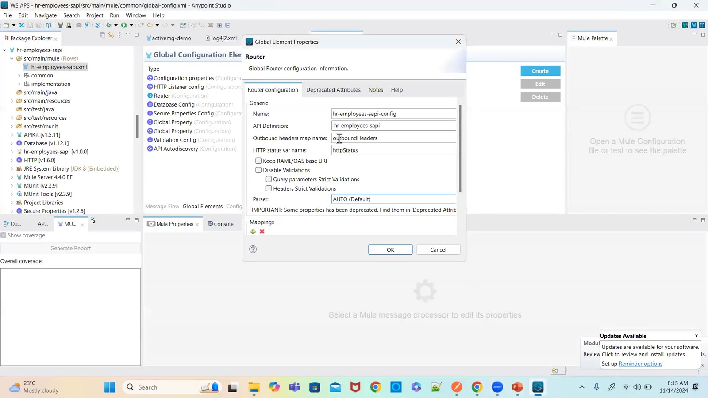

### 11 — createEmpReqDataType.raml — empId, empName, empSalary, active (screen)
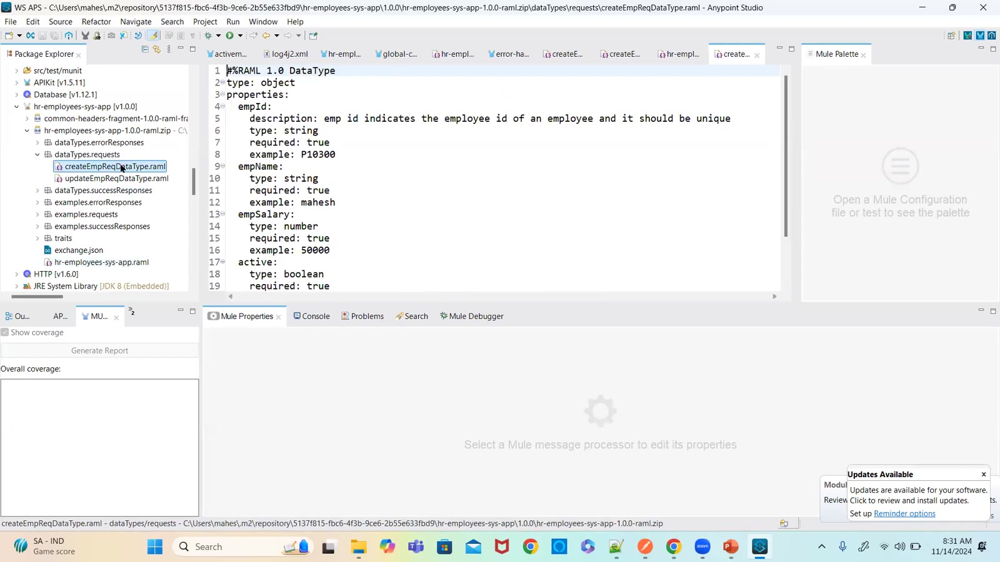

### 12 — headersTraits.raml — transaction-id min/max 20, origin enum (screen)
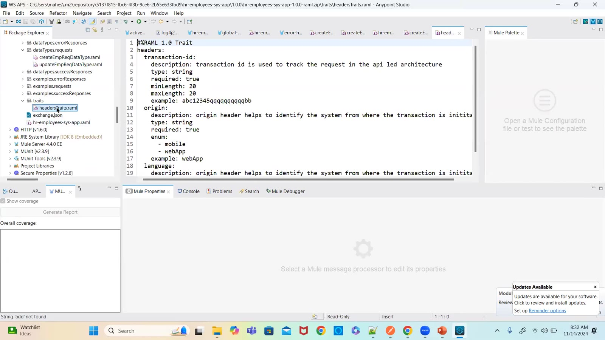

### 13 — Next session agenda — Consume REST Service
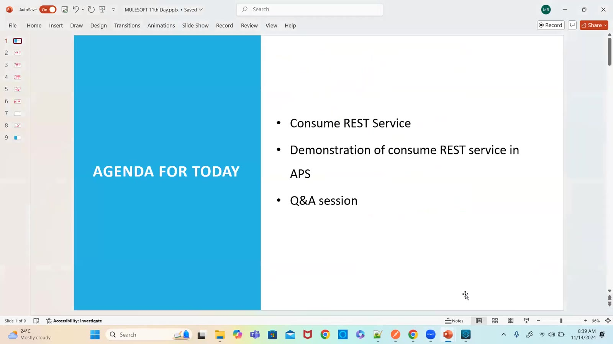

