# Day 11 — Slides and On-Screen Drawings

Frames captured from the Day 11 class recording (MuleSoft Telugu Course Day 11, recorded 19 Nov 2024). Frames showing the OpenWeather API key, account sign-up or email addresses are not included. Repeated and blank frames have been removed. Times are positions in the video.

Notes for this day: [detailed-notes/day11.md](../../detailed-notes/day11.md) · [super-detailed-notes/day11.md](../../super-detailed-notes/day11.md) · [summary](../../day11.md)

| # | Time | Content |
|---|---|---|
| 01 | 0:01 | Agenda — Consume REST Service, demonstration in APS, Q&A |
| 02 | 10:40 | REST APIs → create REST services (HTTP Listener, inbound endpoint) vs consume REST services (HTTP Request, outbound endpoint) (drawing) |
| 03 | 24:54 | API-led connectivity — Exp → Proc → Sys layers each calling the next with HTTP Request; target systems (REST API, SFDC, DB) (drawing) |
| 04 | 24:55 | Types of API (exp-api, papi/proc-api, sapi/sys-api), source/target naming, e.g. sfdc-db-cust-eapi (drawing) |
| 05 | 32:13 | ICICI personal-loan example — orchestration, transformation, enrichment calling PAN, Aadhaar, CIBIL, company APIs (drawing) |
| 06 | 32:09 | Requirement — develop an HTTP service that consumes a weather REST API (city name) provided by an external org (drawing) |
| 07 | 28:26 | Details required for configuring HTTP Requestor — GET, HTTP, api.openweathermap.org, port 80, /data/2.5/weather, 2 query params (drawing) |
| 08 | 24:57 | Request {"city":"Mumbai"} → response {city, minTemp, maxTemp, tempUnit}; "300" → 300 − 273.15 (drawing) |
| 09 | 42:46 | OpenWeatherMap site (screen) |
| 10 | 46:30 | OpenWeather docs — Call current weather data: lat, lon, appid parameters (screen) |
| 11 | 52:22 | Google: Hyderabad coordinates 17.4065° N, 78.4772° E (screen) |
| 12 | 80:43 | HTTP Request configuration — HTTP, host api.openweathermap.org, connection idle timeout 30000 (screen) |
| 13 | 82:42 | Request operation — GET, path /data/2.5/weather, Query Parameters tab (screen) |
| 14 | 93:30 | Preview of a fuller weather flow — Choice router with error branches (screen) |
| 15 | 113:46 | Listener Responses — body payload; Error Response body: output text/plain --- error.description (screen) |
| 16 | 114:58 | Postman → our API → weather API (drawing) |

---

### 01 — Agenda — Consume REST Service, demonstration in APS, Q&A
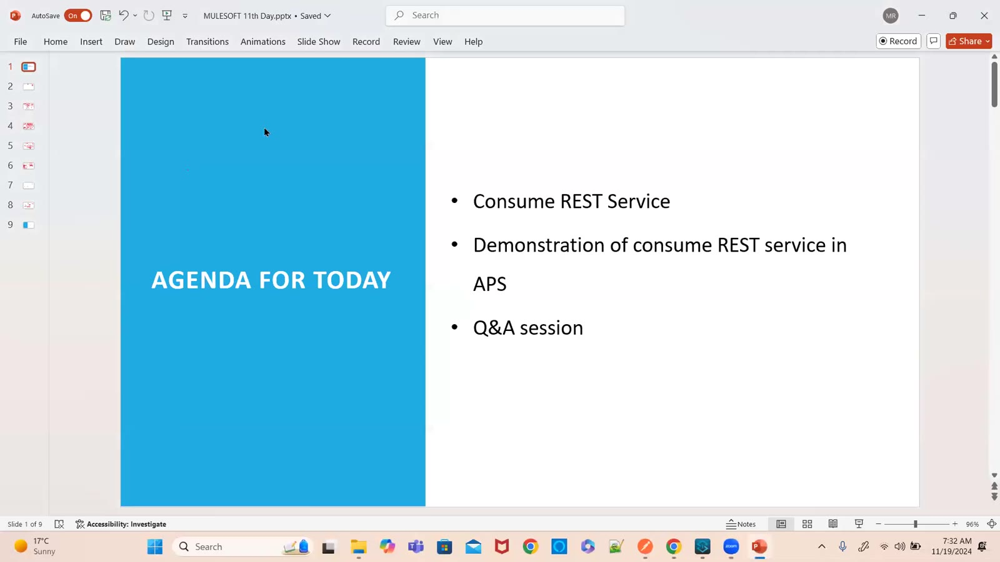

### 02 — REST APIs → create REST services (HTTP Listener, inbound endpoint) vs consume REST services (HTTP Request, outbound endpoint) (drawing)
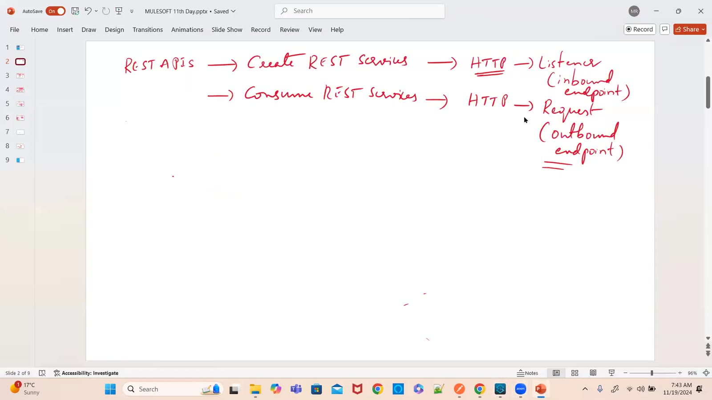

### 03 — API-led connectivity — Exp → Proc → Sys layers each calling the next with HTTP Request; target systems (REST API, SFDC, DB) (drawing)
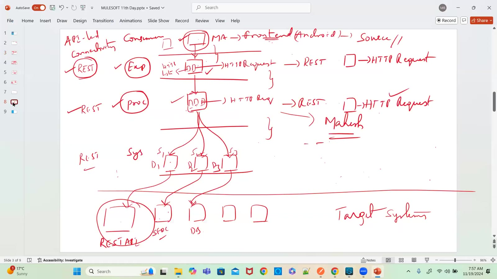

### 04 — Types of API (exp-api, papi/proc-api, sapi/sys-api), source/target naming, e.g. sfdc-db-cust-eapi (drawing)
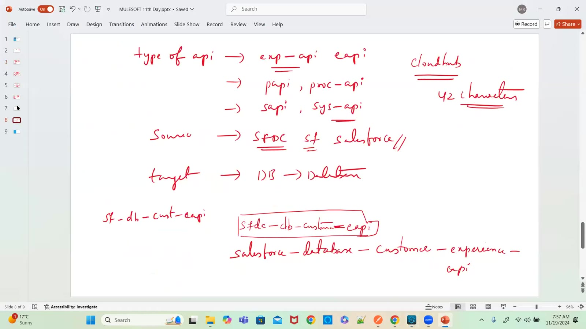

### 05 — ICICI personal-loan example — orchestration, transformation, enrichment calling PAN, Aadhaar, CIBIL, company APIs (drawing)
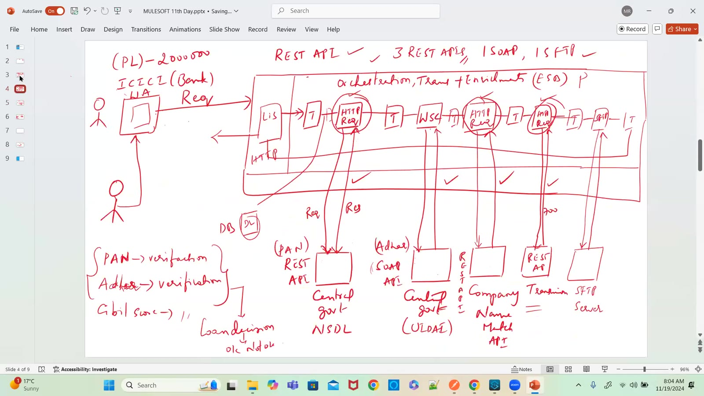

### 06 — Requirement — develop an HTTP service that consumes a weather REST API (city name) provided by an external org (drawing)
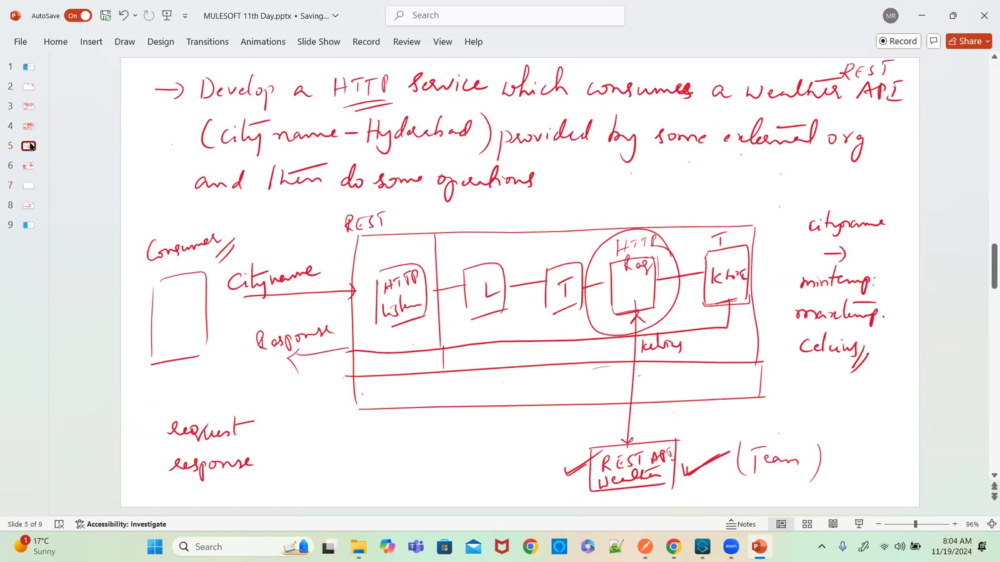

### 07 — Details required for configuring HTTP Requestor — GET, HTTP, api.openweathermap.org, port 80, /data/2.5/weather, 2 query params (drawing)
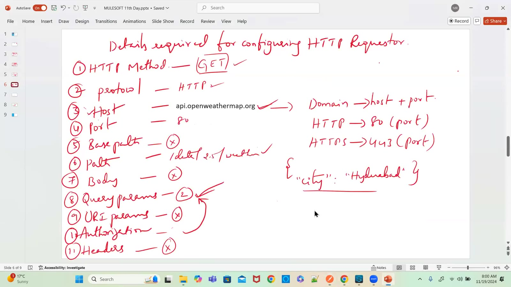

### 08 — Request {"city":"Mumbai"} → response {city, minTemp, maxTemp, tempUnit}; "300" → 300 − 273.15 (drawing)
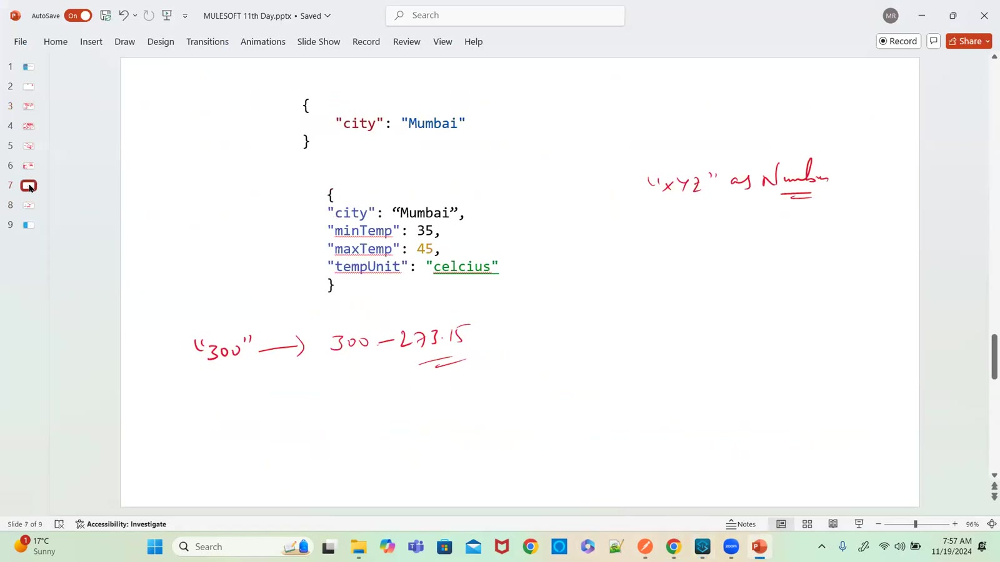

### 09 — OpenWeatherMap site (screen)
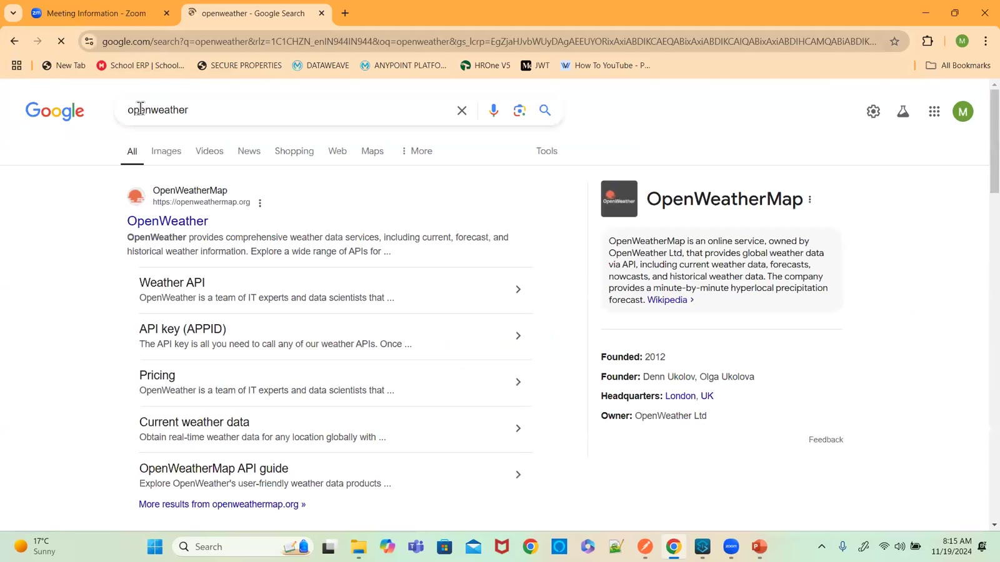

### 10 — OpenWeather docs — Call current weather data: lat, lon, appid parameters (screen)
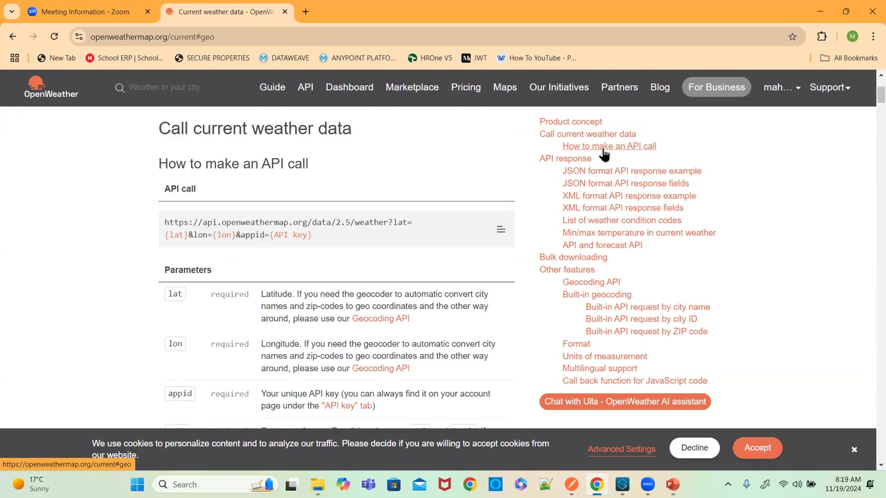

### 11 — Google: Hyderabad coordinates 17.4065° N, 78.4772° E (screen)

### 12 — HTTP Request configuration — HTTP, host api.openweathermap.org, connection idle timeout 30000 (screen)
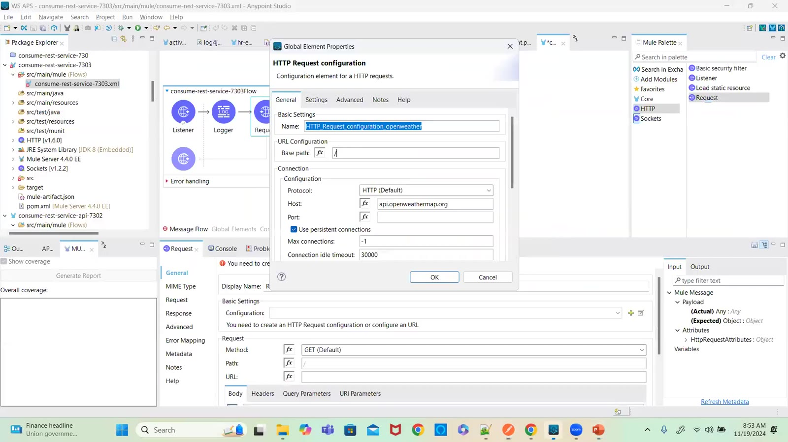

### 13 — Request operation — GET, path /data/2.5/weather, Query Parameters tab (screen)
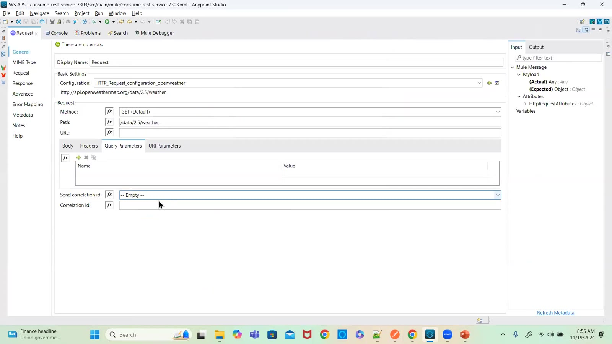

### 14 — Preview of a fuller weather flow — Choice router with error branches (screen)
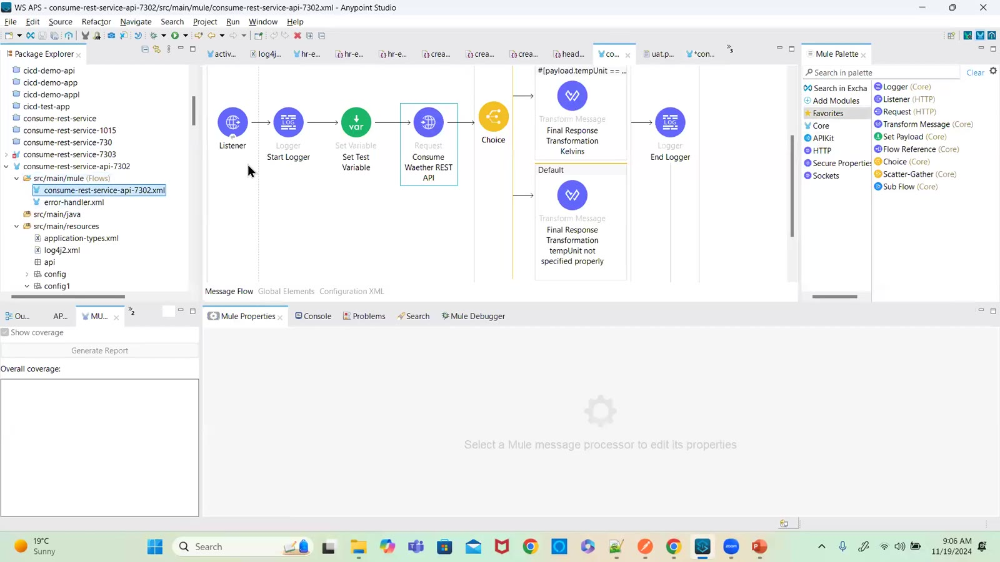

### 15 — Listener Responses — body payload; Error Response body: output text/plain --- error.description (screen)
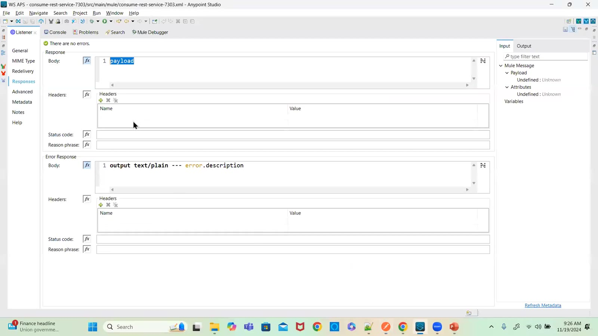

### 16 — Postman → our API → weather API (drawing)
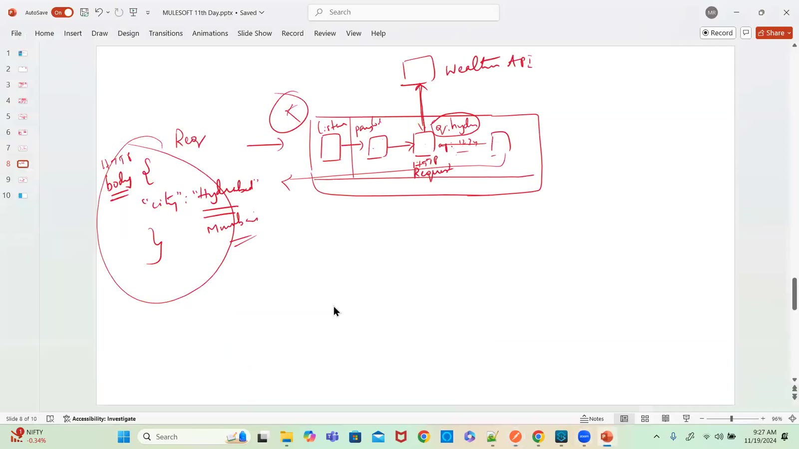

