# Day 12 — Slides and On-Screen Drawings

Frames captured from the Day 12 class recording (MuleSoft Telugu Course Day 12, recorded 20 Nov 2024). Frames showing email addresses or the OpenWeather API key are not included. Repeated and blank frames have been removed. Times are positions in the video.

Notes for this day: [detailed-notes/day12.md](../../detailed-notes/day12.md) · [super-detailed-notes/day12.md](../../super-detailed-notes/day12.md) · [summary](../../day12.md)

| # | Time | Content |
|---|---|---|
| 01 | 24:47 | Agenda — demo of consuming a REST service, propagation of payload/attributes/variables across HTTP Request, target variable, response timeout, response validator, reconnection strategy |
| 02 | 0:26 | Request {"city":"Mumbai"} → response {city, minTemp 35, maxTemp 45, tempUnit "celcius"}; http://host:port/basepath/path (drawing) |
| 03 | 2:18 | Transform Message — Selection dialog to choose the target (Attributes) (screen) |
| 04 | 8:38 | OpenWeather response for Hyderabad — main.temp_min 288.38, temp_max 289.88 (Kelvin) (screen) |
| 05 | 12:48 | DataWeave Playground — payload.main autocomplete on the weather JSON (screen) |
| 06 | 15:12 | Google: 300 K = 26.85 °C (K − 273.15) (screen) |
| 07 | 18:20 | Playground: "110" − 24 — auto-coercing String to Number warning (screen) |
| 08 | 18:51 | Transform Message — minTemp/maxTemp = payload.main.temp_min − 273.15 (screen) |
| 09 | 30:11 | Debugger: MULE:EXPRESSION — "You called the function '-' with these arguments: Null, Number (273.15)" (screen) |
| 10 | 31:03 | Postman: 500 Server Error with the same message (screen) |
| 11 | 34:09 | Transform Message using vars.request.city and vars.weatherResponse.main.temp_min/max − 273.15 (screen) |
| 12 | 33:46 | Postman: 200 OK — {city, minTemp, maxTemp, tempUnit} (screen) |
| 13 | 34:24 | Request operation — config HTTP_Request_configuration_openweather, GET /data/2.5/weather (screen) |
| 14 | 46:42 | HTTP Request configuration — protocol HTTP, host api.openweathermap.org (screen) |
| 15 | 56:47 | Request → Response tab — Response timeout 5000, Response validator None (screen) |

---

### 01 — Agenda — demo of consuming a REST service, propagation of payload/attributes/variables across HTTP Request, target variable, response timeout, response validator, reconnection strategy
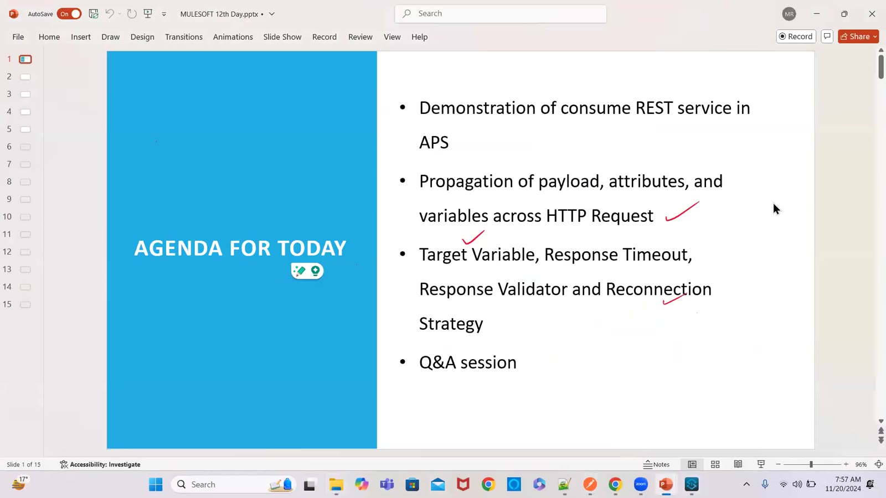

### 02 — Request {"city":"Mumbai"} → response {city, minTemp 35, maxTemp 45, tempUnit "celcius"}; http://host:port/basepath/path (drawing)
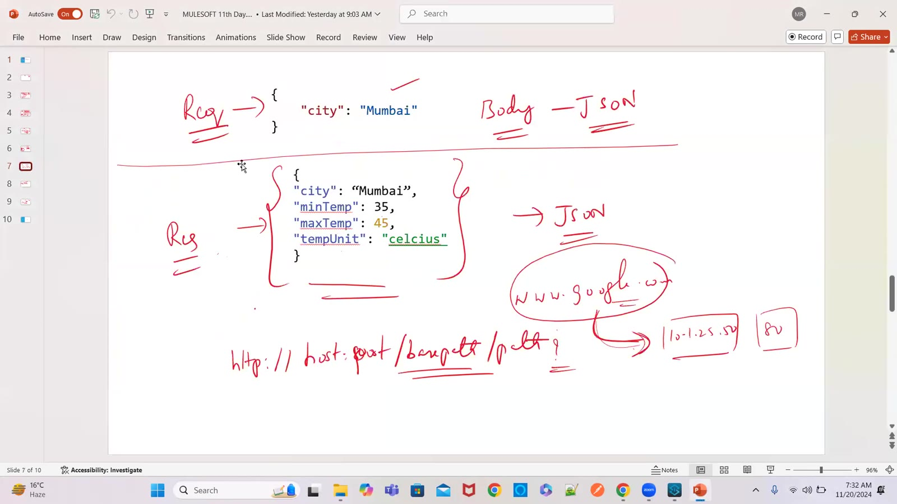

### 03 — Transform Message — Selection dialog to choose the target (Attributes) (screen)
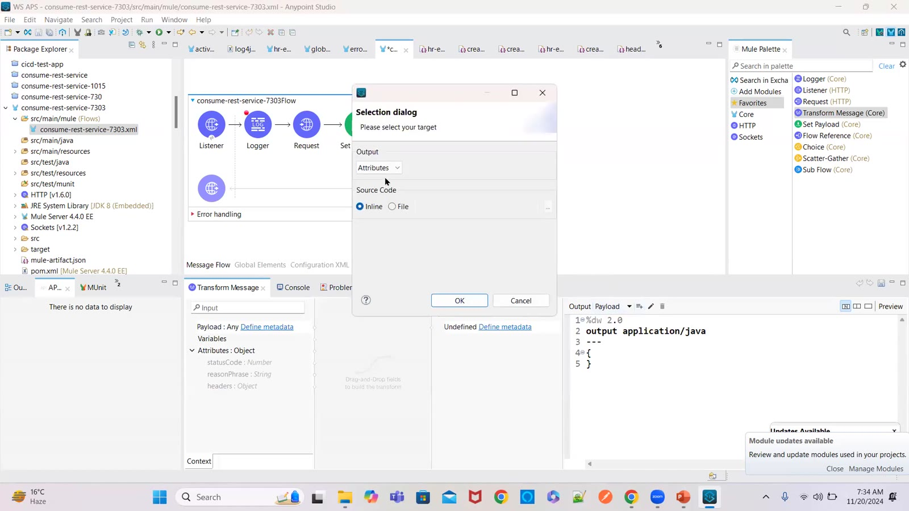

### 04 — OpenWeather response for Hyderabad — main.temp_min 288.38, temp_max 289.88 (Kelvin) (screen)
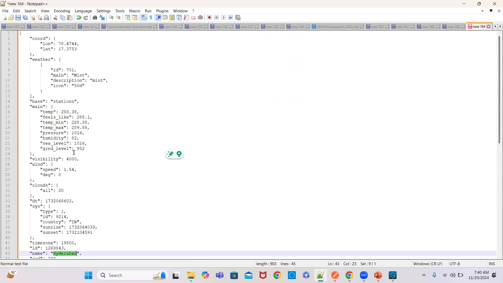

### 05 — DataWeave Playground — payload.main autocomplete on the weather JSON (screen)
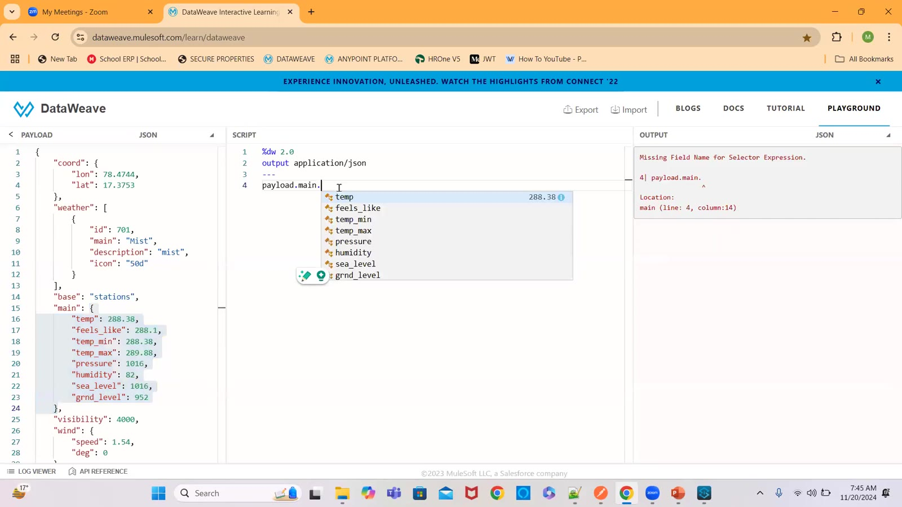

### 06 — Google: 300 K = 26.85 °C (K − 273.15) (screen)
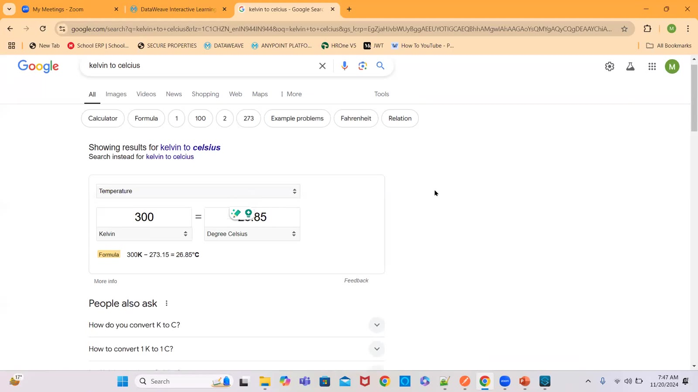

### 07 — Playground: "110" − 24 — auto-coercing String to Number warning (screen)
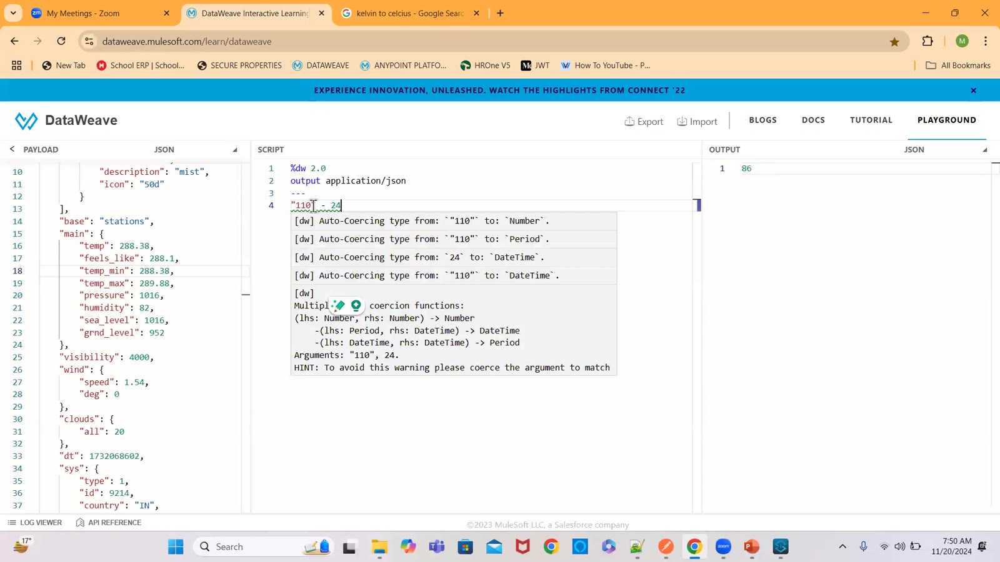

### 08 — Transform Message — minTemp/maxTemp = payload.main.temp_min − 273.15 (screen)
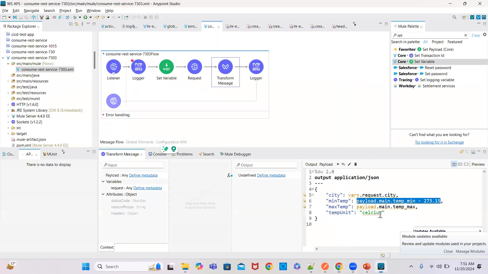

### 09 — Debugger: MULE:EXPRESSION — "You called the function '-' with these arguments: Null, Number (273.15)" (screen)
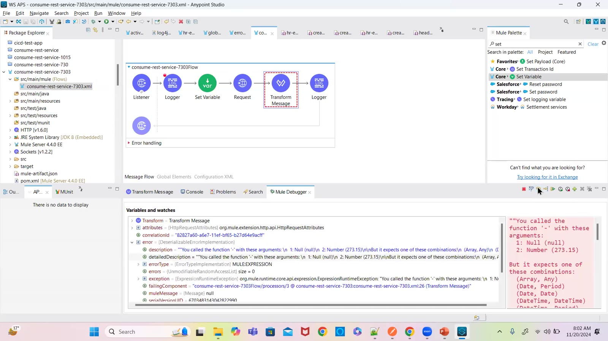

### 10 — Postman: 500 Server Error with the same message (screen)
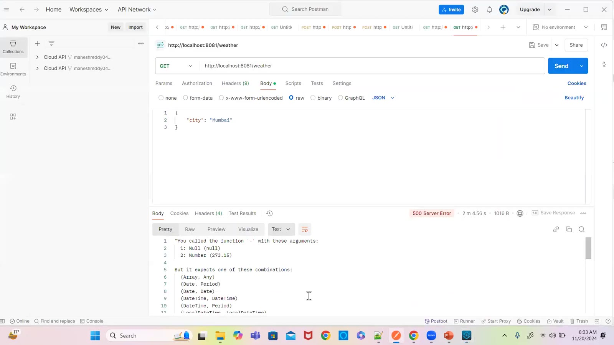

### 11 — Transform Message using vars.request.city and vars.weatherResponse.main.temp_min/max − 273.15 (screen)
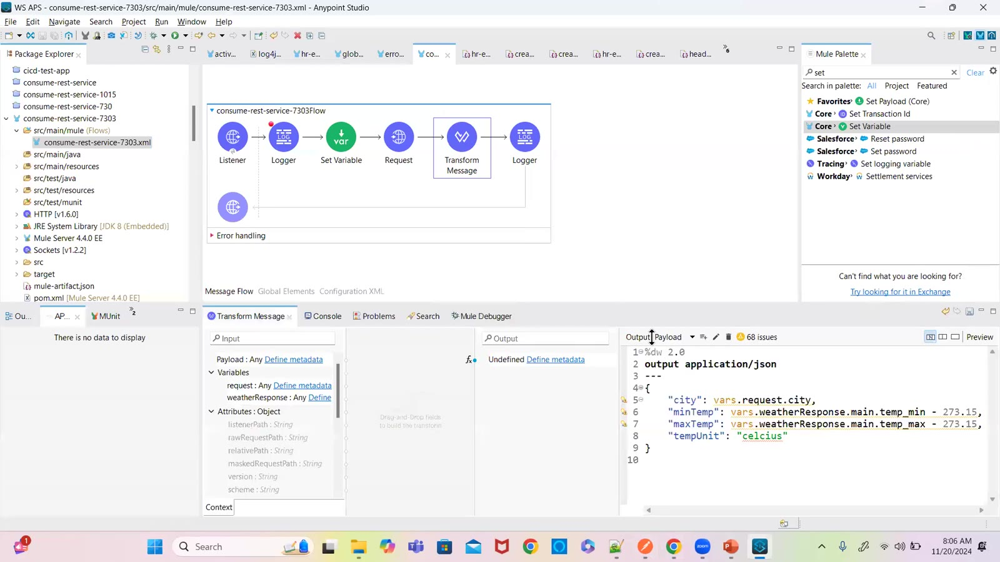

### 12 — Postman: 200 OK — {city, minTemp, maxTemp, tempUnit} (screen)
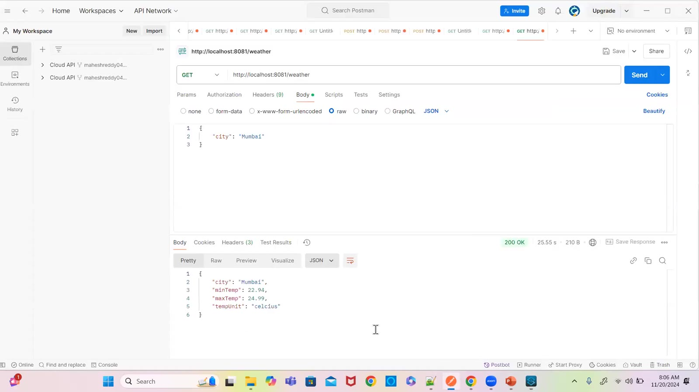

### 13 — Request operation — config HTTP_Request_configuration_openweather, GET /data/2.5/weather (screen)
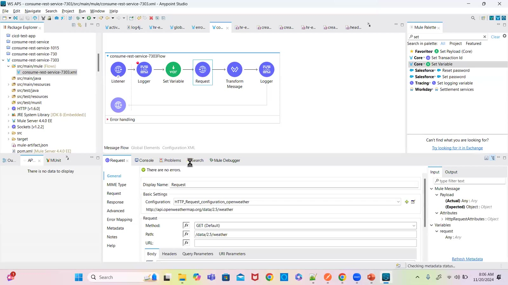

### 14 — HTTP Request configuration — protocol HTTP, host api.openweathermap.org (screen)
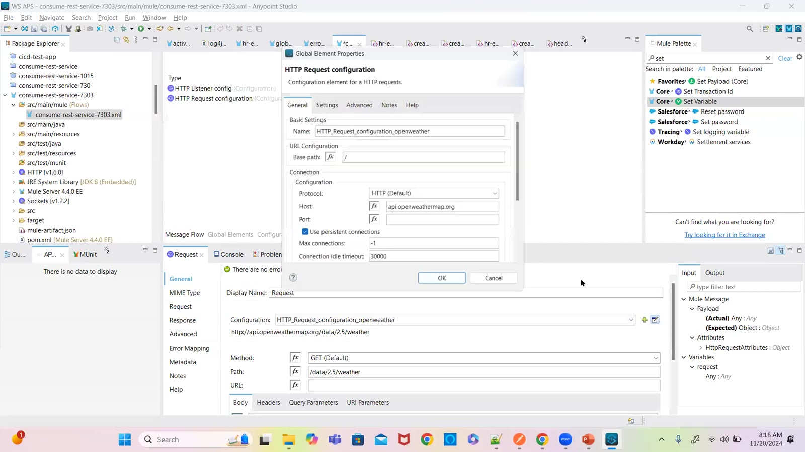

### 15 — Request → Response tab — Response timeout 5000, Response validator None (screen)
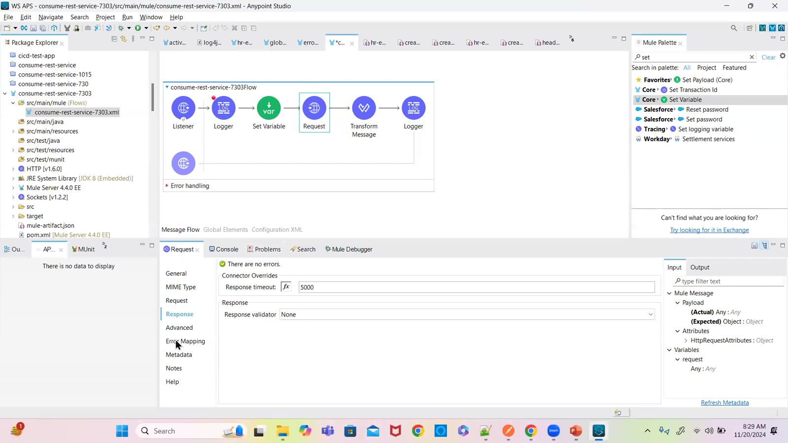

