# Day 13 — Slides and On-Screen Drawings

Frames captured from the Day 13 class recording (MuleSoft Telugu Course Day 13, recorded 21 Nov 2024). Salesforce connection screens (username/password fields) and frames showing the API key are not included. Repeated and blank frames have been removed. Times are positions in the video.

Notes for this day: [detailed-notes/day13.md](../../detailed-notes/day13.md) · [super-detailed-notes/day13.md](../../super-detailed-notes/day13.md) · [summary](../../day13.md)

| # | Time | Content |
|---|---|---|
| 01 | 0:01 | Agenda — target variable, response timeout, response validator, reconnection strategy |
| 02 | 1:02 | Response timeout — connector config vs 1st/2nd HTTP request (800 ms, 500 ms); default 10000 ms = 10 s (drawing) |
| 03 | 1:05 | Mobile app → gateway → API; gateway timeout vs API time (drawing) |
| 04 | 1:08 | Weather API (3rd party) — response timeout 10000 ms (10 s), 15.5 s example (drawing) |
| 05 | 1:13 | Response validator — 200 success, 400 client-side, 500 server-side; success status code validator 200 (201, 205, 206) (drawing) |
| 06 | 17:26 | Reconnection strategy — HTTP connectivity error; standard / none / forever; 2000 ms × 3 times (drawing) |
| 07 | 29:15 | Salesforce on-new-object source — standard vs forever reconnection, every 2000 ms (drawing) |
| 08 | 32:07 | Request → Advanced — Target Variable weatherResponse, Target Value payload, reconnection strategy None (screen) |
| 09 | 44:26 | Response validator — None / Expression or Bean reference / Failure / Success status code validator (screen) |
| 10 | 49:05 | Success status code validator — values 200,400 (screen) |
| 11 | 53:52 | Debugger: HTTP:NOT_FOUND — "HTTP GET on resource 'http://api.openweathermap.org:80/data/2.5/weather' failed: not found (404)" (screen) |
| 12 | 56:38 | Debugger: "You called the function '-' with these arguments: Null, Number (273.15)" (screen) |
| 13 | 61:24 | Details required for configuring HTTP Requestor — recap: HTTP or HTTPS, port 80/443 (drawing) |

---

### 01 — Agenda — target variable, response timeout, response validator, reconnection strategy
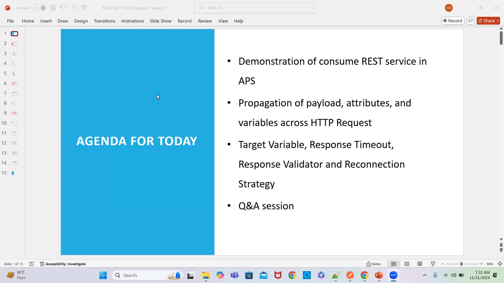

### 02 — Response timeout — connector config vs 1st/2nd HTTP request (800 ms, 500 ms); default 10000 ms = 10 s (drawing)
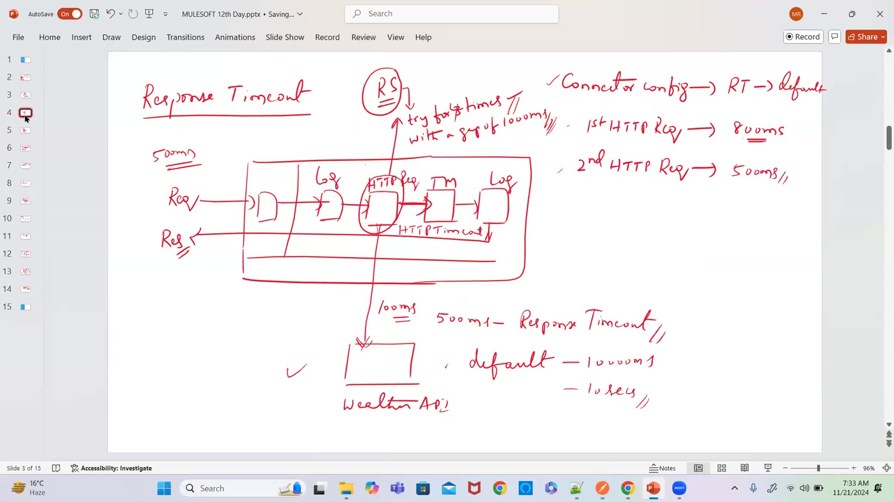

### 03 — Mobile app → gateway → API; gateway timeout vs API time (drawing)
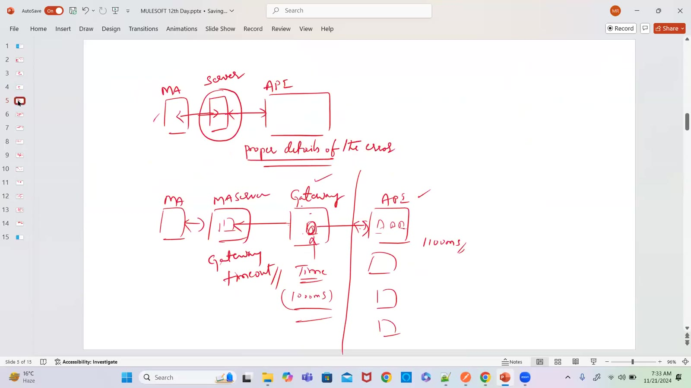

### 04 — Weather API (3rd party) — response timeout 10000 ms (10 s), 15.5 s example (drawing)
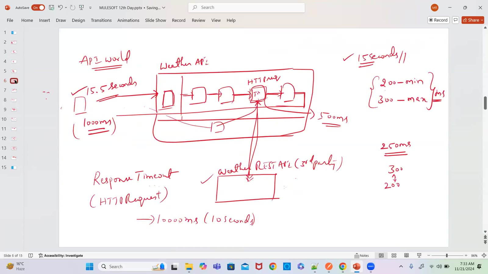

### 05 — Response validator — 200 success, 400 client-side, 500 server-side; success status code validator 200 (201, 205, 206) (drawing)
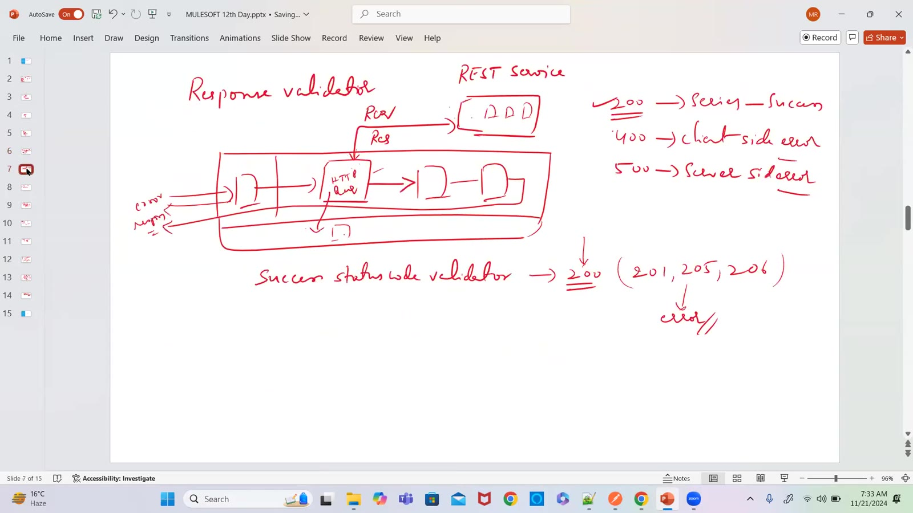

### 06 — Reconnection strategy — HTTP connectivity error; standard / none / forever; 2000 ms × 3 times (drawing)
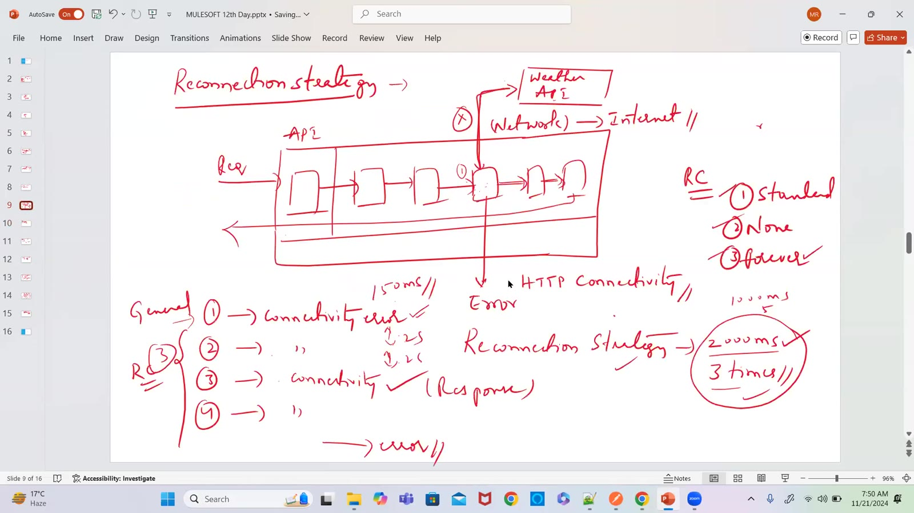

### 07 — Salesforce on-new-object source — standard vs forever reconnection, every 2000 ms (drawing)
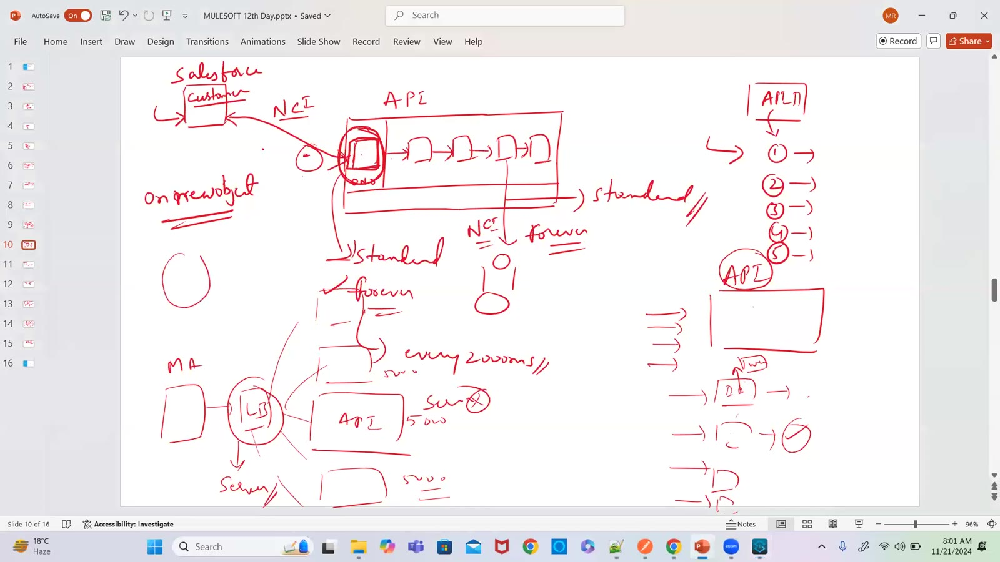

### 08 — Request → Advanced — Target Variable weatherResponse, Target Value payload, reconnection strategy None (screen)
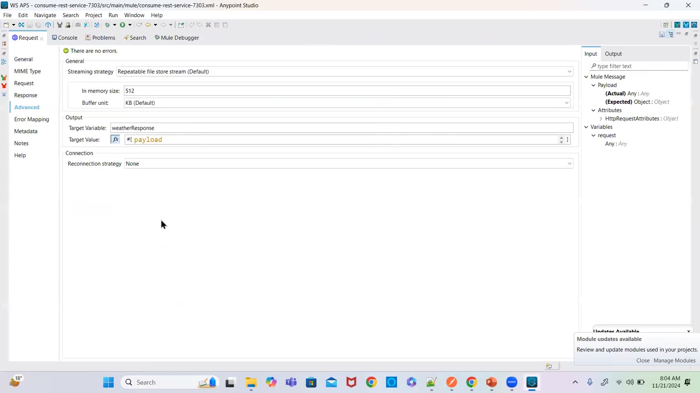

### 09 — Response validator — None / Expression or Bean reference / Failure / Success status code validator (screen)
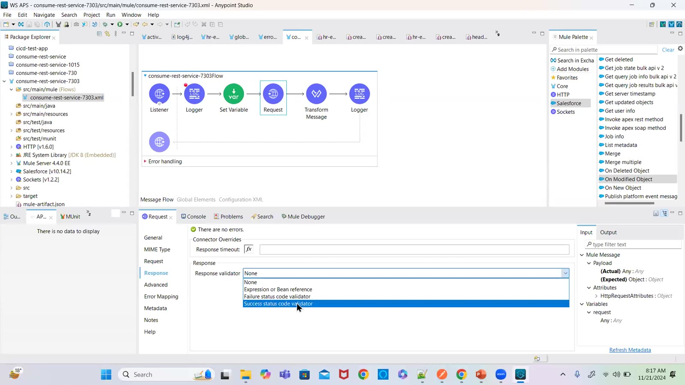

### 10 — Success status code validator — values 200,400 (screen)
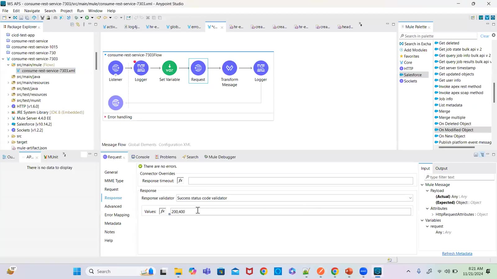

### 11 — Debugger: HTTP:NOT_FOUND — "HTTP GET on resource 'http://api.openweathermap.org:80/data/2.5/weather' failed: not found (404)" (screen)
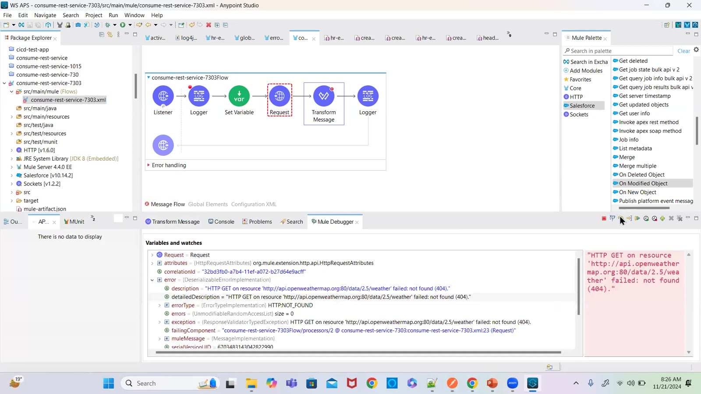

### 12 — Debugger: "You called the function '-' with these arguments: Null, Number (273.15)" (screen)
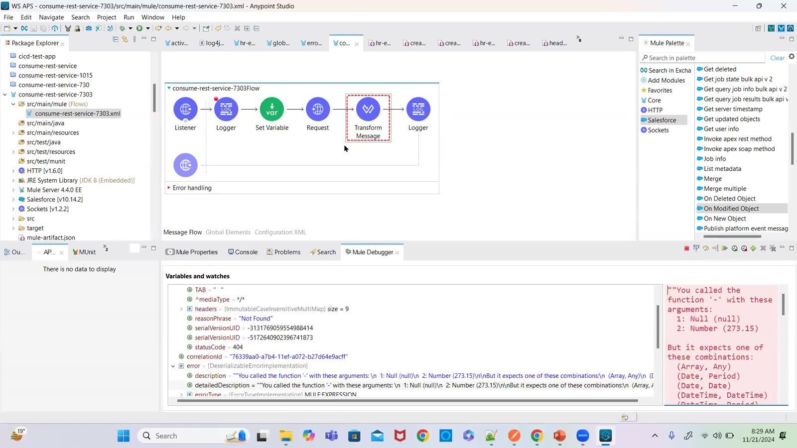

### 13 — Details required for configuring HTTP Requestor — recap: HTTP or HTTPS, port 80/443 (drawing)
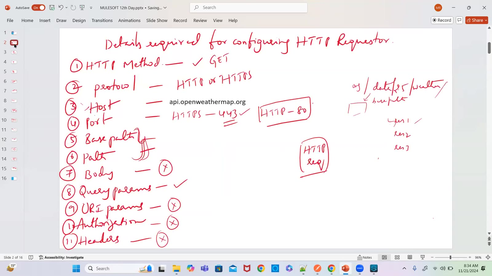

