# Day 14 — Slides and On-Screen Drawings

Frames captured from the Day 14 class recording (MuleSoft Telugu Course Day 14, recorded 25 Nov 2024). Property-file screens showing the OpenWeather API key (plain or encrypted) are not included. Repeated and blank frames have been removed. Times are positions in the video.

Notes for this day: [detailed-notes/day14.md](../../detailed-notes/day14.md) · [super-detailed-notes/day14.md](../../super-detailed-notes/day14.md) · [summary](../../day14.md)

| # | Time | Content |
|---|---|---|
| 01 | 0:03 | Agenda — externalizing properties, property files per environment, deploy using Run Configuration |
| 02 | 1:37 | Importance of externalizing properties — REST service host per env (dev/uat/prod api.openweathermap.org), database 10.1.25.50/51/52 port 330 (drawing) |
| 03 | 10:03 | Properties implementation steps — property file per environment, configuration properties global element, ${key} and Mule::p('key'), runtime arguments |
| 04 | 37:37 | Properties implementation steps with notes — ${host}, p('host') (slide + drawing) |
| 05 | 37:59 | Global Configuration Elements — HTTP Listener, HTTP Request, Configuration properties (screen) |
| 06 | 68:41 | Agenda — encryption/decryption, secure properties with .yaml, .yaml vs .properties, secure .properties |
| 07 | 68:49 | Difference between YAML and properties — http.listener.host/port/path, weather.request.*, weather.reconnection.frequency 2000, attempts 3 |
| 08 | 76:28 | Encryption — readable format → algorithm + key → unreadable format; E → RF→URF, D → URF→RF (drawing) |
| 09 | 68:43 | Secure properties tool — java -cp secure-properties-tool.jar … string encrypt/decrypt Blowfish CBC (drawing) |
| 10 | 78:39 | Secure properties implementation steps — add module from Exchange, encrypt, secure config global element, ${secure::key}, Mule::p('secure::key') |
| 11 | 82:55 | Secure Properties Generator website — operation, algorithm (AES), state (CBC), key, value (screen) |

---

### 01 — Agenda — externalizing properties, property files per environment, deploy using Run Configuration
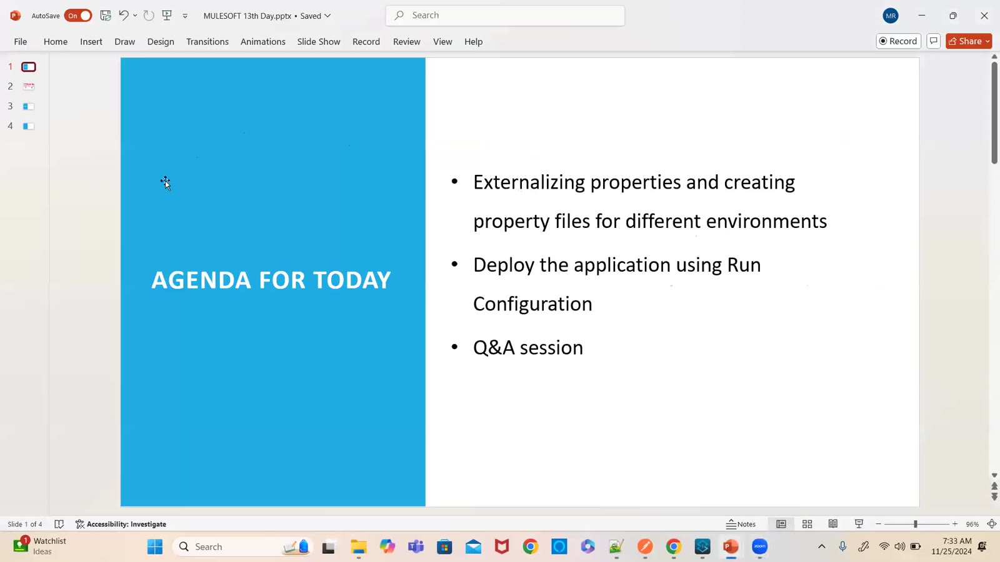

### 02 — Importance of externalizing properties — REST service host per env (dev/uat/prod api.openweathermap.org), database 10.1.25.50/51/52 port 330 (drawing)
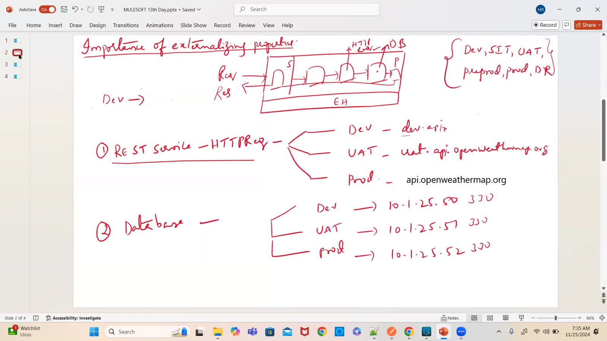

### 03 — Properties implementation steps — property file per environment, configuration properties global element, ${key} and Mule::p('key'), runtime arguments
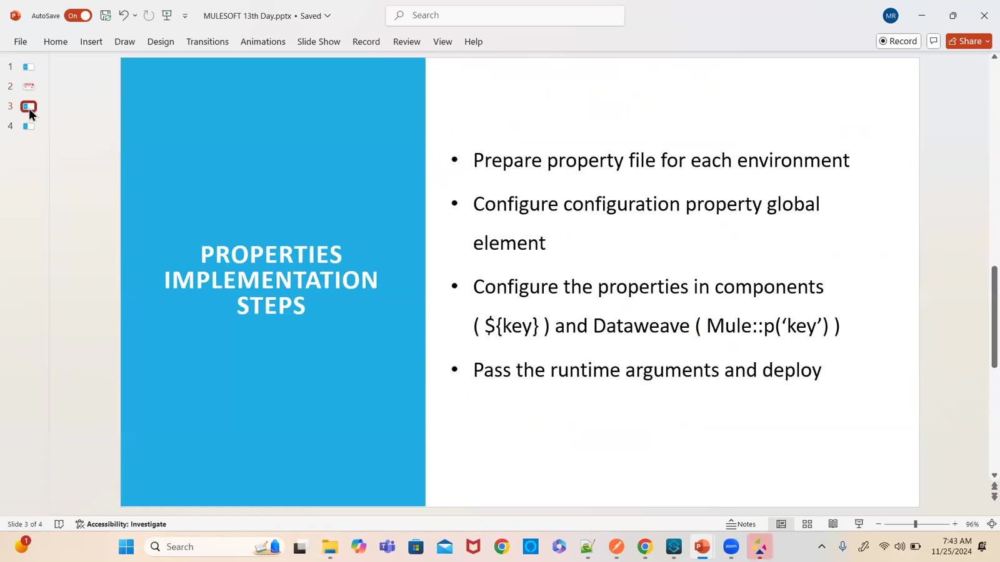

### 04 — Properties implementation steps with notes — ${host}, p('host') (slide + drawing)
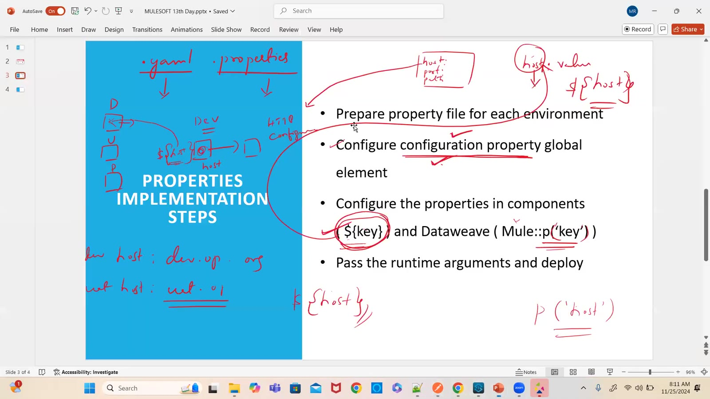

### 05 — Global Configuration Elements — HTTP Listener, HTTP Request, Configuration properties (screen)
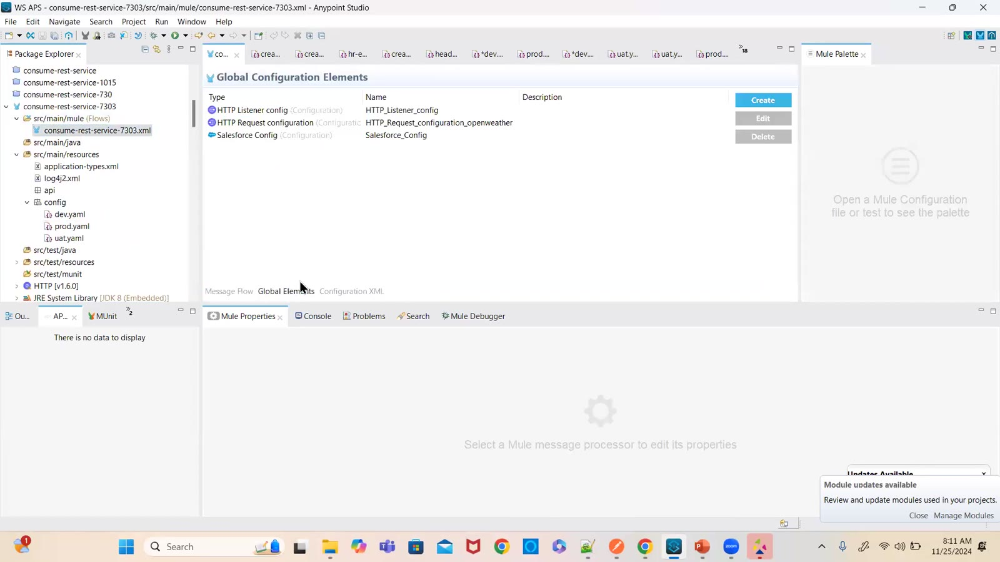

### 06 — Agenda — encryption/decryption, secure properties with .yaml, .yaml vs .properties, secure .properties
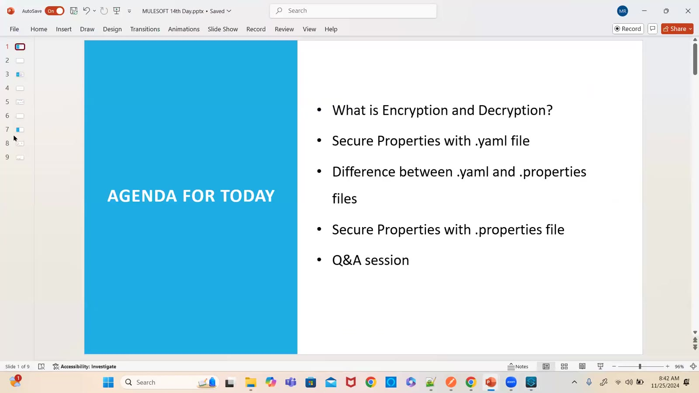

### 07 — Difference between YAML and properties — http.listener.host/port/path, weather.request.*, weather.reconnection.frequency 2000, attempts 3
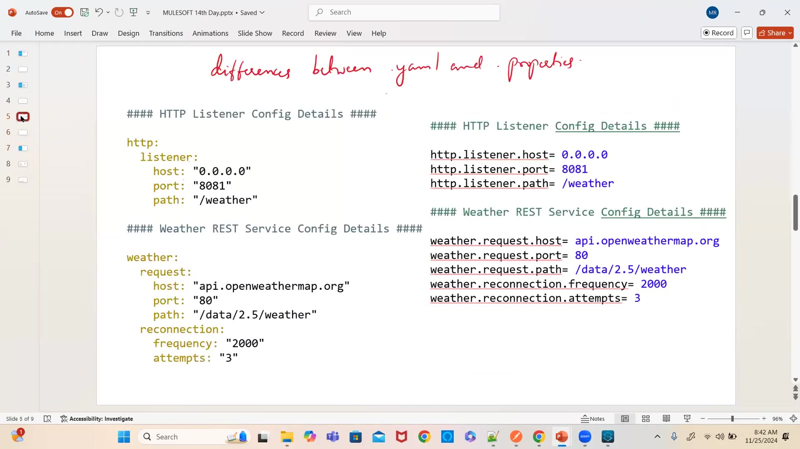

### 08 — Encryption — readable format → algorithm + key → unreadable format; E → RF→URF, D → URF→RF (drawing)
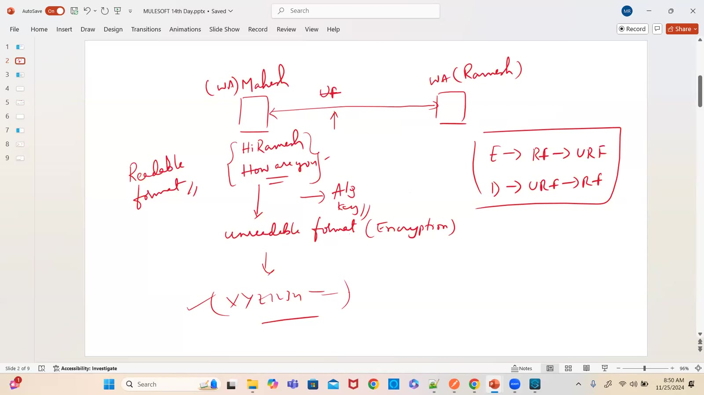

### 09 — Secure properties tool — java -cp secure-properties-tool.jar … string encrypt/decrypt Blowfish CBC (drawing)
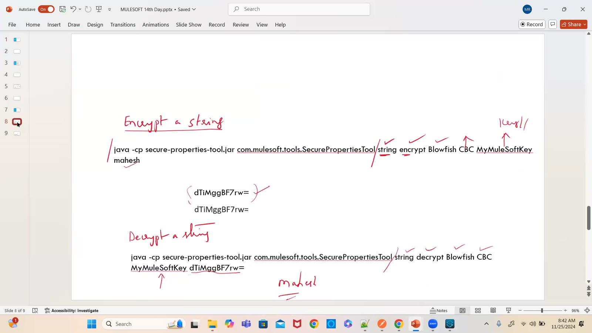

### 10 — Secure properties implementation steps — add module from Exchange, encrypt, secure config global element, ${secure::key}, Mule::p('secure::key')
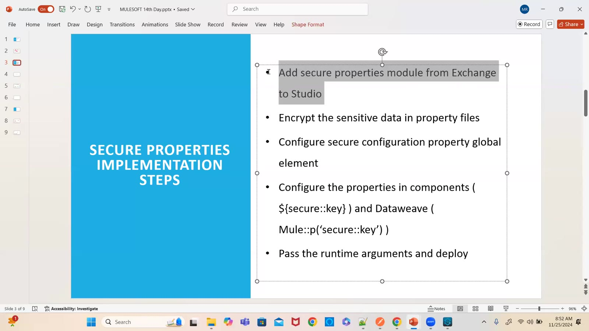

### 11 — Secure Properties Generator website — operation, algorithm (AES), state (CBC), key, value (screen)
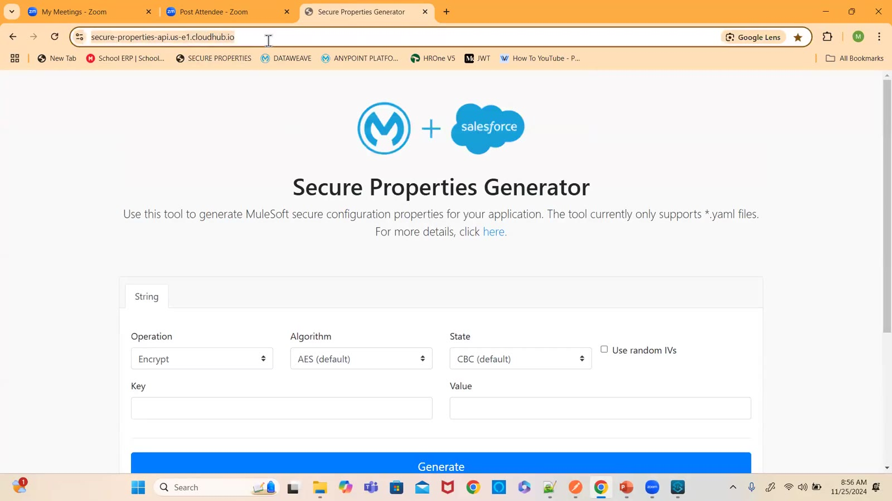

