# Day 15 — Slides and On-Screen Drawings

Frames captured from the Day 15 class recording (MuleSoft Telugu Course Day 15, recorded 26 Nov 2024). Property-file screens showing the API key are not included. Repeated and blank frames have been removed. Times are positions in the video.

Notes for this day: [detailed-notes/day15.md](../../detailed-notes/day15.md) · [super-detailed-notes/day15.md](../../super-detailed-notes/day15.md) · [summary](../../day15.md)

| # | Time | Content |
|---|---|---|
| 01 | 0:01 | Agenda — error handling in Mule 4.x, default error handling and Listener configuration, error object, On Error Propagate, On Error Continue, global error handler |
| 02 | 8:21 | Error handler, On Error Propagate / Continue, Raise Error → error handling in Mule; Try scope → component-level error handling (drawing) |
| 03 | 15:12 | Agenda with notes — REST API, success/error responses, custom code "Err-1700" agreed between consumer and service provider (slide + drawing) |
| 04 | 18:26 | Listener Error Response body — output text/plain --- error.description (screen) |
| 05 | 35:16 | Our API → third-party API → DB; 500-series errors; error.description, error.detailedDescription, error.errorType (drawing) |
| 06 | 39:46 | Transform Message — {"errorStatusCode": 400, "message": error.description} (screen) |
| 07 | 42:34 | Listener Error Response — status code vars.statusCode, reason phrase vars.reasonPhrase (screen) |
| 08 | 41:59 | Flow with On Error Propagate (type HTTP:NOT_FOUND) — Logger + Transform Message (screen) |
| 09 | 46:42 | Postman: 400 Bad Request with errorStatusCode and message (screen) |
| 10 | 48:13 | Request → flow → HTTP request error → On Error Propagate → response (drawing) |
| 11 | 48:16 | Flow level, application level (global error handler), component level / group of components (Try scope) (drawing) |
| 12 | 48:19 | On Error Propagate — "it will stop the process and propagate the error response to the next level" (drawing) |
| 13 | 57:04 | Two handlers — HTTP:NOT_FOUND and MULE:EXPRESSION with Error Logger and Set Error Response (screen) |
| 14 | 63:23 | Transform for the expression error — errorStatusCode 500, message error.description (screen) |

---

### 01 — Agenda — error handling in Mule 4.x, default error handling and Listener configuration, error object, On Error Propagate, On Error Continue, global error handler
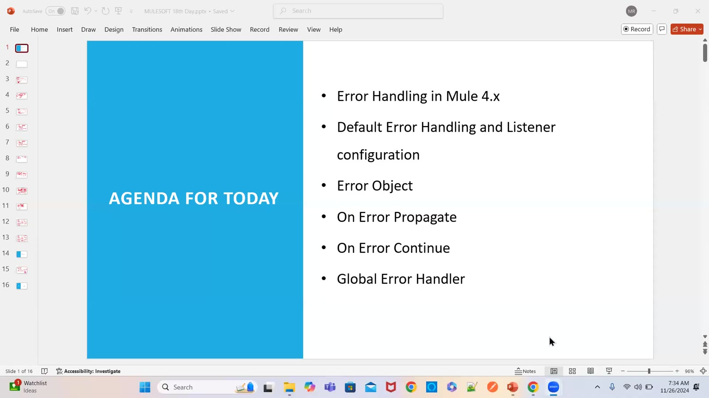

### 02 — Error handler, On Error Propagate / Continue, Raise Error → error handling in Mule; Try scope → component-level error handling (drawing)
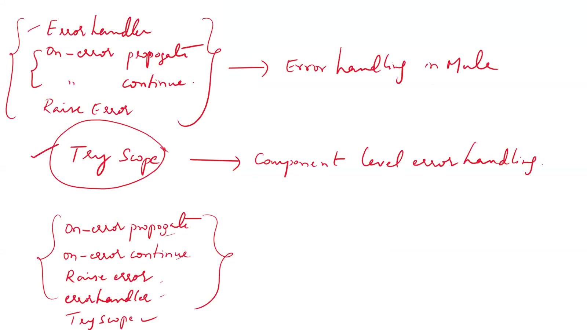

### 03 — Agenda with notes — REST API, success/error responses, custom code "Err-1700" agreed between consumer and service provider (slide + drawing)
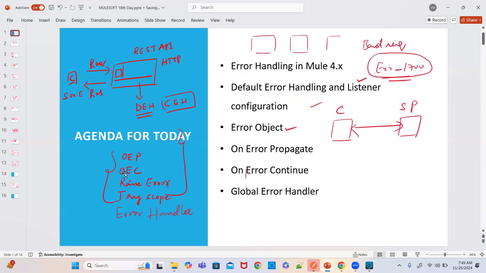

### 04 — Listener Error Response body — output text/plain --- error.description (screen)
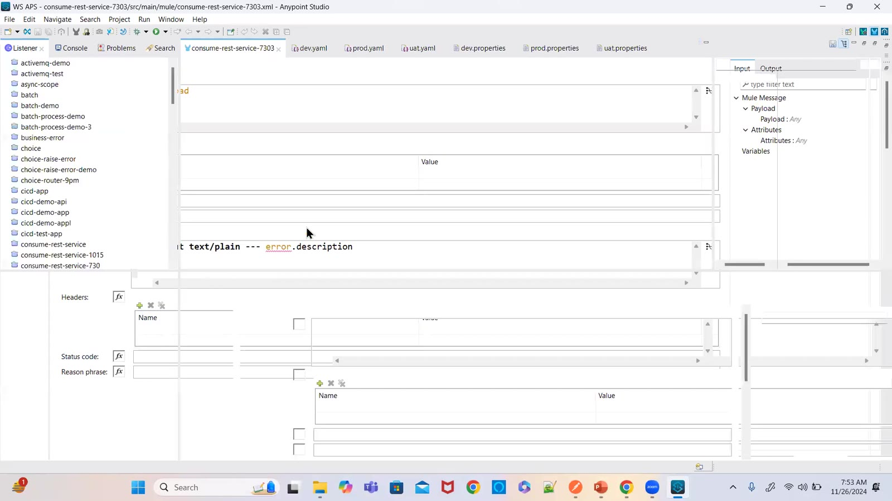

### 05 — Our API → third-party API → DB; 500-series errors; error.description, error.detailedDescription, error.errorType (drawing)
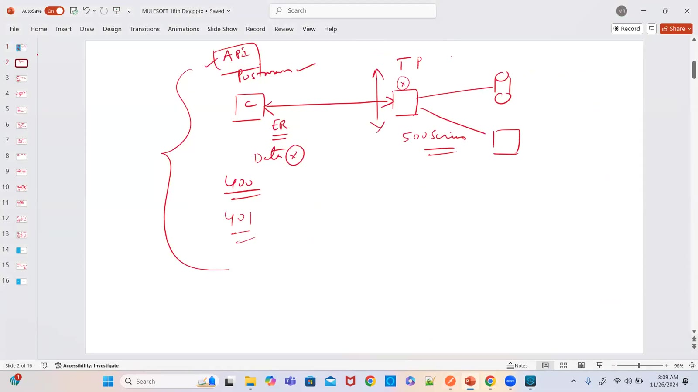

### 06 — Transform Message — {"errorStatusCode": 400, "message": error.description} (screen)
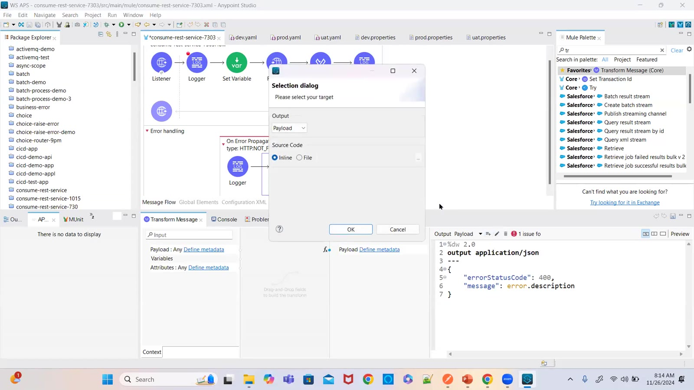

### 07 — Listener Error Response — status code vars.statusCode, reason phrase vars.reasonPhrase (screen)
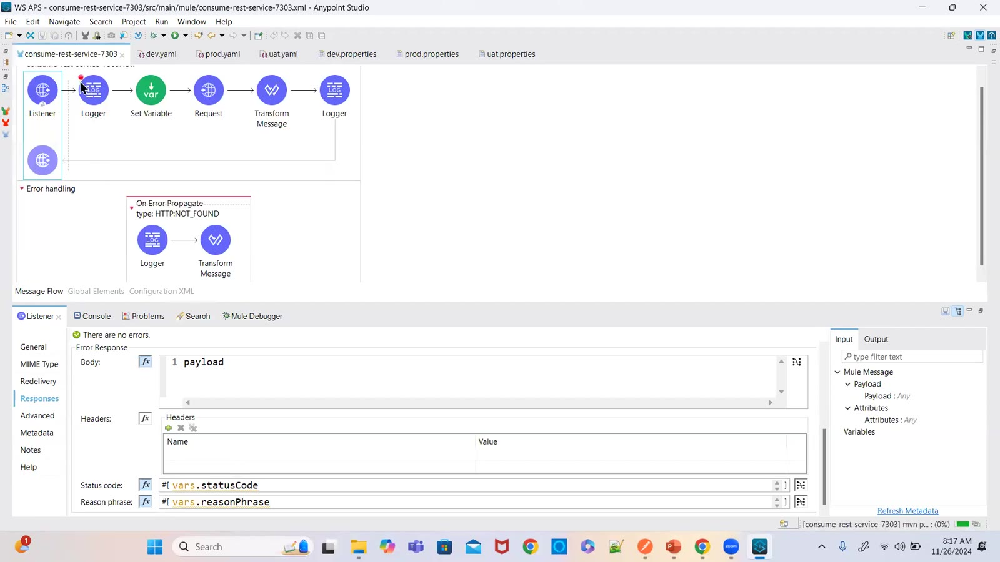

### 08 — Flow with On Error Propagate (type HTTP:NOT_FOUND) — Logger + Transform Message (screen)
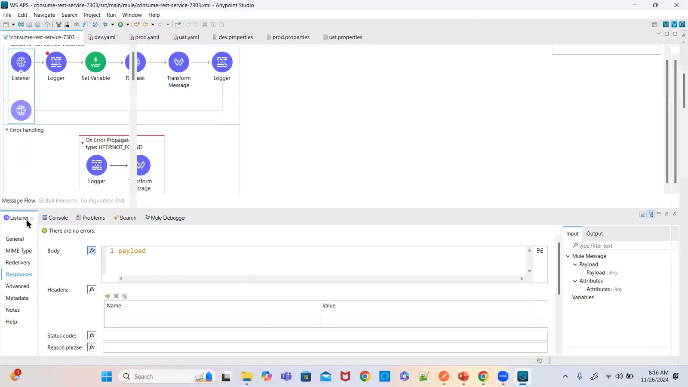

### 09 — Postman: 400 Bad Request with errorStatusCode and message (screen)
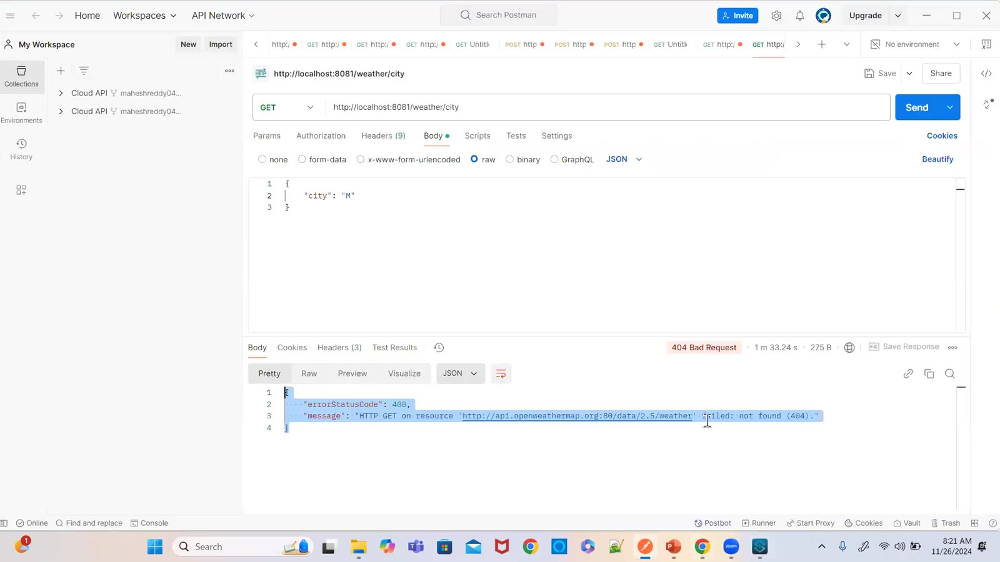

### 10 — Request → flow → HTTP request error → On Error Propagate → response (drawing)
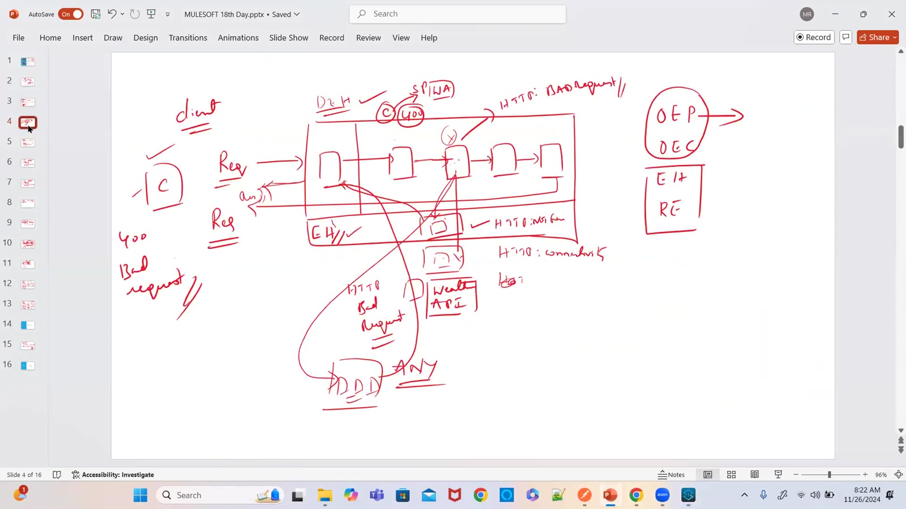

### 11 — Flow level, application level (global error handler), component level / group of components (Try scope) (drawing)
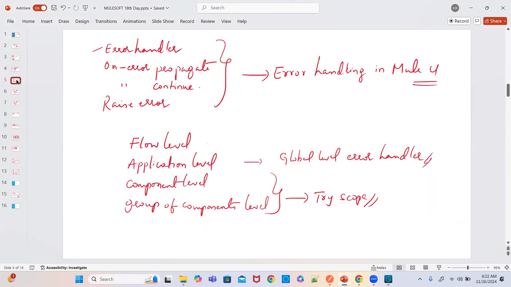

### 12 — On Error Propagate — "it will stop the process and propagate the error response to the next level" (drawing)
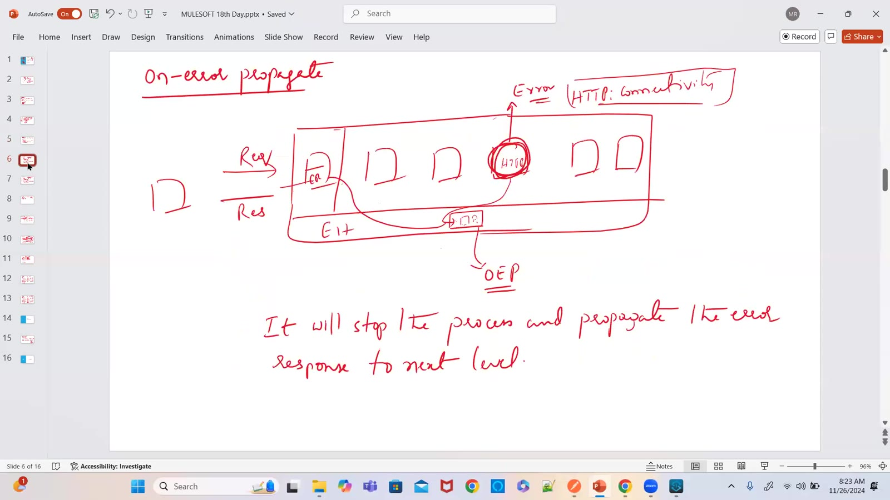

### 13 — Two handlers — HTTP:NOT_FOUND and MULE:EXPRESSION with Error Logger and Set Error Response (screen)
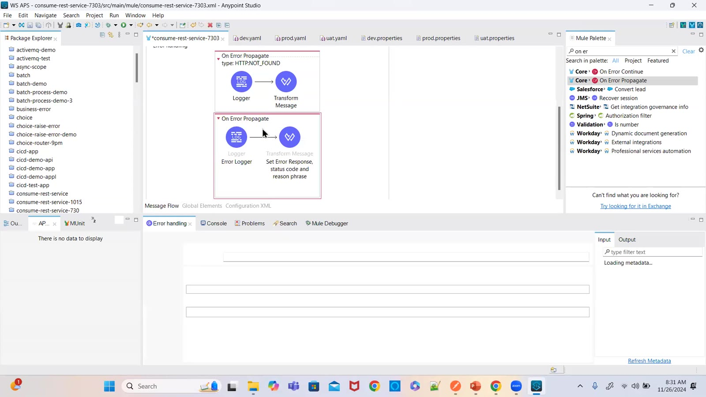

### 14 — Transform for the expression error — errorStatusCode 500, message error.description (screen)
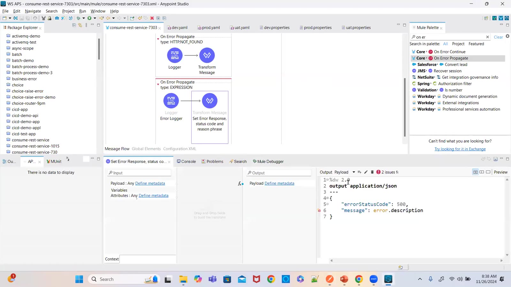

