# Day 16 — Slides and On-Screen Drawings

Frames captured from the Day 16 class recording (MuleSoft Telugu Course Day 16, recorded 27 Nov 2024). Property-file screens showing the API key are not included. Repeated and blank frames have been removed. Times are positions in the video.

Notes for this day: [detailed-notes/day16.md](../../detailed-notes/day16.md) · [super-detailed-notes/day16.md](../../super-detailed-notes/day16.md) · [summary](../../day16.md)

| # | Time | Content |
|---|---|---|
| 01 | 3:06 | Configuration XML — two On Error Propagate handlers with Transform Message setting payload, statusCode and reasonPhrase (screen) |
| 02 | 6:51 | Error handling with HTTP:NOT_FOUND, EXPRESSION and ANY handlers (screen) |
| 03 | 23:22 | Parent flow → Flow Reference → child flow; On Error Propagate in child returns the error to the parent (drawing) |
| 04 | 27:44 | Client → request → API flows; OEP / OEC, error handling, ANY (drawing) |
| 05 | 27:48 | On Error Propagate — "it will stop the process and propagate the error response to the next level" (drawing) |
| 06 | 37:15 | On Error Continue — "it will stop the process and propagate the success response to the next level" (drawing) |
| 07 | 36:56 | Flow Reference in the main flow with On Error Continue + Logger (screen) |
| 08 | 41:55 | <flow> opening tag, </flow> closing tag, self-closing <flow ... /> (drawing) |
| 09 | 49:29 | Global error handler XML — <error-handler name="common-error-handlerError_Handler"> (screen) |
| 10 | 58:48 | OEP, OEC, RE, EH, Try scope → error handling in MuleSoft (drawing) |
| 11 | 62:33 | Try scope around the Request with its own error handling (screen) |
| 12 | 66:35 | Try scope → component or group of components error handling (drawing) |
| 13 | 66:53 | On Error Continue inside Try — the flow continues after the failed step (drawing) |
| 14 | 73:10 | Choice router — payload.age > 17 and payload.age < 66 (screen) |
| 15 | 83:53 | Raise Error — Postman 500 "age is not in the specified limits" (screen) |
| 16 | 85:06 | Postman 200 — "loan process is successful but different for 30 to 65 people" (screen) |

---

### 01 — Configuration XML — two On Error Propagate handlers with Transform Message setting payload, statusCode and reasonPhrase (screen)
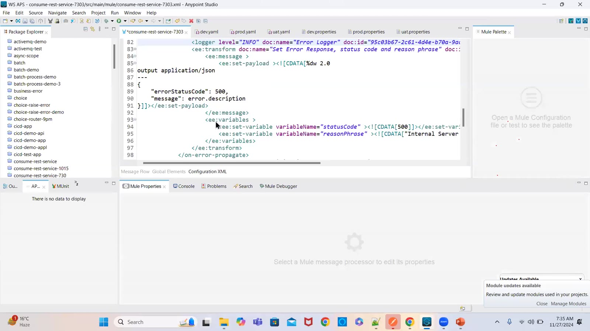

### 02 — Error handling with HTTP:NOT_FOUND, EXPRESSION and ANY handlers (screen)
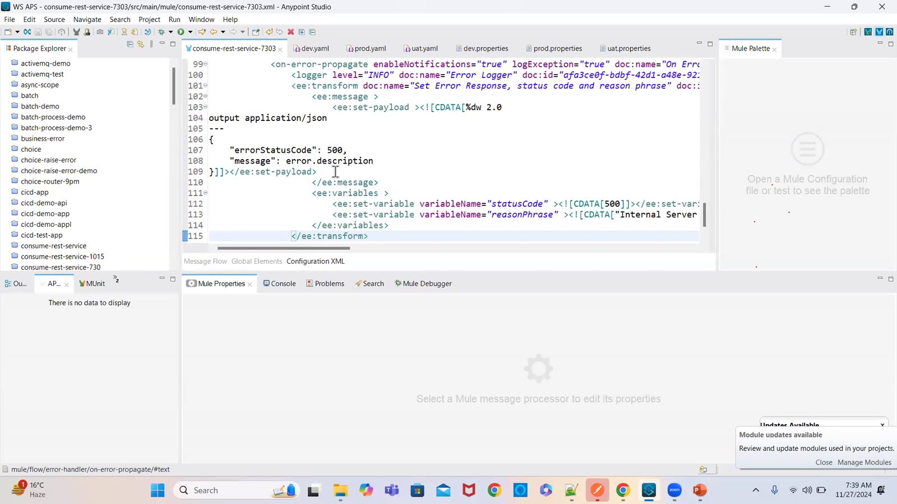

### 03 — Parent flow → Flow Reference → child flow; On Error Propagate in child returns the error to the parent (drawing)
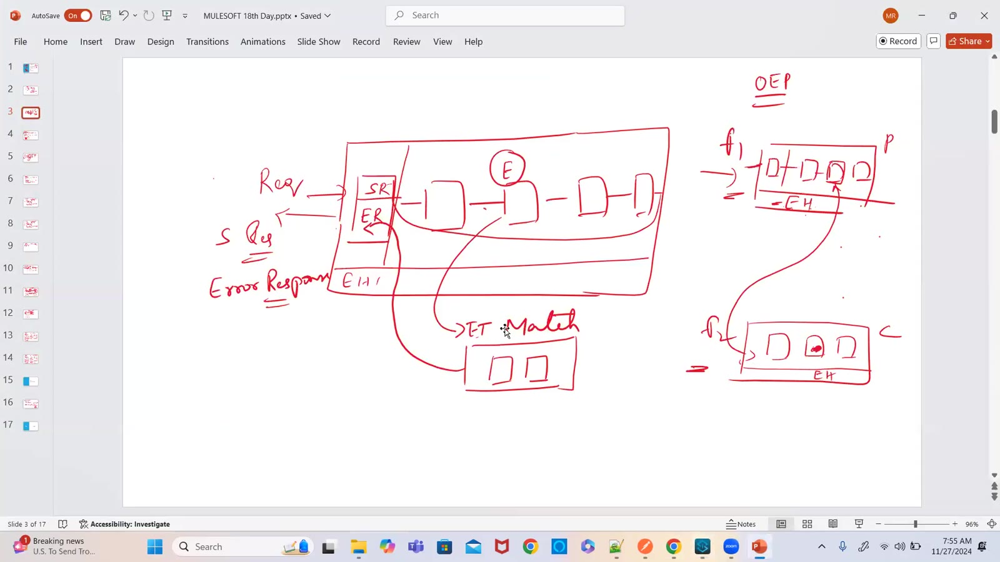

### 04 — Client → request → API flows; OEP / OEC, error handling, ANY (drawing)
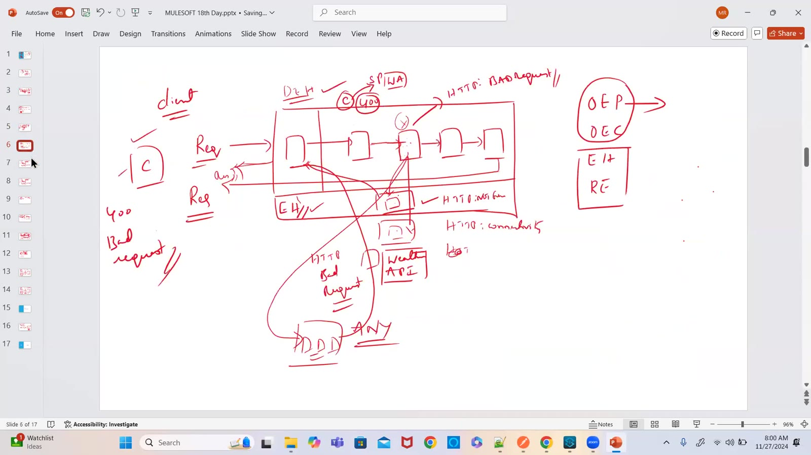

### 05 — On Error Propagate — "it will stop the process and propagate the error response to the next level" (drawing)
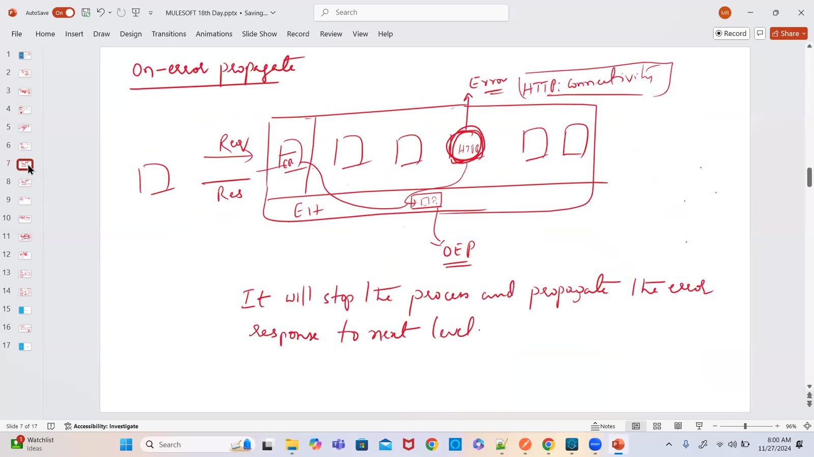

### 06 — On Error Continue — "it will stop the process and propagate the success response to the next level" (drawing)
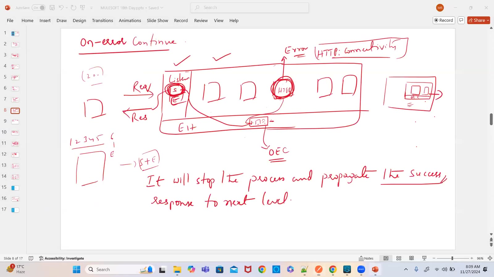

### 07 — Flow Reference in the main flow with On Error Continue + Logger (screen)
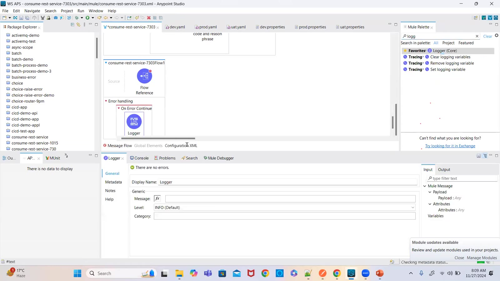

### 08 — <flow> opening tag, </flow> closing tag, self-closing <flow ... /> (drawing)
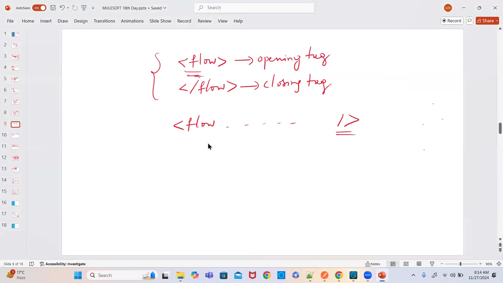

### 09 — Global error handler XML — <error-handler name="common-error-handlerError_Handler"> (screen)
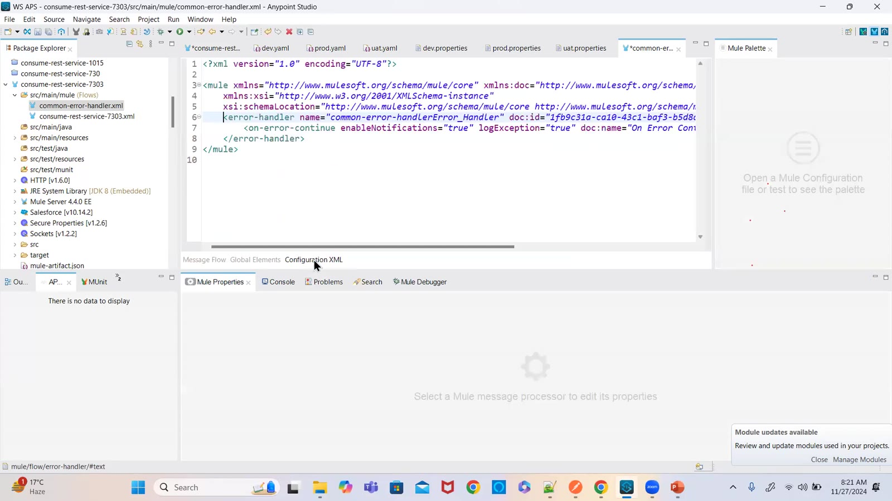

### 10 — OEP, OEC, RE, EH, Try scope → error handling in MuleSoft (drawing)
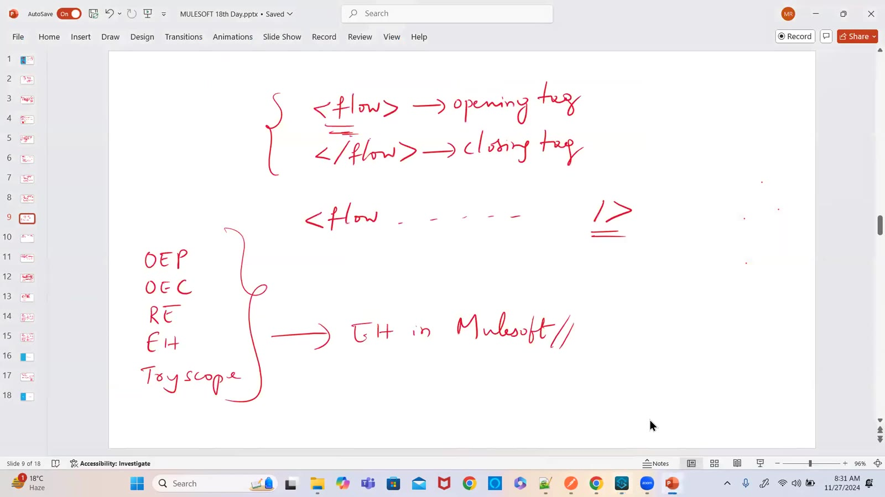

### 11 — Try scope around the Request with its own error handling (screen)
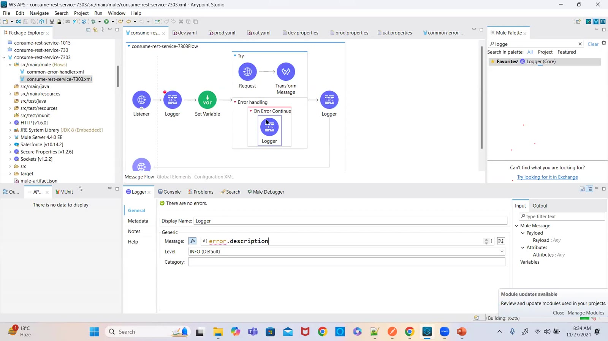

### 12 — Try scope → component or group of components error handling (drawing)
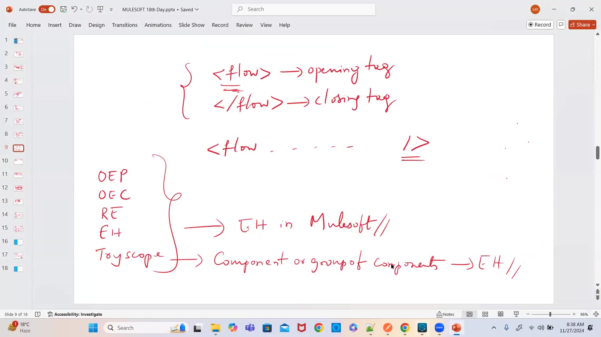

### 13 — On Error Continue inside Try — the flow continues after the failed step (drawing)
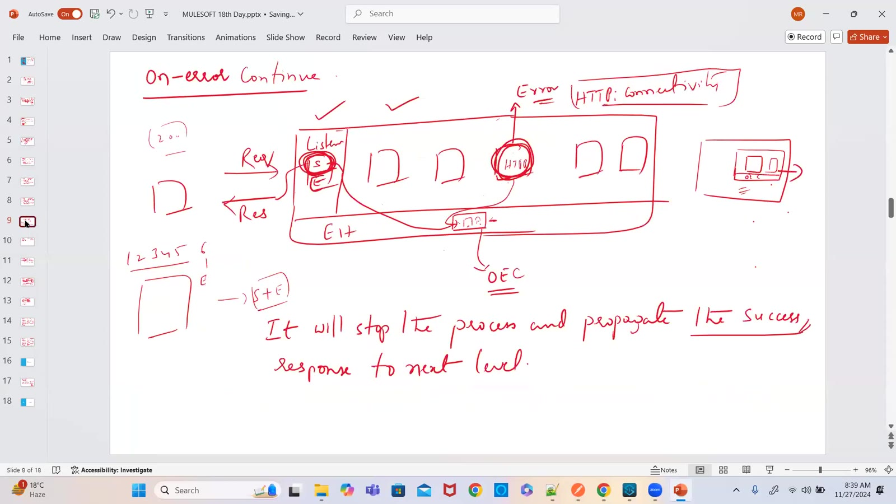

### 14 — Choice router — payload.age > 17 and payload.age < 66 (screen)
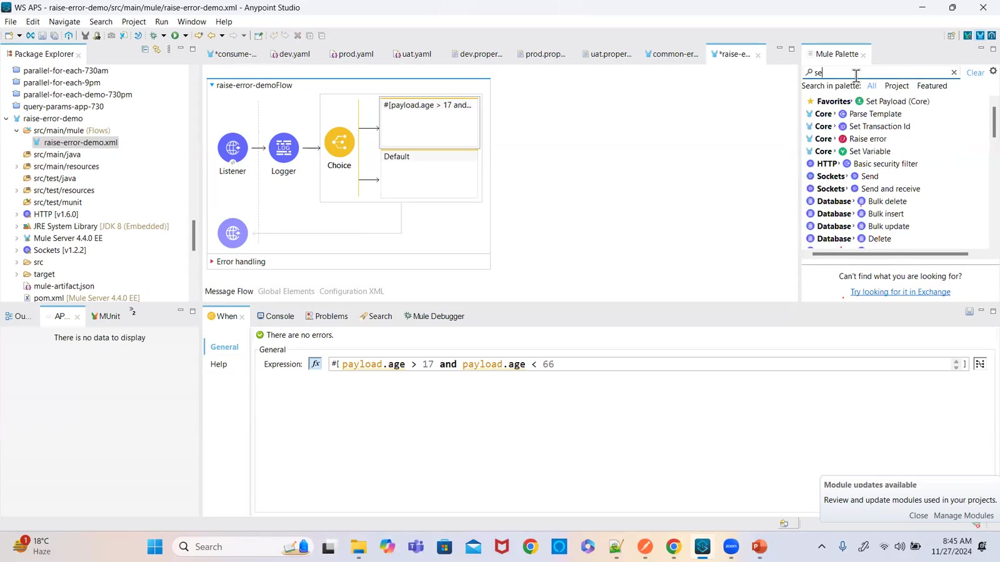

### 15 — Raise Error — Postman 500 "age is not in the specified limits" (screen)
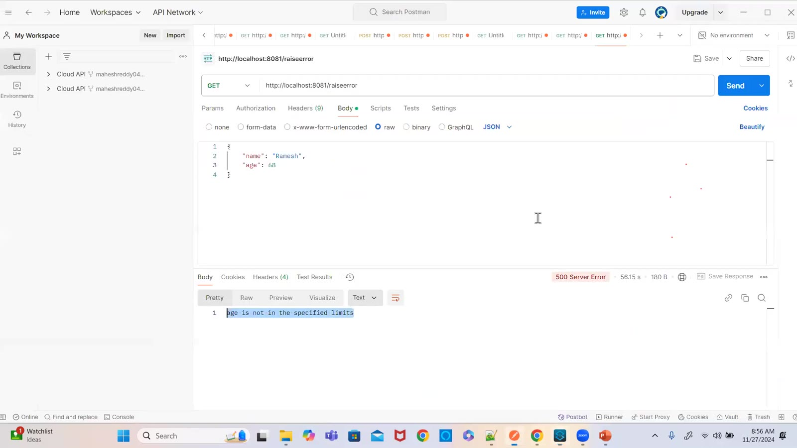

### 16 — Postman 200 — "loan process is successful but different for 30 to 65 people" (screen)
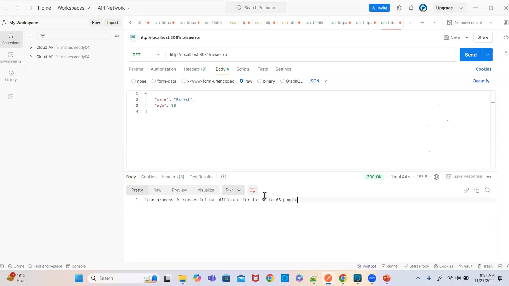

