# Day 17 — Slides and On-Screen Drawings

Frames captured from the Day 17 class recording (MuleSoft Telugu Course Day 17, recorded 28 Nov 2024). This session was taught on the whiteboard. Repeated and blank frames have been removed. Times are positions in the video.

Notes for this day: [detailed-notes/day17.md](../../detailed-notes/day17.md) · [super-detailed-notes/day17.md](../../super-detailed-notes/day17.md) · [summary](../../day17.md)

| # | Time | Content |
|---|---|---|
| 01 | 0:01 | Agenda — deployment strategies in MuleSoft; on-premise, hybrid and CloudHub |
| 02 | 10:18 | Environments dev, SIT (QA or test), UAT, preprod, prod, DR; cloud vs RBI data rules (slide + drawing) |
| 03 | 11:42 | Control plane — Runtime Manager, API Manager, Exchange, Management Center → Anypoint Platform, hosted by MuleSoft or own (drawing) |
| 04 | 17:12 | Runtime plane — Mule runtime, connectors and components, logging (drawing) |
| 05 | 18:57 | Deployment model vs control plane vs runtime plane — CloudHub, on-premises, hybrid, RTF; AWS or Azure workers (drawing) |
| 06 | 31:31 | Deploy app → load balancer (round-robin), SLB / DLB, workers, high availability and less downtime (drawing) |
| 07 | 34:58 | Load balancer — SLB (shared) vs DLB (dedicated); 0.1 vCore workers on CloudHub (US east) (drawing) |
| 08 | 35:00 | SLB ports HTTP 8081 / HTTPS 8082; DLB ports HTTP 8091 / HTTPS 8092 (drawing) |
| 09 | 45:15 | Scaling — load balancer across workers W1, W2; high availability; SLB shared, DLB dedicated (drawing) |
| 10 | 58:07 | ICICI Bank — CloudHub (sensitive data on cloud) vs on-premises (more secure, more maintenance, high cost) (drawing) |
| 11 | 59:09 | Hybrid — control plane (MuleSoft) + runtime plane (ICICI) with logging, connectors, actual business data (drawing) |
| 12 | 60:11 | CloudHub — cloud solution provided by MuleSoft; AWS/Azure; Anypoint Platform modules as control plane (drawing) |
| 13 | 60:19 | Hybrid and vCore sizes — 0.1 vCore (500 MB memory), payload size and requests per day (drawing) |
| 14 | 60:29 | ICICI → financial institution → RBI; CloudHub regions US East / UK / Singapore vs AWS Mumbai (drawing) |

---

### 01 — Agenda — deployment strategies in MuleSoft; on-premise, hybrid and CloudHub
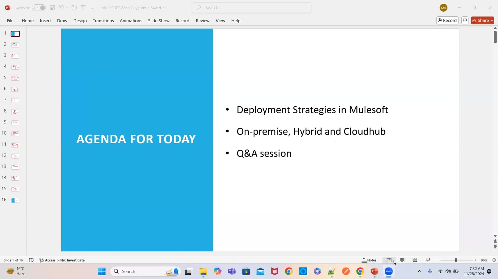

### 02 — Environments dev, SIT (QA or test), UAT, preprod, prod, DR; cloud vs RBI data rules (slide + drawing)
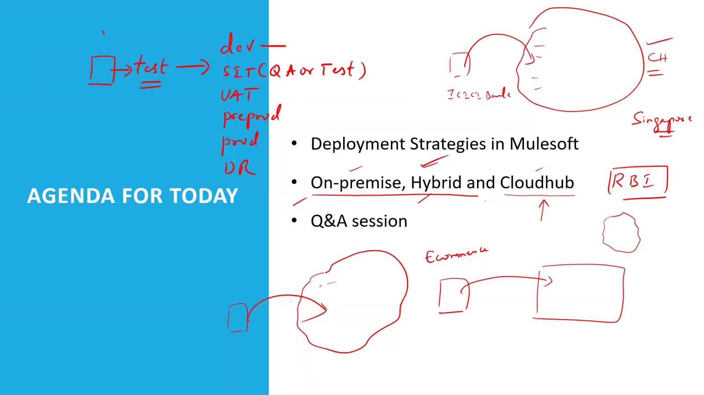

### 03 — Control plane — Runtime Manager, API Manager, Exchange, Management Center → Anypoint Platform, hosted by MuleSoft or own (drawing)
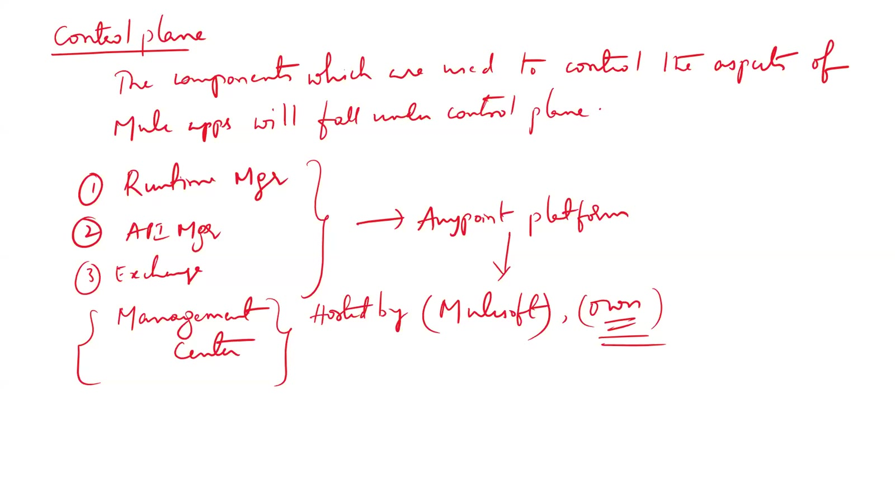

### 04 — Runtime plane — Mule runtime, connectors and components, logging (drawing)
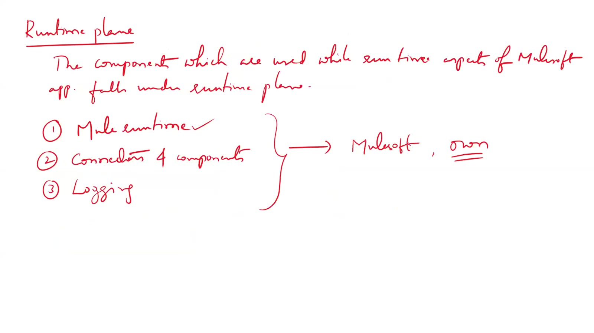

### 05 — Deployment model vs control plane vs runtime plane — CloudHub, on-premises, hybrid, RTF; AWS or Azure workers (drawing)
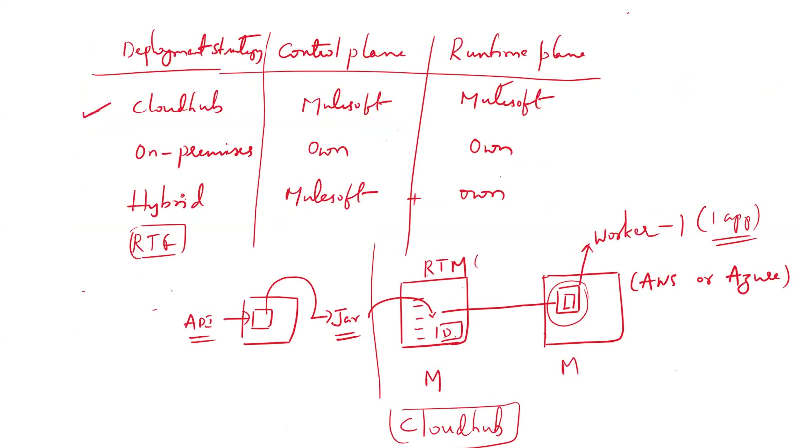

### 06 — Deploy app → load balancer (round-robin), SLB / DLB, workers, high availability and less downtime (drawing)
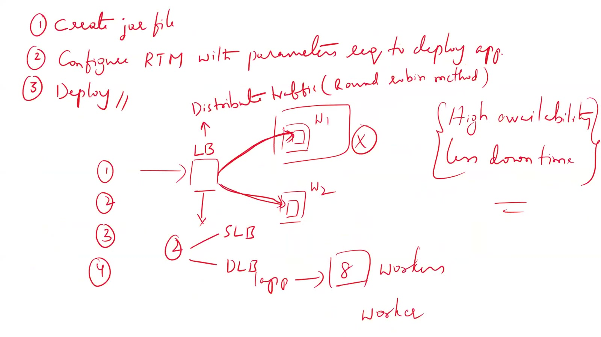

### 07 — Load balancer — SLB (shared) vs DLB (dedicated); 0.1 vCore workers on CloudHub (US east) (drawing)
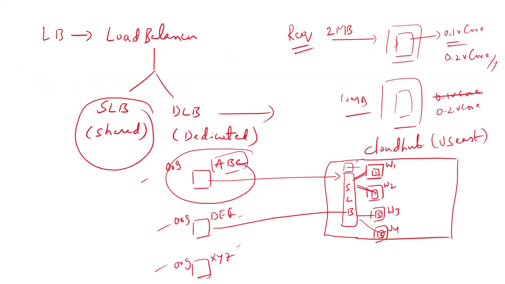

### 08 — SLB ports HTTP 8081 / HTTPS 8082; DLB ports HTTP 8091 / HTTPS 8092 (drawing)
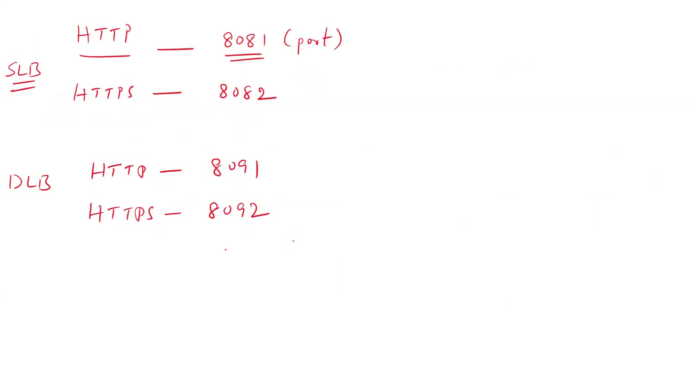

### 09 — Scaling — load balancer across workers W1, W2; high availability; SLB shared, DLB dedicated (drawing)
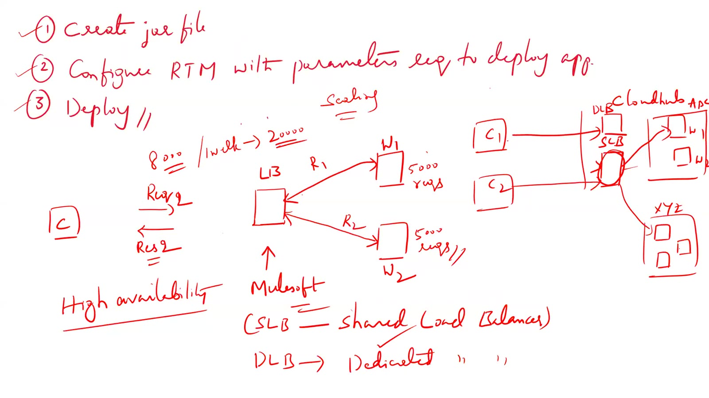

### 10 — ICICI Bank — CloudHub (sensitive data on cloud) vs on-premises (more secure, more maintenance, high cost) (drawing)
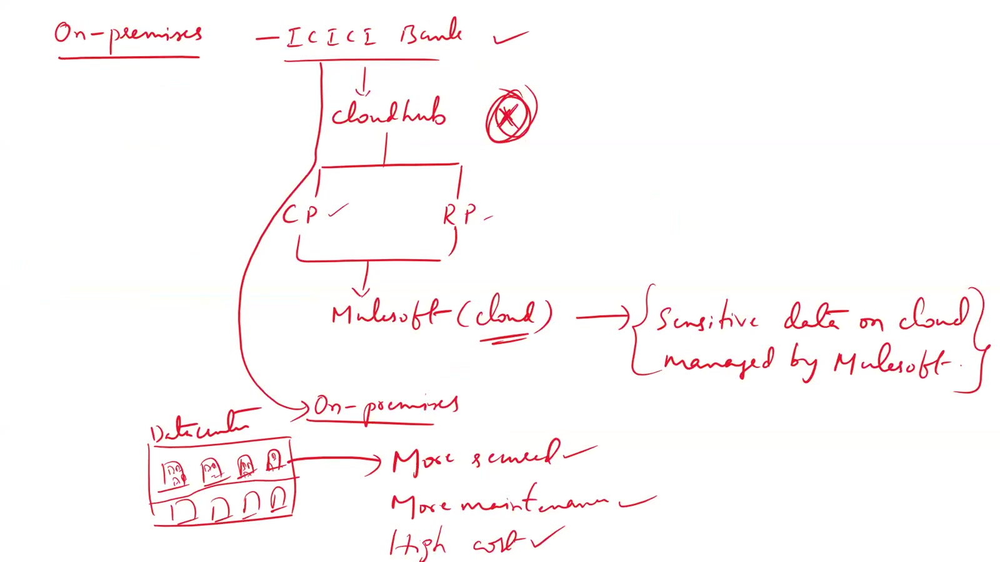

### 11 — Hybrid — control plane (MuleSoft) + runtime plane (ICICI) with logging, connectors, actual business data (drawing)
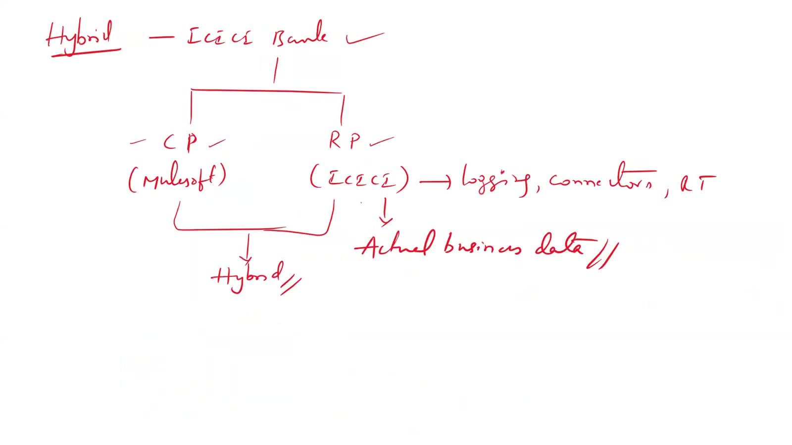

### 12 — CloudHub — cloud solution provided by MuleSoft; AWS/Azure; Anypoint Platform modules as control plane (drawing)
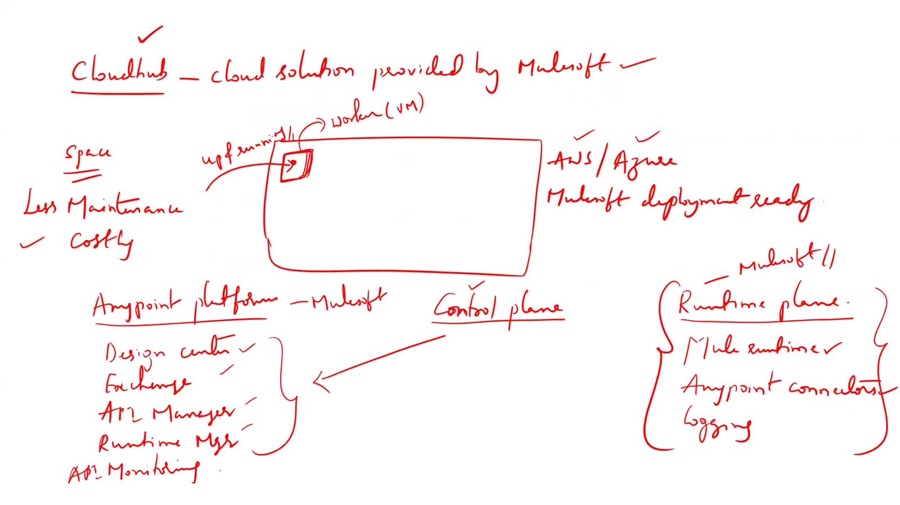

### 13 — Hybrid and vCore sizes — 0.1 vCore (500 MB memory), payload size and requests per day (drawing)
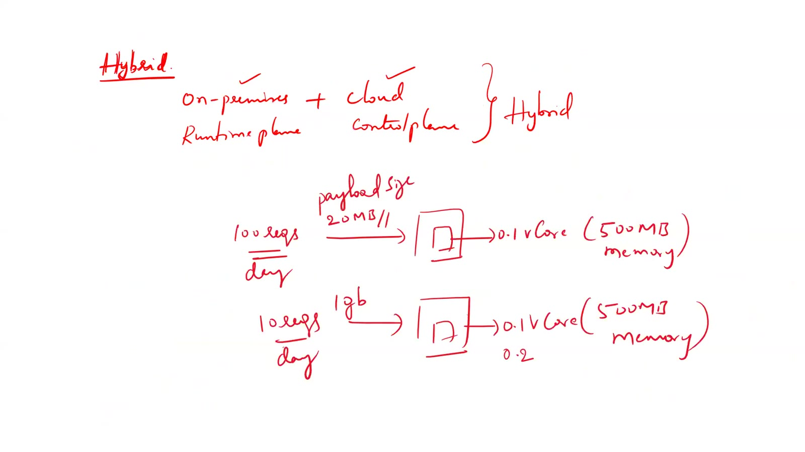

### 14 — ICICI → financial institution → RBI; CloudHub regions US East / UK / Singapore vs AWS Mumbai (drawing)
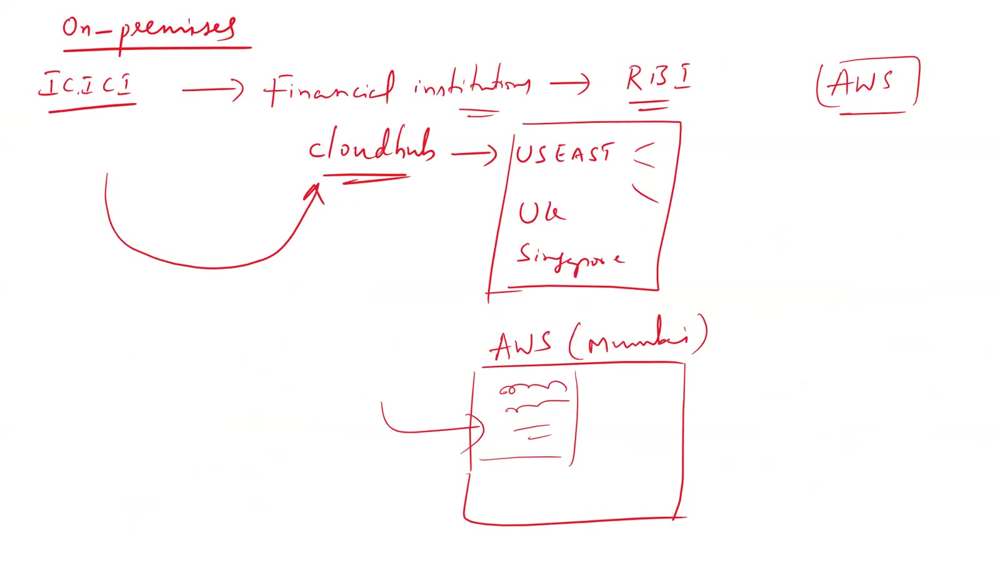

