# Day 18 — Slides and On-Screen Drawings

Frames captured from the Day 18 class recording (MuleSoft Telugu Course Day 18, recorded 2 Dec 2024). Login screens, the profile page and property files showing the API key are not included. Repeated and blank frames have been removed. Times are positions in the video.

Notes for this day: [detailed-notes/day18.md](../../detailed-notes/day18.md) · [super-detailed-notes/day18.md](../../super-detailed-notes/day18.md) · [summary](../../day18.md)

| # | Time | Content |
|---|---|---|
| 01 | 1:28 | Agenda — CloudHub demonstration, horizontal scaling, vertical scaling |
| 02 | 1:35 | What is CloudHub — iPaaS; worker = dedicated Mule instance; vCore sizes 0.1 = 500 MB, 0.2 = 1 GB, 1 = 1.5 GB |
| 03 | 18:01 | Horizontal scaling — more workers; for high-frequency small payloads; high availability |
| 04 | 18:56 | Flipkart sale — load balancer across workers, 100000 → 340000 requests (drawing) |
| 05 | 19:25 | Vertical scaling — bigger vCore; for large payloads with less frequency |
| 06 | 19:28 | Vertical scaling — 200 KB payload, 0.1 → 0.2 vCore (drawing) |
| 07 | 25:57 | Runtime Manager → Deploy Application — name, deployment target, application file (screen) |
| 08 | 27:57 | Deployment settings — runtime version, Java version, worker size options (screen) |
| 09 | 49:10 | Replicas — replica count and 0.1 vCores, deployment model Rolling update (screen) |
| 10 | 56:55 | Properties tab — "Protect value?" for a property (screen) |
| 11 | 60:33 | Runtime Manager — consume-rest-service-7303 deploying (screen) |
| 12 | 61:34 | Runtime Manager → Logs for the deployed app (screen) |
| 13 | 77:51 | Mule Runtime — runtime engine to host and run Mule apps; on-premises or cloud (slide + drawing) |

---

### 01 — Agenda — CloudHub demonstration, horizontal scaling, vertical scaling
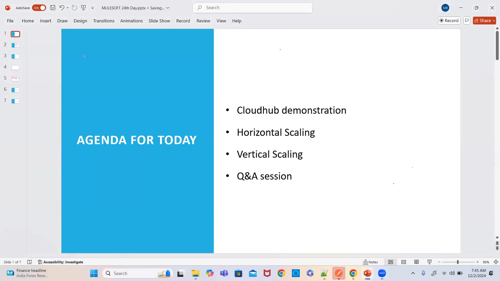

### 02 — What is CloudHub — iPaaS; worker = dedicated Mule instance; vCore sizes 0.1 = 500 MB, 0.2 = 1 GB, 1 = 1.5 GB
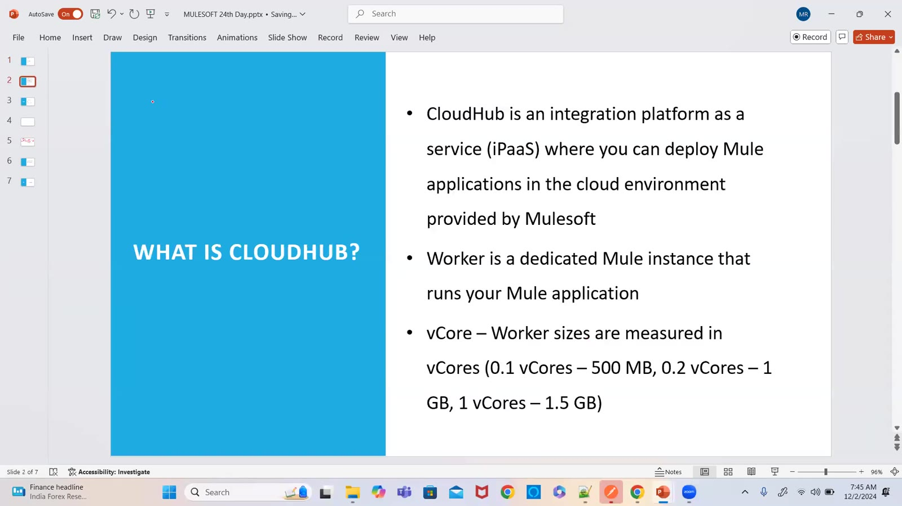

### 03 — Horizontal scaling — more workers; for high-frequency small payloads; high availability
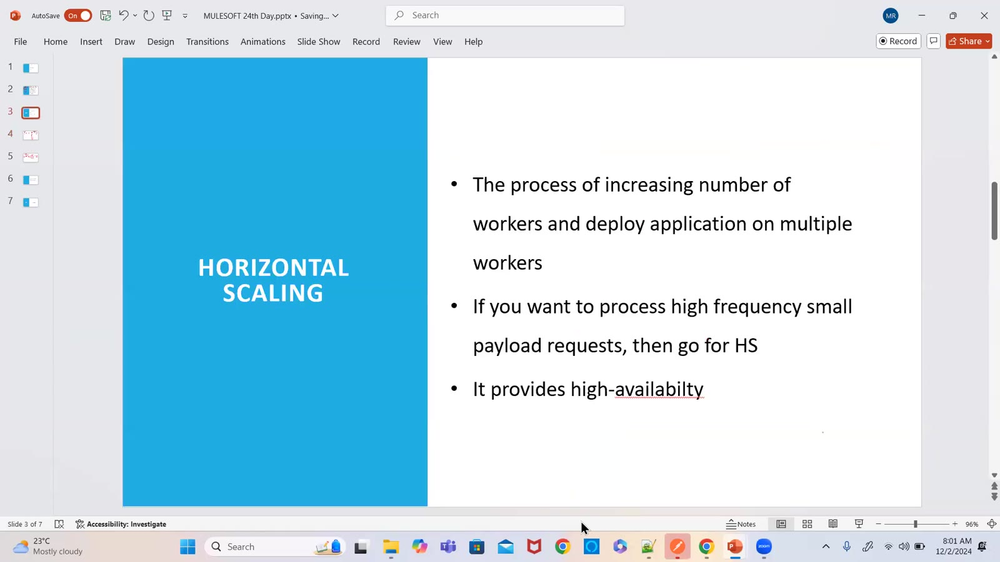

### 04 — Flipkart sale — load balancer across workers, 100000 → 340000 requests (drawing)
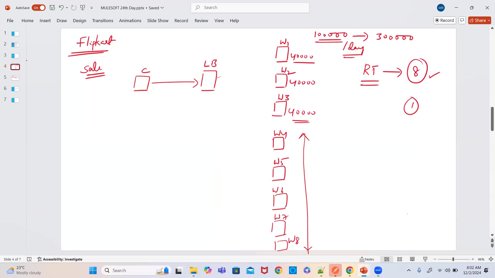

### 05 — Vertical scaling — bigger vCore; for large payloads with less frequency
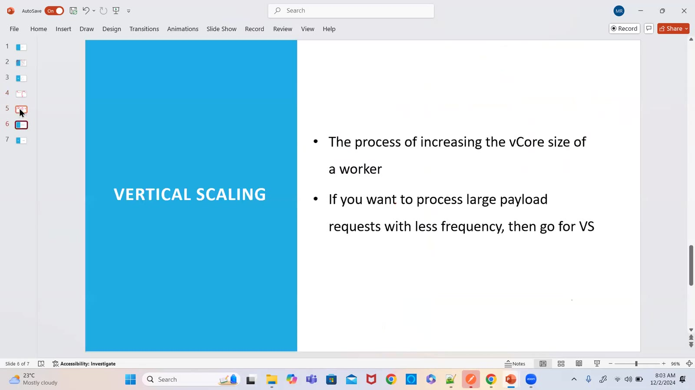

### 06 — Vertical scaling — 200 KB payload, 0.1 → 0.2 vCore (drawing)
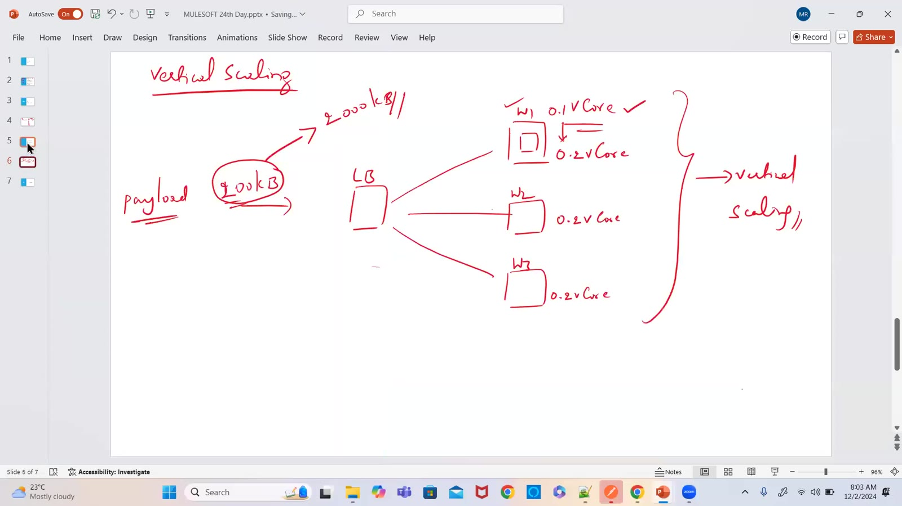

### 07 — Runtime Manager → Deploy Application — name, deployment target, application file (screen)
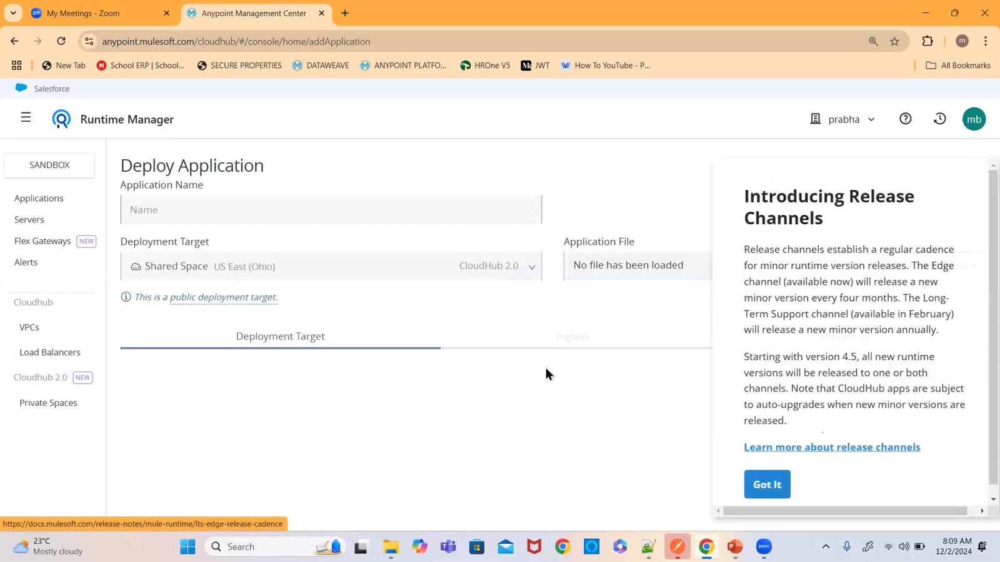

### 08 — Deployment settings — runtime version, Java version, worker size options (screen)
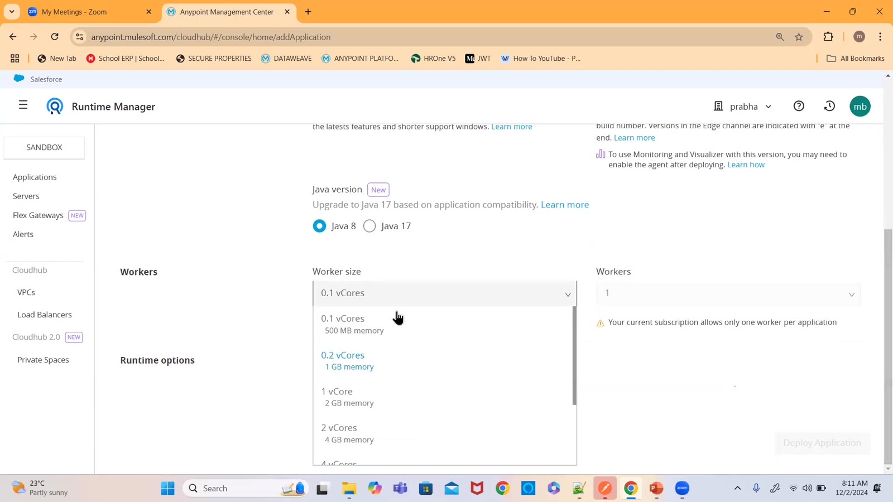

### 09 — Replicas — replica count and 0.1 vCores, deployment model Rolling update (screen)
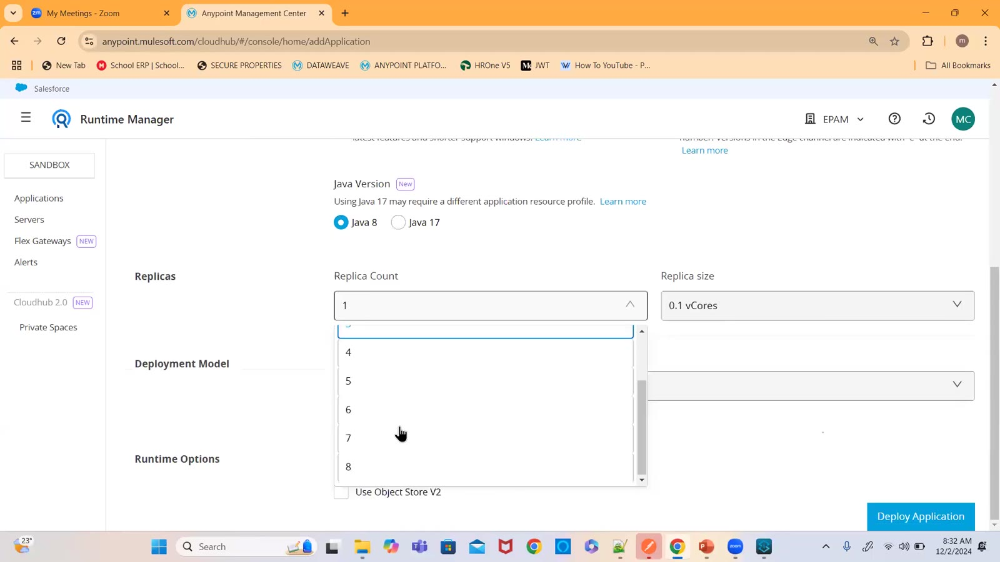

### 10 — Properties tab — "Protect value?" for a property (screen)
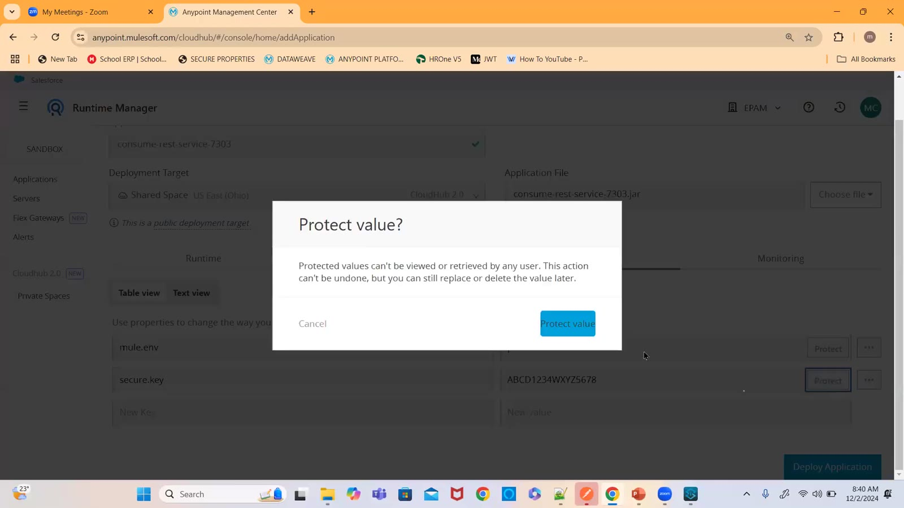

### 11 — Runtime Manager — consume-rest-service-7303 deploying (screen)
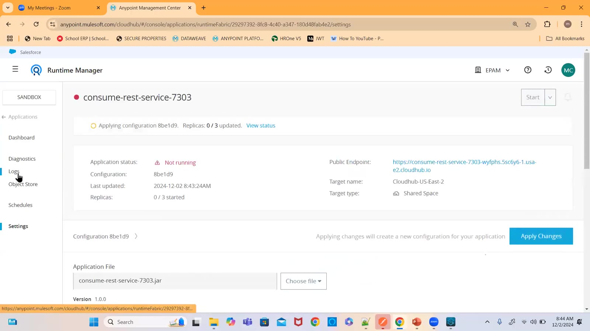

### 12 — Runtime Manager → Logs for the deployed app (screen)
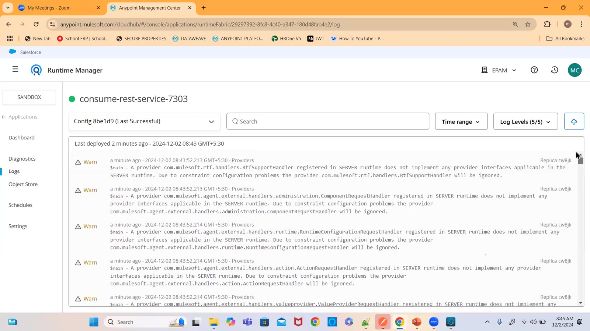

### 13 — Mule Runtime — runtime engine to host and run Mule apps; on-premises or cloud (slide + drawing)
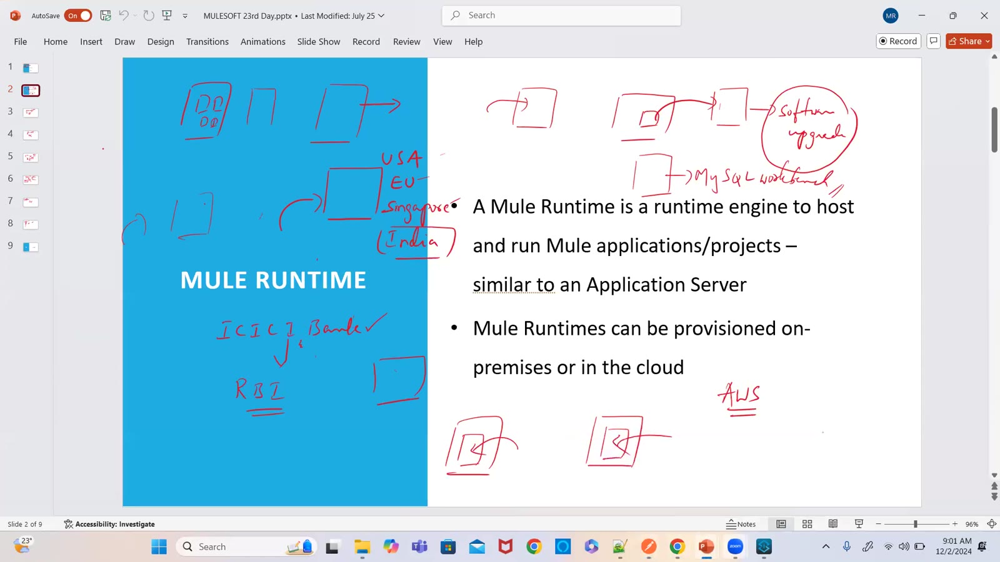

