# Day 19 — Slides and On-Screen Drawings

Frames captured from the Day 19 class recording (MuleSoft Telugu Course Day 19, recorded 4 Dec 2024). Login screens, files listing email addresses, wrapper.conf credential lines and property files showing the API key are not included. Repeated and blank frames have been removed. Times are positions in the video.

Notes for this day: [detailed-notes/day19.md](../../detailed-notes/day19.md) · [super-detailed-notes/day19.md](../../super-detailed-notes/day19.md) · [summary](../../day19.md)

| # | Time | Content |
|---|---|---|
| 01 | 20:36 | Agenda — CloudHub demo, deployment strategies continued, Mule runtime, on-premise (standalone) demo, hybrid demo |
| 02 | 2:26 | HTTP Connector release notes — Mule 4, version 1.10.3 compatibility (screen) |
| 03 | 20:38 | Mule Runtime — runtime engine to host and run Mule apps, like an application server (slide + drawing) |
| 04 | 20:51 | Hybrid — Anypoint Platform → Mumbai data center runtime (drawing) |
| 05 | 26:56 | Docs — Mule EE or CE runtime: install JDK, download, unzip, start from the bin folder (screen) |
| 06 | 27:50 | Mule Kernel 4.5.0 download and previous versions (screen) |
| 07 | 34:59 | Command prompt — java -version and mvn -version (screen) |
| 08 | 60:15 | Mule runtime with domain project — shared configs across apps (drawing) |
| 09 | 68:20 | Standalone runtime starting from the command line (screen) |
| 10 | 73:12 | Standalone deploy FAILED — "Couldn't find configuration property value for key ${mule.env}" (screen) |
| 11 | 78:26 | Docs — Start and Stop Mule, start Mule as a Windows service (screen) |
| 12 | 79:59 | Standalone runtime — app DEPLOYED after setting mule.env (screen) |
| 13 | 86:18 | log4j2.xml — RollingFile appender for the app log (screen) |

---

### 01 — Agenda — CloudHub demo, deployment strategies continued, Mule runtime, on-premise (standalone) demo, hybrid demo
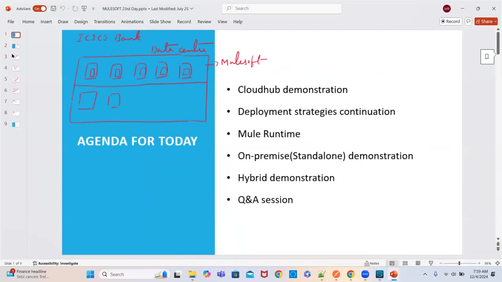

### 02 — HTTP Connector release notes — Mule 4, version 1.10.3 compatibility (screen)
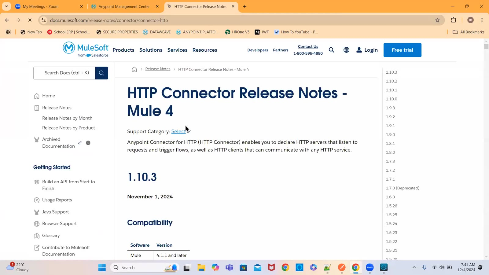

### 03 — Mule Runtime — runtime engine to host and run Mule apps, like an application server (slide + drawing)
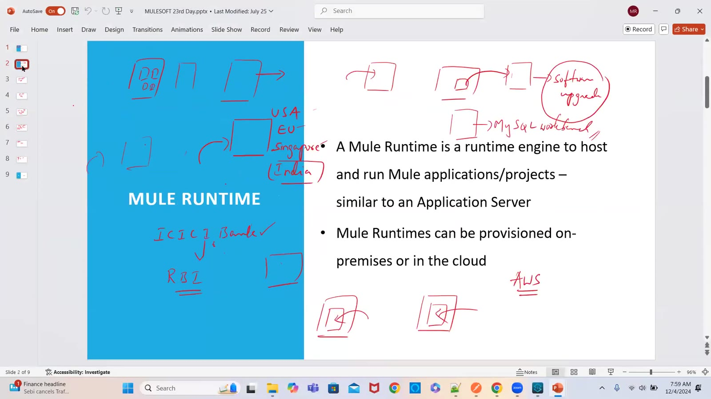

### 04 — Hybrid — Anypoint Platform → Mumbai data center runtime (drawing)
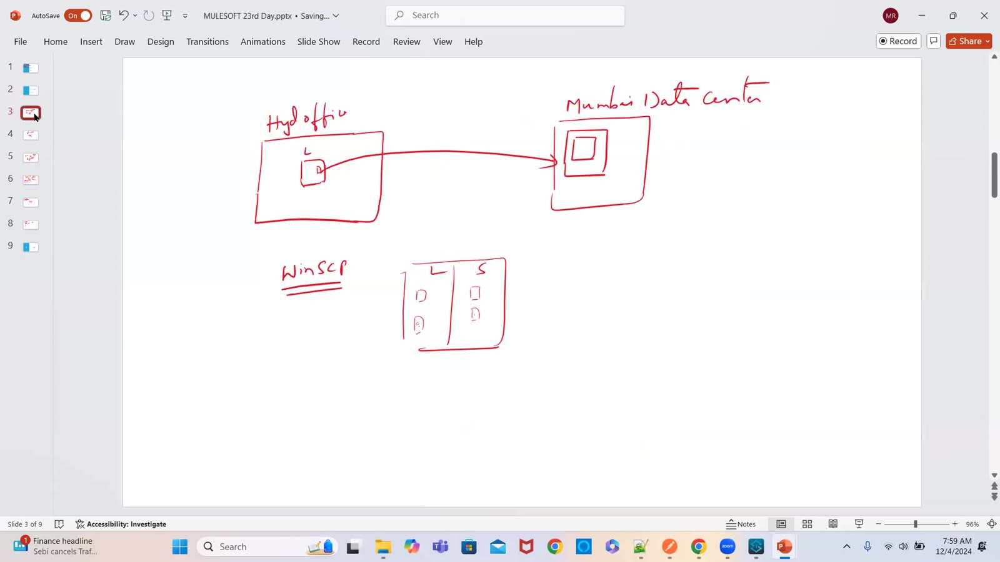

### 05 — Docs — Mule EE or CE runtime: install JDK, download, unzip, start from the bin folder (screen)
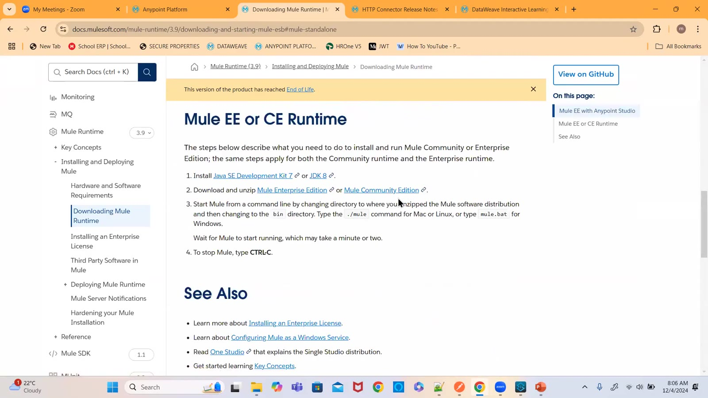

### 06 — Mule Kernel 4.5.0 download and previous versions (screen)
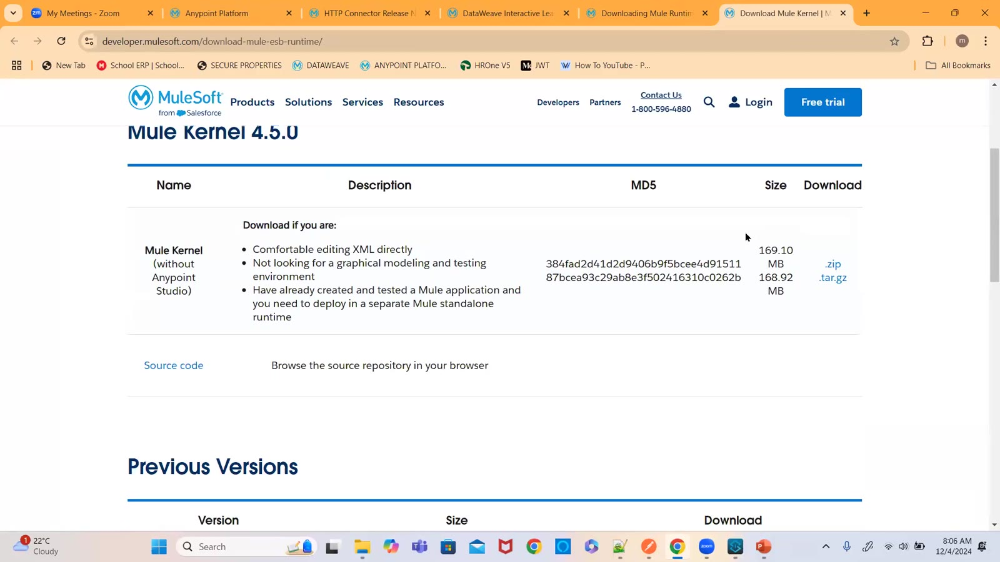

### 07 — Command prompt — java -version and mvn -version (screen)
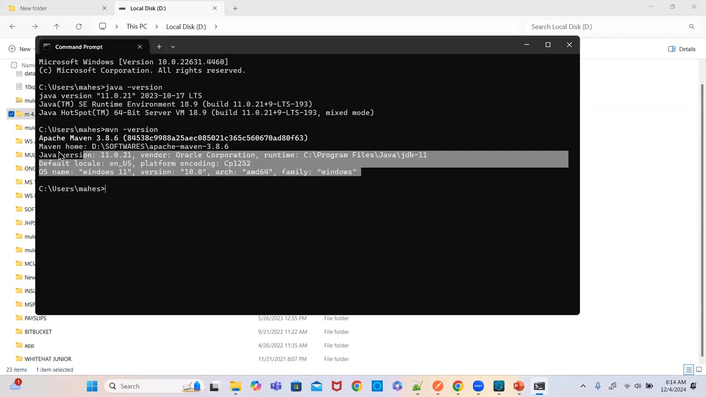

### 08 — Mule runtime with domain project — shared configs across apps (drawing)
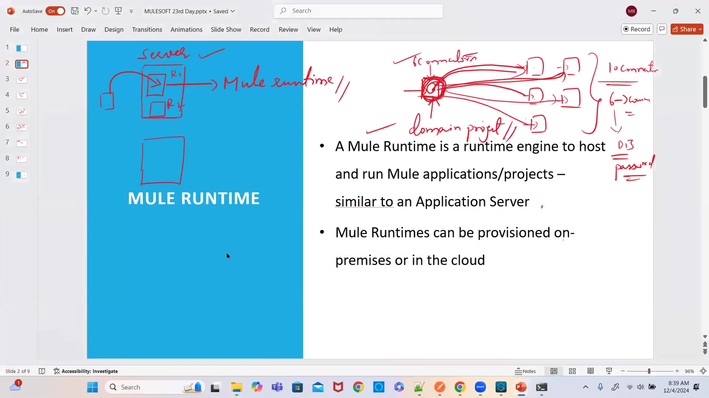

### 09 — Standalone runtime starting from the command line (screen)
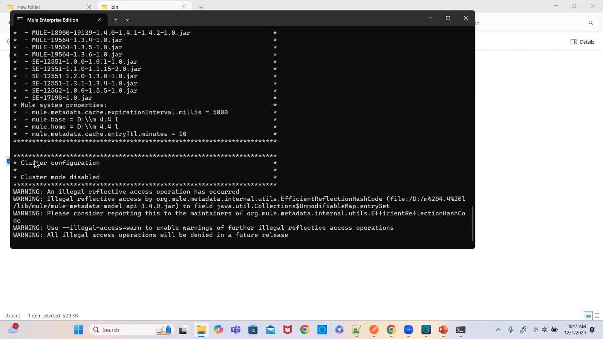

### 10 — Standalone deploy FAILED — "Couldn't find configuration property value for key ${mule.env}" (screen)
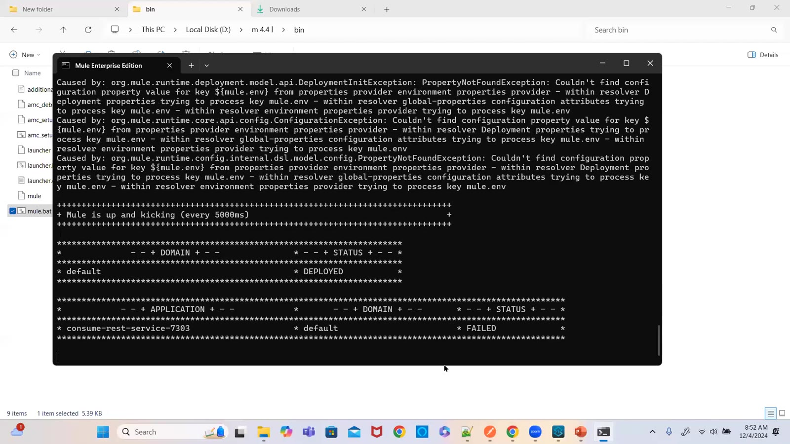

### 11 — Docs — Start and Stop Mule, start Mule as a Windows service (screen)
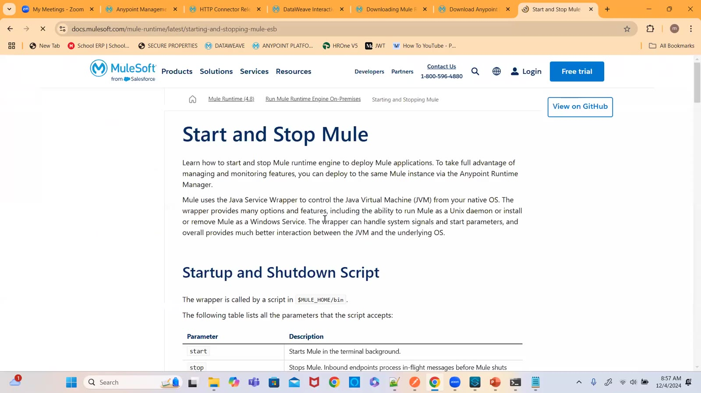

### 12 — Standalone runtime — app DEPLOYED after setting mule.env (screen)
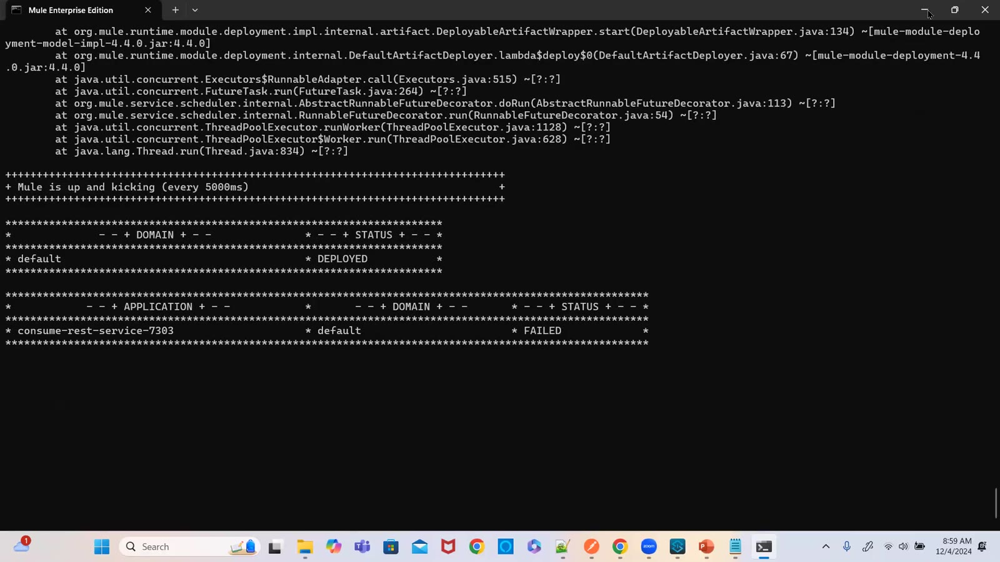

### 13 — log4j2.xml — RollingFile appender for the app log (screen)
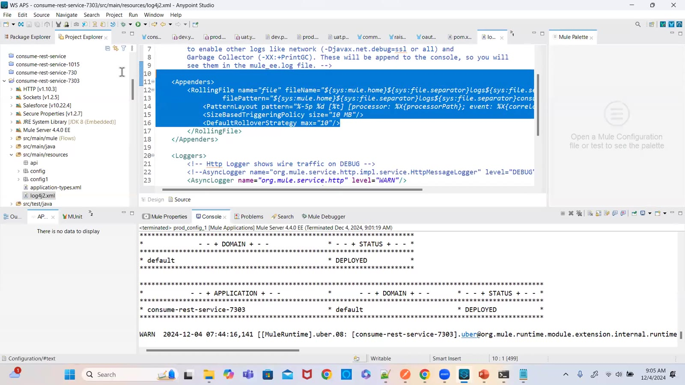

