# Day 20 — Slides and On-Screen Drawings

Frames captured from the Day 20 class recording (MuleSoft Telugu Course Day 20, recorded 5 Dec 2024). Add Server dialogs and command lines containing the server registration token, login screens, email inboxes and download forms with personal details are not included. Repeated and blank frames have been removed. Times are positions in the video.

Notes for this day: [detailed-notes/day20.md](../../detailed-notes/day20.md) · [super-detailed-notes/day20.md](../../super-detailed-notes/day20.md) · [summary](../../day20.md)

| # | Time | Content |
|---|---|---|
| 01 | 5:42 | Hybrid — runtime on-premises + control plane in cloud; register the server in RTM, install runtime agent, deploy the app (drawing) |
| 02 | 5:52 | CloudHub 1.0 / 2.0 workers behind a load balancer (drawing) |
| 03 | 10:02 | amc_setup — "The certificate provided by the Anypoint Management Center is not valid" (screen) |
| 04 | 11:35 | Runtime Manager → Servers — server mule4 created, "Applications running on mule4" (screen) |
| 05 | 14:05 | Delete server dialog (screen) |
| 06 | 16:10 | Mule agent install error — "Unable to delete file … being used by another process" (screen) |
| 07 | 25:47 | Two errors hit — CloudHub 2.0 app error while testing; hybrid server not getting registered (certificate) (drawing) |
| 08 | 28:13 | Mule standalone download — "Please check your email inbox" (screen) |
| 09 | 31:52 | MuleSoft Meetup Groups — Hyderabad (screen) |
| 10 | 32:27 | Meetup group upcoming events (screen) |
| 11 | 35:15 | MuleSoft help article — BindException: Address already in use (screen) |
| 12 | 42:06 | Help article — cause and solution: another app using the same port (screen) |
| 13 | 50:04 | Docs — Mule runtime Java support (Java 8, 11, 17 by version) (screen) |

---

### 01 — Hybrid — runtime on-premises + control plane in cloud; register the server in RTM, install runtime agent, deploy the app (drawing)
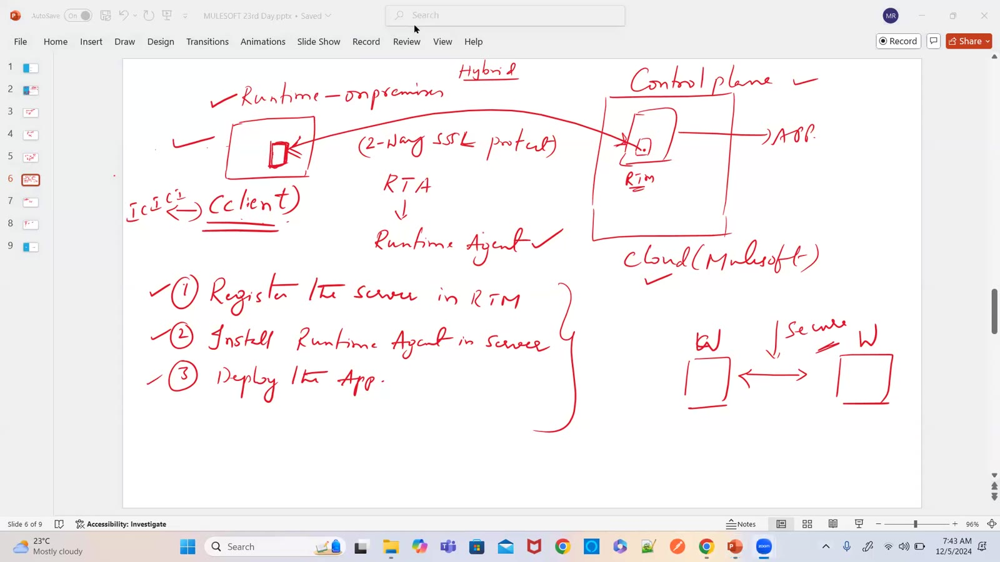

### 02 — CloudHub 1.0 / 2.0 workers behind a load balancer (drawing)
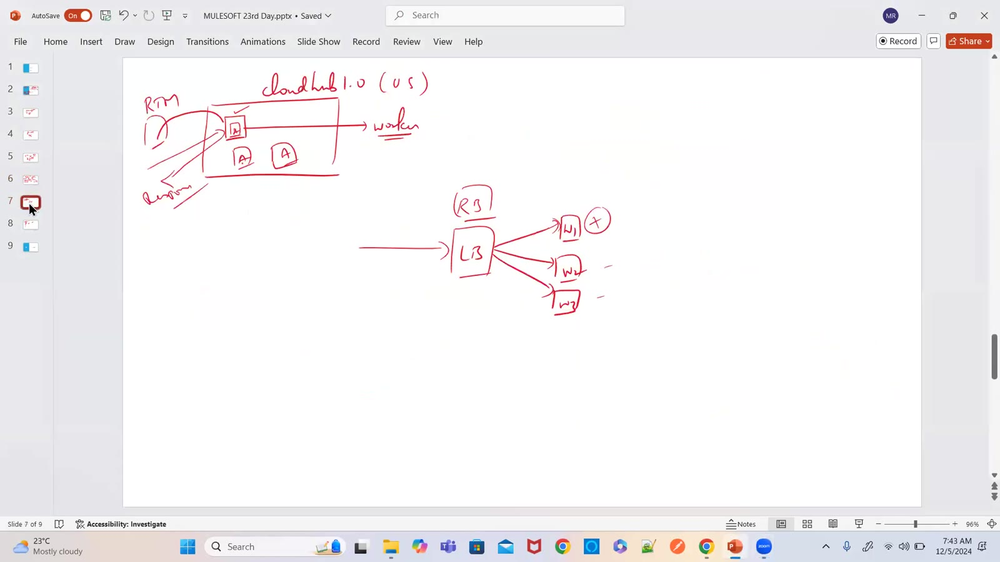

### 03 — amc_setup — "The certificate provided by the Anypoint Management Center is not valid" (screen)
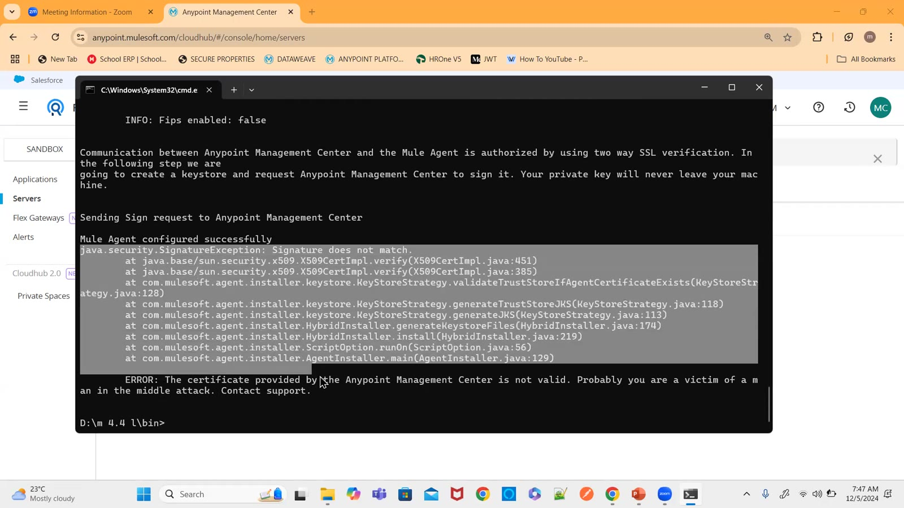

### 04 — Runtime Manager → Servers — server mule4 created, "Applications running on mule4" (screen)
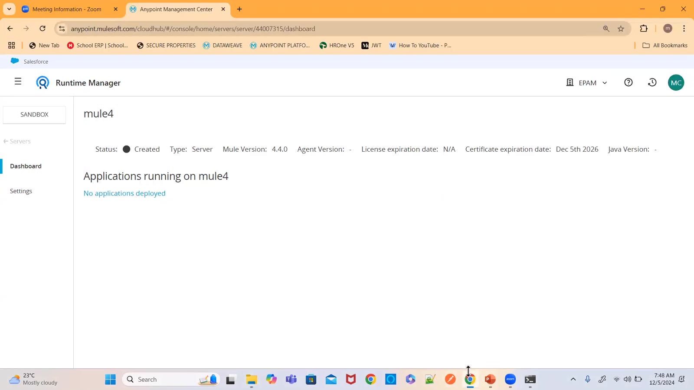

### 05 — Delete server dialog (screen)
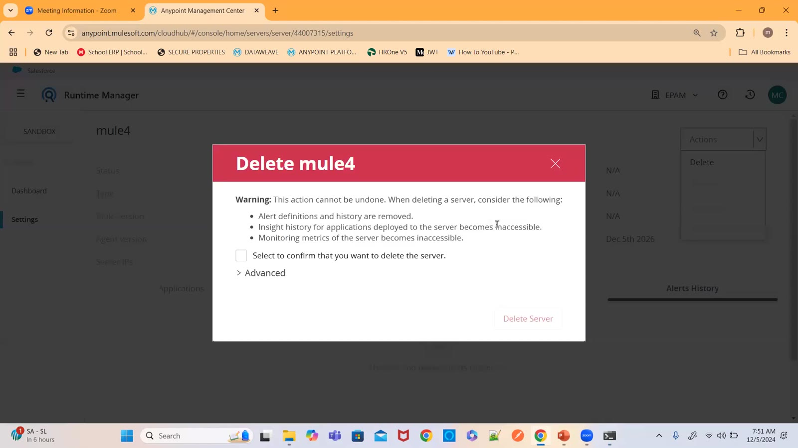

### 06 — Mule agent install error — "Unable to delete file … being used by another process" (screen)
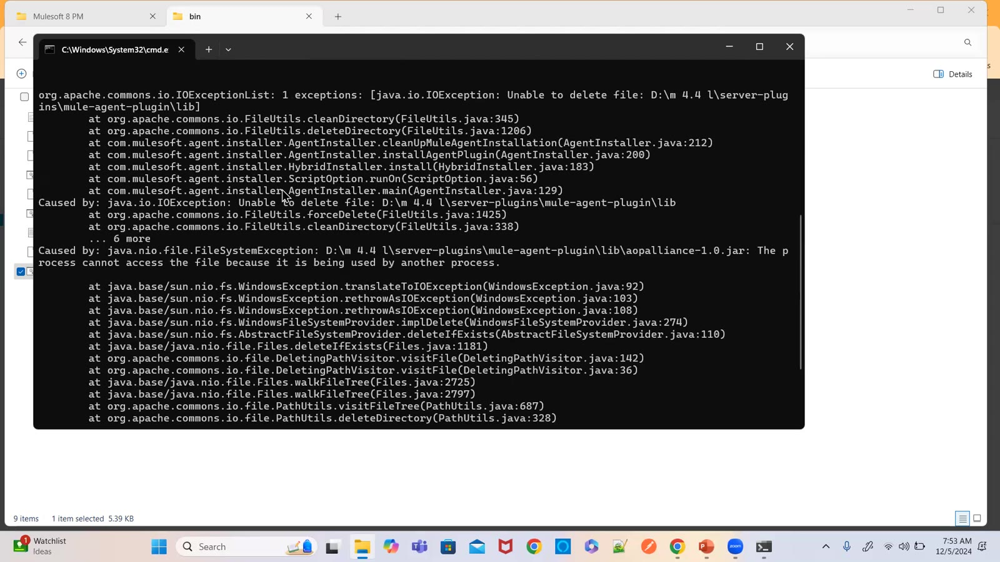

### 07 — Two errors hit — CloudHub 2.0 app error while testing; hybrid server not getting registered (certificate) (drawing)
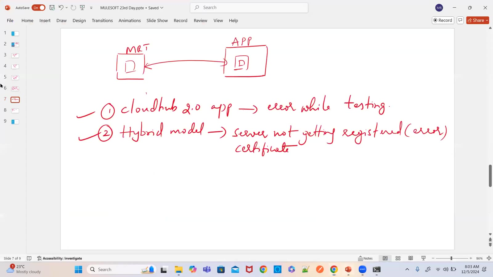

### 08 — Mule standalone download — "Please check your email inbox" (screen)
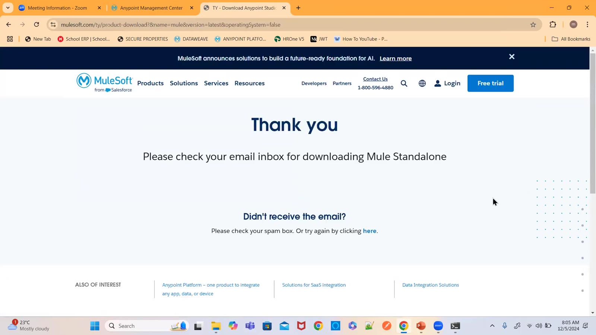

### 09 — MuleSoft Meetup Groups — Hyderabad (screen)
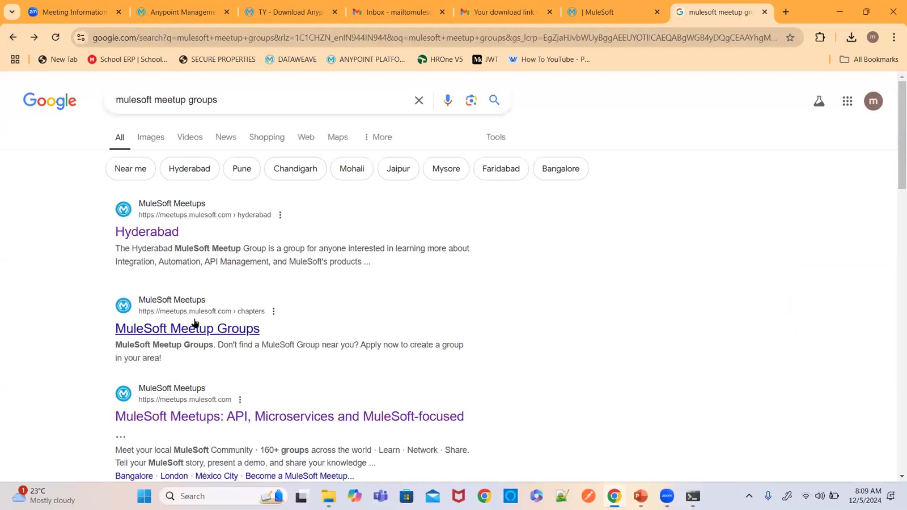

### 10 — Meetup group upcoming events (screen)
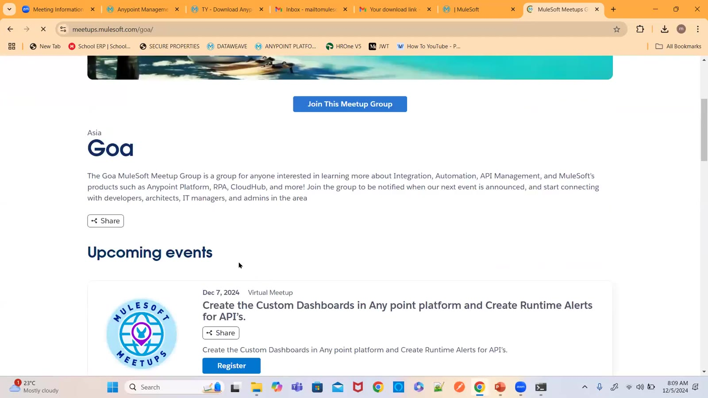

### 11 — MuleSoft help article — BindException: Address already in use (screen)
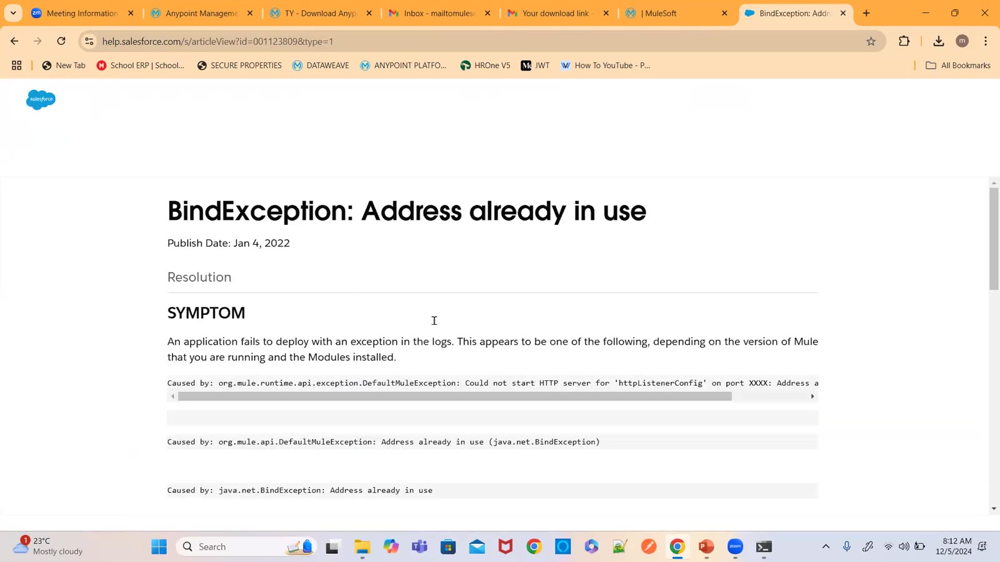

### 12 — Help article — cause and solution: another app using the same port (screen)
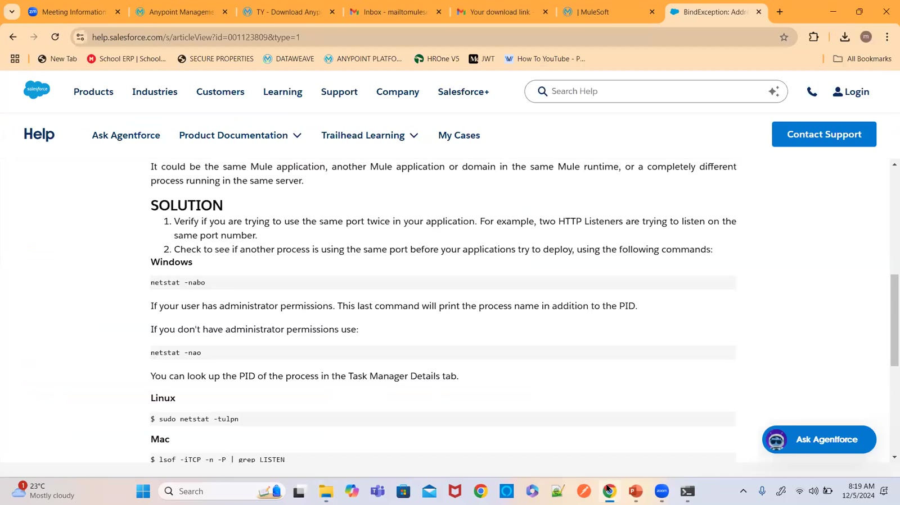

### 13 — Docs — Mule runtime Java support (Java 8, 11, 17 by version) (screen)
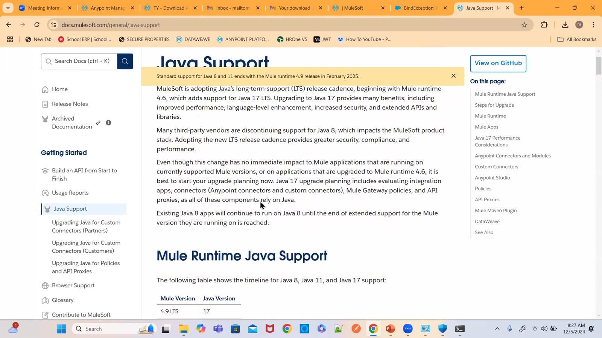

