# Day 21 — Slides and On-Screen Drawings

Frames captured from the Day 21 class recording (MuleSoft Telugu Course Day 21). Screens listing student email addresses are not included. Repeated and blank frames have been removed. Times are positions in the video.

Notes for this day: [detailed-notes/day21.md](../../detailed-notes/day21.md) · [super-detailed-notes/day21.md](../../super-detailed-notes/day21.md) · [summary](../../day21.md)

| # | Time | Content |
|---|---|---|
| 01 | 0:01 | Agenda — API lifecycle in Mule, introduction to RAML, employees use case for API specification, RAML implementation |
| 02 | 14:57 | API lifecycle in Mule — Design Center, Exchange, APIs, RTM, API Manager, AM, Postman; API Manager → policies (drawing) |
| 03 | 17:24 | What is RAML — RESTful API Modeling Language, YAML-based; Design Center supports RAML and OAS (Swagger) |
| 04 | 26:01 | What is RAML with notes — API spec → RAML 1.0 / OAS (drawing) |
| 05 | 26:09 | Traits — reusable components in RAML; imported to resources with "is" |
| 06 | 26:13 | Data Type — custom data types; "types" to import, "type" to call |
| 07 | 26:17 | Library — collection of data types, security schemes and resource types; "uses:" |
| 08 | 36:43 | Security Schemes — Basic Auth, Client ID Enforcement, OAuth 2.0; "securedBy" |
| 09 | 58:01 | Employees use case — create (POST), update (PATCH), fetch by id (GET); /employees resource; HRMS → API → DB (drawing) |
| 10 | 61:54 | API-led architecture — source HR app, target HR database, contract employee details; hr-employees-sys-app naming (drawing) |
| 11 | 61:10 | Exp → Proc → Sys layers, HTTPS / OAuth 2.0, 0.1 vCore per API (drawing) |
| 12 | 61:51 | API specification — /employees: POST create, PATCH update, GET fetch; JSON schema and examples (drawing) |
| 13 | 36:32 | Optional field example — language: "english" or null (drawing) |

---

### 01 — Agenda — API lifecycle in Mule, introduction to RAML, employees use case for API specification, RAML implementation
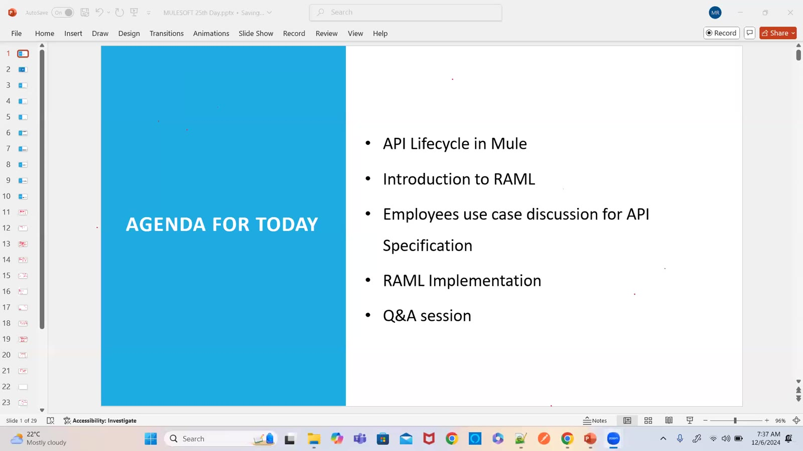

### 02 — API lifecycle in Mule — Design Center, Exchange, APIs, RTM, API Manager, AM, Postman; API Manager → policies (drawing)
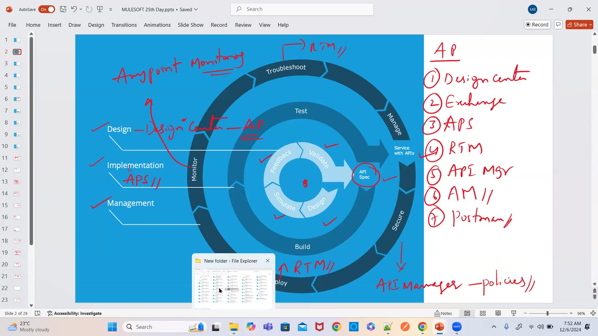

### 03 — What is RAML — RESTful API Modeling Language, YAML-based; Design Center supports RAML and OAS (Swagger)
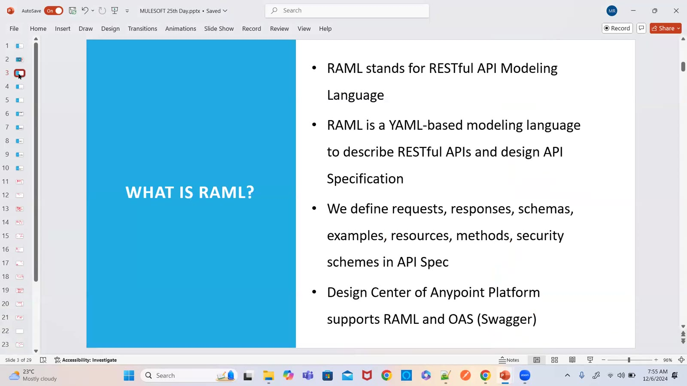

### 04 — What is RAML with notes — API spec → RAML 1.0 / OAS (drawing)
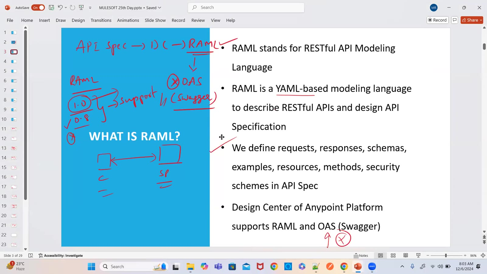

### 05 — Traits — reusable components in RAML; imported to resources with "is"
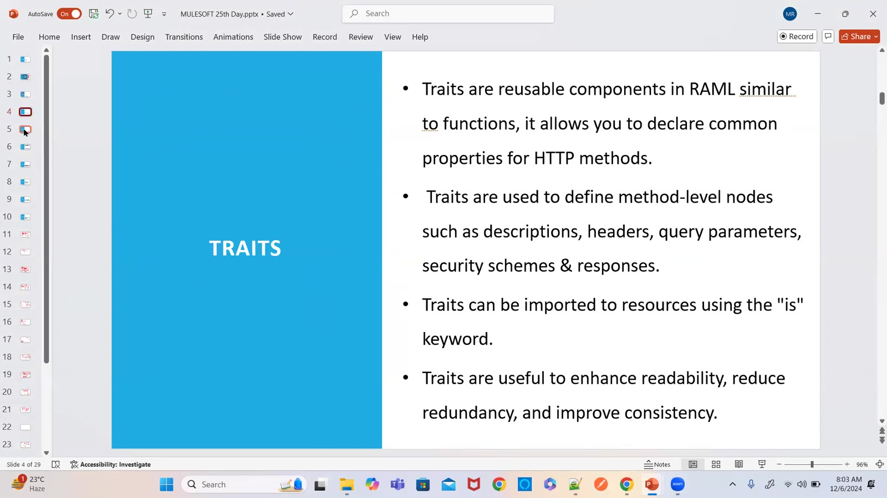

### 06 — Data Type — custom data types; "types" to import, "type" to call
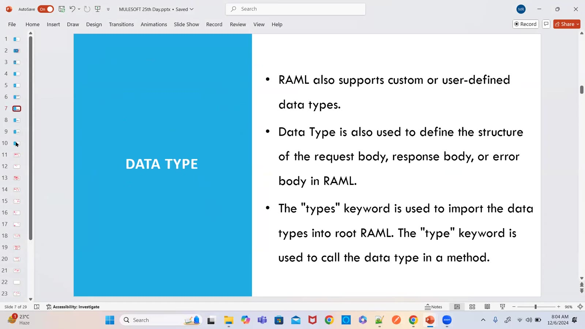

### 07 — Library — collection of data types, security schemes and resource types; "uses:"
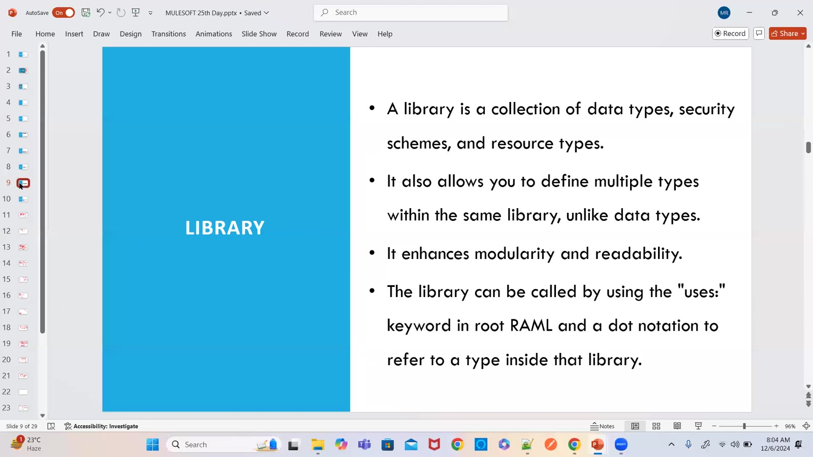

### 08 — Security Schemes — Basic Auth, Client ID Enforcement, OAuth 2.0; "securedBy"
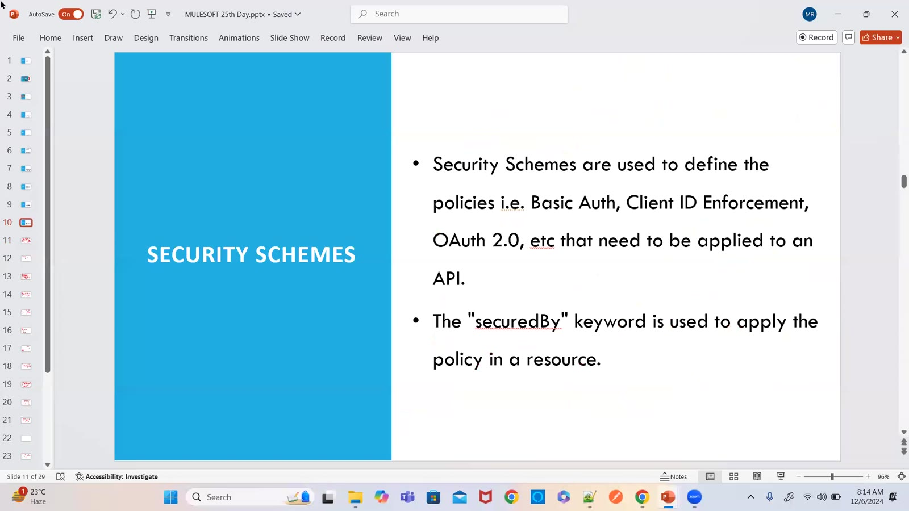

### 09 — Employees use case — create (POST), update (PATCH), fetch by id (GET); /employees resource; HRMS → API → DB (drawing)
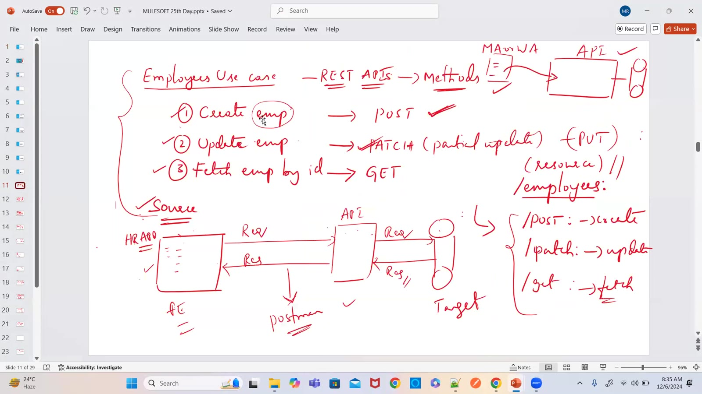

### 10 — API-led architecture — source HR app, target HR database, contract employee details; hr-employees-sys-app naming (drawing)
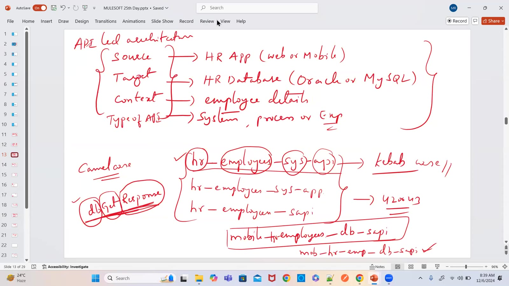

### 11 — Exp → Proc → Sys layers, HTTPS / OAuth 2.0, 0.1 vCore per API (drawing)
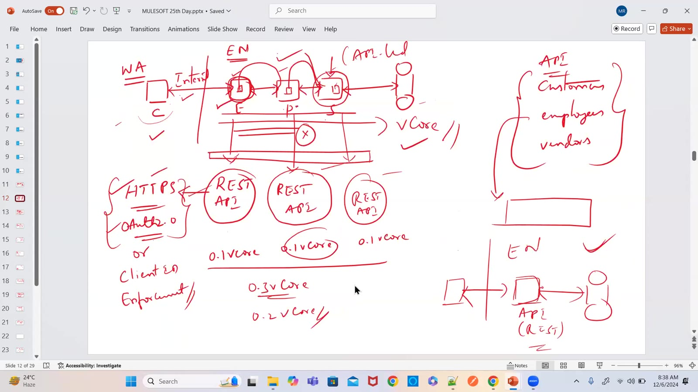

### 12 — API specification — /employees: POST create, PATCH update, GET fetch; JSON schema and examples (drawing)
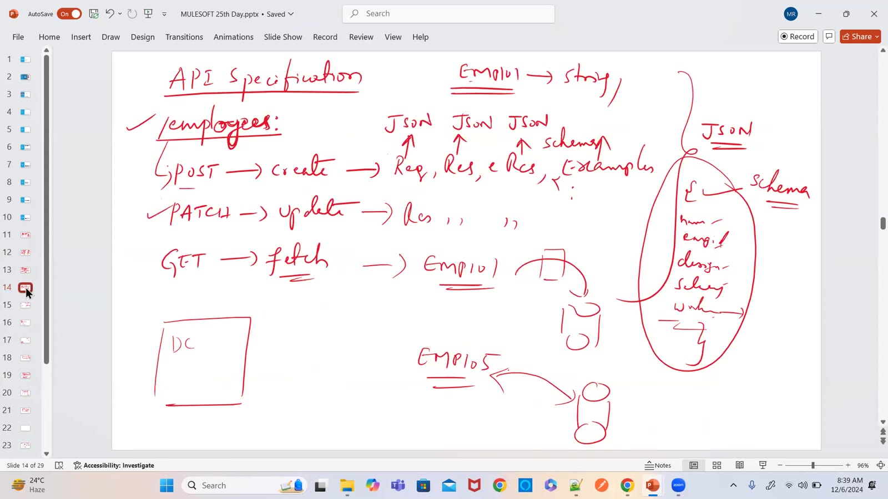

### 13 — Optional field example — language: "english" or null (drawing)
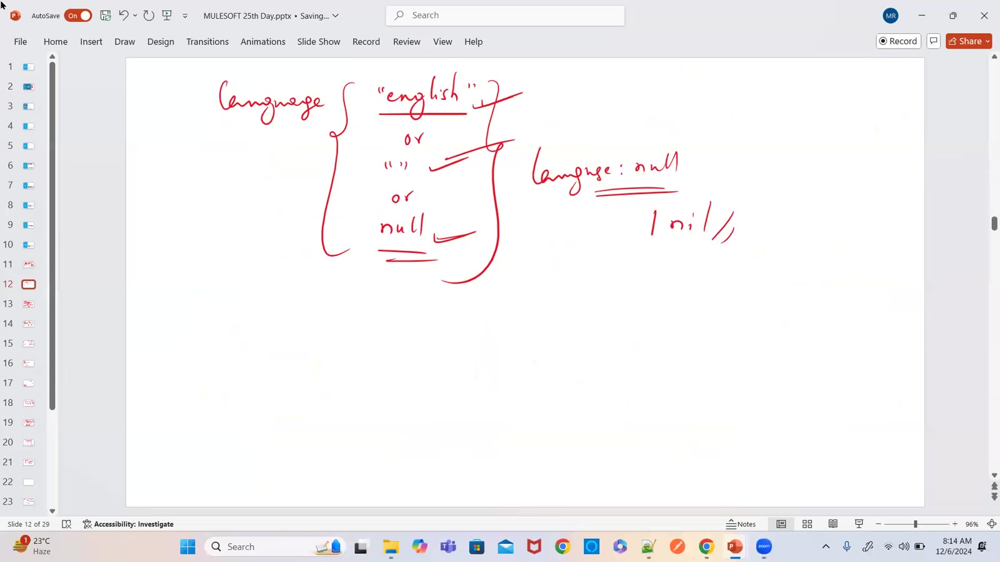

