# Day 22 — Slides and On-Screen Drawings

Frames captured from the Day 22 class recording (MuleSoft Telugu Course Day 22). JSON validator pages and video-call screens are not included. Repeated and blank frames have been removed. Times are positions in the video.

Notes for this day: [detailed-notes/day22.md](../../detailed-notes/day22.md) · [super-detailed-notes/day22.md](../../super-detailed-notes/day22.md) · [summary](../../day22.md)

| # | Time | Content |
|---|---|---|
| 01 | 8:29 | API specification — /employees: POST create, PATCH update, GET fetch; request/response JSON, schema and examples (drawing) |
| 02 | 14:11 | Create employee request {empId "P10300", empName, empSalary 80000, active, empDesignation}; responses 201 and 400 |
| 03 | 37:57 | Create emp — JSON data types, date as string "25-01-2025", hobbies array; HRMS → API (drawing) |
| 04 | 47:00 | POST — QP ✗, URI P ✗, body ✓ (schema/example), headers ✓ (source, correlation id, transaction id), method, HTTPS, JSON (drawing) |
| 05 | 61:37 | Update emp — PATCH partial update, response 200 "employee details updated successfully" (drawing) |
| 06 | 81:18 | GET — no body, headers ✓, QP, URI params; response JSON; mapping sheet empId → employee_id (drawing) |
| 07 | 84:44 | API-led company architecture — HR app (web/mobile) → exp/proc/sys APIs → DB, Salesforce (drawing) |
| 08 | 73:03 | Functional Specification Document — Transaction Management (screen) |
| 09 | 73:23 | Design document — System API: version, resource /members/transactions, POST; headers with mandatory/type/examples (screen) |
| 10 | 78:52 | Design document — request body example and System API to SFDC object mapping (screen) |
| 11 | 87:11 | Transaction and Loyalty Management — Banking flowchart (screen) |
| 12 | 87:52 | API landscape for Transaction and Loyalty Management — experience, process and system layers (screen) |
| 13 | 88:06 | Transaction Management sequence diagram — Experience → Process → System API (screen) |
| 14 | 88:45 | Design document — 404 error response example with errorType RESOURCE_NOT_FOUND (screen) |

---

### 01 — API specification — /employees: POST create, PATCH update, GET fetch; request/response JSON, schema and examples (drawing)
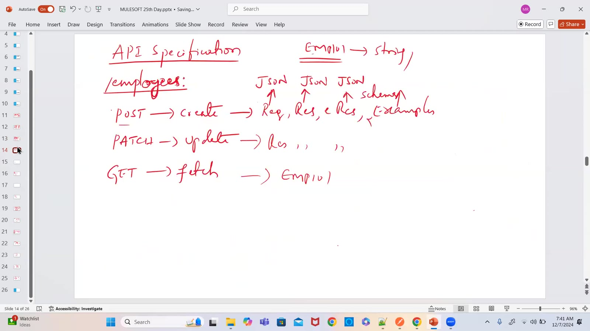

### 02 — Create employee request {empId "P10300", empName, empSalary 80000, active, empDesignation}; responses 201 and 400
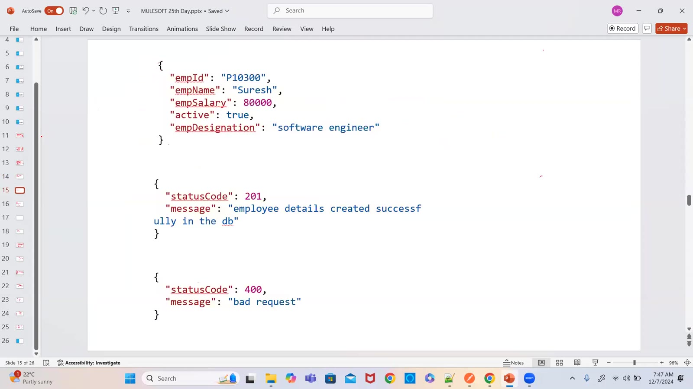

### 03 — Create emp — JSON data types, date as string "25-01-2025", hobbies array; HRMS → API (drawing)
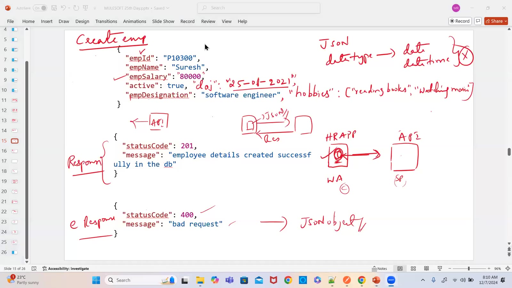

### 04 — POST — QP ✗, URI P ✗, body ✓ (schema/example), headers ✓ (source, correlation id, transaction id), method, HTTPS, JSON (drawing)
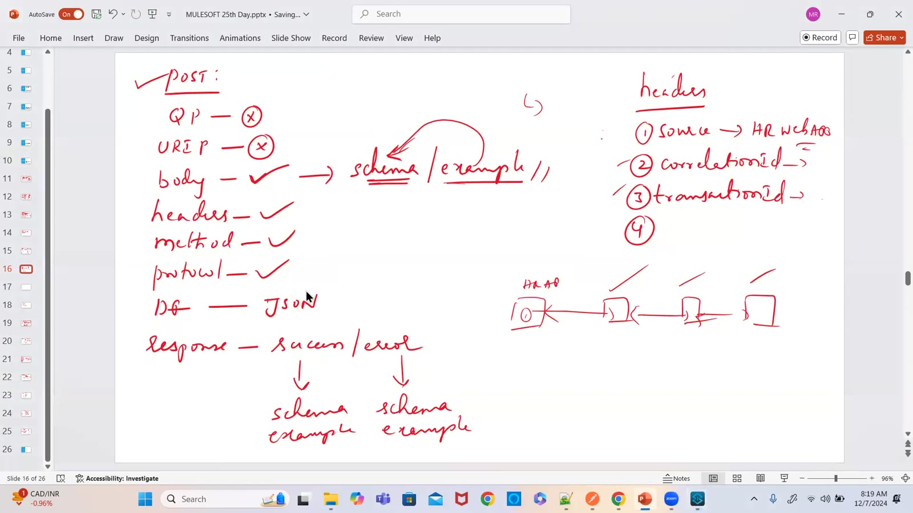

### 05 — Update emp — PATCH partial update, response 200 "employee details updated successfully" (drawing)
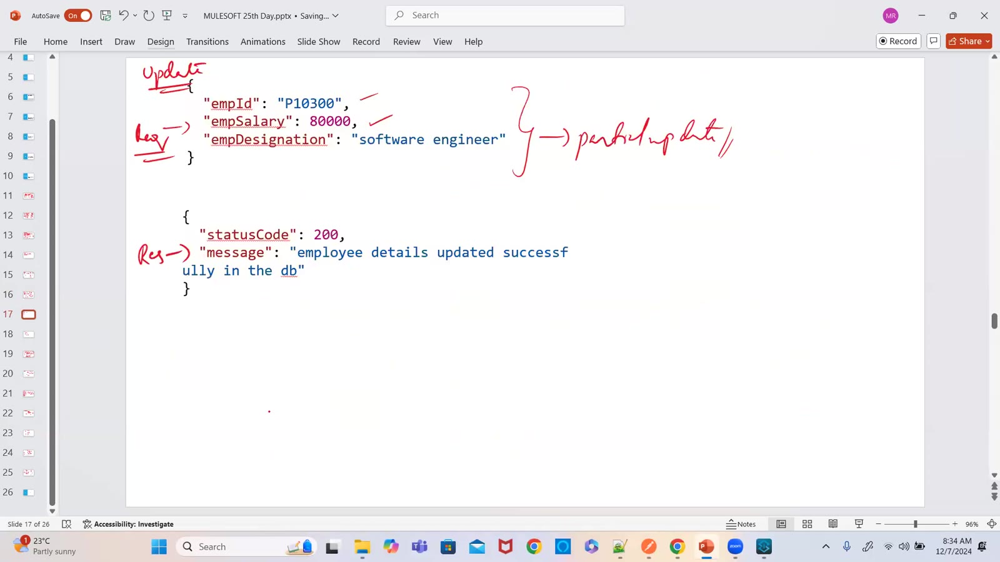

### 06 — GET — no body, headers ✓, QP, URI params; response JSON; mapping sheet empId → employee_id (drawing)
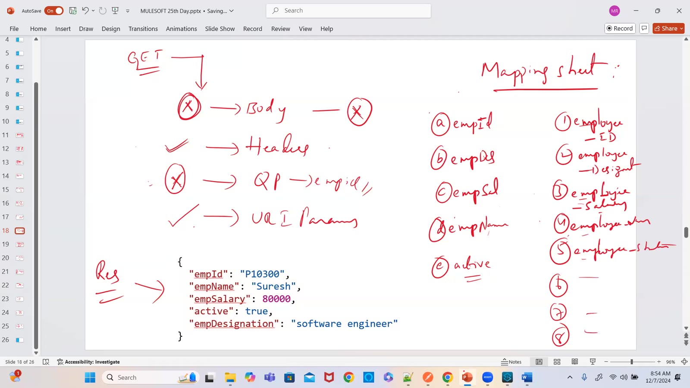

### 07 — API-led company architecture — HR app (web/mobile) → exp/proc/sys APIs → DB, Salesforce (drawing)
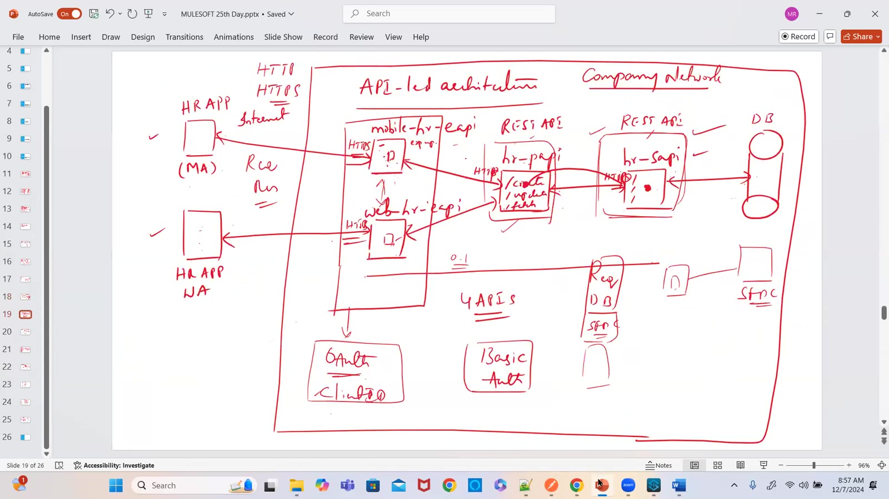

### 08 — Functional Specification Document — Transaction Management (screen)
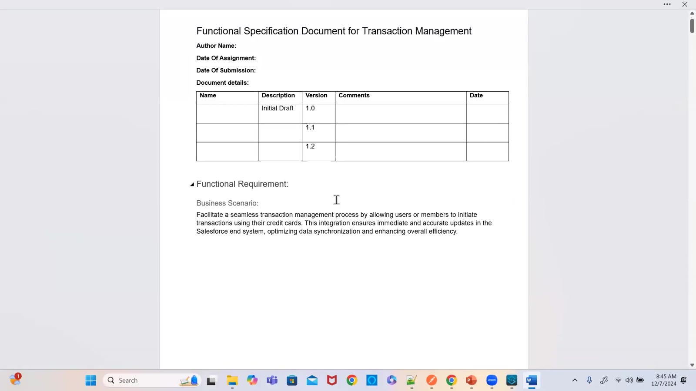

### 09 — Design document — System API: version, resource /members/transactions, POST; headers with mandatory/type/examples (screen)
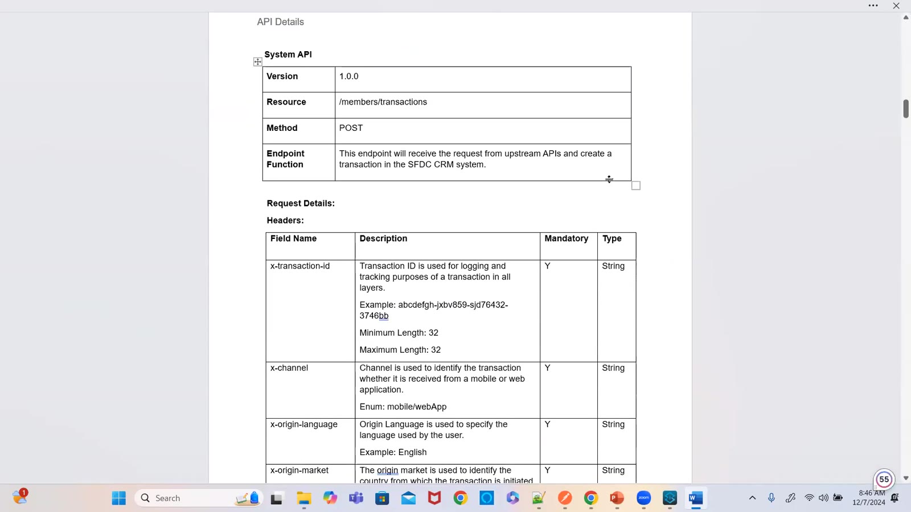

### 10 — Design document — request body example and System API to SFDC object mapping (screen)
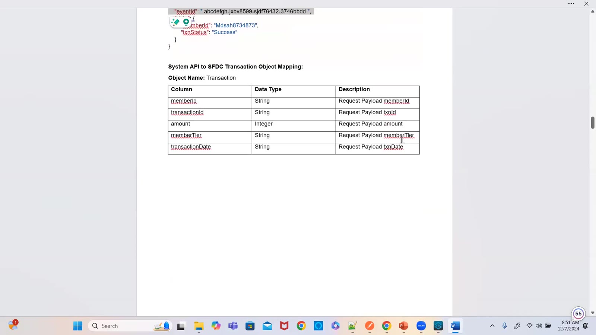

### 11 — Transaction and Loyalty Management — Banking flowchart (screen)
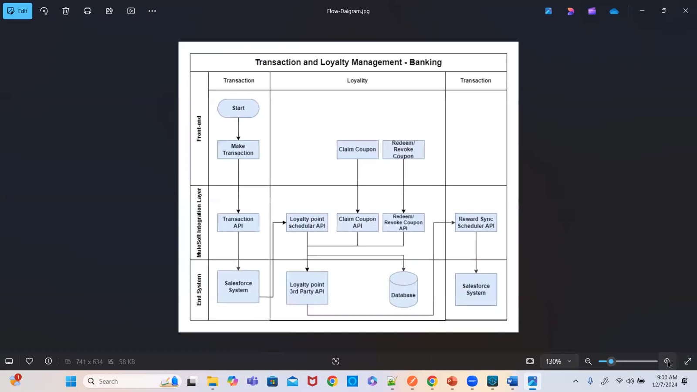

### 12 — API landscape for Transaction and Loyalty Management — experience, process and system layers (screen)
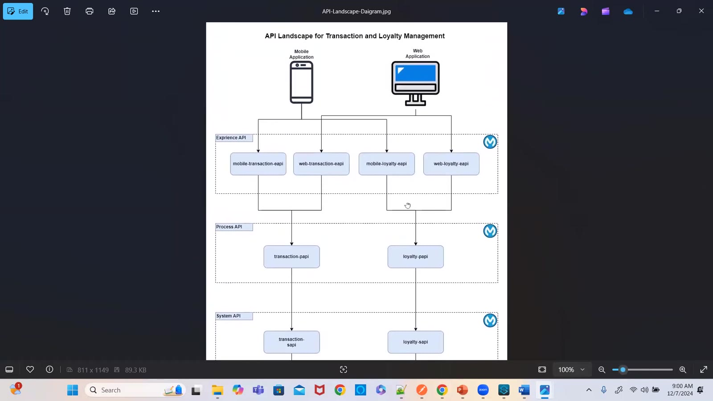

### 13 — Transaction Management sequence diagram — Experience → Process → System API (screen)
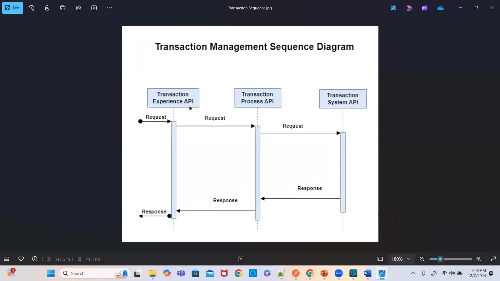

### 14 — Design document — 404 error response example with errorType RESOURCE_NOT_FOUND (screen)
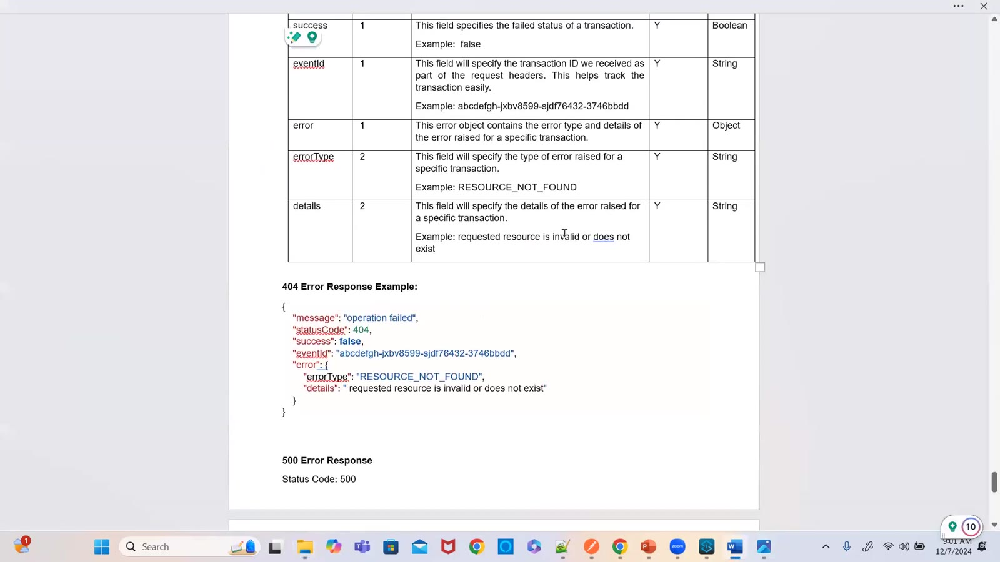

