# Day 23 — Slides and On-Screen Drawings

Frames captured from the Day 23 class recording (MuleSoft Telugu Course Day 23). Repeated and blank frames have been removed. Times are positions in the video.

Notes for this day: [detailed-notes/day23.md](../../detailed-notes/day23.md) · [super-detailed-notes/day23.md](../../super-detailed-notes/day23.md) · [summary](../../day23.md)

| # | Time | Content |
|---|---|---|
| 01 | 2:44 | Design Center — New API specification: project name, "I'm comfortable designing it on my own", RAML 1.0 (screen) |
| 02 | 6:04 | Design Center editor — #%RAML 1.0, title: hr-employees-sapi (screen) |
| 03 | 6:39 | Reference project in Studio — headersTraits.raml (transaction-id, origin, language) (screen) |
| 04 | 7:45 | Reference root RAML — title, description, version, protocols HTTPS, mediaType application/json, traits and types includes (screen) |
| 05 | 9:14 | Create employee — request body, headers (transaction-id), POST, HTTP/HTTPS; responses 201 / 400 (drawing) |
| 06 | 9:17 | /employees/{empId} — GET: body ✗, URI param ✓, headers ✓; response JSON (drawing) |
| 07 | 14:58 | RAML — /employees post with headersTraits, body type addRequestDataType, example !include examples/requests/addRequestExample.json (screen) |
| 08 | 36:47 | Create emp — JSON object, data types, no date type, hobbies array; HRMS → API (drawing) |
| 09 | 40:27 | addRequestDataType.raml — #%RAML 1.0 DataType, empName, empId, empSalary with description/type/required/example (screen) |
| 10 | 64:14 | Design Center error — should have required property 'message' / 'statusCode' (screen) |
| 11 | 78:32 | Design Center errors — "should NOT have additional properties" (screen) |
| 12 | 76:37 | Update emp — PATCH partial update; 200 "employee details updated successfully" (drawing) |
| 13 | 96:23 | Design Center documentation panel — Summary, Endpoints, /employees, /{empId} (screen) |
| 14 | 96:54 | Documentation — GET /employees/{empId} with the mocking service URL (screen) |

---

### 01 — Design Center — New API specification: project name, "I'm comfortable designing it on my own", RAML 1.0 (screen)
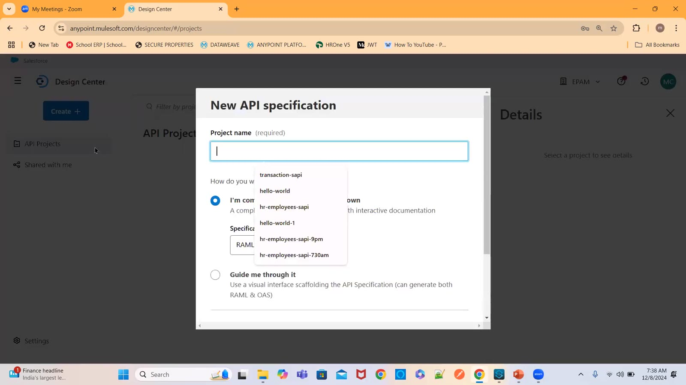

### 02 — Design Center editor — #%RAML 1.0, title: hr-employees-sapi (screen)
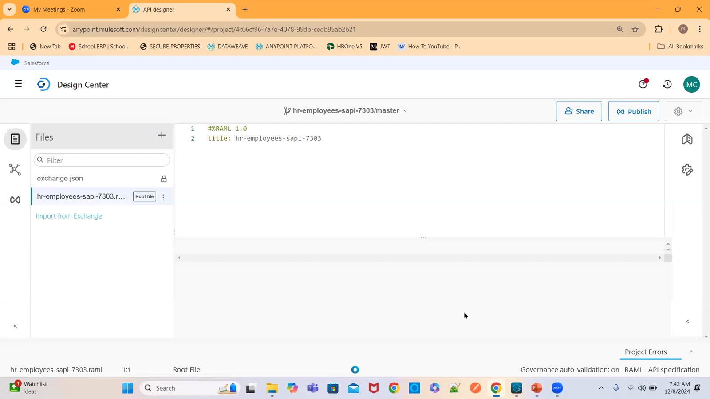

### 03 — Reference project in Studio — headersTraits.raml (transaction-id, origin, language) (screen)
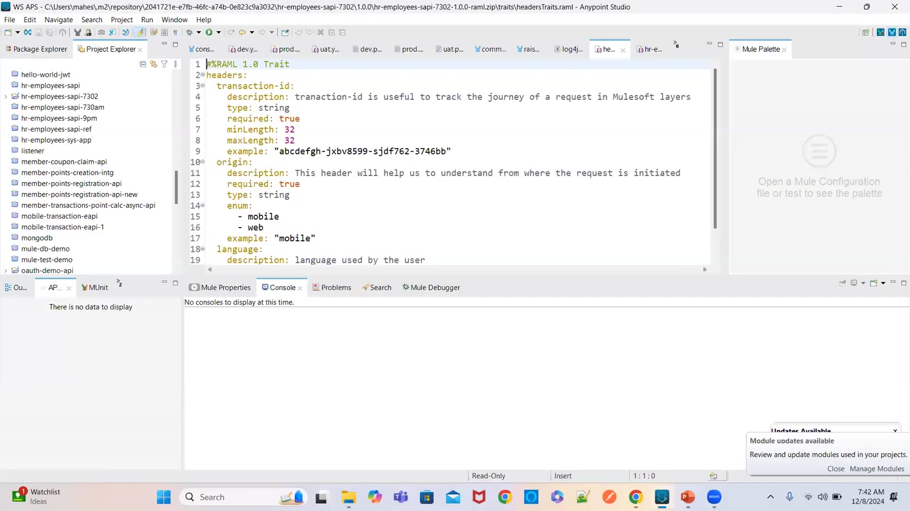

### 04 — Reference root RAML — title, description, version, protocols HTTPS, mediaType application/json, traits and types includes (screen)
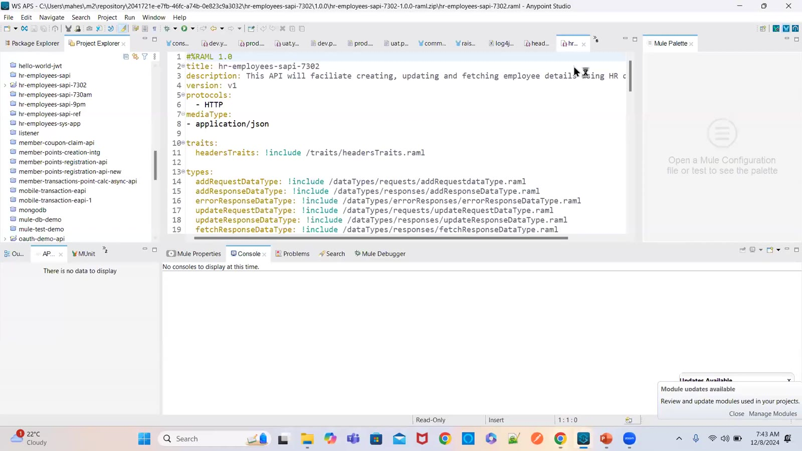

### 05 — Create employee — request body, headers (transaction-id), POST, HTTP/HTTPS; responses 201 / 400 (drawing)
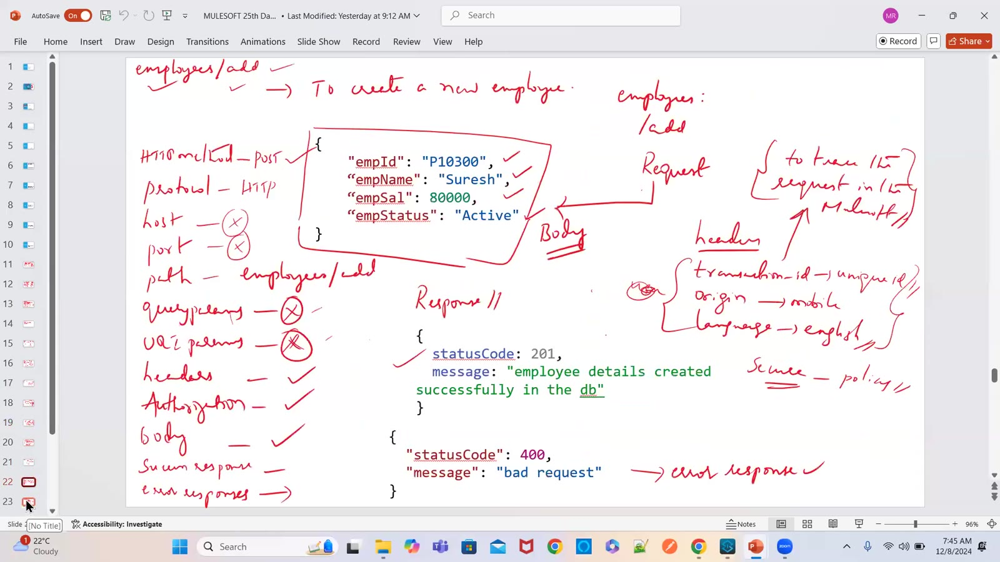

### 06 — /employees/{empId} — GET: body ✗, URI param ✓, headers ✓; response JSON (drawing)
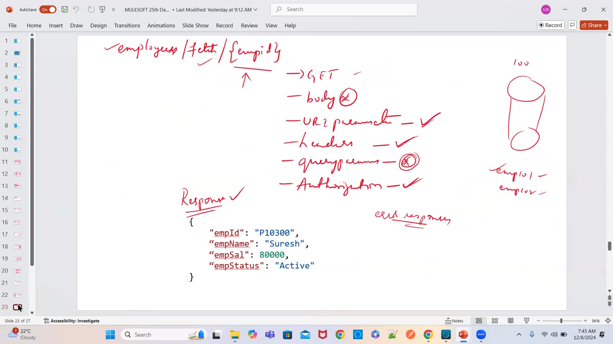

### 07 — RAML — /employees post with headersTraits, body type addRequestDataType, example !include examples/requests/addRequestExample.json (screen)
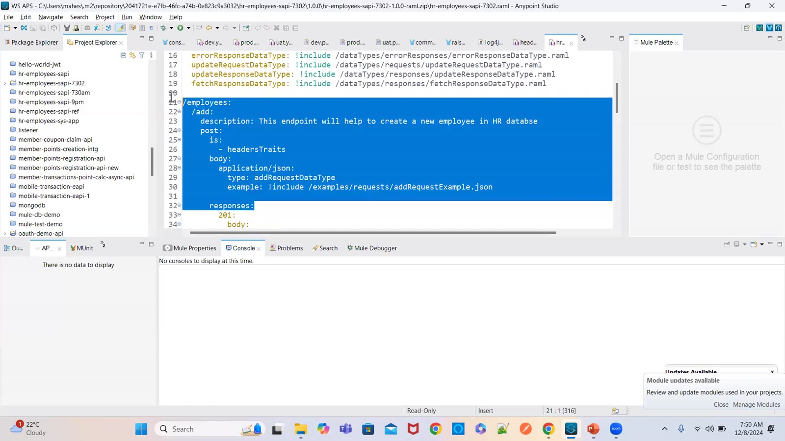

### 08 — Create emp — JSON object, data types, no date type, hobbies array; HRMS → API (drawing)
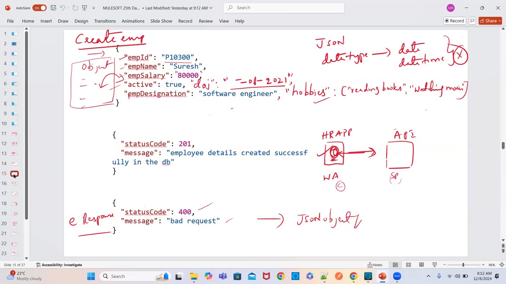

### 09 — addRequestDataType.raml — #%RAML 1.0 DataType, empName, empId, empSalary with description/type/required/example (screen)
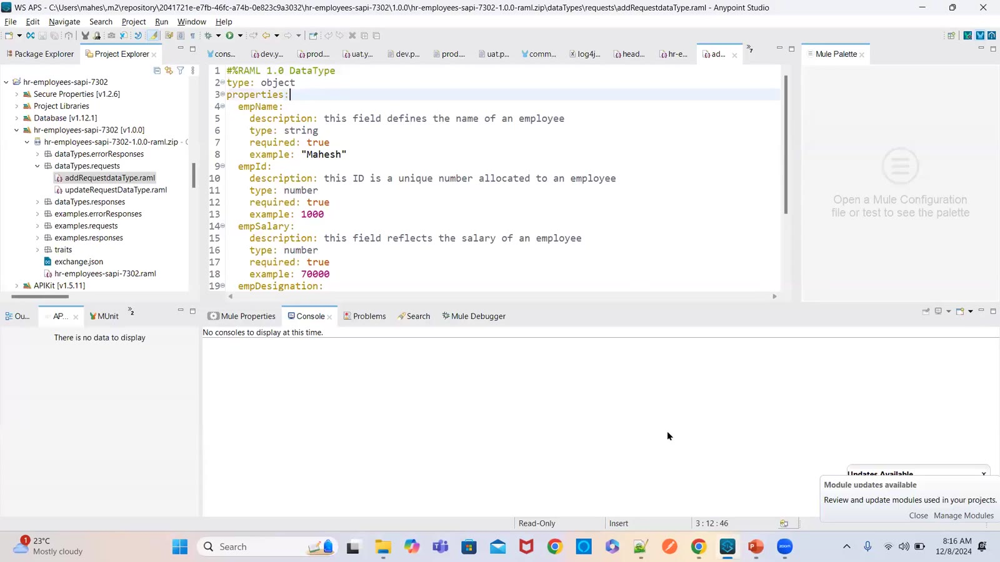

### 10 — Design Center error — should have required property 'message' / 'statusCode' (screen)
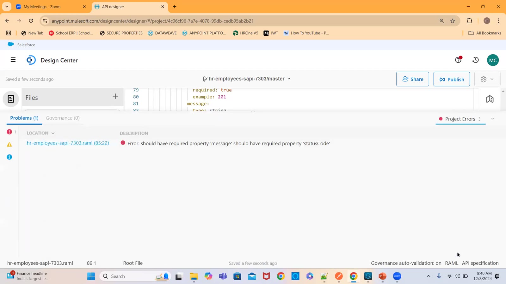

### 11 — Design Center errors — "should NOT have additional properties" (screen)
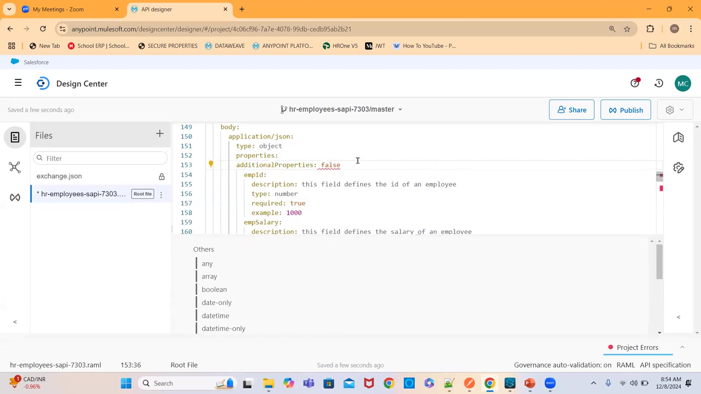

### 12 — Update emp — PATCH partial update; 200 "employee details updated successfully" (drawing)
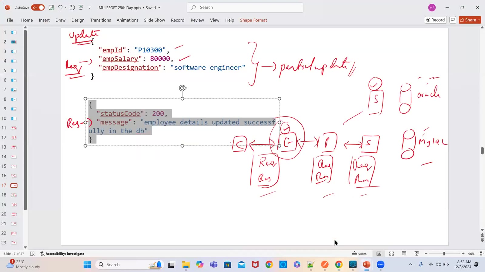

### 13 — Design Center documentation panel — Summary, Endpoints, /employees, /{empId} (screen)
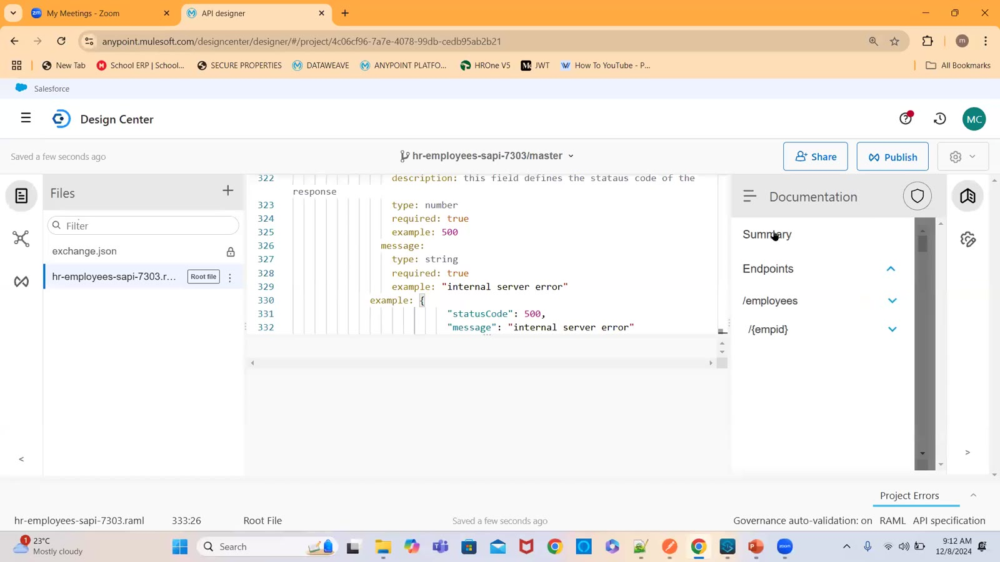

### 14 — Documentation — GET /employees/{empId} with the mocking service URL (screen)
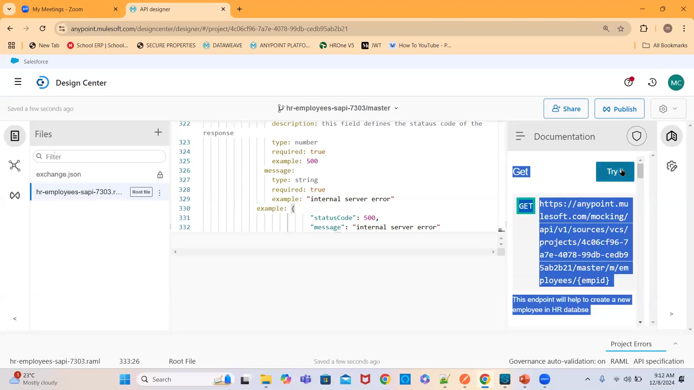

