# Day 24 — Slides and On-Screen Drawings

Frames captured from the Day 24 class recording (MuleSoft Telugu Course Day 24). Repeated and blank frames have been removed. Times are positions in the video.

Notes for this day: [detailed-notes/day24.md](../../detailed-notes/day24.md) · [super-detailed-notes/day24.md](../../super-detailed-notes/day24.md) · [summary](../../day24.md)

| # | Time | Content |
|---|---|---|
| 01 | 0:03 | Agenda — applying best practices in RAML |
| 02 | 2:34 | Reference root RAML in Studio — traits and types !include lines (screen) |
| 03 | 4:02 | Design Center — Add new folder (examples) (screen) |
| 04 | 10:56 | Add new file — API format RAML 1.0 / OAS / Other (screen) |
| 05 | 11:59 | examples/errorResponses/400ErrorResponseExample.json — {statusCode 400, message "bad request"} (screen) |
| 06 | 17:28 | examples/responses — "employee details created successfully in the db" (screen) |
| 07 | 19:40 | Reference headersTraits.raml in Studio (screen) |
| 08 | 32:17 | Add new file — file type: Specification, Trait, Resource Type, Library, Overlay, Data Type… (screen) |
| 09 | 35:12 | dataTypes/requests/postRequestDataType.raml — #%RAML 1.0 DataType properties (screen) |
| 10 | 37:26 | Root RAML — types: postRequestDataType: !include dataTypes/requests/postRequestDataType.raml (screen) |
| 11 | 60:28 | Design Center — validation errors while moving properties into a data type (screen) |
| 12 | 73:32 | Address object; ① scratch → API spec → DC; ② enhancement → API spec → DC; template (drawing) |
| 13 | 73:44 | Design Center — Duplicate project (screen) |

---

### 01 — Agenda — applying best practices in RAML
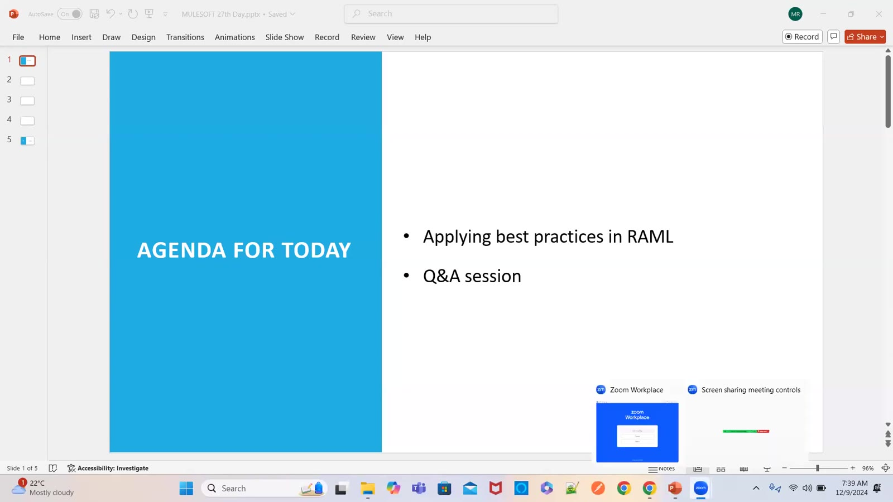

### 02 — Reference root RAML in Studio — traits and types !include lines (screen)
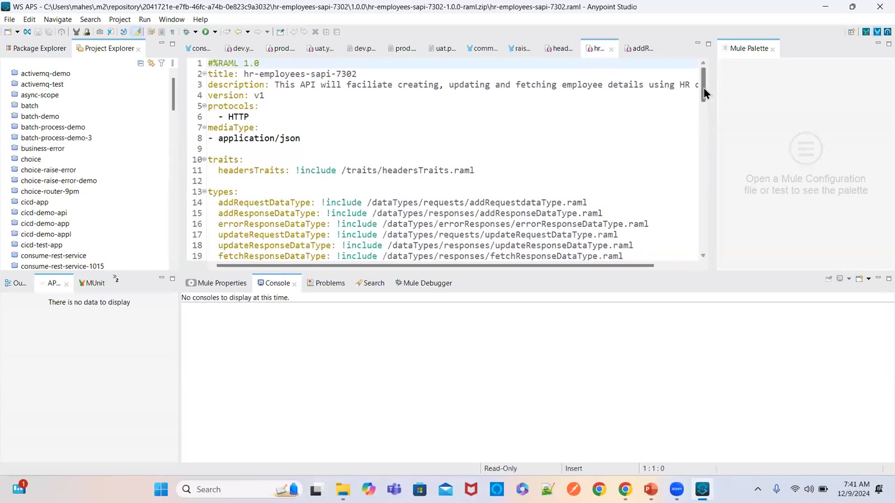

### 03 — Design Center — Add new folder (examples) (screen)
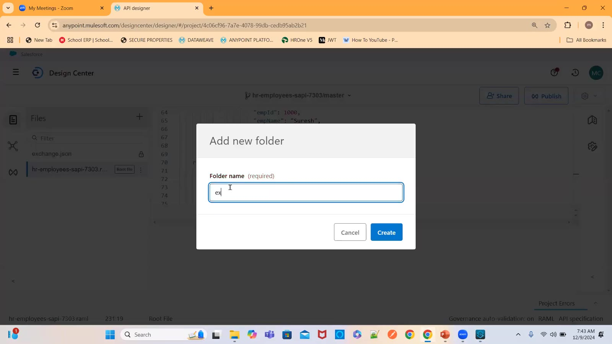

### 04 — Add new file — API format RAML 1.0 / OAS / Other (screen)
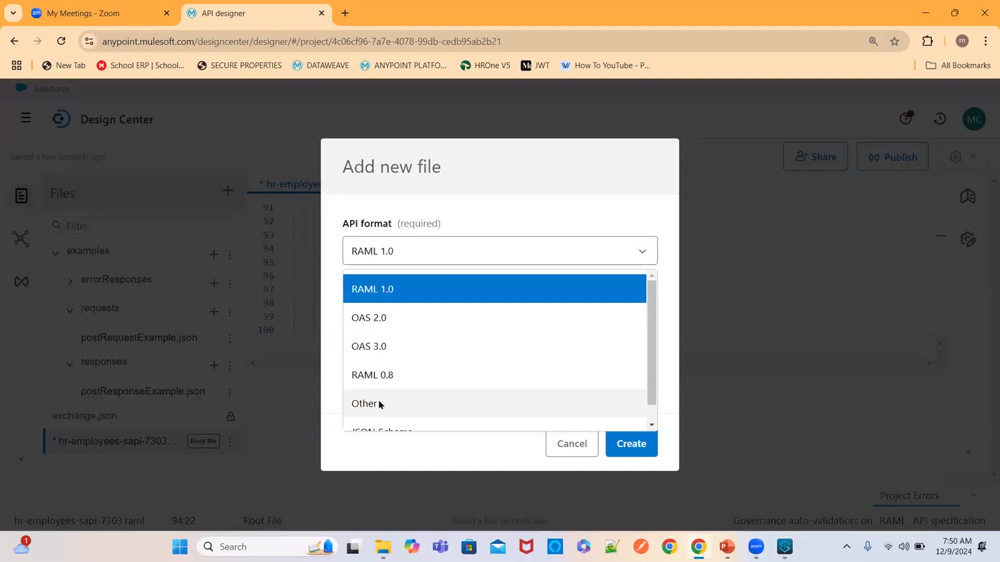

### 05 — examples/errorResponses/400ErrorResponseExample.json — {statusCode 400, message "bad request"} (screen)
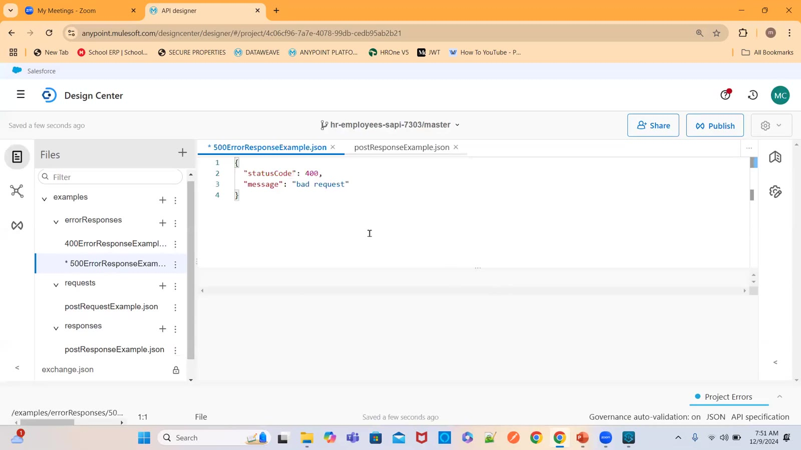

### 06 — examples/responses — "employee details created successfully in the db" (screen)
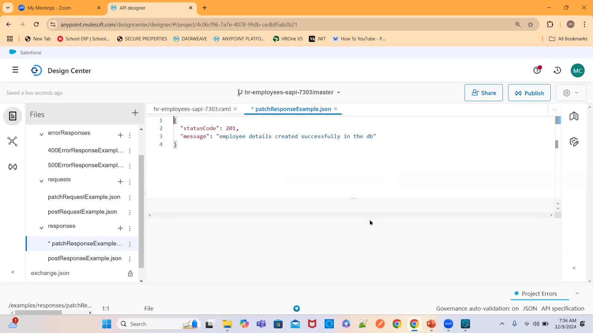

### 07 — Reference headersTraits.raml in Studio (screen)
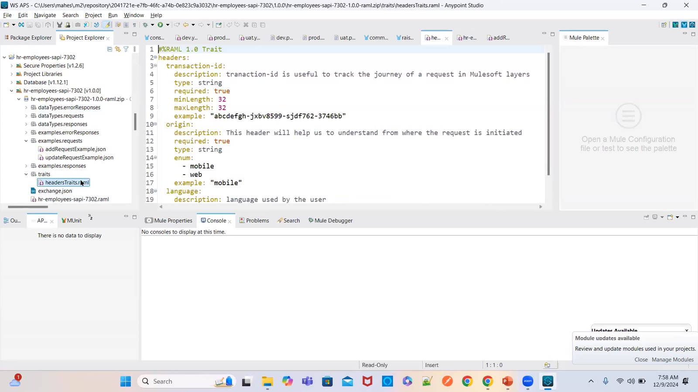

### 08 — Add new file — file type: Specification, Trait, Resource Type, Library, Overlay, Data Type… (screen)
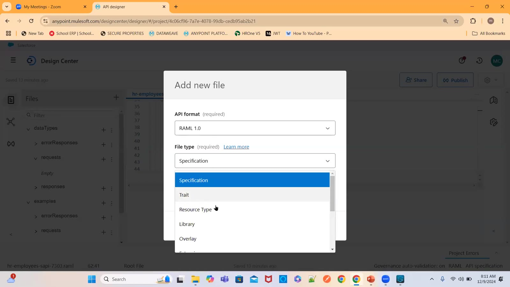

### 09 — dataTypes/requests/postRequestDataType.raml — #%RAML 1.0 DataType properties (screen)
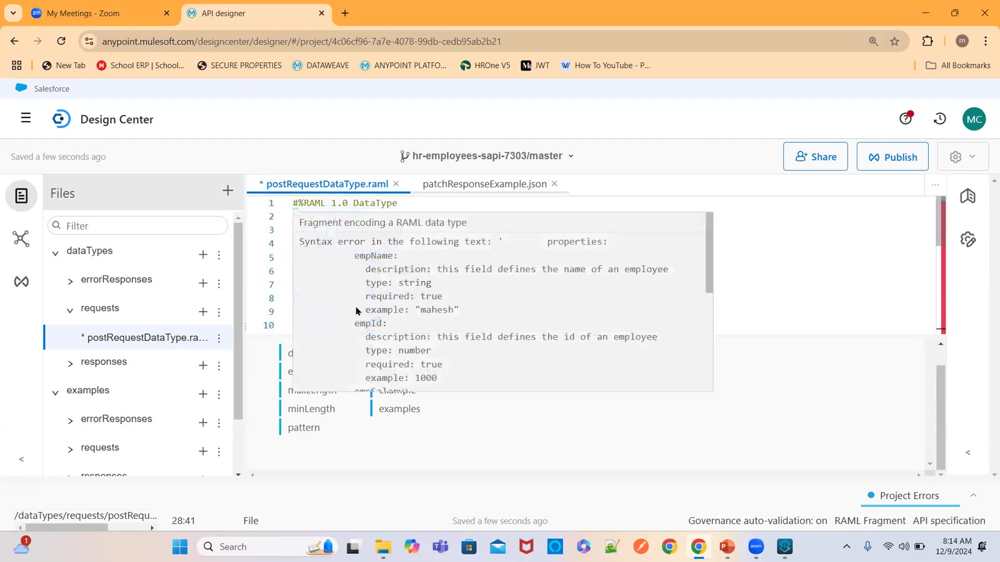

### 10 — Root RAML — types: postRequestDataType: !include dataTypes/requests/postRequestDataType.raml (screen)
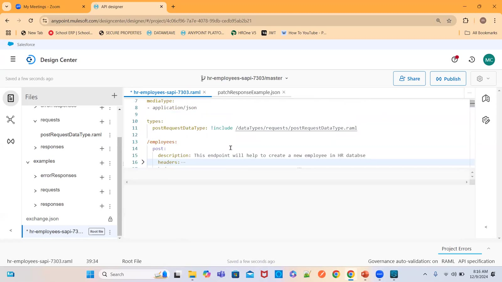

### 11 — Design Center — validation errors while moving properties into a data type (screen)
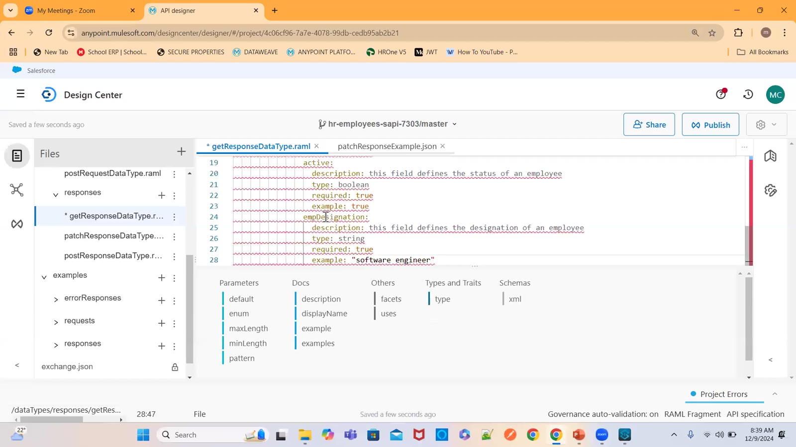

### 12 — Address object; ① scratch → API spec → DC; ② enhancement → API spec → DC; template (drawing)
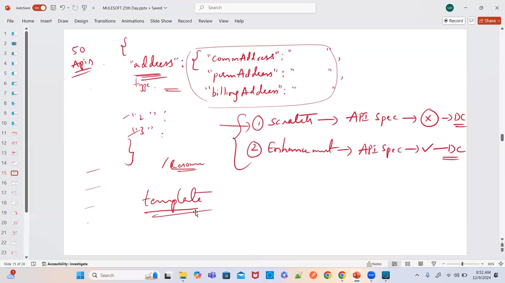

### 13 — Design Center — Duplicate project (screen)
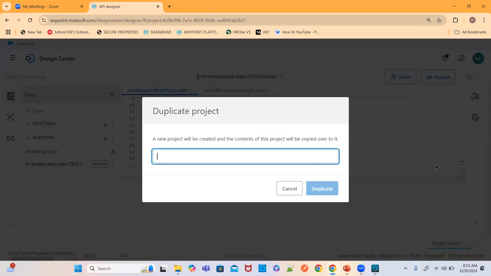

