# Day 25 — Slides and On-Screen Drawings

Frames captured from the Day 25 class recording (MuleSoft Telugu Course Day 25). Share-project dialogs showing user names and email addresses are not included. Repeated and blank frames have been removed. Times are positions in the video.

Notes for this day: [detailed-notes/day25.md](../../detailed-notes/day25.md) · [super-detailed-notes/day25.md](../../super-detailed-notes/day25.md) · [summary](../../day25.md)

| # | Time | Content |
|---|---|---|
| 01 | 0:44 | Data Type — built-in types: string, number, integer, boolean, date-only, time-only, datetime |
| 02 | 0:42 | Data Type — custom types; "types" to import, "type" to call |
| 03 | 0:01 | Traits — reusable components; imported to resources with "is" |
| 04 | 0:46 | Resource Type — template for common resource properties; called with "type" |
| 05 | 0:37 | Security Schemes — Basic Auth, Client ID Enforcement, OAuth 2.0; "securedBy" |
| 06 | 0:40 | Fragment — reusable component; externalise security schemes, library, resource types, traits, data types; publish to Exchange |
| 07 | 36:18 | Design Center — Add new file of type Trait in a fragment project (screen) |
| 08 | 37:02 | API Projects — RAML fragment and API specification projects (screen) |
| 09 | 38:49 | Library in Studio — traits and types grouped with includes (screen) |
| 10 | 50:10 | Publishing to Exchange — asset version and lifecycle state (screen) |
| 11 | 51:17 | Change version of the fragment dependency (screen) |
| 12 | 52:23 | Root RAML — headersTraits: !include exchange_modules/…/common-headers-fragment (screen) |
| 13 | 63:12 | Mocking Service Configuration — make public, mock URL (screen) |
| 14 | 67:46 | Postman — Export collection to share (screen) |

---

### 01 — Data Type — built-in types: string, number, integer, boolean, date-only, time-only, datetime
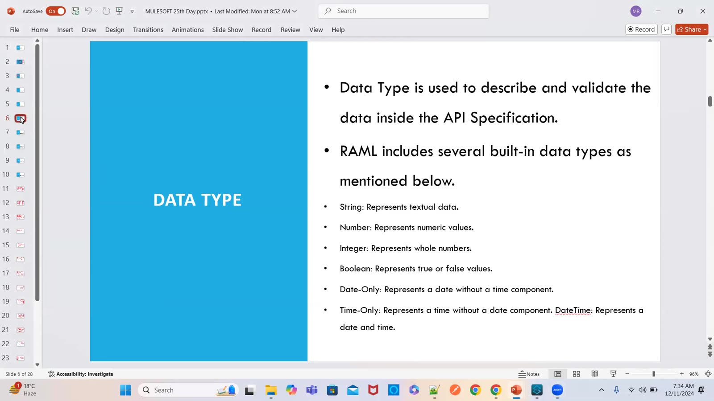

### 02 — Data Type — custom types; "types" to import, "type" to call
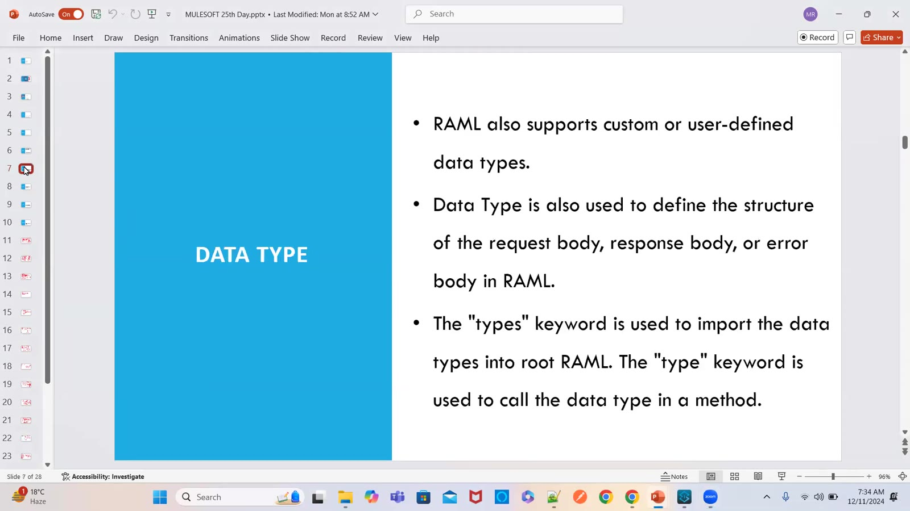

### 03 — Traits — reusable components; imported to resources with "is"
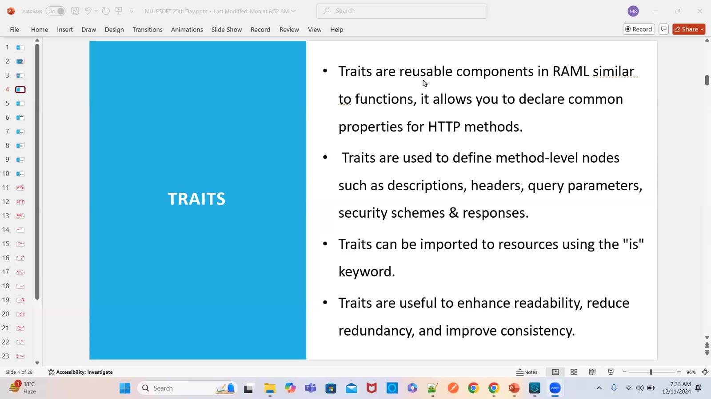

### 04 — Resource Type — template for common resource properties; called with "type"
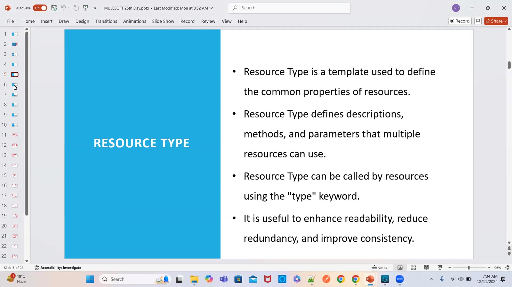

### 05 — Security Schemes — Basic Auth, Client ID Enforcement, OAuth 2.0; "securedBy"
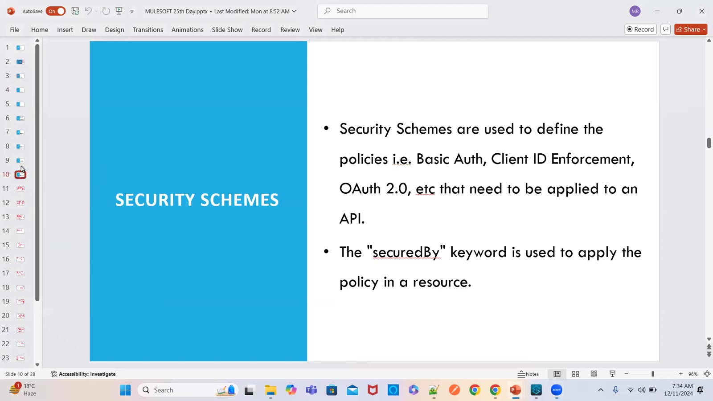

### 06 — Fragment — reusable component; externalise security schemes, library, resource types, traits, data types; publish to Exchange
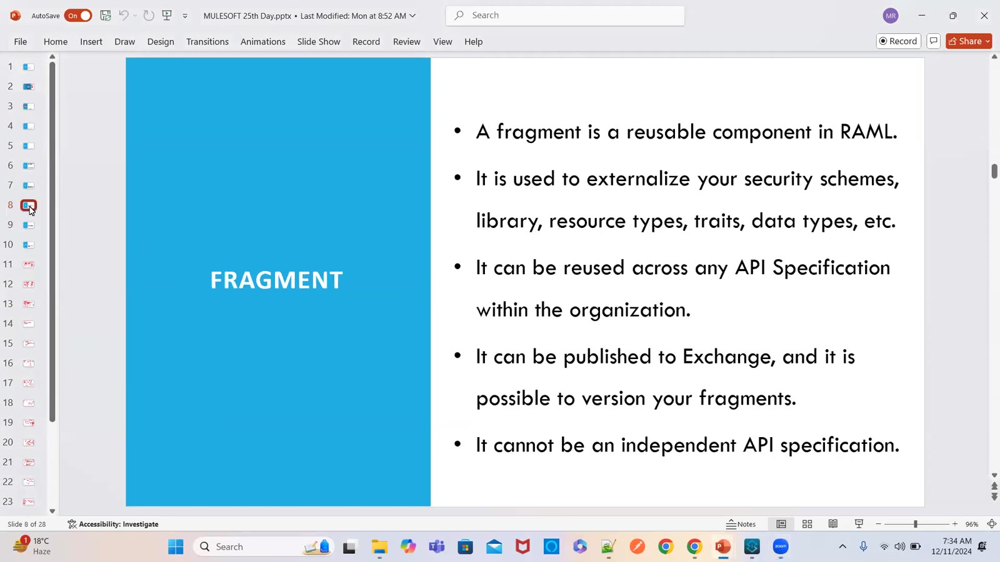

### 07 — Design Center — Add new file of type Trait in a fragment project (screen)
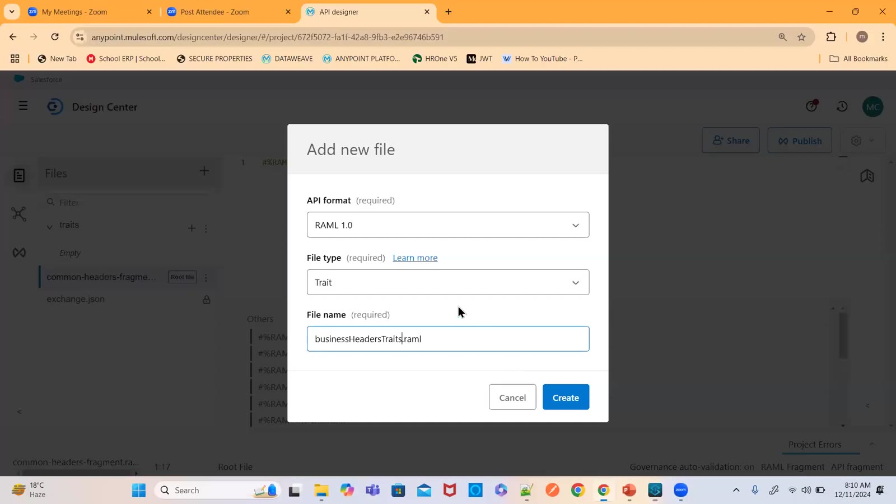

### 08 — API Projects — RAML fragment and API specification projects (screen)
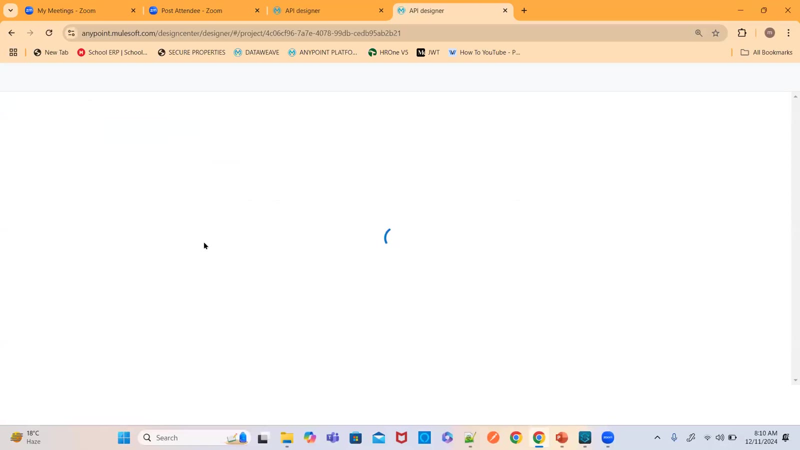

### 09 — Library in Studio — traits and types grouped with includes (screen)
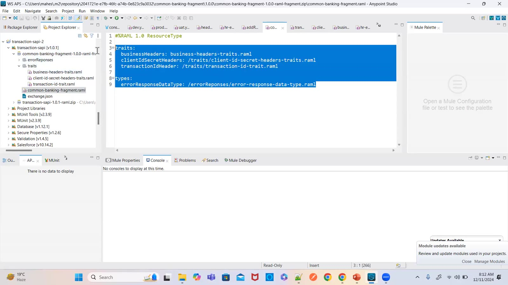

### 10 — Publishing to Exchange — asset version and lifecycle state (screen)
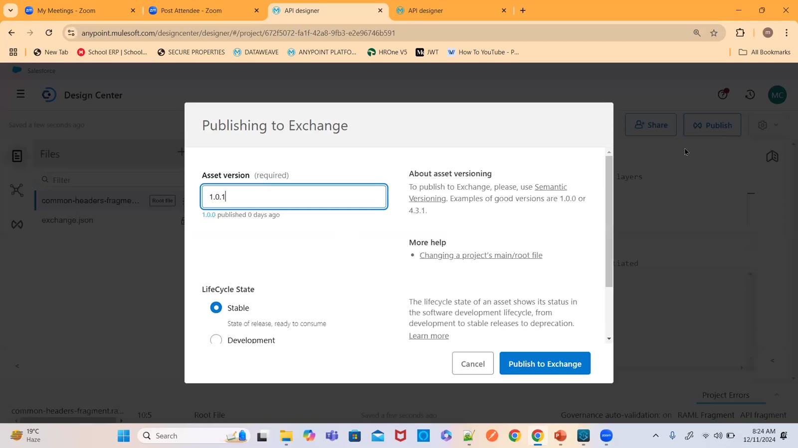

### 11 — Change version of the fragment dependency (screen)
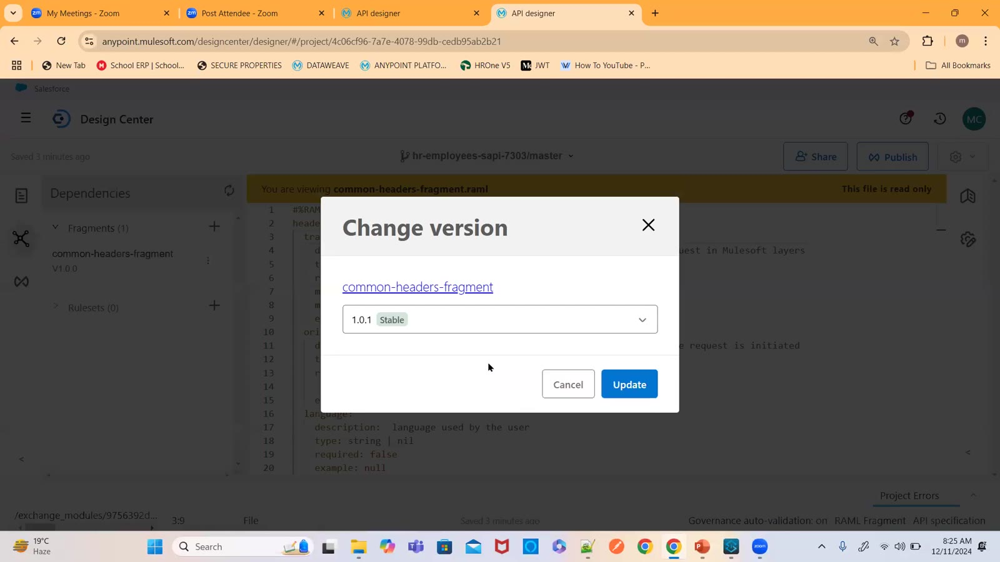

### 12 — Root RAML — headersTraits: !include exchange_modules/…/common-headers-fragment (screen)
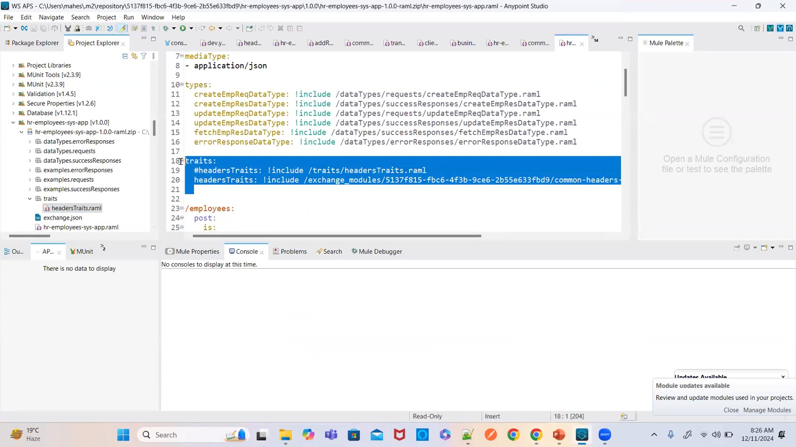

### 13 — Mocking Service Configuration — make public, mock URL (screen)
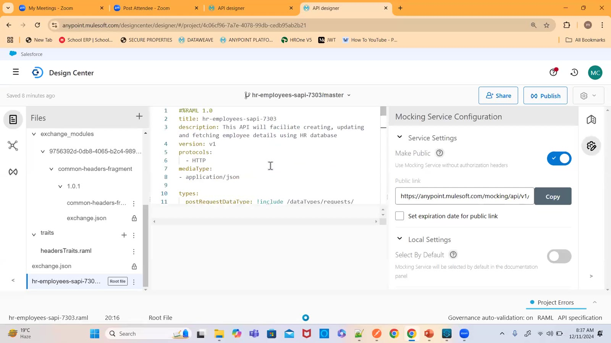

### 14 — Postman — Export collection to share (screen)
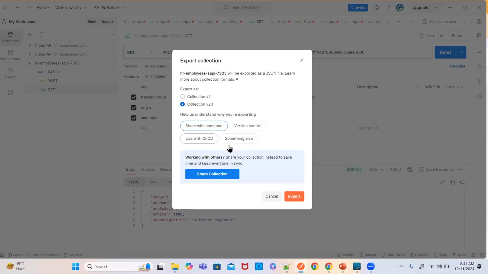

