# Day 26 — Slides and On-Screen Drawings

Frames captured from the Day 26 class recording (MuleSoft Telugu Course Day 26, recorded 12 Dec 2024). Login screens and Studio's Anypoint sign-in dialogs are not included. Repeated and blank frames have been removed. Times are positions in the video.

Notes for this day: [detailed-notes/day26.md](../../detailed-notes/day26.md) · [super-detailed-notes/day26.md](../../super-detailed-notes/day26.md) · [summary](../../day26.md)

| # | Time | Content |
|---|---|---|
| 01 | 82:04 | Agenda — API specification implementation using RAML |
| 02 | 2:04 | Design Center — Publishing to Exchange: asset version 1.0.0, API version v1, lifecycle Stable (screen) |
| 03 | 3:11 | Exchange — All assets: hr-employees-sapi-7303 and common-headers-fragment (screen) |
| 04 | 9:22 | Exchange asset page — hr-employees-sapi-7303, REST API, v1.0.0 Stable, endpoints (screen) |
| 05 | 9:55 | Exchange documentation — headers and body with Try it (screen) |
| 06 | 10:26 | Exchange — Share the asset (screen) |
| 07 | 11:15 | Public developer portal — "Welcome to your developer portal!" (screen) |
| 08 | 15:05 | Studio — New Mule Project → API implementation: import a published API / RAML; Scaffold flows (screen) |
| 09 | 34:28 | Scaffolded flows — post/patch/get flows with Transform Message placeholders (screen) |
| 10 | 39:39 | APIkit Router configuration — hr-employees-sapi-7303-config, outboundHeaders, httpStatus (screen) |
| 11 | 56:32 | pom.xml — the API specification added as a dependency (screen) |
| 12 | 65:33 | post flow Transform Message — statusCode 201, "employee details created successfully in the db" (screen) |
| 13 | 75:59 | Postman POST /api/employees → 201 Created (screen) |
| 14 | 79:56 | Postman — 404 "Resource not found" for a wrong path (screen) |
| 15 | 82:36 | Postman — 501 "Not Implemented" (screen) |

---

### 01 — Agenda — API specification implementation using RAML
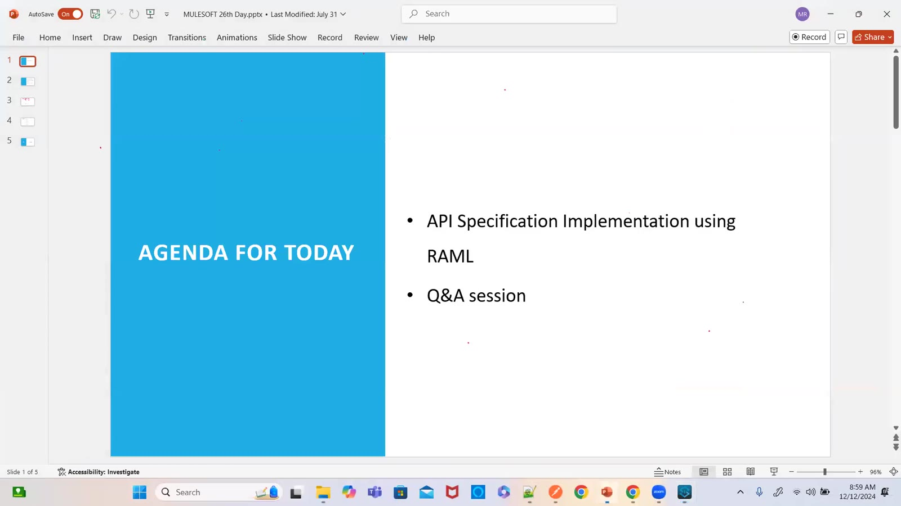

### 02 — Design Center — Publishing to Exchange: asset version 1.0.0, API version v1, lifecycle Stable (screen)
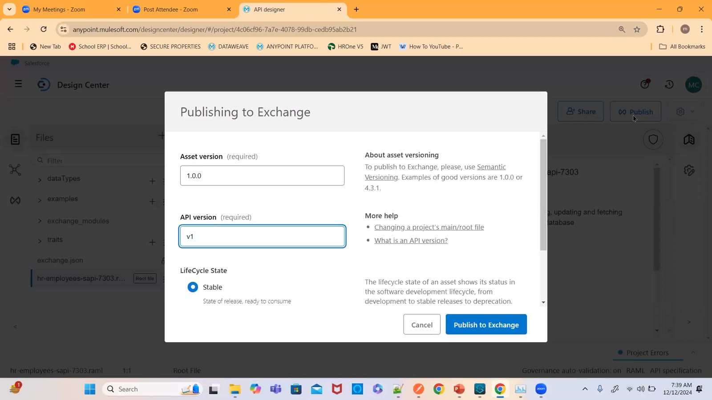

### 03 — Exchange — All assets: hr-employees-sapi-7303 and common-headers-fragment (screen)
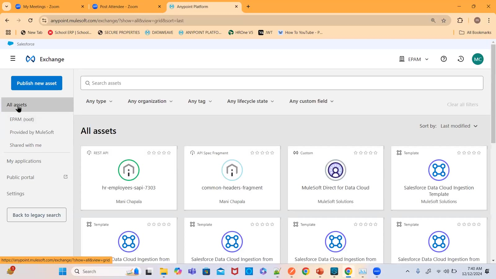

### 04 — Exchange asset page — hr-employees-sapi-7303, REST API, v1.0.0 Stable, endpoints (screen)
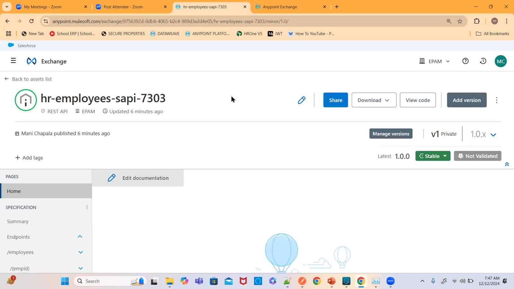

### 05 — Exchange documentation — headers and body with Try it (screen)
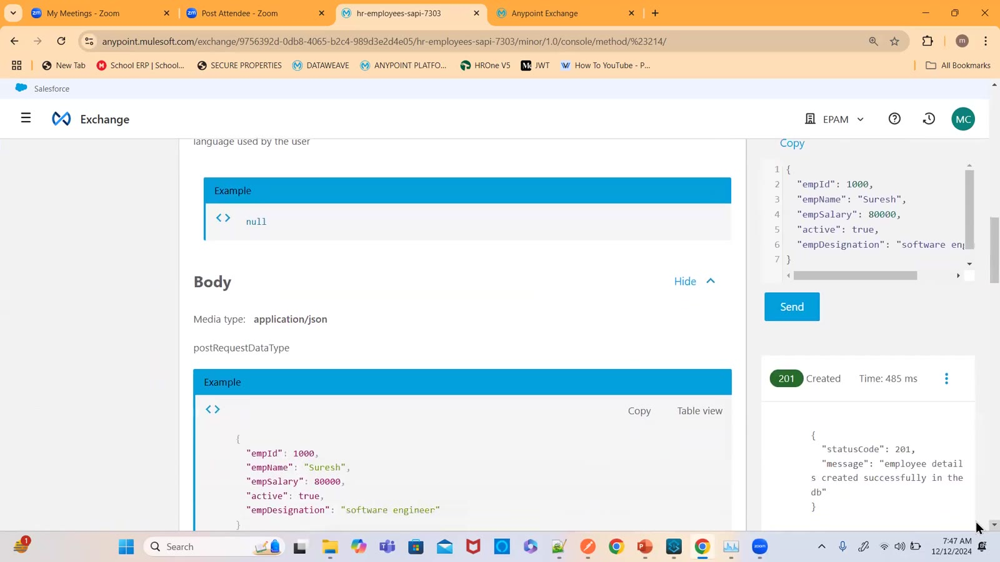

### 06 — Exchange — Share the asset (screen)
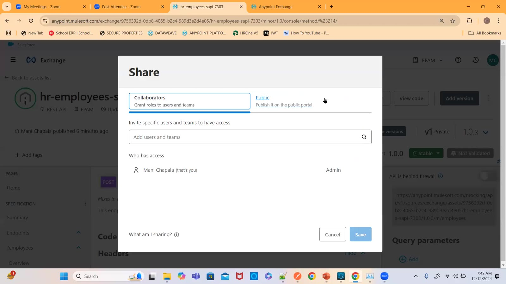

### 07 — Public developer portal — "Welcome to your developer portal!" (screen)
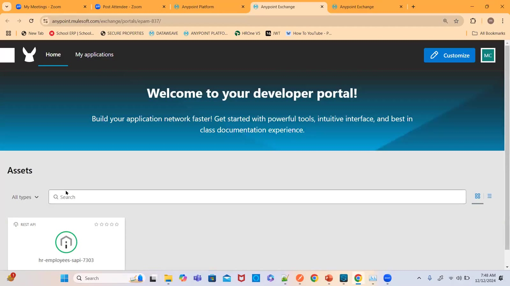

### 08 — Studio — New Mule Project → API implementation: import a published API / RAML; Scaffold flows (screen)
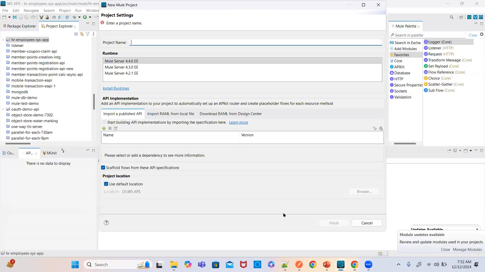

### 09 — Scaffolded flows — post/patch/get flows with Transform Message placeholders (screen)
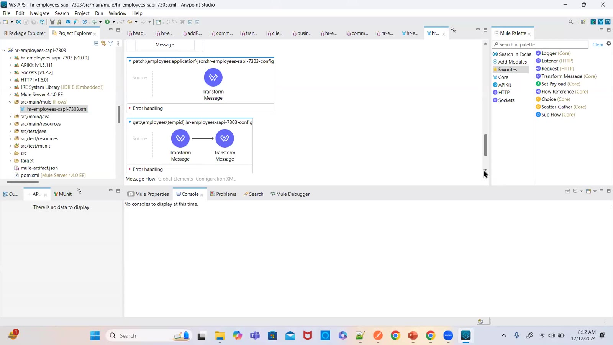

### 10 — APIkit Router configuration — hr-employees-sapi-7303-config, outboundHeaders, httpStatus (screen)
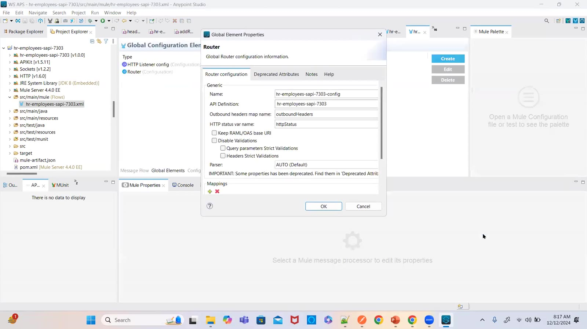

### 11 — pom.xml — the API specification added as a dependency (screen)
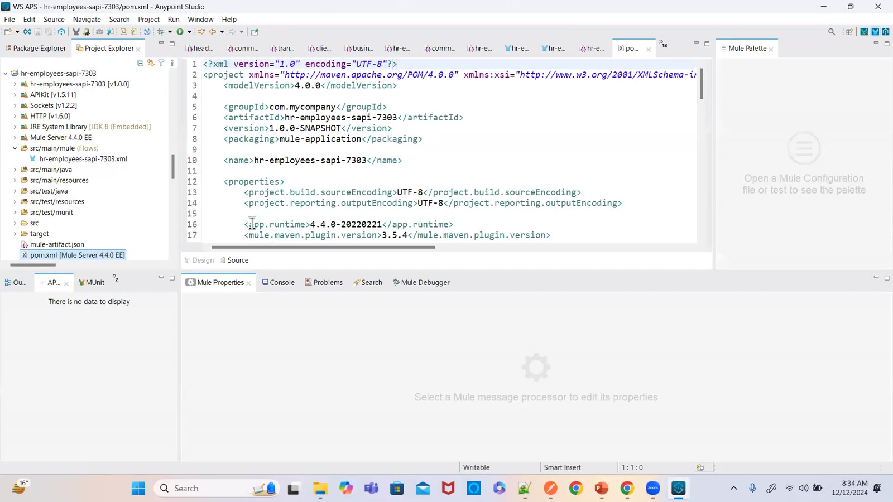

### 12 — post flow Transform Message — statusCode 201, "employee details created successfully in the db" (screen)
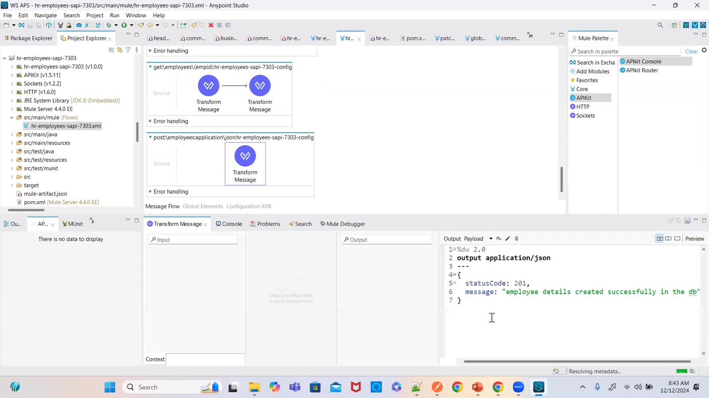

### 13 — Postman POST /api/employees → 201 Created (screen)
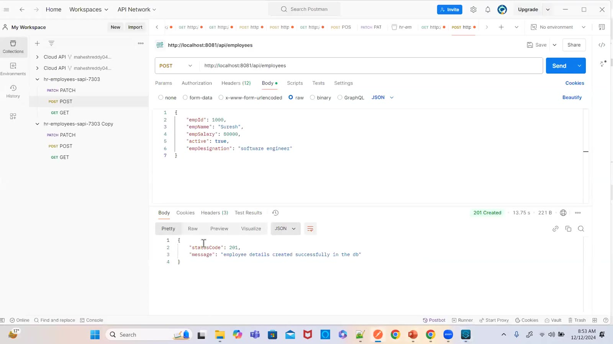

### 14 — Postman — 404 "Resource not found" for a wrong path (screen)
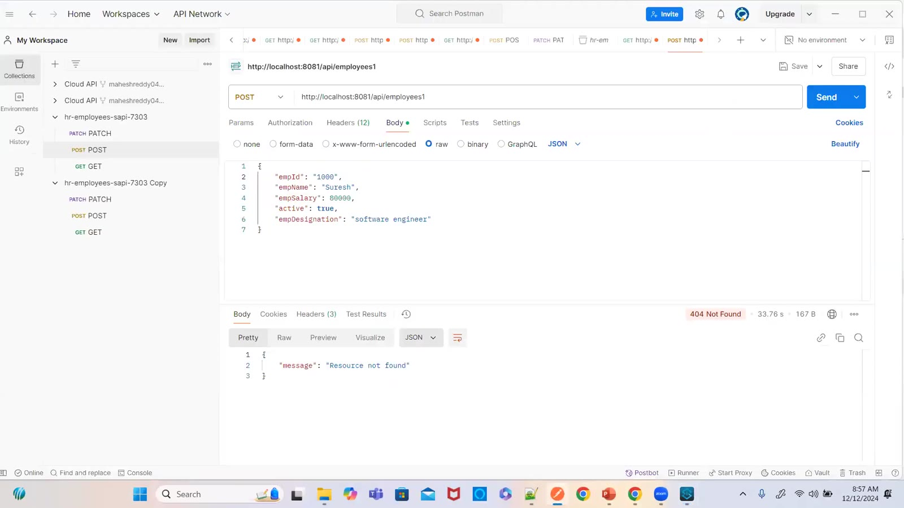

### 15 — Postman — 501 "Not Implemented" (screen)
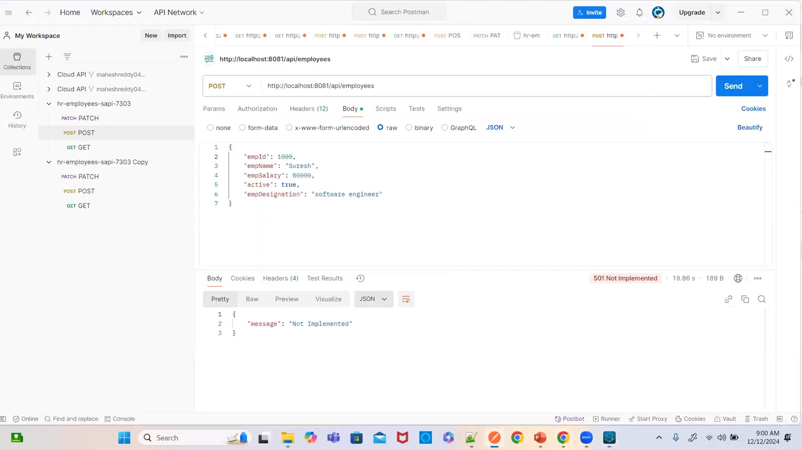

