# Day 27 — Slides and On-Screen Drawings

Frames captured from the Day 27 class recording (MuleSoft Telugu Course Day 27, recorded 13 Dec 2024). Repeated and blank frames have been removed. Times are positions in the video.

Notes for this day: [detailed-notes/day27.md](../../detailed-notes/day27.md) · [super-detailed-notes/day27.md](../../super-detailed-notes/day27.md) · [summary](../../day27.md)

| # | Time | Content |
|---|---|---|
| 01 | 0:01 | hr-employees-sapi-7303 main flow — Listener → APIkit Router, error handling (screen) |
| 02 | 11:34 | Global Configuration Elements — HTTP Listener config and Router in global-config (screen) |
| 03 | 16:46 | common/common-error-handler.xml — On Error Propagate DATABASE:NO_DATA_FOUND and ANY with Error Logger + Final Error Response (screen) |
| 04 | 23:40 | post-employee-implementation-flow — Initial attributes and payload vars → Before Create Emp in DB → Create Emp using DB Insert → After → Post Final Response (screen) |
| 05 | 31:36 | post-employee-implementation-flow — Logger → Insert → Logger → Create Employee Final Response (screen) |
| 06 | 43:55 | config/qa.yaml — listener 0.0.0.0:8081 /api/*, MySQL localhost 330 db mule8, encrypted username/password, autodiscovery.id (screen) |
| 07 | 49:17 | Database Config — MySQL Connection, host/port/user/password/database from properties (screen) |
| 08 | 57:14 | Reference project global-config.xml — listener, APIkit, configuration properties, secure properties, DB config, validation, API autodiscovery (screen) |
| 09 | 57:43 | implementation/ files — post, patch, get employee implementation flows (screen) |
| 10 | 69:22 | MySQL Installer 8.0.19 — Choosing a Setup Type (screen) |
| 11 | 76:47 | MySQL Installer — Authentication Method (strong password encryption) (screen) |
| 12 | 77:18 | MySQL Installer — Windows Service (MySQL80) (screen) |
| 13 | 78:44 | MySQL Workbench — Welcome screen, Local instance MySQL80 (screen) |
| 14 | 80:08 | Windows Services — checking the MySQL service (screen) |

---

### 01 — hr-employees-sapi-7303 main flow — Listener → APIkit Router, error handling (screen)
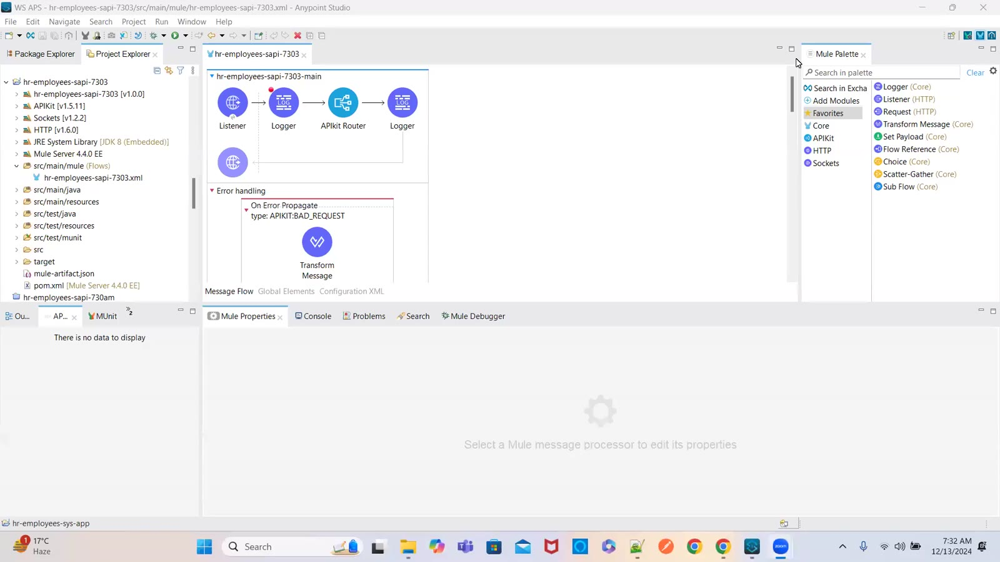

### 02 — Global Configuration Elements — HTTP Listener config and Router in global-config (screen)
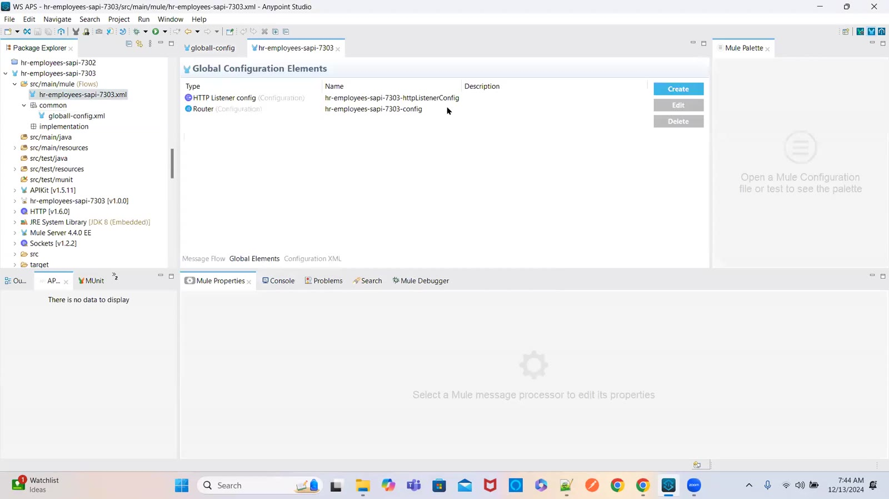

### 03 — common/common-error-handler.xml — On Error Propagate DATABASE:NO_DATA_FOUND and ANY with Error Logger + Final Error Response (screen)
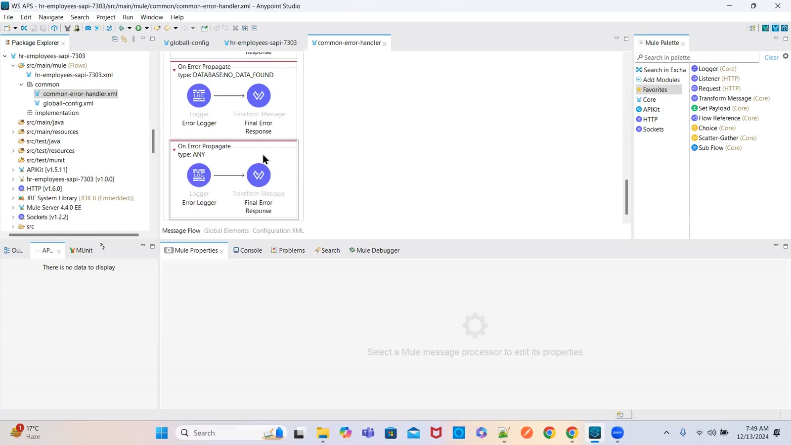

### 04 — post-employee-implementation-flow — Initial attributes and payload vars → Before Create Emp in DB → Create Emp using DB Insert → After → Post Final Response (screen)
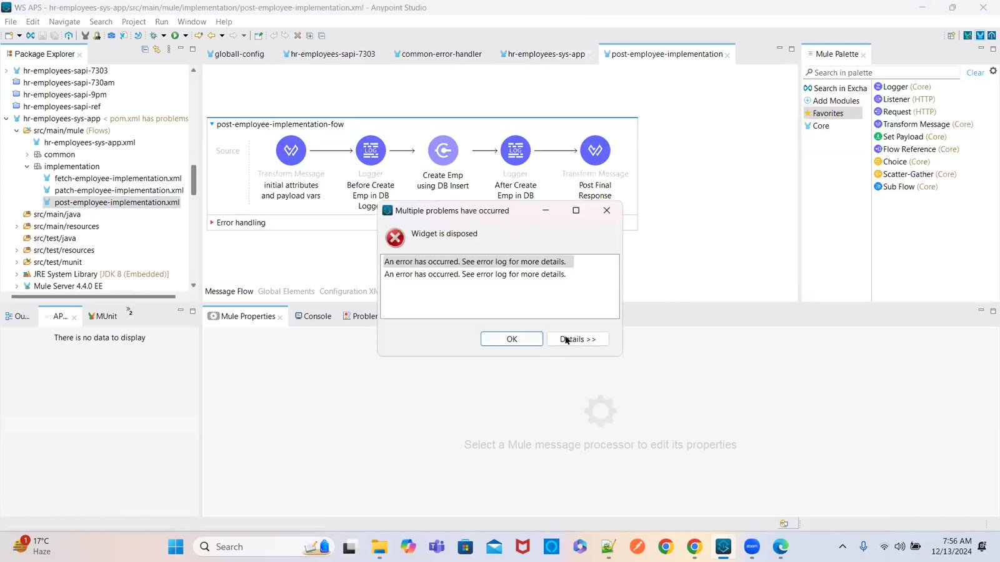

### 05 — post-employee-implementation-flow — Logger → Insert → Logger → Create Employee Final Response (screen)
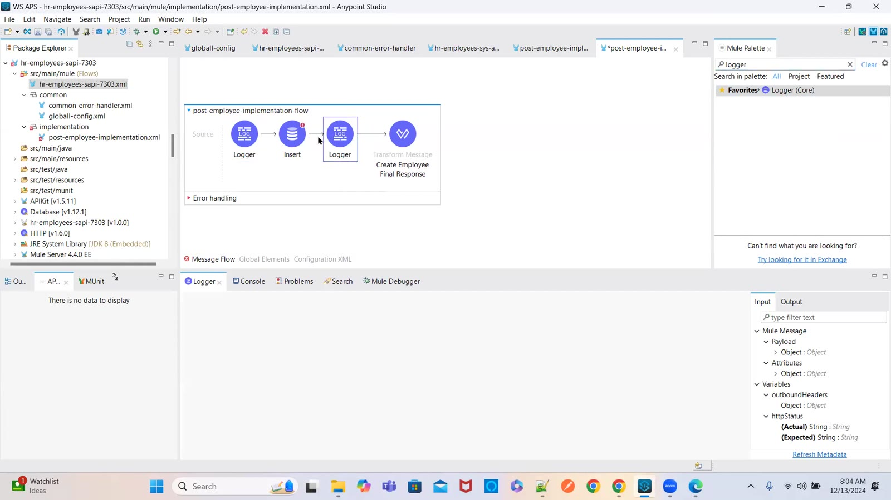

### 06 — config/qa.yaml — listener 0.0.0.0:8081 /api/*, MySQL localhost 330 db mule8, encrypted username/password, autodiscovery.id (screen)
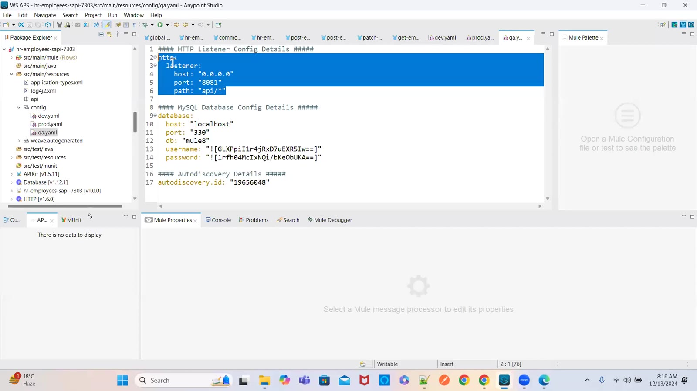

### 07 — Database Config — MySQL Connection, host/port/user/password/database from properties (screen)
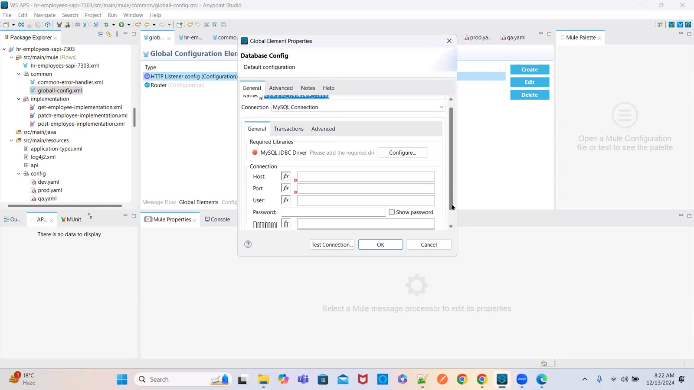

### 08 — Reference project global-config.xml — listener, APIkit, configuration properties, secure properties, DB config, validation, API autodiscovery (screen)
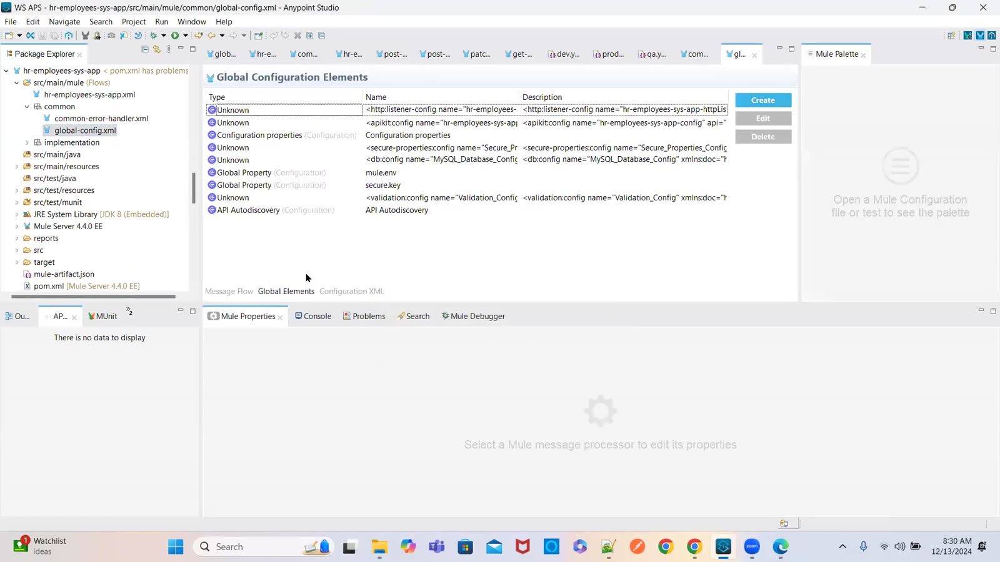

### 09 — implementation/ files — post, patch, get employee implementation flows (screen)
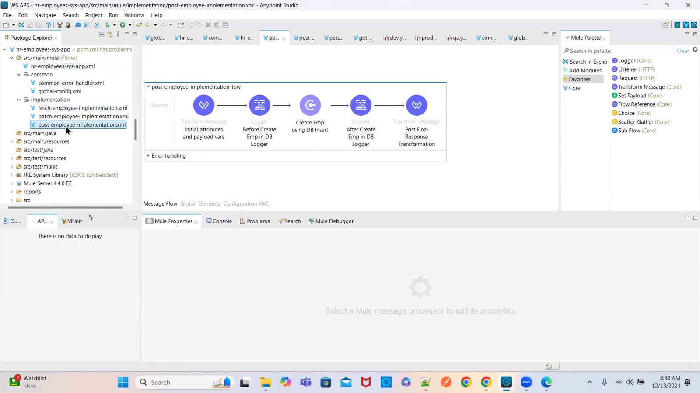

### 10 — MySQL Installer 8.0.19 — Choosing a Setup Type (screen)
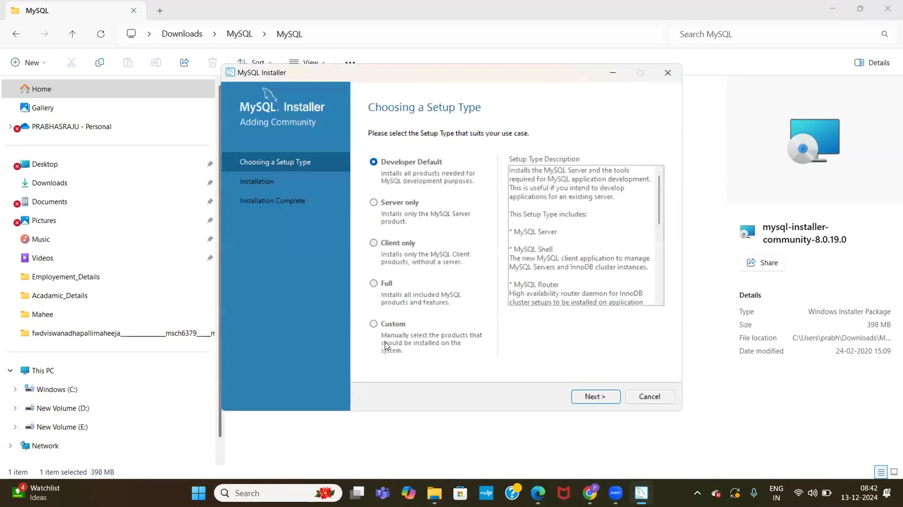

### 11 — MySQL Installer — Authentication Method (strong password encryption) (screen)
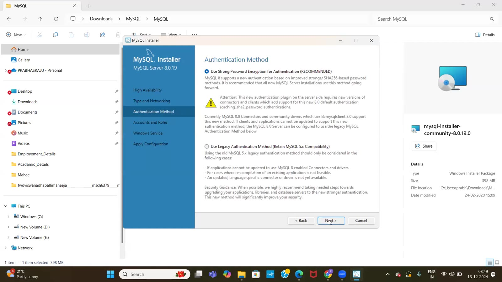

### 12 — MySQL Installer — Windows Service (MySQL80) (screen)
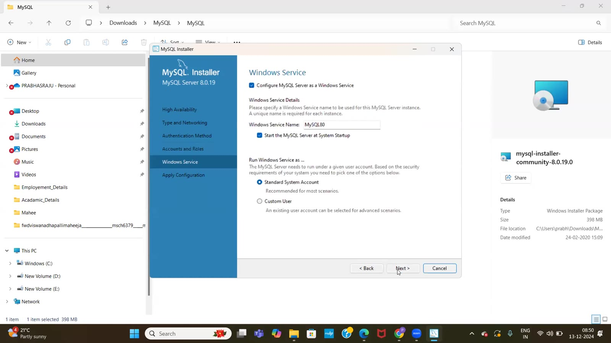

### 13 — MySQL Workbench — Welcome screen, Local instance MySQL80 (screen)
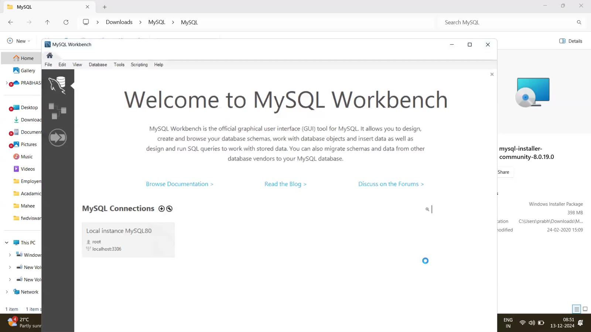

### 14 — Windows Services — checking the MySQL service (screen)
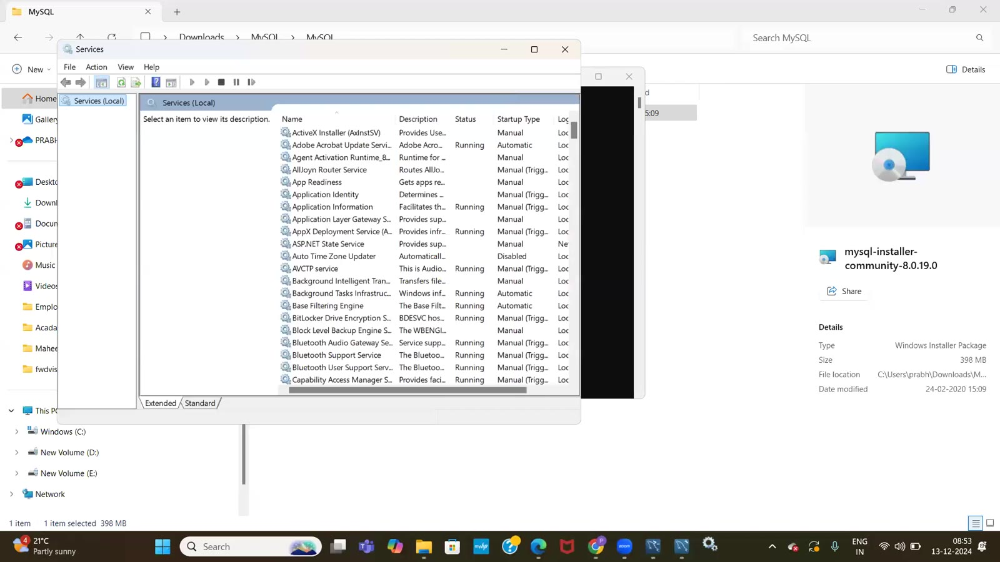

