# Day 28 — Slides and On-Screen Drawings

Frames captured from the Day 28 class recording (MuleSoft Telugu Course Day 28, recorded 14 Dec 2024). Repeated and blank frames have been removed. Times are positions in the video.

Notes for this day: [detailed-notes/day28.md](../../detailed-notes/day28.md) · [super-detailed-notes/day28.md](../../super-detailed-notes/day28.md) · [summary](../../day28.md)

| # | Time | Content |
|---|---|---|
| 01 | 3:13 | initialize-variables-sub-flow — Create Initial Variables (screen) |
| 02 | 12:48 | Configuration XML — Create Initial Variables: queryParams, uriParams, headers, startTime (now()), requestPayload (screen) |
| 03 | 13:09 | Resource flows — Flow Reference to the implementation flows; vars uriParams.empid (screen) |
| 04 | 14:41 | DataWeave Playground (screen) |
| 05 | 16:09 | Playground — now() returns the current date-time (screen) |
| 06 | 20:00 | Postman PATCH — 200 "employee details updated successfully in the db" (screen) |
| 07 | 28:50 | Start Logger message — output application/json indent = false: applicationName, fileName, source, destination, transactionId, memberId, startTime, tracePoint, message (screen) |
| 08 | 30:48 | Playground — indent=false prints JSON on a single line (screen) |
| 09 | 36:44 | Logger level options — INFO, DEBUG, WARN, ERROR, TRACE (screen) |
| 10 | 43:19 | post-employee-implementation-flow — Before / After DB loggers around Insert (screen) |
| 11 | 48:09 | log4j2.xml — RollingFile appender and AsyncRoot logger (screen) |
| 12 | 48:17 | log4j2.xml — HTTP wire logging at DEBUG, processor logger (screen) |
| 13 | 59:05 | Before HR DB logger — employeeId from requestPayload.empId, startDBTime: now(), tracePoint BEFORE_DB (screen) |
| 14 | 68:56 | post employees implementation flow started — destination "HR DB" logger (screen) |

---

### 01 — initialize-variables-sub-flow — Create Initial Variables (screen)
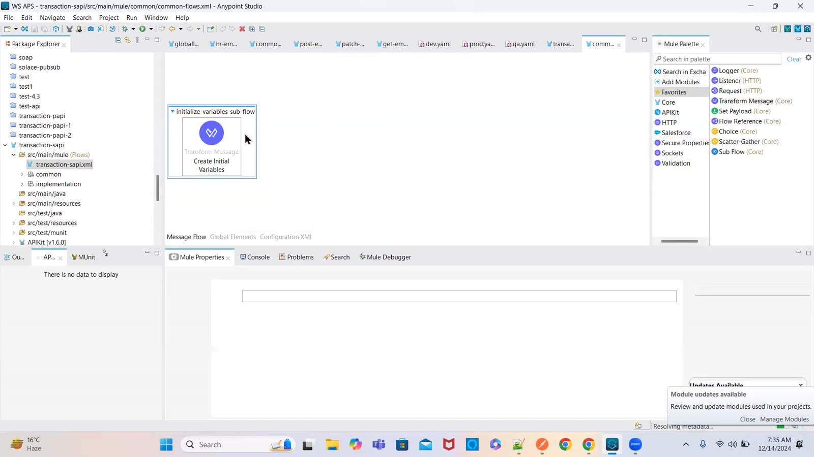

### 02 — Configuration XML — Create Initial Variables: queryParams, uriParams, headers, startTime (now()), requestPayload (screen)
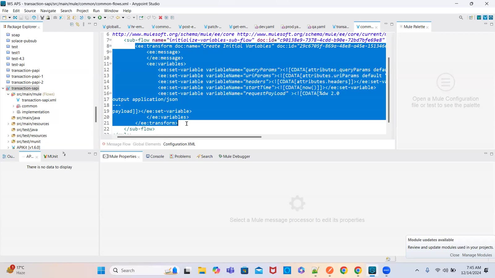

### 03 — Resource flows — Flow Reference to the implementation flows; vars uriParams.empid (screen)
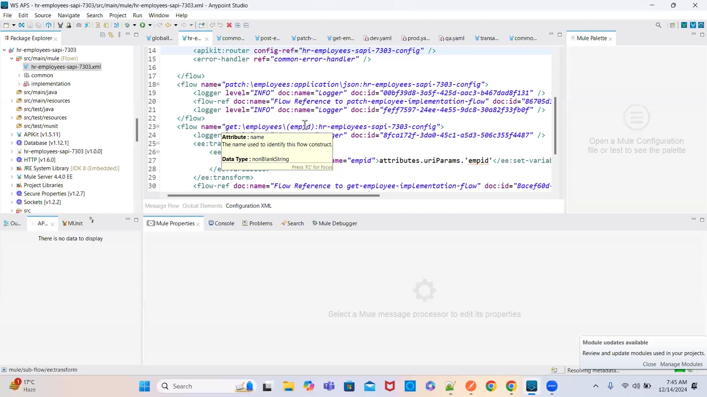

### 04 — DataWeave Playground (screen)
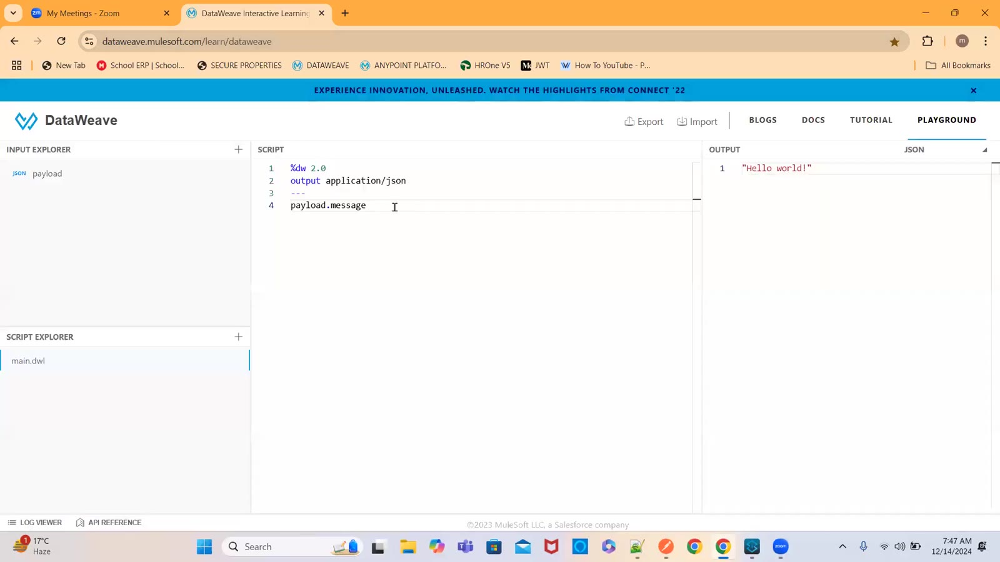

### 05 — Playground — now() returns the current date-time (screen)
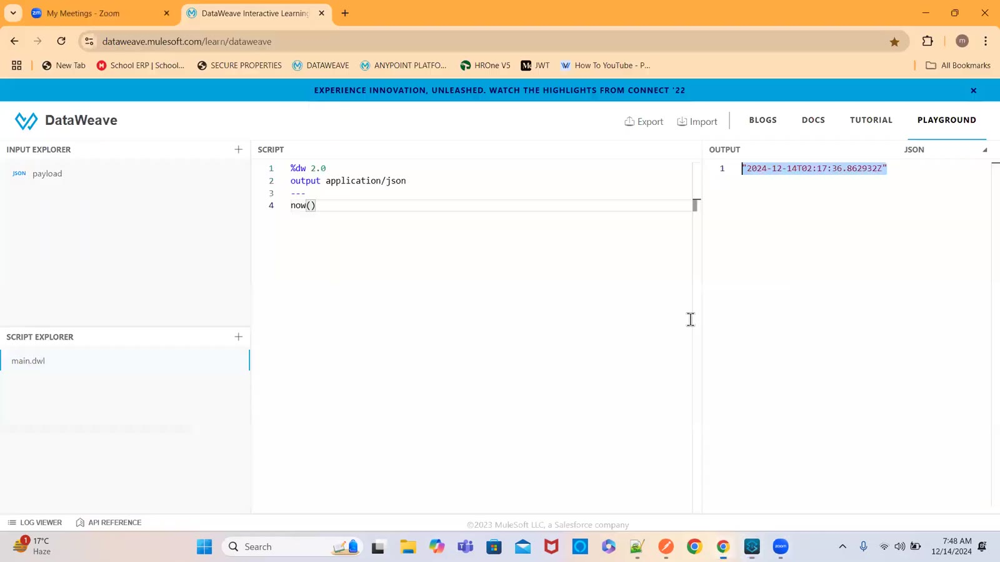

### 06 — Postman PATCH — 200 "employee details updated successfully in the db" (screen)
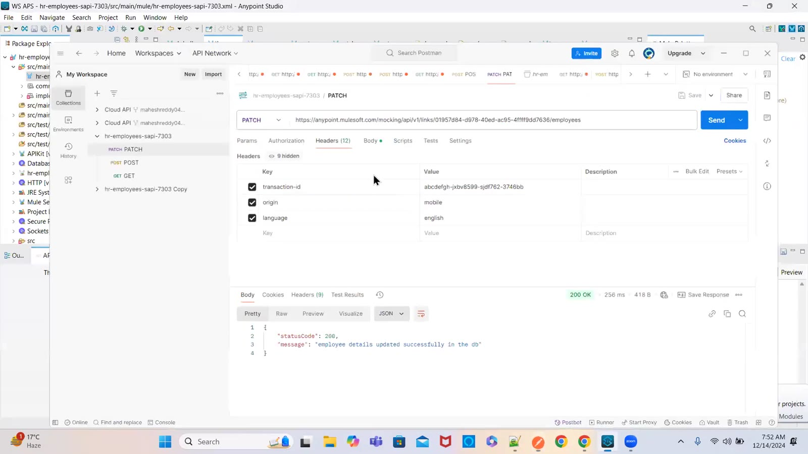

### 07 — Start Logger message — output application/json indent = false: applicationName, fileName, source, destination, transactionId, memberId, startTime, tracePoint, message (screen)
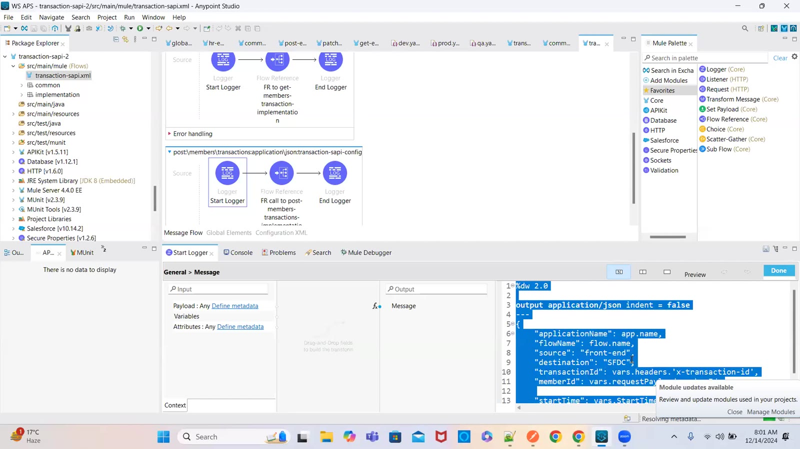

### 08 — Playground — indent=false prints JSON on a single line (screen)
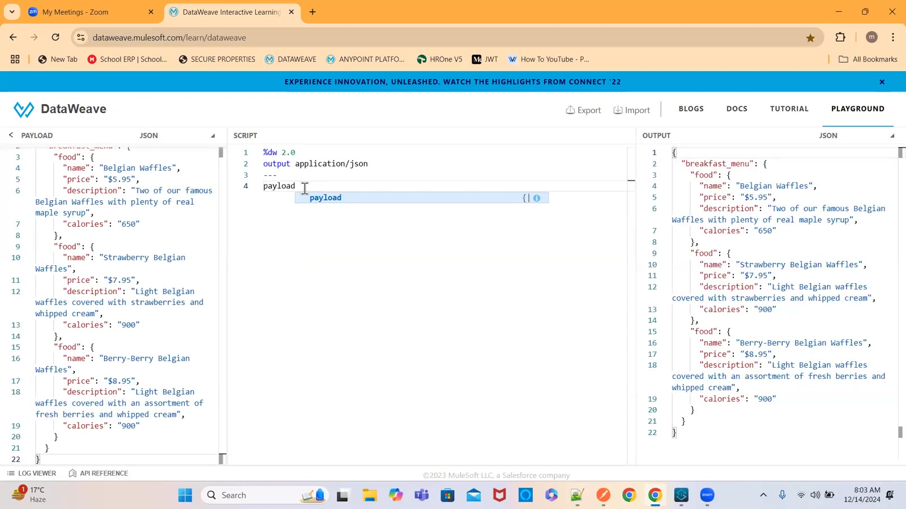

### 09 — Logger level options — INFO, DEBUG, WARN, ERROR, TRACE (screen)
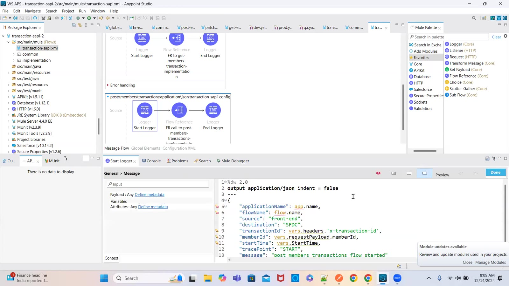

### 10 — post-employee-implementation-flow — Before / After DB loggers around Insert (screen)
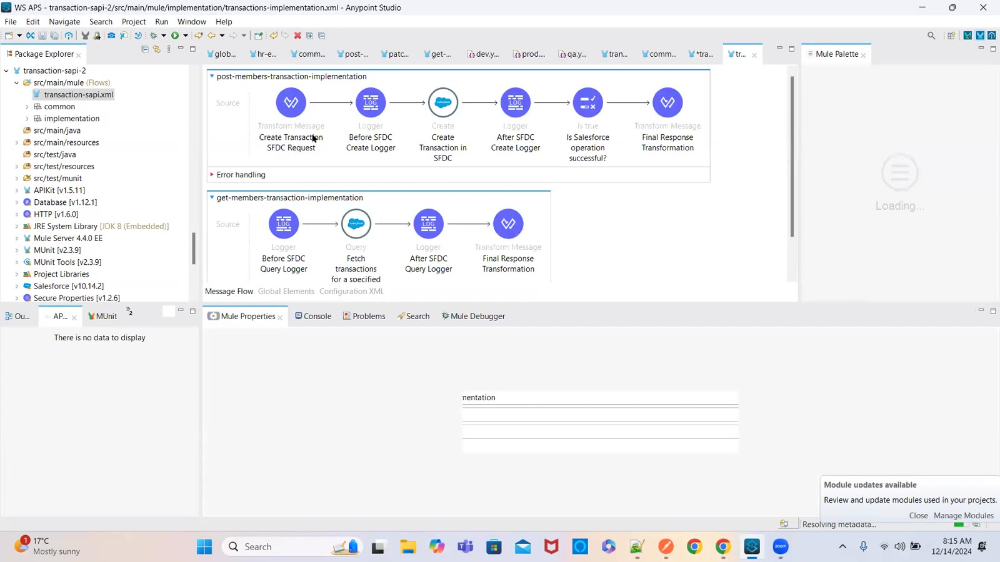

### 11 — log4j2.xml — RollingFile appender and AsyncRoot logger (screen)
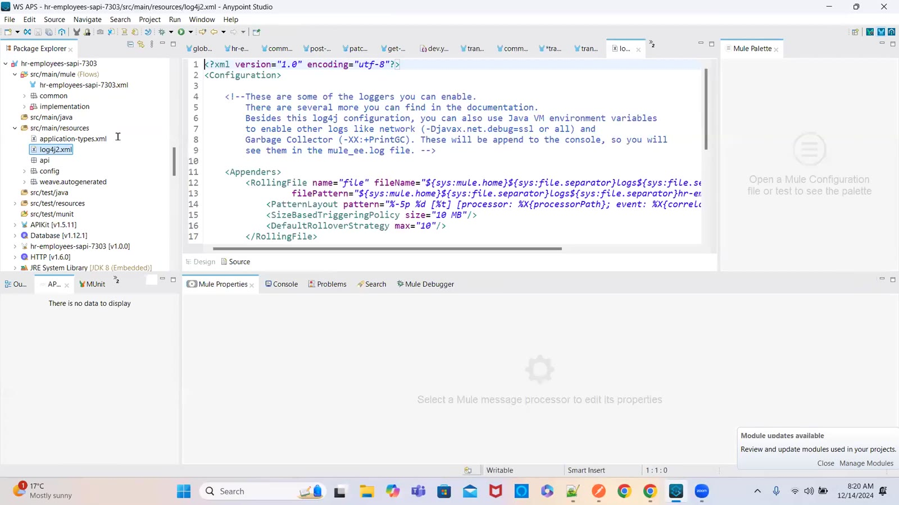

### 12 — log4j2.xml — HTTP wire logging at DEBUG, processor logger (screen)
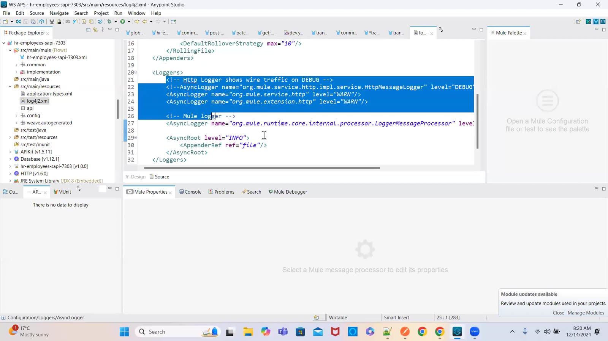

### 13 — Before HR DB logger — employeeId from requestPayload.empId, startDBTime: now(), tracePoint BEFORE_DB (screen)
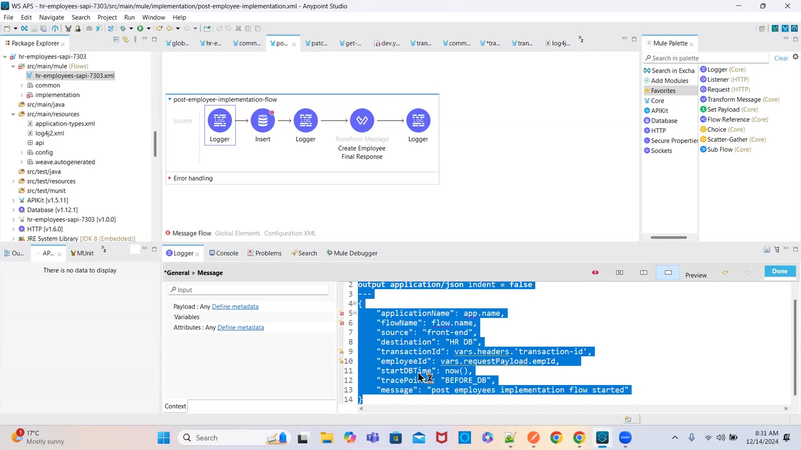

### 14 — post employees implementation flow started — destination "HR DB" logger (screen)
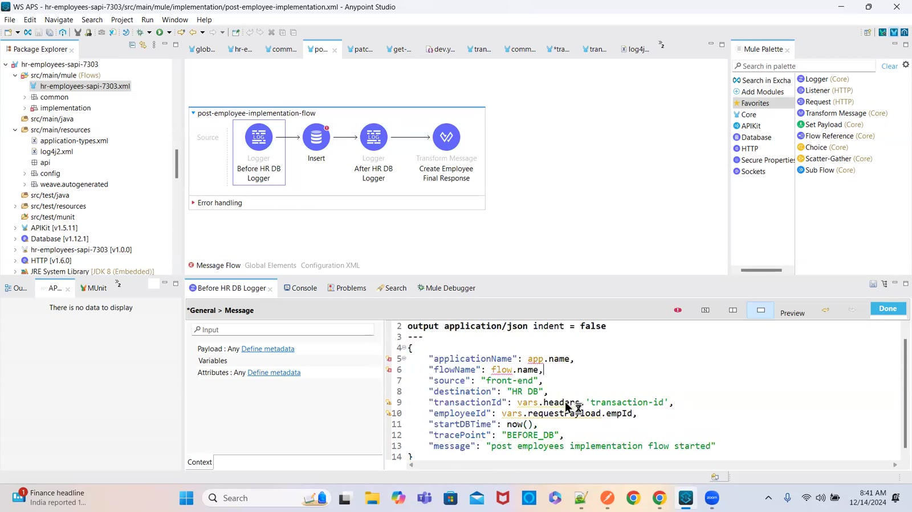

