# Day 32 — Slides and On-Screen Drawings

Drawings from the Day 32 class (19 Dec 2024): rate limiting and SLA tiers, spike control, HTTP caching, IP allow/block lists, JSON threat protection, and the Client ID Enforcement steps. Repeated and blank frames have been removed. Times are positions in the video.

Notes for this day: [detailed-notes/day32.md](../../detailed-notes/day32.md) · [super-detailed-notes/day32.md](../../super-detailed-notes/day32.md) · [summary](../../day32.md)

| # | Time | Content |
|---|---|---|
| 01 | 15:12 | *Drawing:* Rate limiting — fixed window; 100 req/min processing capacity, set e.g. 95/min; window starts at the first request (deploy 10:00, first request 10:10 → 10:10–10:11, 10:11–10:12 …); over the limit → **429 Too Many Requests** |
| 02 | 19:51 | *Drawing:* Real-world correlation — our API calls the Okta API, which allows 10,000 req/hour, so our rate limit must stay below it |
| 03 | 26:21 | *Drawing:* Rate limiting SLA = client ID + rate limit — tiers (Silver 1, Gold 2, Diamond 5 req/min), over-limit clients get 429; policy summary list |
| 04 | 30:08 | *Drawing:* Rate limiting SLA — Gold C1 50 req/min, Silver C2 25 req/min, Bronze C3 10 req/min against an API limited to 100/min |
| 05 | 30:13 | *Drawing:* Spike control — extra requests wait in a queue and are retried (e.g. 5-minute window, 10 requests; 20 arrive) |
| 06 | 43:54 | *Drawing:* Spike control with 5 req / 5 sec — sliding window over 0–5, 1–6 …; rejected after the retries → 429 |
| 07 | 57:42 | *Drawing:* Spike control (throttling) 5 req / 5 sec, sliding window; rate limiting 1000 req/hour 10:00–11:00, fixed window |
| 08 | 50:41 | *Drawing:* HTTP caching — PAN verification API (NSDL) paid per call; cache answers repeats (TL/HL/PL loan apps calling one Mule API) |
| 09 | 57:30 | *Drawing:* When **not** to cache — HR resignations data changes daily (Nov 25, Oct 50, Dec 10+), so a cached answer would be stale |
| 10 | 57:34 | *Drawing:* Cache duration — e.g. ICICI Bank → NSDL PAN data, cache for days (asked 10 times, called once) |
| 11 | 57:53 | *Drawing:* IP allowlist (only 10.1.25.1–.3 allowed) vs IP blocklist (10.1.25.100–.102 blocked) |
| 12 | 57:52 | *Drawing:* JSON threat protection — gateway checks the JSON (depth, lengths) before the API; same for XML |
| 13 | 59:50 | Design Center: postRequestDataType.raml (empName string, required, example "mahesh") — RAML can also set limits like maxLength/minLength |
| 14 | 44:03 | *Drawing:* Steps to apply Client ID Enforcement — 1 create asset/application in API Manager, 2 apply the policy, 3 in Exchange request access to create client credentials, 4 configure autodiscovery ID and redeploy to CloudHub |

---

### 01 — *Drawing:* Rate limiting — fixed window; 100 req/min processing capacity, set e.g. 95/min; window starts at the first request (deploy 10:00, first request 10:10 → 10:10–10:11, 10:11–10:12 …); over the limit → **429 Too Many Requests**
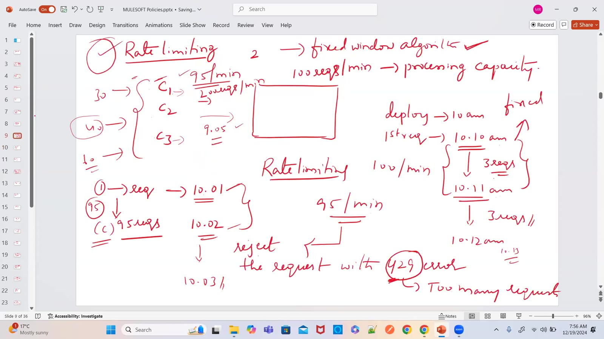

### 02 — *Drawing:* Real-world correlation — our API calls the Okta API, which allows 10,000 req/hour, so our rate limit must stay below it
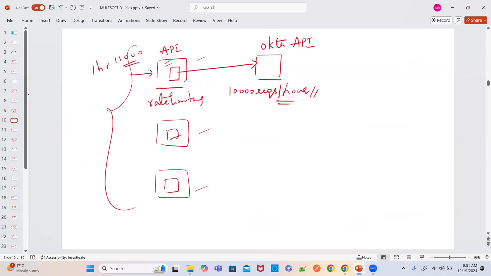

### 03 — *Drawing:* Rate limiting SLA = client ID + rate limit — tiers (Silver 1, Gold 2, Diamond 5 req/min), over-limit clients get 429; policy summary list
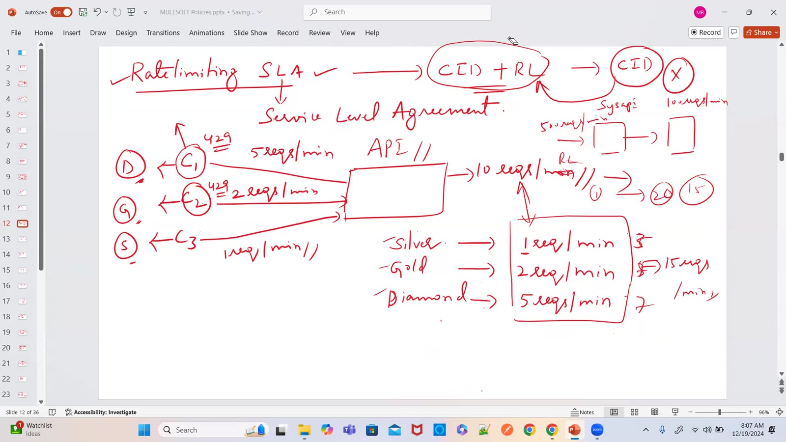

### 04 — *Drawing:* Rate limiting SLA — Gold C1 50 req/min, Silver C2 25 req/min, Bronze C3 10 req/min against an API limited to 100/min
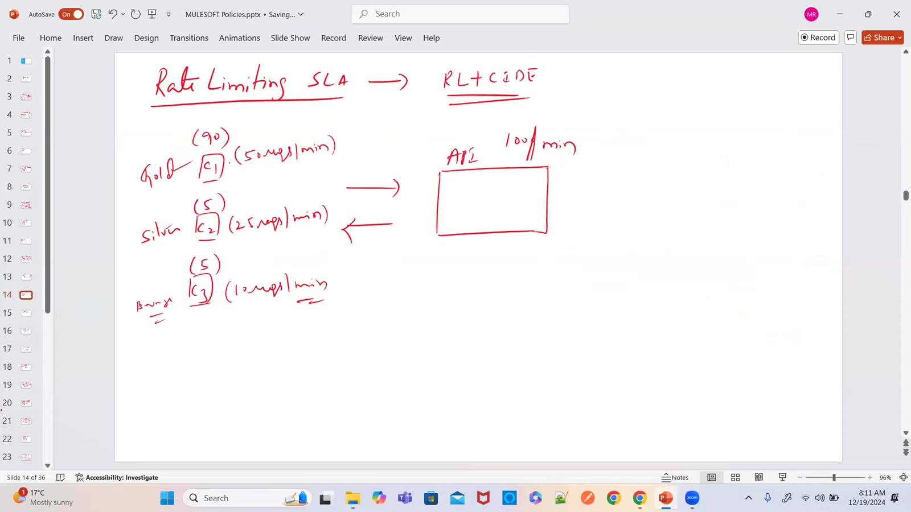

### 05 — *Drawing:* Spike control — extra requests wait in a queue and are retried (e.g. 5-minute window, 10 requests; 20 arrive)
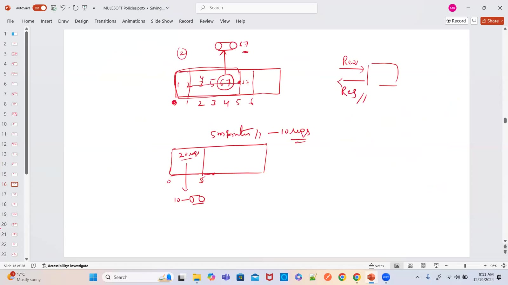

### 06 — *Drawing:* Spike control with 5 req / 5 sec — sliding window over 0–5, 1–6 …; rejected after the retries → 429
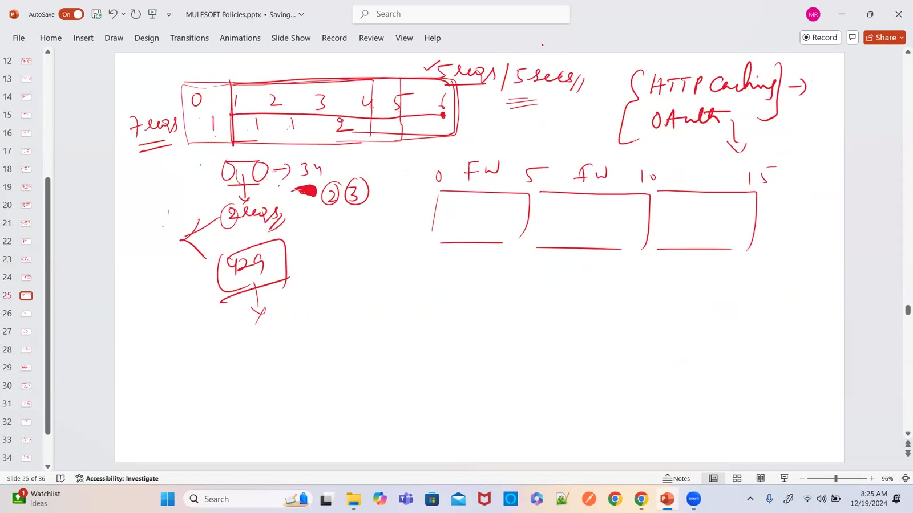

### 07 — *Drawing:* Spike control (throttling) 5 req / 5 sec, sliding window; rate limiting 1000 req/hour 10:00–11:00, fixed window
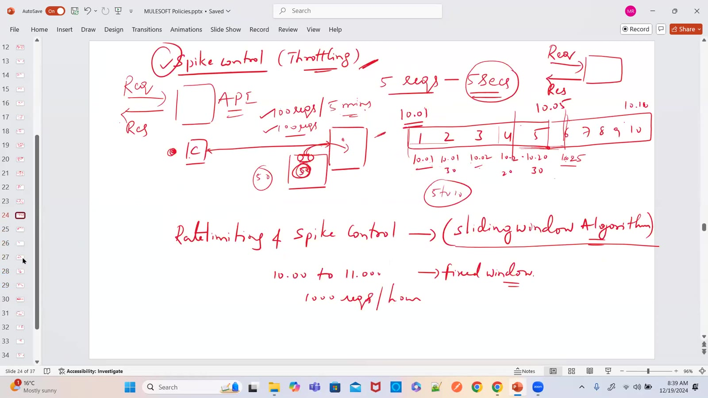

### 08 — *Drawing:* HTTP caching — PAN verification API (NSDL) paid per call; cache answers repeats (TL/HL/PL loan apps calling one Mule API)
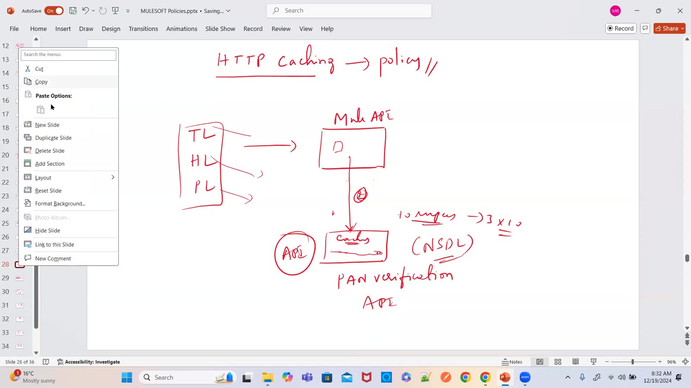

### 09 — *Drawing:* When **not** to cache — HR resignations data changes daily (Nov 25, Oct 50, Dec 10+), so a cached answer would be stale
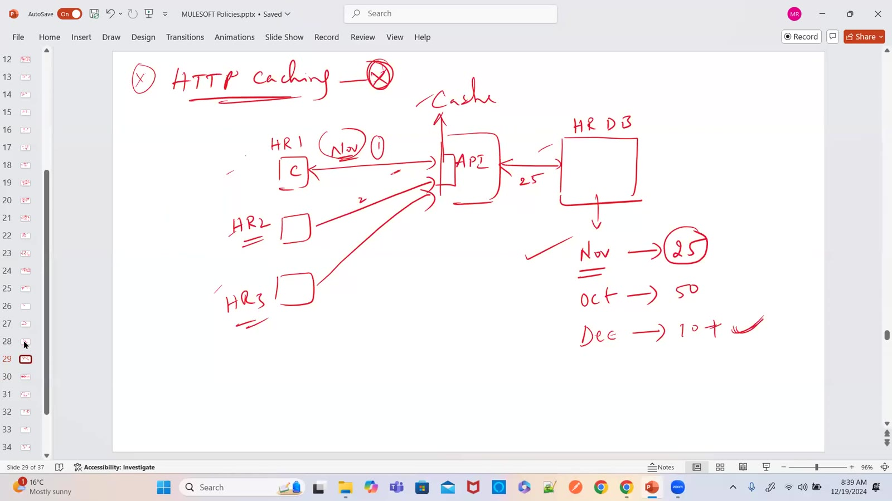

### 10 — *Drawing:* Cache duration — e.g. ICICI Bank → NSDL PAN data, cache for days (asked 10 times, called once)
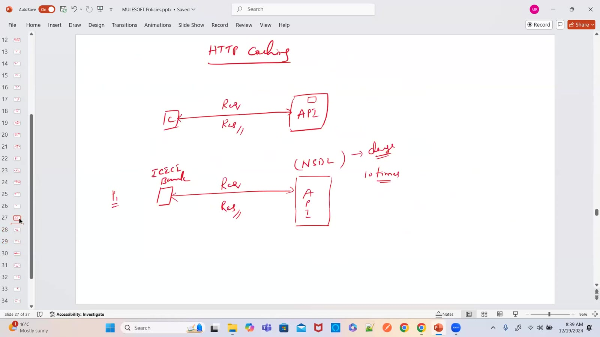

### 11 — *Drawing:* IP allowlist (only 10.1.25.1–.3 allowed) vs IP blocklist (10.1.25.100–.102 blocked)
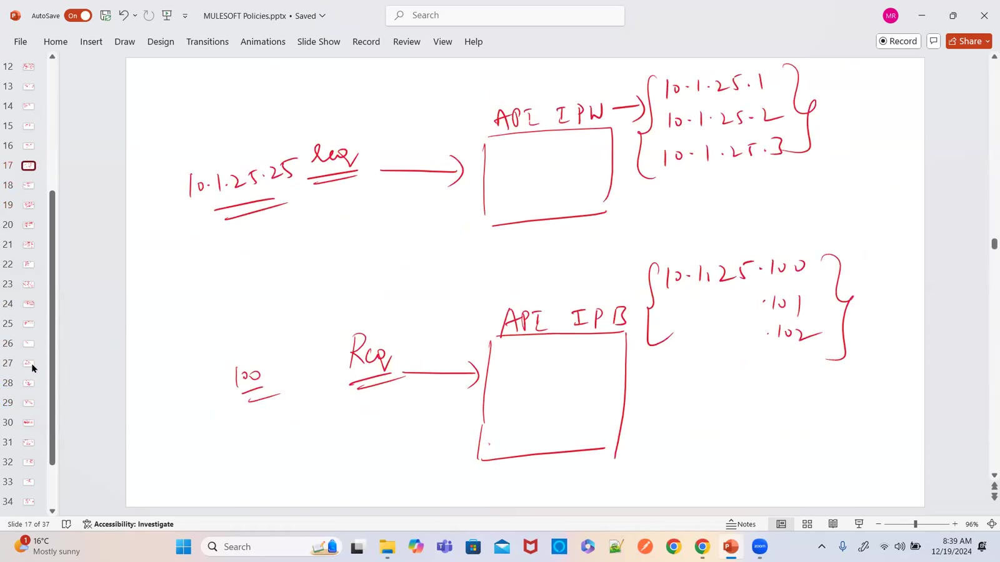

### 12 — *Drawing:* JSON threat protection — gateway checks the JSON (depth, lengths) before the API; same for XML
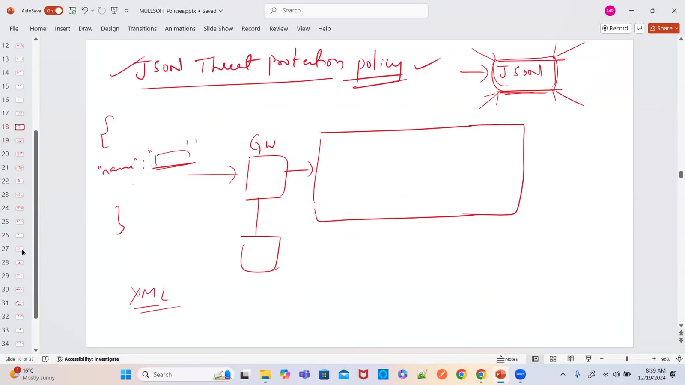

### 13 — Design Center: postRequestDataType.raml (empName string, required, example "mahesh") — RAML can also set limits like maxLength/minLength
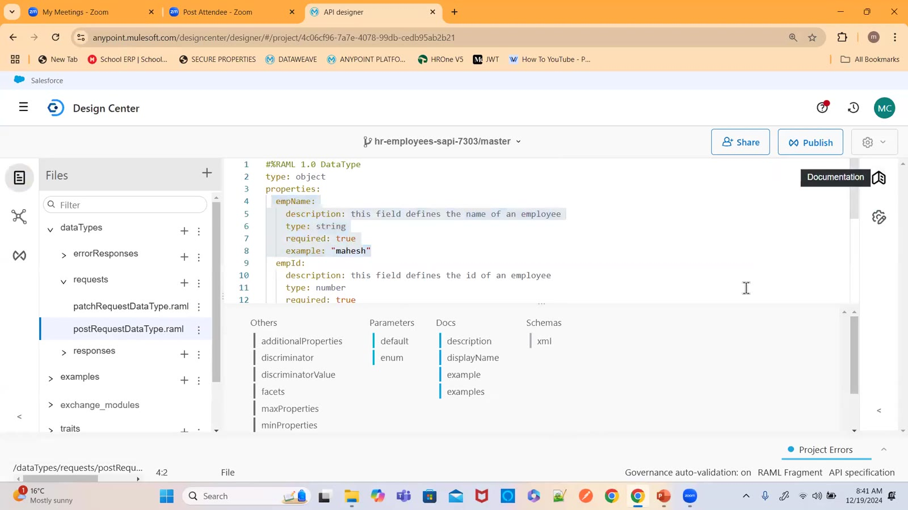

### 14 — *Drawing:* Steps to apply Client ID Enforcement — 1 create asset/application in API Manager, 2 apply the policy, 3 in Exchange request access to create client credentials, 4 configure autodiscovery ID and redeploy to CloudHub
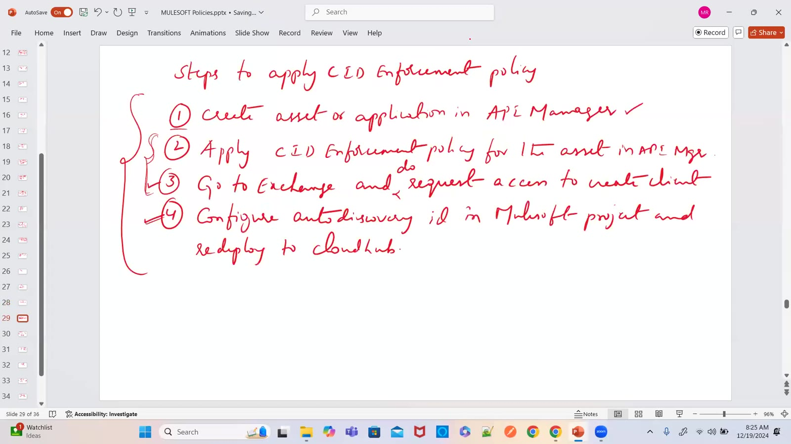

