# Day 34 — Slides and On-Screen Drawings

Slides and drawings from the Day 34 class (21 Dec 2024): the client credentials and resource owner password grants, OAuth on our API, and JWT with the jwt.io demo and the JWT validation policy. Repeated and blank frames have been removed. Times are positions in the video.

Notes for this day: [detailed-notes/day34.md](../../detailed-notes/day34.md) · [super-detailed-notes/day34.md](../../super-detailed-notes/day34.md) · [summary](../../day34.md)

| # | Time | Content |
|---|---|---|
| 01 | 0:01 | OAuth 2.0 Flow — Client Credentials Grant: Zomato (client) → /token + Client_ID + Client_Secret → Authorization Server → accessToken → /getPizzaTypes + accessToken → Resource Server (pizza types, offers, restaurants) → /validate |
| 02 | 33:28 | Client credentials annotated: Domino's as resource owner (×), Zomato front end ↔ web server, client ID/secret held by the client app; server-to-server |
| 03 | 12:41 | Grant type — Client Credentials: token from client credentials; no ownership of resources — data common to everyone; server-to-server communication |
| 04 | 33:07 | *Drawing:* our API with OAuth — ABC company's OAuth server (Okta / Auth0, the AS) issues a 1-hour token for client ID + secret; client caches the token (object store) and sends token + request to our API |
| 05 | 35:56 | OAuth 2.0 Flow — Resource Owner Password Grant: /token + client credentials + user credentials → accessToken → /getOrders + accessToken → orders, memberships, offers, favourites |
| 06 | 45:51 | Grant type — Resource Owner Password: token from client credentials plus resource owner credentials; ownership with the user; to get the specific user's data from the client app's server |
| 07 | 44:48 | Grant type — Authorization Code (recap): token from the authorization code; sign up using third-party apps |
| 08 | 46:30 | JWT — JSON Web Token; format: compact, self-contained JSON object; structure: header, payload and signature separated by dots |
| 09 | 47:58 | jwt.io — "JSON Web Tokens are an open, industry standard RFC 7519 method for representing claims securely between two parties" |
| 10 | 48:50 | jwt.io debugger — encoded token (header.payload.signature) and decoded header `{"alg": "HS256", "typ": "JWT"}`, payload `{"sub": "1234567890", "name": "John Doe", "iat": 1516239022}` |
| 11 | 50:51 | jwt.io — VERIFY SIGNATURE: HMACSHA256(base64UrlEncode(header) + "." + base64UrlEncode(payload), secret) → "Signature Verified" |
| 12 | 51:41 | *Drawing:* opaque token — gateway asks the AS to validate every request; JWT — the token carries its own claims, validated with the JWT policy |
| 13 | 51:47 | *Drawing:* PM / client generates the token via /generate on Auth0, then sends token + request to an experience API protected with JWT |
| 14 | 51:54 | *Drawing:* sender encrypts with key 1, receiver decrypts with key 2 — symmetric (same key) vs asymmetric (key pair) encryption |
| 15 | 69:47 | *Drawing:* JWT validation policy — auth server (Okta/Auth0) signs with its **private cert**; the JWT policy on the resource server validates with the **public cert**, no call to the auth server per request |

---

### 01 — OAuth 2.0 Flow — Client Credentials Grant: Zomato (client) → /token + Client_ID + Client_Secret → Authorization Server → accessToken → /getPizzaTypes + accessToken → Resource Server (pizza types, offers, restaurants) → /validate
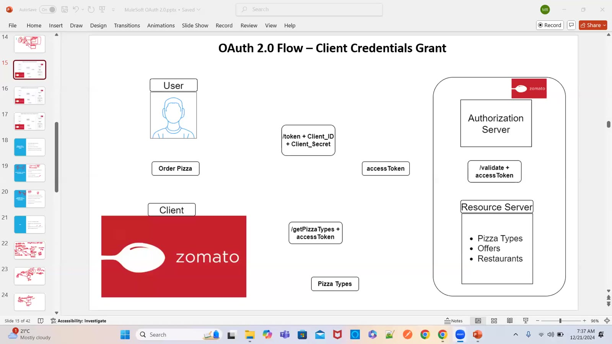

### 02 — Client credentials annotated: Domino's as resource owner (×), Zomato front end ↔ web server, client ID/secret held by the client app; server-to-server
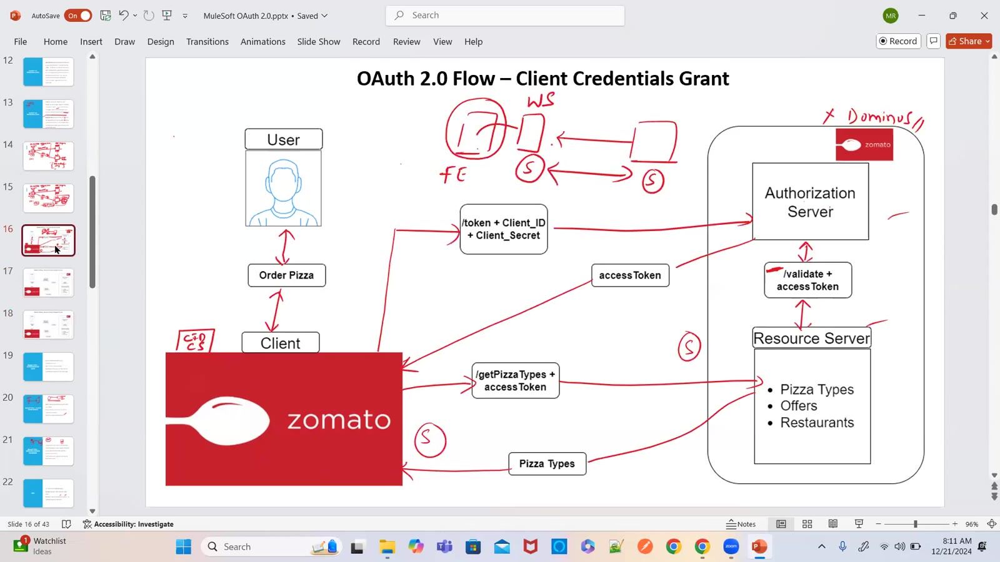

### 03 — Grant type — Client Credentials: token from client credentials; no ownership of resources — data common to everyone; server-to-server communication
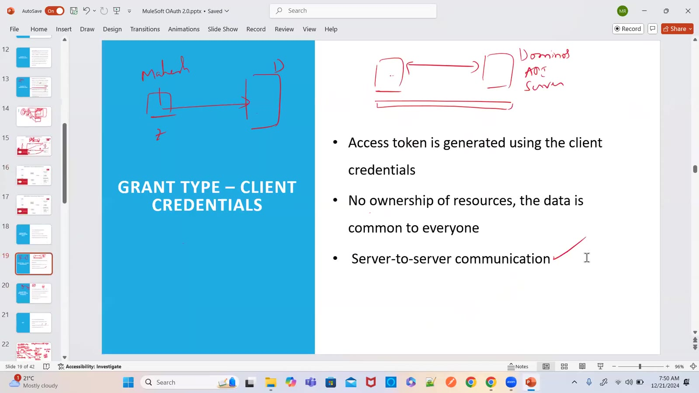

### 04 — *Drawing:* our API with OAuth — ABC company's OAuth server (Okta / Auth0, the AS) issues a 1-hour token for client ID + secret; client caches the token (object store) and sends token + request to our API
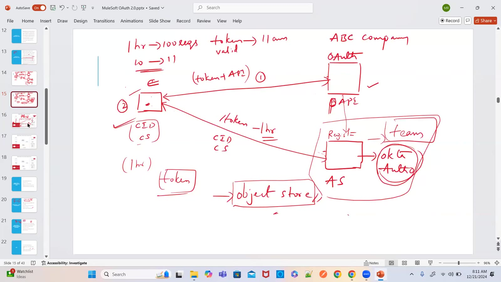

### 05 — OAuth 2.0 Flow — Resource Owner Password Grant: /token + client credentials + user credentials → accessToken → /getOrders + accessToken → orders, memberships, offers, favourites
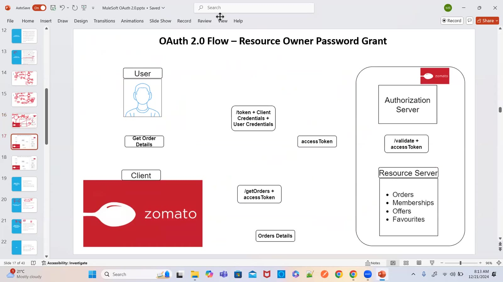

### 06 — Grant type — Resource Owner Password: token from client credentials plus resource owner credentials; ownership with the user; to get the specific user's data from the client app's server
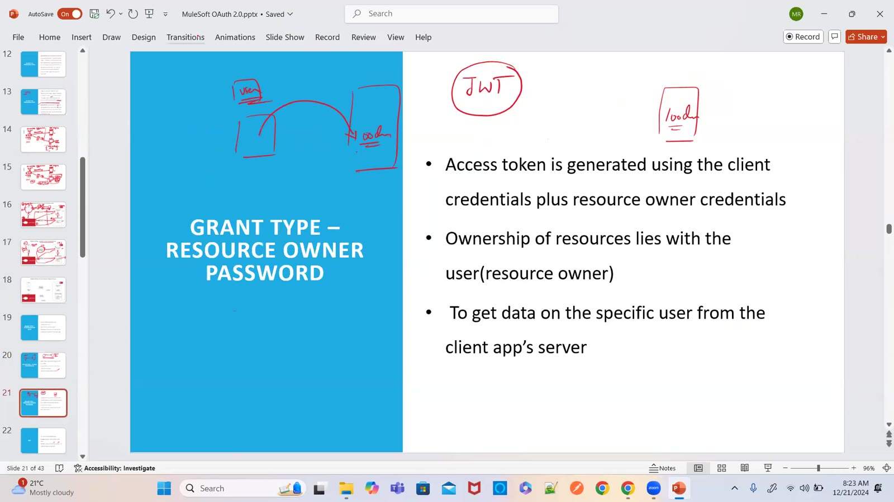

### 07 — Grant type — Authorization Code (recap): token from the authorization code; sign up using third-party apps
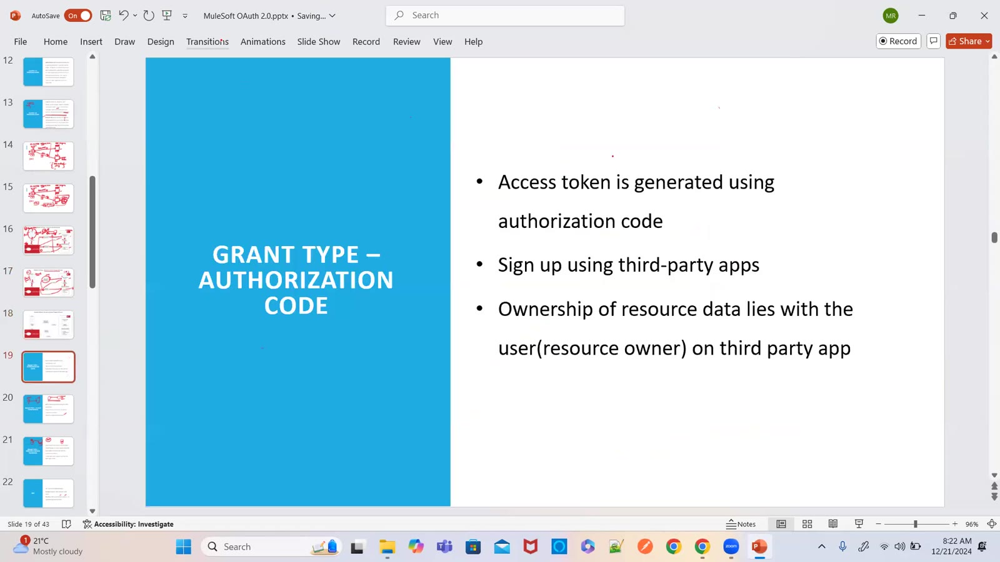

### 08 — JWT — JSON Web Token; format: compact, self-contained JSON object; structure: header, payload and signature separated by dots
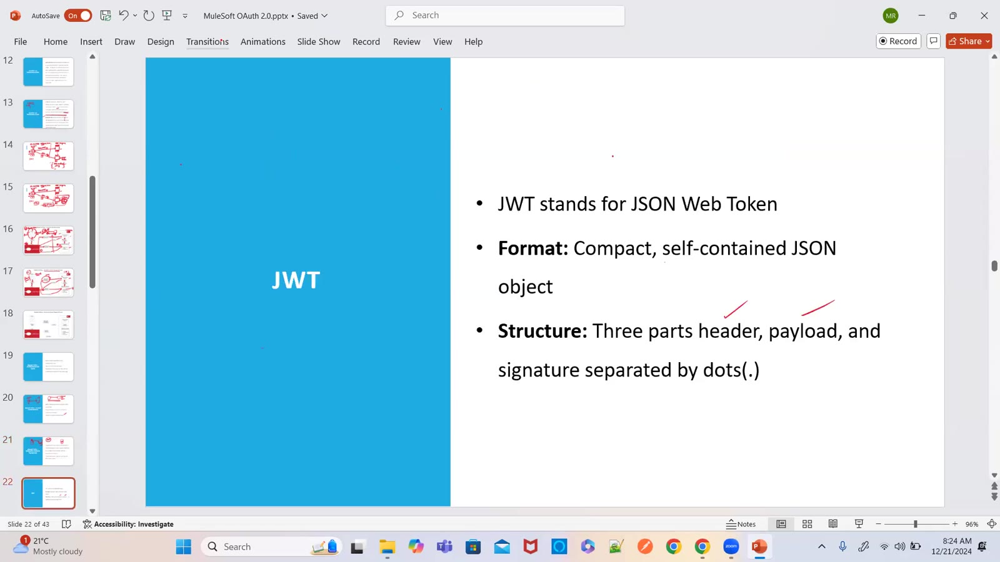

### 09 — jwt.io — "JSON Web Tokens are an open, industry standard RFC 7519 method for representing claims securely between two parties"
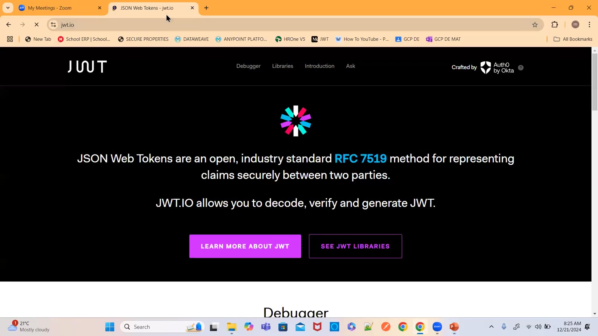

### 10 — jwt.io debugger — encoded token (header.payload.signature) and decoded header `{"alg": "HS256", "typ": "JWT"}`, payload `{"sub": "1234567890", "name": "John Doe", "iat": 1516239022}`
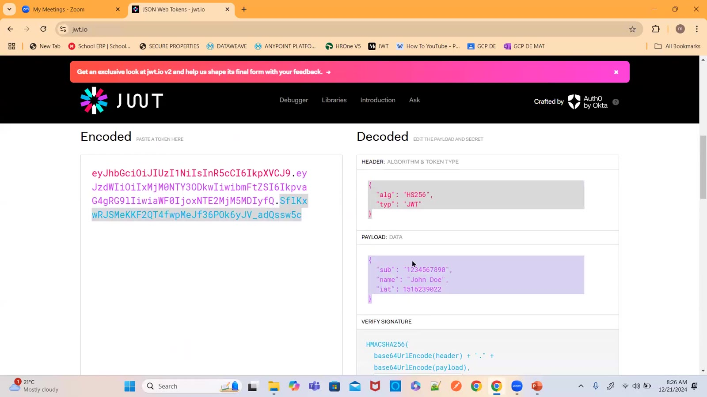

### 11 — jwt.io — VERIFY SIGNATURE: HMACSHA256(base64UrlEncode(header) + "." + base64UrlEncode(payload), secret) → "Signature Verified"
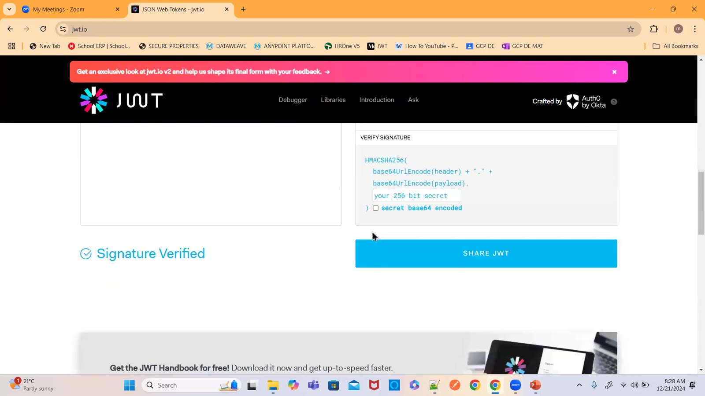

### 12 — *Drawing:* opaque token — gateway asks the AS to validate every request; JWT — the token carries its own claims, validated with the JWT policy
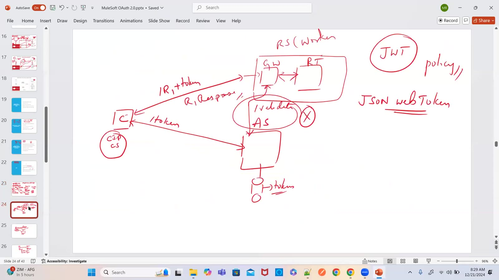

### 13 — *Drawing:* PM / client generates the token via /generate on Auth0, then sends token + request to an experience API protected with JWT
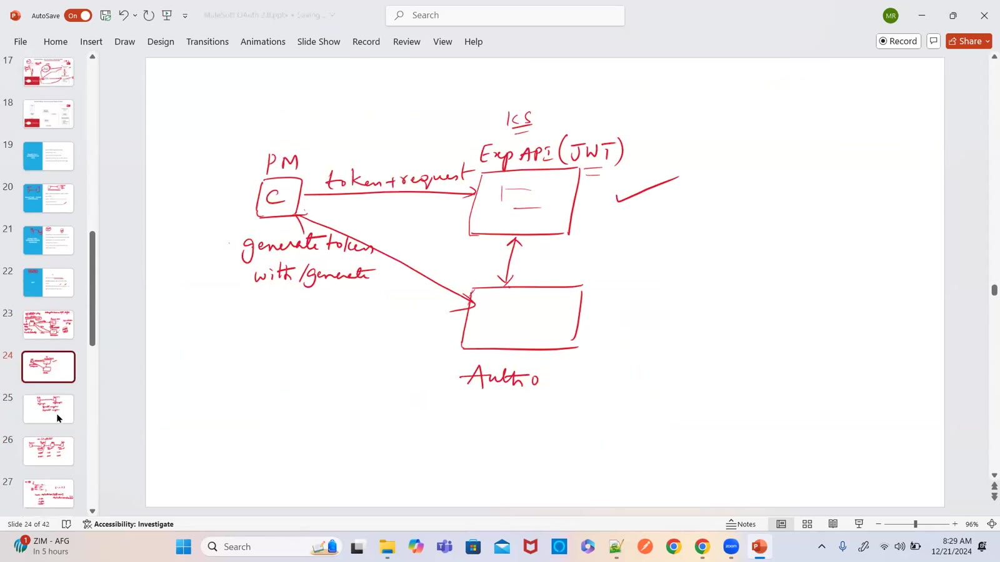

### 14 — *Drawing:* sender encrypts with key 1, receiver decrypts with key 2 — symmetric (same key) vs asymmetric (key pair) encryption
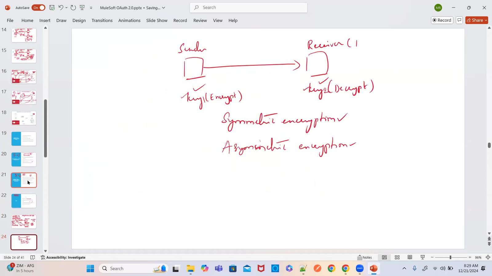

### 15 — *Drawing:* JWT validation policy — auth server (Okta/Auth0) signs with its **private cert**; the JWT policy on the resource server validates with the **public cert**, no call to the auth server per request
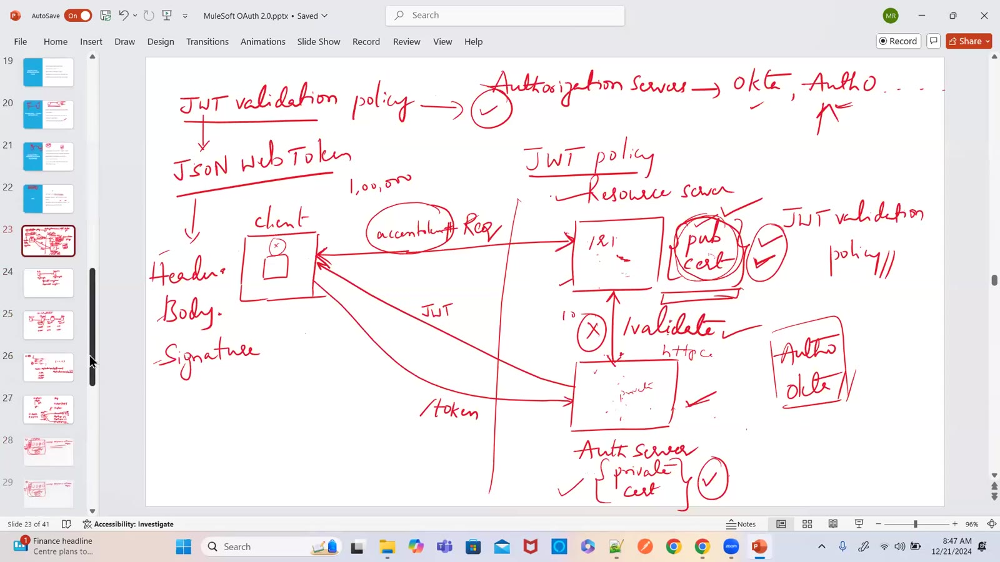

