# Day 41 — Slides and On-Screen Drawings

Screens from the Day 41 class (6 Jan 2025): consuming the dneonline calculator SOAP service with the Web Service Consumer — reading the WSDL, the consumer config, transforming JSON to SOAP XML, and mapping the SOAP response back to JSON. Repeated and blank frames have been removed. Times are positions in the video.

Notes for this day: [detailed-notes/day41.md](../../detailed-notes/day41.md) · [super-detailed-notes/day41.md](../../super-detailed-notes/day41.md) · [summary](../../day41.md)

| # | Time | Content |
|---|---|---|
| 01 | 0:03 | Reference project consume-soap-service-730: Listener → Start Logger → Set XML input for SOAP calculator service → Before SOAP Logger → Consume Calculator SOAP service → After SOAP Logger → Final Response → End Logger |
| 02 | 3:57 | *Drawing:* a SOAP service consumed through the SOAP connector (Web Service Consumer) inside our Mule app |
| 03 | 5:45 | The SOAP service's WSDL — http://www.dneonline.com/calculator.asmx?WSDL (types: Add, AddResponse, Subtract, Multiply, Divide) |
| 04 | 6:50 | WSDL operations and binding — Add, Subtract, Multiply, Divide; soapAction http://tempuri.org/Add, CalculatorSoap / CalculatorSoap12 |
| 05 | 8:08 | Web Service Consumer Config: WSDL location http://www.dneonline.com/calculator.asmx?WSDL, Service Calculator, Port CalculatorSoap, Address http://www.dneonline.com/calculator.asmx |
| 06 | 8:15 | New Mule project consume-soap-service-7303 (Mule Server 4.4.0 EE) |
| 07 | 9:34 | Add Modules → Web Service Consumer; Consume operation dragged into the flow after the Listener (path /soap) |
| 08 | 11:05 | *Drawing:* JSON request → transform to XML → SOAP connector → XML response |
| 09 | 12:26 | *Drawing:* the request body `{"integer1": 100, "integer2": 105}` sent from Postman |
| 10 | 12:50 | Consumer config General tab: SOAP version SOAP11 (default), MTOM enabled false |
| 11 | 14:57 | Finding the service name (Calculator) and port (CalculatorSoap / CalculatorSoap12) in the WSDL |
| 12 | 15:45 | Consume: connector config Web_Service_Consumer_Config, Operation **Add**, Body `payload` |
| 13 | 20:44 | Transform Message → Define metadata for the input (JSON example: num1, num2) |
| 14 | 27:59 | Transform to SOAP: `output application/xml` / `ns ns0 http://tempuri.org/` / `ns0#Add: { ns0#intA: payload.num1, ns0#intB: payload.num2 }` |
| 15 | 35:05 | Mule Debugger: payload is a SoapOutputEnvelope — body `<AddResponse xmlns="http://tempuri.org/"><AddResult>395</AddResult></AddResponse>`, headers, attachments |
| 16 | 39:22 | Postman GET http://localhost:8081/soap with `{"num1": 195, "num2": 200}` → 200 — `body:<AddResponse …><AddResult>395</AddResult></AddResponse>` |
| 17 | 41:11 | Final Transform: `output json` / `{ Response: payload.body.AddResponse.AddResult, "serviceused": "addition" }` |
| 18 | 42:19 | Postman → 200 `{"Response": "395", "serviceused": "addition"}` |
| 19 | 43:27 | WSDL service section: port CalculatorSoap12 (binding tns:CalculatorSoap12) — used for the SOAP 1.2 discussion |
| 20 | 44:29 | A student's flow during Q&A (Listener → Transform → Consume → Transform → Logger) |

---

### 01 — Reference project consume-soap-service-730: Listener → Start Logger → Set XML input for SOAP calculator service → Before SOAP Logger → Consume Calculator SOAP service → After SOAP Logger → Final Response → End Logger
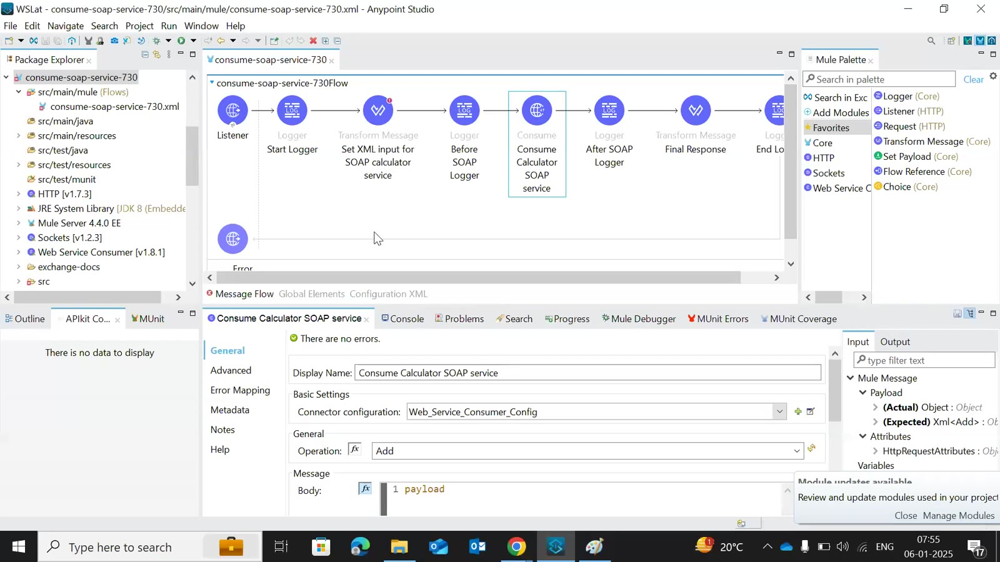

### 02 — *Drawing:* a SOAP service consumed through the SOAP connector (Web Service Consumer) inside our Mule app
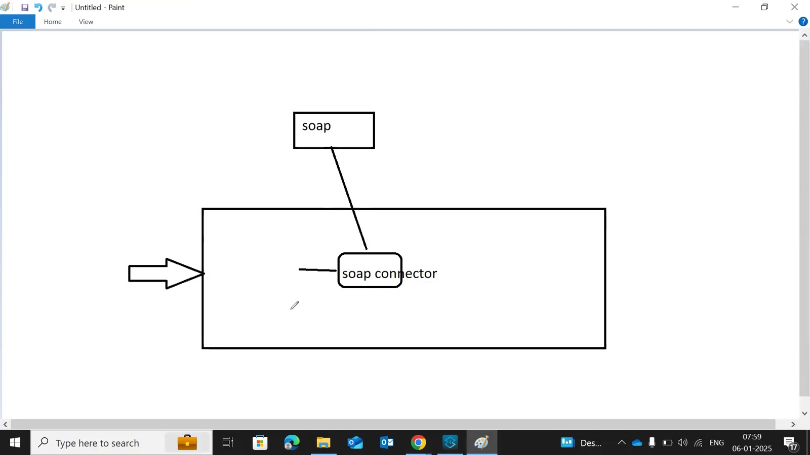

### 03 — The SOAP service's WSDL — http://www.dneonline.com/calculator.asmx?WSDL (types: Add, AddResponse, Subtract, Multiply, Divide)

### 04 — WSDL operations and binding — Add, Subtract, Multiply, Divide; soapAction http://tempuri.org/Add, CalculatorSoap / CalculatorSoap12
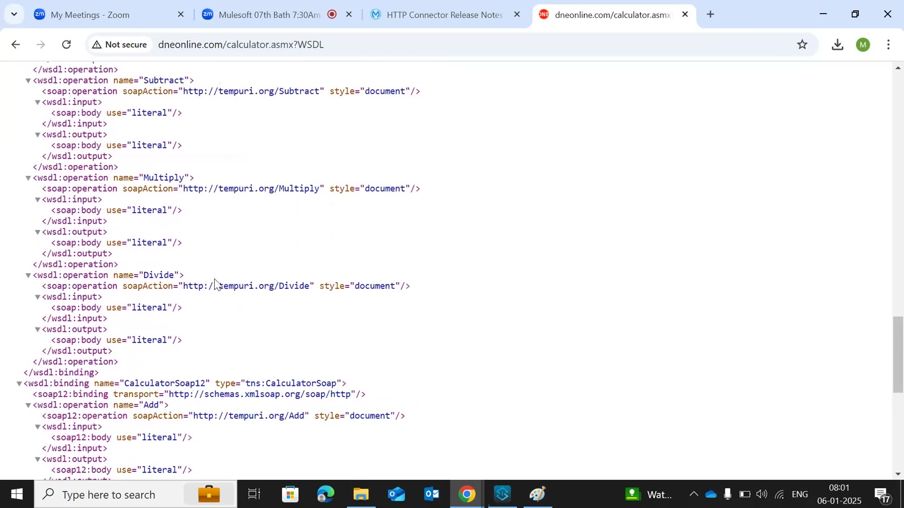

### 05 — Web Service Consumer Config: WSDL location http://www.dneonline.com/calculator.asmx?WSDL, Service Calculator, Port CalculatorSoap, Address http://www.dneonline.com/calculator.asmx

### 06 — New Mule project consume-soap-service-7303 (Mule Server 4.4.0 EE)
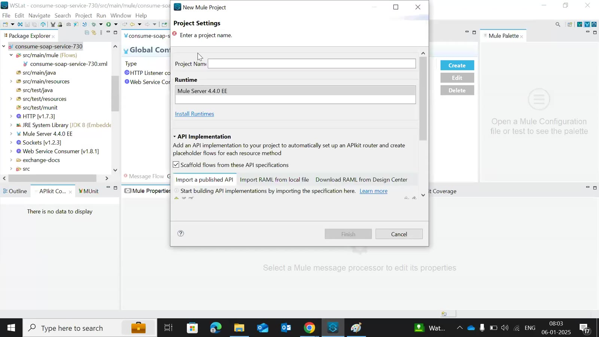

### 07 — Add Modules → Web Service Consumer; Consume operation dragged into the flow after the Listener (path /soap)
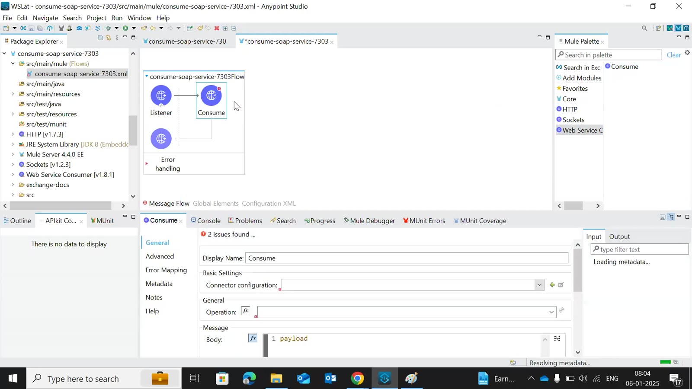

### 08 — *Drawing:* JSON request → transform to XML → SOAP connector → XML response
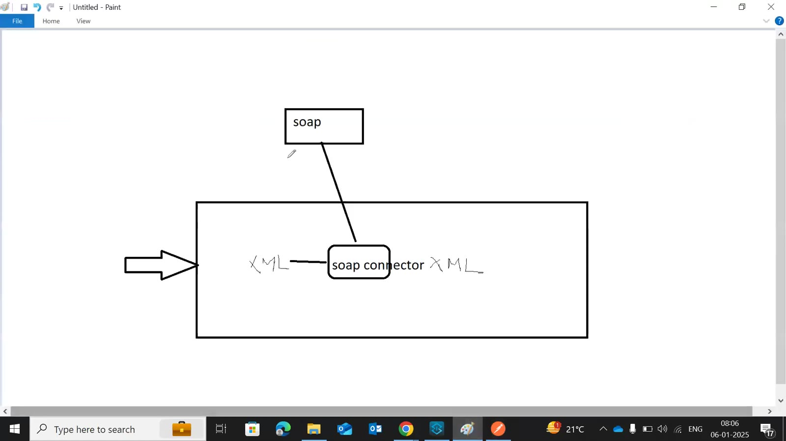

### 09 — *Drawing:* the request body `{"integer1": 100, "integer2": 105}` sent from Postman
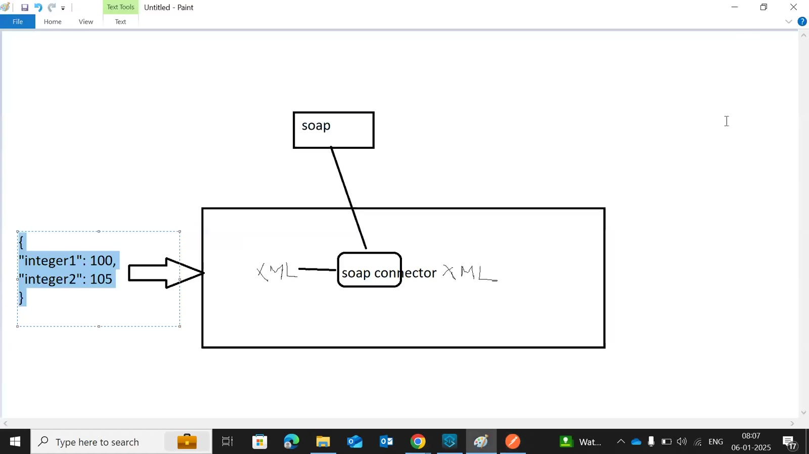

### 10 — Consumer config General tab: SOAP version SOAP11 (default), MTOM enabled false
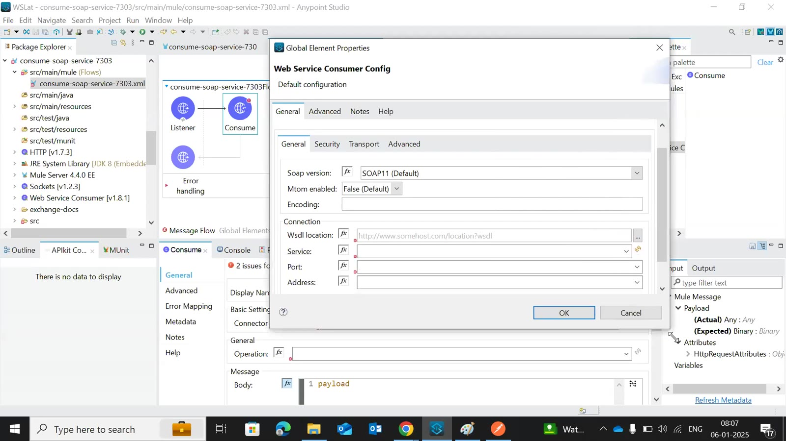

### 11 — Finding the service name (Calculator) and port (CalculatorSoap / CalculatorSoap12) in the WSDL
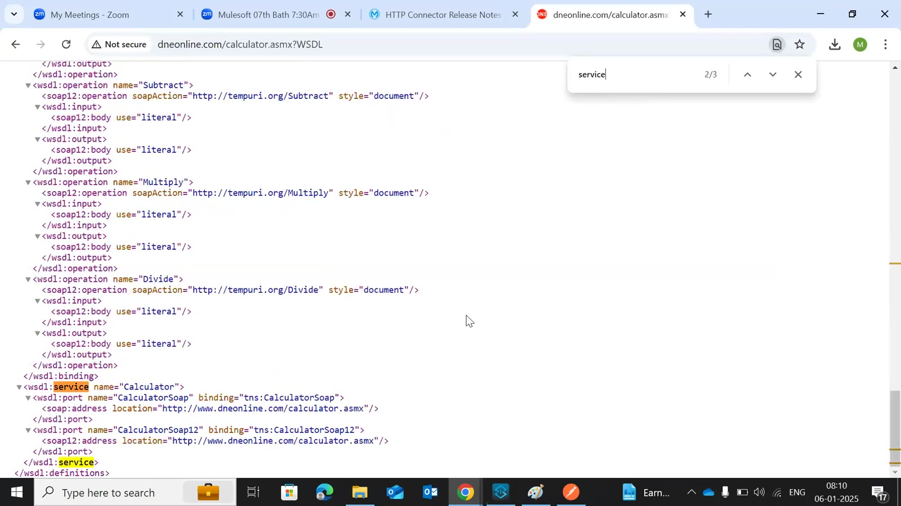

### 12 — Consume: connector config Web_Service_Consumer_Config, Operation **Add**, Body `payload`
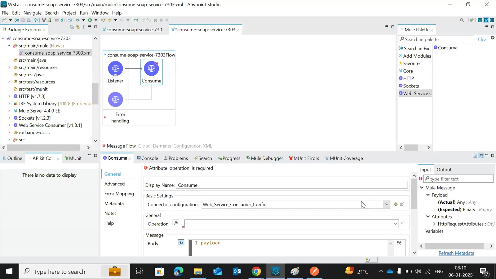

### 13 — Transform Message → Define metadata for the input (JSON example: num1, num2)
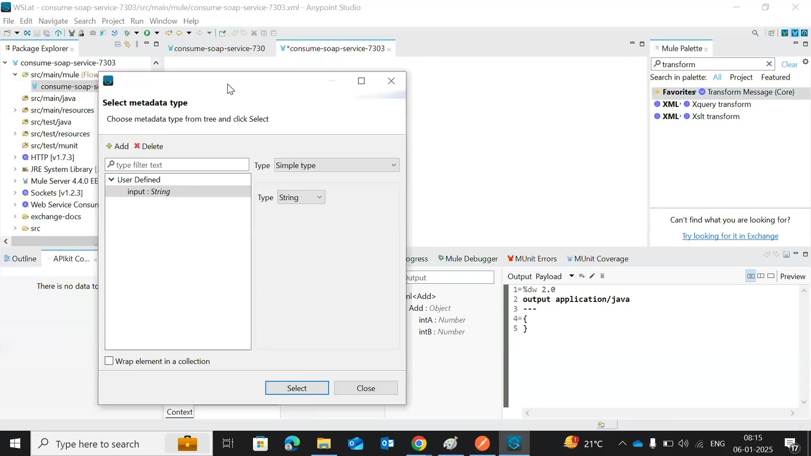

### 14 — Transform to SOAP: `output application/xml` / `ns ns0 http://tempuri.org/` / `ns0#Add: { ns0#intA: payload.num1, ns0#intB: payload.num2 }`

### 15 — Mule Debugger: payload is a SoapOutputEnvelope — body `<AddResponse xmlns="http://tempuri.org/"><AddResult>395</AddResult></AddResponse>`, headers, attachments

### 16 — Postman GET http://localhost:8081/soap with `{"num1": 195, "num2": 200}` → 200 — `body:<AddResponse …><AddResult>395</AddResult></AddResponse>`
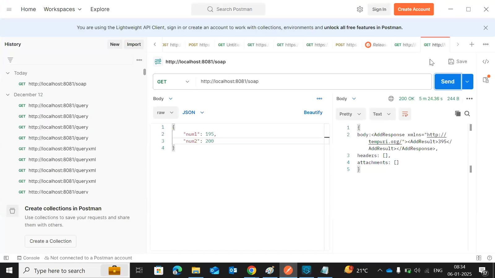

### 17 — Final Transform: `output json` / `{ Response: payload.body.AddResponse.AddResult, "serviceused": "addition" }`
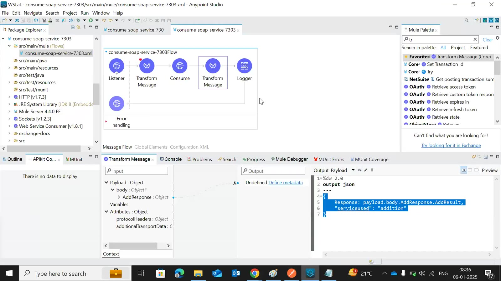

### 18 — Postman → 200 `{"Response": "395", "serviceused": "addition"}`
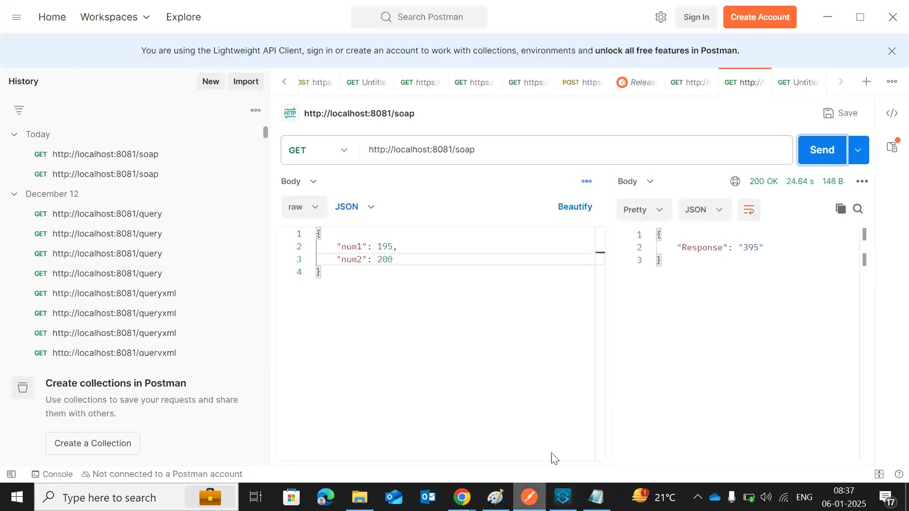

### 19 — WSDL service section: port CalculatorSoap12 (binding tns:CalculatorSoap12) — used for the SOAP 1.2 discussion
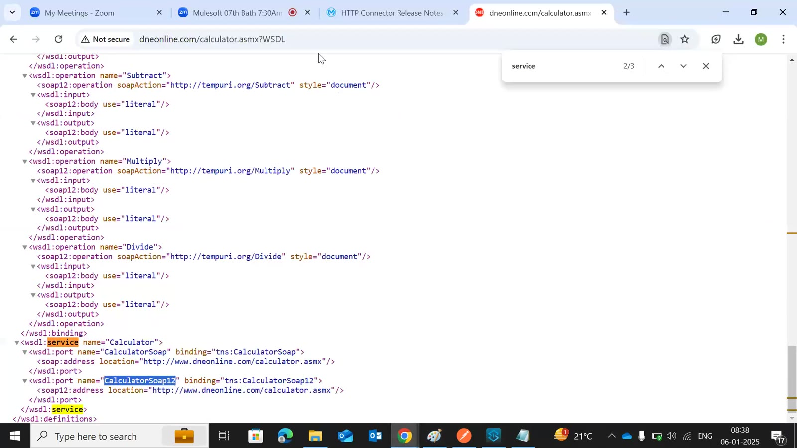

### 20 — A student's flow during Q&A (Listener → Transform → Consume → Transform → Logger)
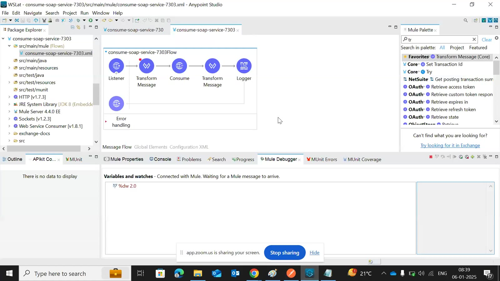

