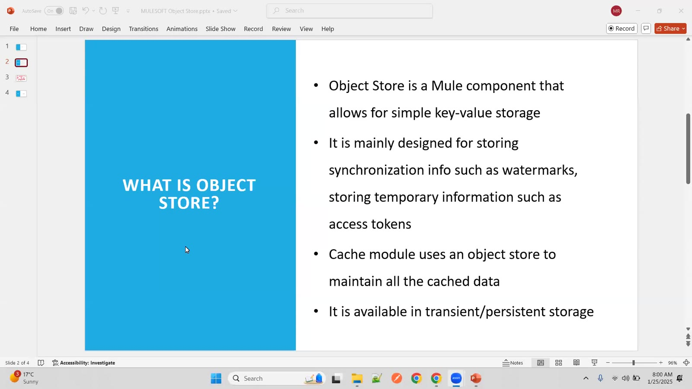
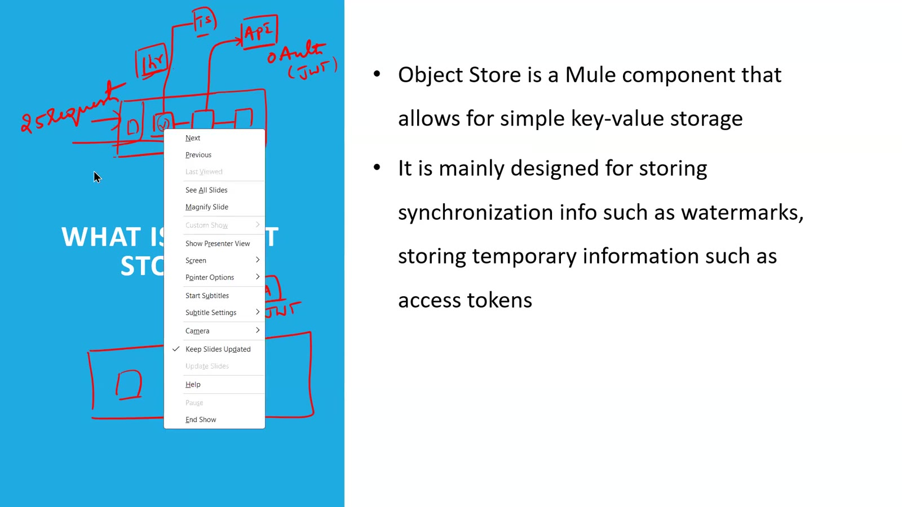
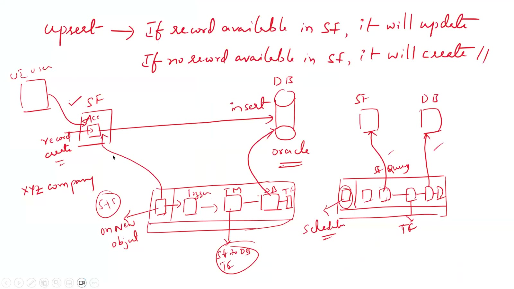
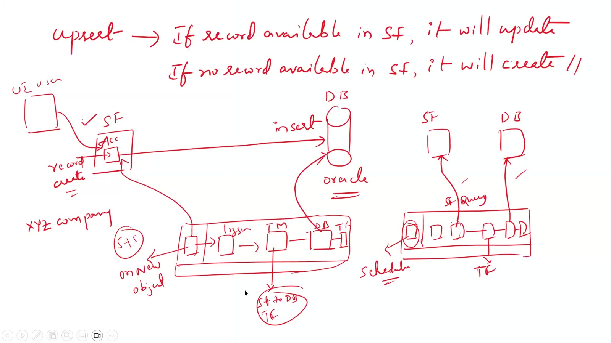
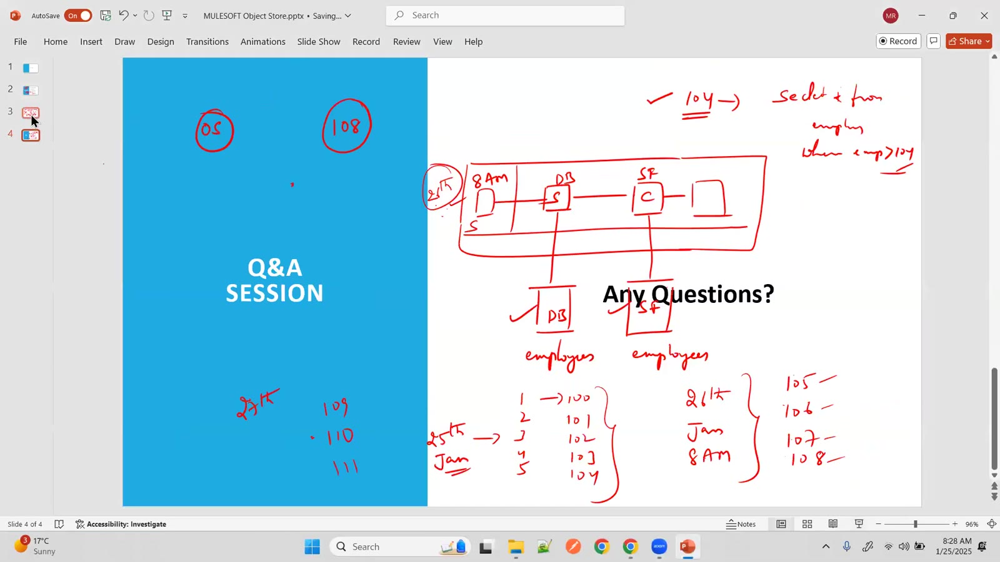

# Day 52 — Slides and On-Screen Drawings

Slides and drawings from the short Day 52 class (22 Jan 2025): what the Object Store is (key-value, transient or persistent, used by the Cache module), storing access tokens, and watermarking for scheduler-based syncs. Repeated and blank frames have been removed. Times are positions in the video.

Notes for this day: [detailed-notes/day52.md](../../detailed-notes/day52.md) · [super-detailed-notes/day52.md](../../super-detailed-notes/day52.md) · [summary](../../day52.md)

| # | Time | Content |
|---|---|---|
| 01 | 0:01 | What is Object Store? — a Mule component for simple key-value storage; mainly for synchronization info such as watermarks and temporary data such as access tokens; the Cache module uses an object store; available as transient or persistent storage |
| 02 | 6:45 | *Drawing:* storing an access token in the object store so repeated calls reuse it instead of requesting a new one |
| 03 | 15:05 | *Drawing:* upsert — if the record exists in SF it is updated, otherwise created; SF → Mule (On New Object / scheduler) → insert into the DB (Oracle) |
| 04 | 18:38 | *Drawing:* scheduler-based sync with a watermark kept in the object store — each run picks up only records after the last saved timestamp |
| 05 | 27:50 | *Drawing (Q&A):* watermark example — employee IDs 101…110 processed in batches; the last processed ID / time is stored and the next run continues from there |

---

### 01 — What is Object Store? — a Mule component for simple key-value storage; mainly for synchronization info such as watermarks and temporary data such as access tokens; the Cache module uses an object store; available as transient or persistent storage

### 02 — *Drawing:* storing an access token in the object store so repeated calls reuse it instead of requesting a new one

### 03 — *Drawing:* upsert — if the record exists in SF it is updated, otherwise created; SF → Mule (On New Object / scheduler) → insert into the DB (Oracle)

### 04 — *Drawing:* scheduler-based sync with a watermark kept in the object store — each run picks up only records after the last saved timestamp

### 05 — *Drawing (Q&A):* watermark example — employee IDs 101…110 processed in batches; the last processed ID / time is stored and the next run continues from there

