# Day 53 — Slides and On-Screen Drawings

Screens from the Day 53 class (23 Jan 2025): a scheduler-based watermark using the Object Store — Retrieve the last ID, select only newer rows, Store the new max — plus the null error when no rows return and the Choice that fixes it. Repeated and blank frames have been removed. Times are positions in the video.

Notes for this day: [detailed-notes/day53.md](../../detailed-notes/day53.md) · [super-detailed-notes/day53.md](../../super-detailed-notes/day53.md) · [summary](../../day53.md)

| # | Time | Content |
|---|---|---|
| 01 | 0:02 | Remaining modules (Notepad++) — Object Store and watermarking, JMS, transformation (pending: custom function, flatten, flatMap), CI/CD, AWS S3, HTTPS, CloudHub 1.0 vs 2.0 |
| 02 | 1:39 | object-store-demo flow: Scheduler → **Retrieve** (last emp_id) → Logger → Select → Logger → Transform Message → **Store** (new max emp_id) → Logger |
| 03 | 14:39 | Object Store config: name Object_store, Persistent, Max entries, Entry TTL (HOURS), Expiration interval |
| 04 | 14:47 | Global Configuration Elements: Database Config and Object_store |
| 05 | 24:44 | DB Select: `select * from EMPLOYEES_INFO where emp_id > :emp_id` — only records newer than the stored watermark |
| 06 | 25:08 | MySQL Workbench — local instance used for the demo |
| 07 | 25:25 | EMPLOYEES_INFO rows (IDs 120, 1000–1009 …) used to show which records each run picks up |
| 08 | 27:41 | Retrieve operation — key and a **default value** for the very first run (no watermark stored yet) |
| 09 | 31:59 | Debugger: the Select returns the new records as a list (emp_salary, emp_status, emp_name, emp_designation, emp_id) |
| 10 | 32:03 | Run output in Notepad++ — records 1006 … 1009 returned after the stored watermark |
| 11 | 34:38 | Error "You called the function 'max' with these arguments: 1: Null (null) — but it expects Array" — `max(payload.emp_id)` when no new rows came back |
| 12 | 35:51 | Fix: a Choice with `#[sizeOf(payload) > 0]` — Store the new watermark only when records were returned; Default does nothing |
| 13 | 36:09 | Choice condition `#[sizeOf(payload) > 0]` routing to the Store operation |
| 14 | 39:27 | Full course module list — modules 1–4 (ESB, Mule basics, deployment strategies) already covered |

---

### 01 — Remaining modules (Notepad++) — Object Store and watermarking, JMS, transformation (pending: custom function, flatten, flatMap), CI/CD, AWS S3, HTTPS, CloudHub 1.0 vs 2.0
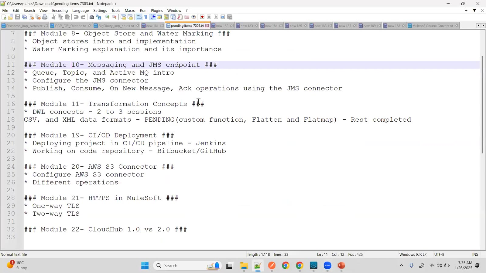

### 02 — object-store-demo flow: Scheduler → **Retrieve** (last emp_id) → Logger → Select → Logger → Transform Message → **Store** (new max emp_id) → Logger
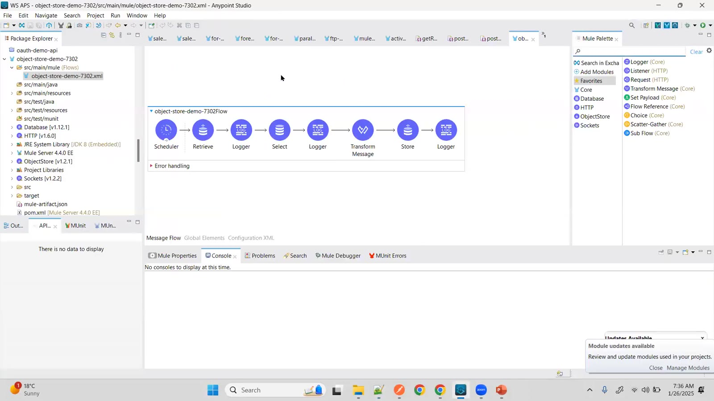

### 03 — Object Store config: name Object_store, Persistent, Max entries, Entry TTL (HOURS), Expiration interval
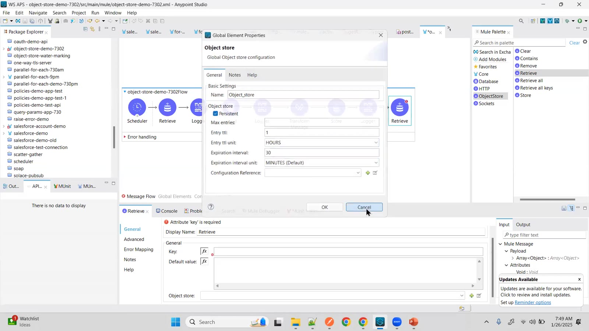

### 04 — Global Configuration Elements: Database Config and Object_store
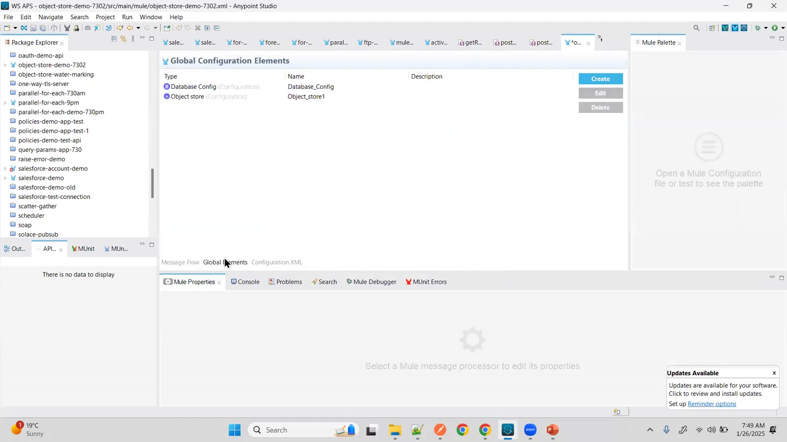

### 05 — DB Select: `select * from EMPLOYEES_INFO where emp_id > :emp_id` — only records newer than the stored watermark
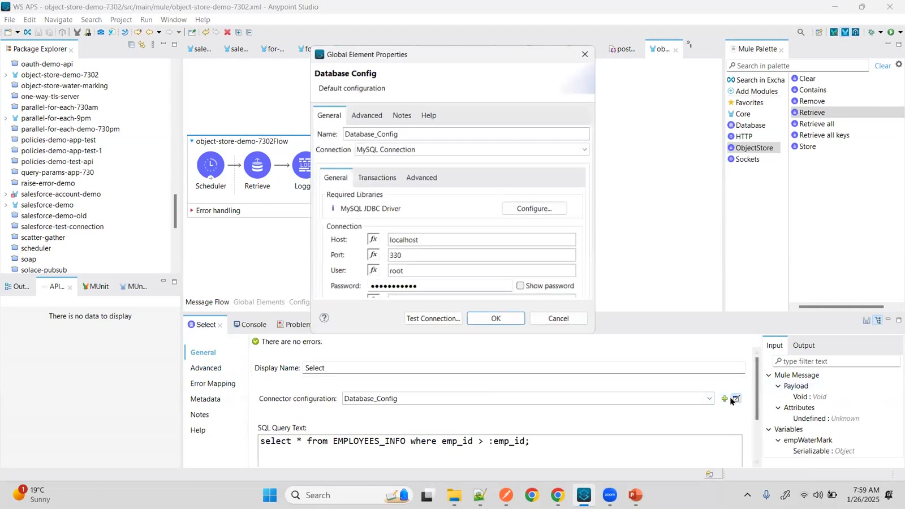

### 06 — MySQL Workbench — local instance used for the demo
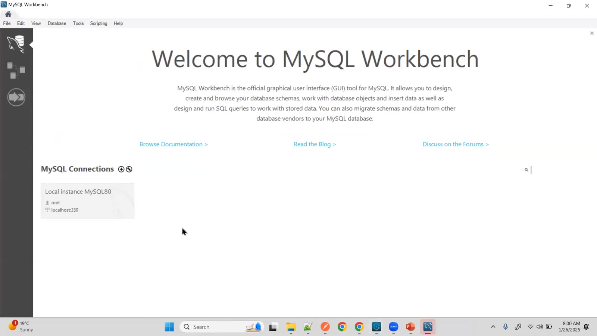

### 07 — EMPLOYEES_INFO rows (IDs 120, 1000–1009 …) used to show which records each run picks up
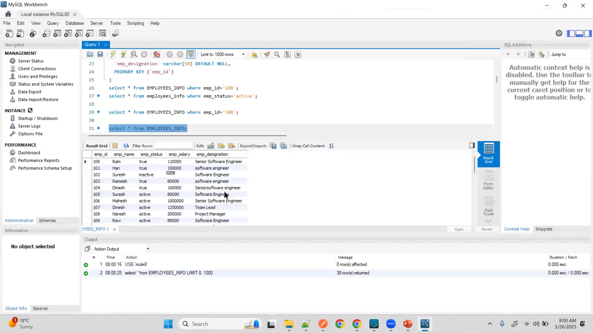

### 08 — Retrieve operation — key and a **default value** for the very first run (no watermark stored yet)
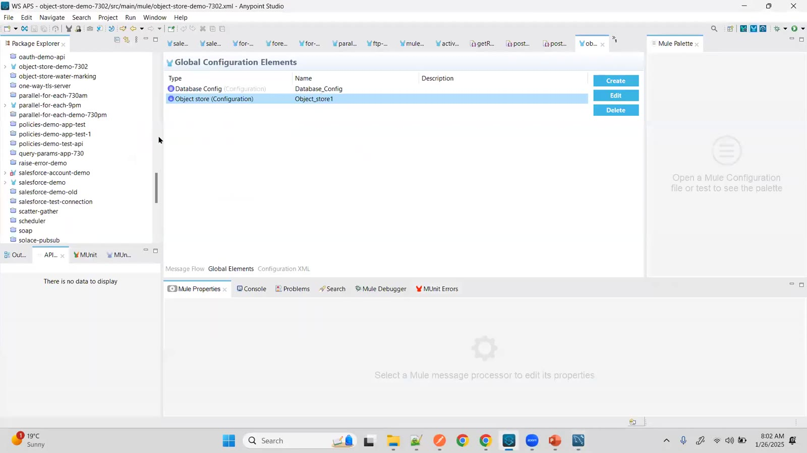

### 09 — Debugger: the Select returns the new records as a list (emp_salary, emp_status, emp_name, emp_designation, emp_id)
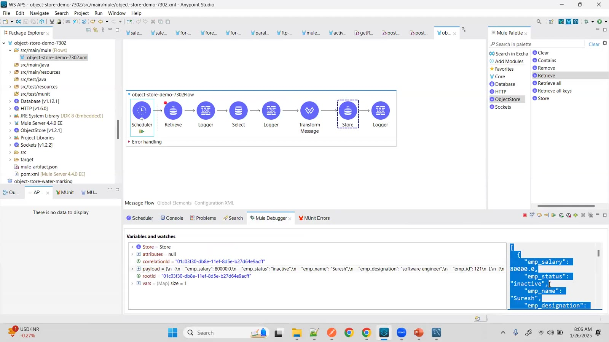

### 10 — Run output in Notepad++ — records 1006 … 1009 returned after the stored watermark
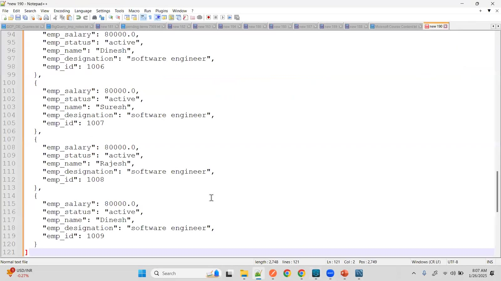

### 11 — Error "You called the function 'max' with these arguments: 1: Null (null) — but it expects Array" — `max(payload.emp_id)` when no new rows came back
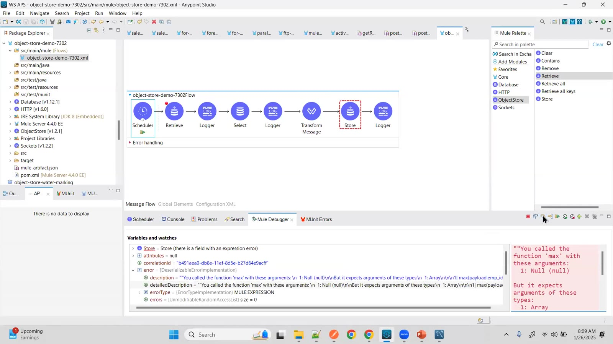

### 12 — Fix: a Choice with `#[sizeOf(payload) > 0]` — Store the new watermark only when records were returned; Default does nothing
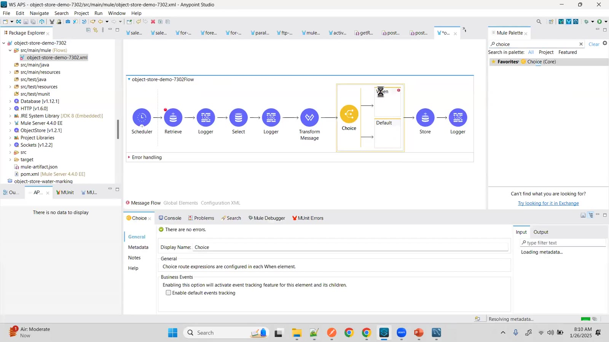

### 13 — Choice condition `#[sizeOf(payload) > 0]` routing to the Store operation
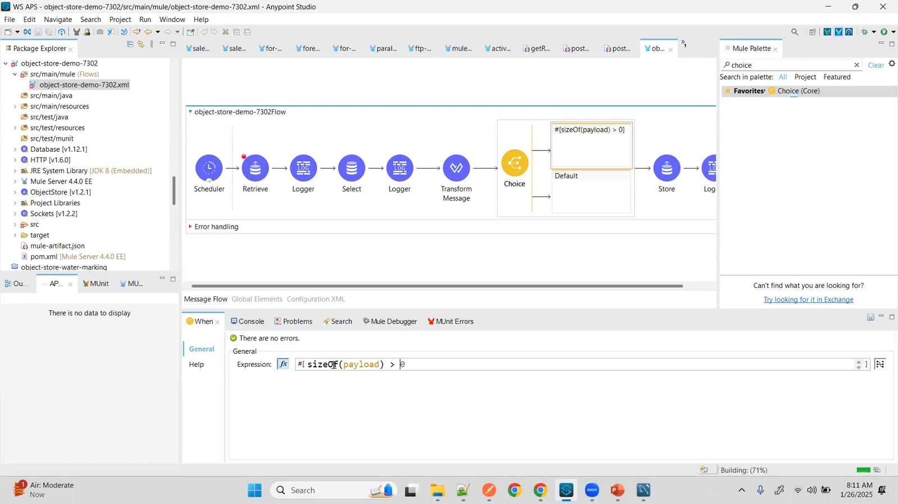

### 14 — Full course module list — modules 1–4 (ESB, Mule basics, deployment strategies) already covered
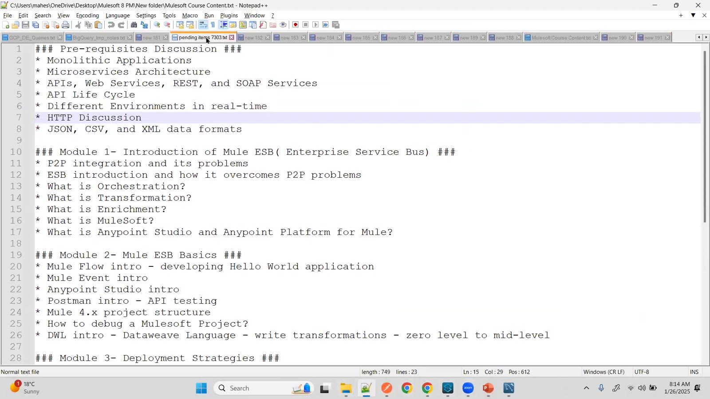

