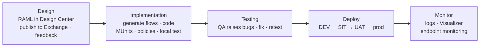
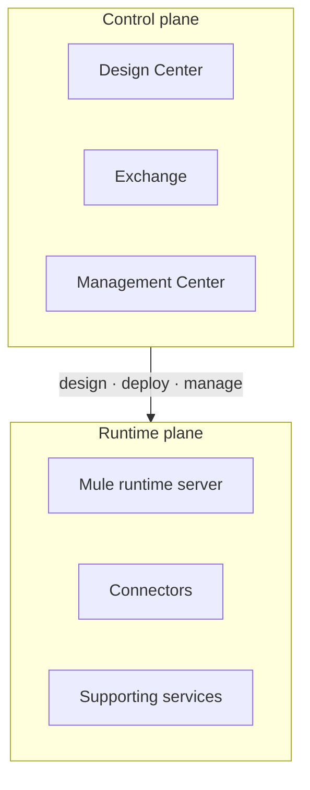
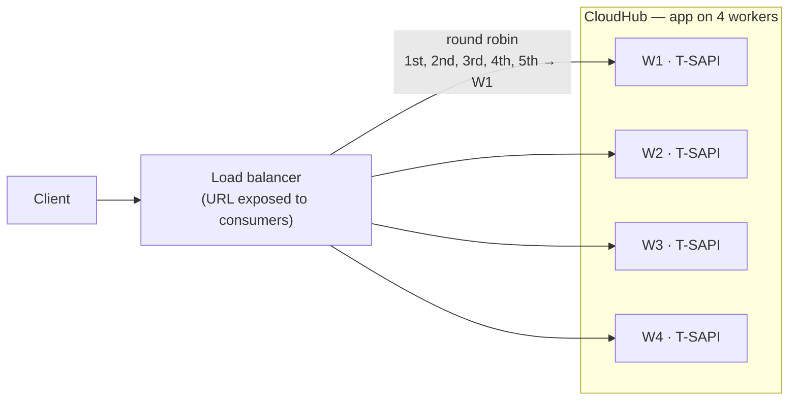
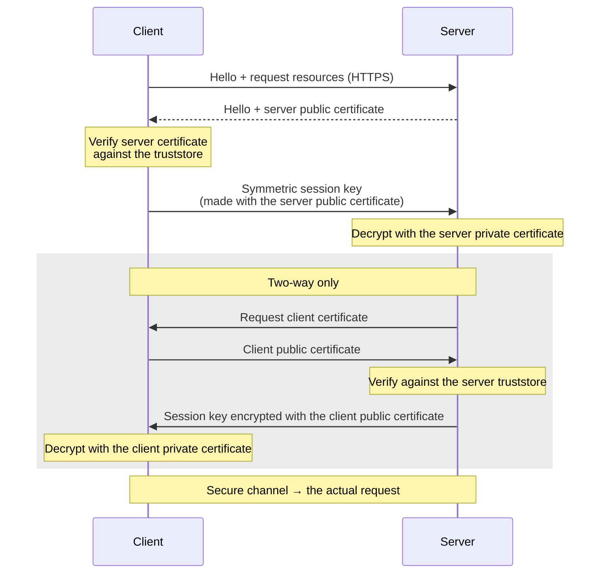

# Interview Preparation Part 3 — DataWeave Q&A (continued), API-led Connectivity, Runtime Manager, Deployment, Clustering and Load Balancers, and HTTPS / TLS

> **Sources:**
> - Cleaned audio transcript ([transcripts-cleaned/interview-part3.txt](../transcripts-cleaned/interview-part3.txt)) and the class video (recorded 6 Apr 2024, ~138 min).
> - Text marked *slide* is read from the instructor's prep text files shown on screen (DataWeave, API-led Connectivity, Runtime Manager and SSL/TLS question files).
> - Slide images: [slides/interview-part3](../slides/interview-part3/).

## 1. Overview

1. DataWeave Q&A, continued from Part 2 (which stopped at Q10, reduce) — Q12 to Q32: default, custom functions, variables, selectors, date-time, concat, pluck, map / mapObject, skipNullOn, data formats, version, `p()`, log, lookup, joinBy, isEmpty, mask, app/flow name, if-else, readUrl
2. What the instructor sees when he interviews senior candidates
3. API-led connectivity — the three layers, why more than one experience API, advantages / disadvantages, communication between layers, counting APIs
4. API lifecycle
5. Runtime Manager — Runtime Manager, vCore, worker, worker sizes, horizontal vs vertical scaling, Mule runtime
6. Deployment models — CloudHub, on-premise, hybrid, RTF; control plane vs runtime plane; autoscaling
7. CloudHub vs on-premise
8. Cluster, server group, clustering in MuleSoft (with a drawing)
9. Implementation vs proxy URL, Anypoint VPC, VPN, load balancer, shared vs dedicated load balancer
10. Domain project
11. Ways of deploying Mule applications; disabling CloudHub logs
12. HTTPS / TLS — keystore, truststore, private / public key, SSL vs TLS, one-way and two-way handshakes, exposing and consuming HTTPS, generating certificates, symmetric vs asymmetric encryption, digital and self-signed certificates
13. Shown on screen but not discussed
14. Must Remember
15. Interview-question checklist

- Q11 of the DataWeave file (encrypt / decrypt) was skipped again — the class started at Q12, default.
- The instructor says his prep files are written in simple "interview language", not documentation language. If a sentence is still hard, put it in your own words.

---

## 2. DataWeave Q&A (continued)

### 2.1 Q12 — What is the default function?

*Slide:* "If the payload.name is not receiving any value then the default value will be assigned."

- **default** sets a value when the payload (or a field) is **absent or null**.
- Why: if a field doesn't arrive and you concatenate it or use it in an expression, the script breaks. Using `default` is good practice.

```dataweave
fullName: payload.name default "XYZ Bank"
```

### 2.2 Q13 — How do you create a custom function in DataWeave?

*Slide:* "We can define our own custom functions in DataWeave at the header level using fun keyword."

- Use one when a reusable function you need isn't built in.
- Syntax: the **`fun`** keyword, the function name, the parameters, then the code to execute — written in the **header** of the Transform Message.
- Call it in the body by its name, passing the parameters. The body of the function can have several steps.

```dataweave
%dw 2.0
output application/json
fun myfunction(p1) = upper(p1)
---
myfunction("Hello")      // "HELLO"
```

### 2.3 Q14 — What are the different ways to create variables?

*Slide:*

| | Way | Scope |
|---|---|---|
| a | **Set Variable** component | Mule event |
| b | **Target variable** on components — DB connector, Flow Reference, Salesforce connector, etc. | Mule event |
| c | **Transform Message** component (output to a variable) | Mule event |
| d | **Scripting** component | Mule event |
| e | **DWL global variable** — `var` in the header of the script | The whole script; **not accessible outside that Transform Message** |
| f | **DWL local variable** — created in the body (with `using`) | Only inside the scope where it's initialized |

- Local variables are rarely used; it's enough to know they exist.

### 2.4 Q15 — Explain the different selectors

*Slide:*

| Selector | Syntax | Returns |
|---|---|---|
| Single-value | `.keyName` | The first matching value of an object; the first matching value of every element in an array |
| Multi-value | `.*keyName` | All values at the specified level, **but not the descendants** |
| Descendants | `..keyName` | All values of matching keys **irrespective of hierarchy** |
| Index | `[index]` | The value at a position — works on an array, string or object. `[0]` = first, `[-1]` = last |
| Range | `[0 to 2]` | A range of positions |
| Attribute | `.@attributeName` | The value of an attribute in the XML tag |
| All attributes | `.@` | All attributes of the XML tag as key-value pairs |

- People use these daily without knowing the names — learn the names.
- Not every interview asks this, but knowing it lets you answer if it comes.

### 2.5 Q16 — Explain the date-time functions

*Slide:*

| Expression | Result |
|---|---|
| `now()` | System date and timestamp |
| `now() >> "IST"` | Converts the timestamp to the given time zone |
| `now() as Date` | Only the date |
| `now() as Date {format: "yyyy-MMM-dd"}` | 2021-12-14 → "2021-Dec-14" |
| `now() + \|PT15M\|` | Adds 15 minutes |
| `now() + \|P10D\|` | Adds 10 days |
| `now().year` / `.month` / `.day` | Year / month of year / day of month |

- CloudHub uses the **UTC** time zone by default. Time-zone names are listed in the MuleSoft documentation.
- **PT** = hours, minutes, seconds. **P** = years, months, days. Written between pipes, in capitals. Use `-` to subtract (e.g. `- |P1D|`).
- Capital **M** is month. **MMM** gives "Dec"; **MM** gives the month number.
- **Dates from JSON arrive as strings** — this confuses most people, in real projects too. `as Date` with a new format won't work directly on the string. First convert the string to a Date **in its current format**, then format that Date into the required format.
- Copying from the prep file: check the double quotes — curly quotes break the script.

### 2.6 Q17 — Explain concat (`++`)

*Slide:* "Concat is used to append two strings, objects, arrays, etc. We use ++ sign to concatenate. We can use $() and object destructor () to concatenate in some scenarios."

- Use `++`. The instructor has never used the `$()` / object-destructor ways in a real project.
- The documentation has much more than real projects use. Learn the class set first, then explore.

### 2.7 Q18 — What is pluck / how do you convert an object to an array?

*Slide:* "Pluck iterates over an object and outputs those values into an array. pluck (value, key, index) -> {}, input is object, output is array"

- **Object → array: `pluck`. Array → object: `reduce`.**

### 2.8 Q19 — pluck vs mapObject

*Slide:* "Both pluck and mapObject functions iterate over an object but pluck outputs the object values into an array whereas mapObject outputs an object."

### 2.9 Q20 — map vs mapObject; `$`, `$$`, `$$$`

*Slide:*

| | Input → output | Lambda | Shorthand |
|---|---|---|---|
| `map` | Array → array of transformed elements | `(value, index)` — call it item | `$` = item, `$$` = index |
| `mapObject` | Object → object of properties | `(value, key, index)` | `$` = value, `$$` = key, `$$$` = index |

- **How to remember:** count the lambda parameters in order — the first is `$`, the second `$$`, the third `$$$`.
- **Use auto-complete** in the editor: type `map` or `mapObject` and pick it — the full syntax appears.

**Tip for screen-share scripting rounds:**

- They'll give you the request and the expected response, often in the chat.
- Paste the request as the input. Store the expected response in a variable in the script header (e.g. `var o = …`).
- Now you can compare as you write, without switching screens.

### 2.10 Q21 — How do you skip null values?

*Slide:* "skipNullOn = "everywhere" should be mentioned in the headers part of DataWeave"

- Write it on the `output` line, above the `---` delimiter.
- Values: `attributes`, `elements` or `everywhere`. Try the other two yourself.
- **Demo (Playground):** input `{"message": "Hello world!"}`. The script maps `message` and `name: payload.name`. `name` is missing, so it would be null — with `skipNullOn = "everywhere"` the output is just `{"message": "Hello world!"}`.

```dataweave
%dw 2.0
output application/json skipNullOn = "everywhere"
---
{
    message: payload.message,
    name: payload.name
}
```

### 2.11 Q22 — What data formats have you worked on?

- Mostly **JSON, XML and CSV**.
- About 80% of questions are on JSON, but get some practice with XML and CSV data too.

### 2.12 Q23 — Which DataWeave version do you use? The latest?

- Using **2.0**. The latest is **2.6.0**.
- If asked about its advantages, look them up beforehand — it's rarely asked.
- **Related question:** "How do you keep up with the latest updates?" Answers given in class:
  - attend MuleSoft **meetups** (online and offline);
  - read the MuleSoft **release notes**.
- The interviewer is testing whether you follow new releases. Example: **CloudHub 2.0** (released around Nov–Dec 2023). Be ready with 2–3 points on CloudHub 1.0 vs 2.0 — the instructor will cover it in the last session.

### 2.13 Q24 — How do you call config properties in DataWeave?

*Slide:* `p('propertyname')` – normal · `p('secure::propertyname')` – secure

### 2.14 Q25 — How do you log a message in DataWeave?

*Slide:* "log(prefix, value) function is used to print logs in DataWeave."

```dataweave
%dw 2.0
output application/json
---
log("WARNING", "Houston, we have a problem")
```

- Not the Logger component — the `log` function inside the script. First argument = the type / prefix, second = the message.

### 2.15 Q26 — Can you call a sub-flow with lookup?

*Slide:* "No, we cannot call a subflow using the lookup function in DataWeave."

- `lookup` calls only a **flow** or a **private flow**.

### 2.16 Q27 — How do you convert an array to a string / explain joinBy

*Slide:* "joinBy merges an array into a single string value and uses the provided string as a separator between each item in the list. joinBy performs the opposite task of splitBy."

```dataweave
%dw 2.0
output application/json
---
{ "hyphenate" : ["a","b","c"] joinBy "-" }     // { "hyphenate": "a-b-c" }
```

- **splitBy:** string → array. **joinBy:** array → string.
- Functions to be really confident in (10–15 is enough): map, mapObject, distinctBy, splitBy, joinBy, reduce, pluck, filter, filterObject.

### 2.17 Q28 — How do you perform a null check?

*Slide:* "The isEmpty() function is used to perform a null check. It works on an Array, Object, or String."

### 2.18 Q29 — How do you mask a value?

*Slide:* "mask function is used to mask the values in DataWeave."

```dataweave
payload mask field("age") with "***"
```

- They sometimes ask for the syntax — remember it.

### 2.19 Q30 — How do you get the application name and flow name for a log?

*Slide:* "flow.name is used to retrieve flow name. app.name is used to retrieve the application name."

- In Mule 4 they work **only in the Logger**, not outside it.

### 2.20 Q31 — Explain if-else

*Slide:* "IF statement evaluates the expression, if it is true returns the value under if condition otherwise it returns the value under else. If we want to apply multiple conditions then go for else if. if(conditions) value else value"

- Two outcomes → `if … else`.
- More conditions → `if … else if … else if … else`. The final `else` is the default for everything else.

### 2.21 Q32 — Explain readUrl

- **readUrl reads a URL or file and returns its content.** You can specify the data format.
- Where you've seen it: the **MUnit Test Recorder**.
  - It saves the recorded payload, attributes and variables as files in **src/test/resources**.
  - The generated Set Event / Mock processors read them with `readUrl("classpath://<folder>/set-event_payload.dwl")`, media type application/json, UTF-8.
- Writing MUnits by hand: put the files in src/test/resources yourself and refer to them the same way.
- Class example: `readUrl("classpath://file.json", "application/json")` for a file under src/main/resources.
- The instructor still has to add the DataWeave practice questions (promised in Part 2).

---

## 3. What the Instructor Sees When He Interviews

- That week he interviewed 4–5 candidates with 9½, 10 and 13 years of experience for a lead role. He takes the first round; his senior manager takes the second, technical round.
- He asks the **same questions taught in these sessions** — DataWeave, API Manager, web services, RAML — and isn't getting proper answers.
- Only one candidate went to the second round, and was rejected there.
- A 9½-year candidate couldn't explain **PUT vs PATCH**, or **when to use REST vs SOAP**.
- His view: these people have worked on real projects. They know the material only at a high level and haven't gone deeper.
- A lead must be **very clear on whatever they know** — 10 concepts known thoroughly.
- Knowing this question set should get you through **70–80%** of interviews.
- **Practice is your job.** He teaches the 20–30 functions in theory; you work them in the Playground or Studio.

---

## 4. API-led Connectivity Q&A

### 4.1 Explain API-led architecture

*Slide:* "API led architecture model is one of the best practices specified by mulesoft in designing and developing APIs. It is widely used across the industry. We follow a 3 layered approach in API led architecture."

| Layer | What it does |
|---|---|
| **System** | Connects to the external systems — databases, third-party APIs, Salesforce — to fetch data. **No business logic**; it just passes the data to the process layer |
| **Process** | Applies the **business logic**. The intermediate layer between system and experience; sends the response to the experience layer |
| **Experience** | Exposed to clients such as mobile and web apps. **Just a wrapper** around the process / system APIs. **All non-functional policies go here** — it faces the outside world, so it needs the most security |

- Explaining this well is enough as a base. Nowadays expect a **scenario question** on top.

### 4.2 Why more than one experience API for the same requirement?

*Slide:* "It depends on the business requirement, the no. of experience apis to be created."

- **Example 1:** a mobile app and a web app consume the same experience API, but mobile needs less data than web → two experience APIs.
- **Example 2:** the API is consumed by a third party and by internal systems. The third party needs an extra policy that internal systems don't → two experience APIs.
- **If both consumers need the same data and the same policies → one experience API.** Two would waste resources.
- It isn't mandatory either way — it depends on the business requirement.
- Sometimes there is **no process layer** — the experience API calls the system API directly.

### 4.3 Why follow API-led architecture?

*Slide:*

| Advantages | Disadvantages |
|---|---|
| Increases **reusability** — e.g. one system API reused by several departments | Three APIs instead of one → **more time in the initial phases** |
| A break affects **only limited functionality** (a monolith would break the whole service) | More APIs → **more vCores → more cost** |
| **Faster time to market in the long run** — reusable pieces already exist when a new requirement comes. Slower in the short run: you have to divide the work and decide what's reusable | |
| Easy to maintain (slide) | |

### 4.4 How do the system, process and experience layers communicate?

*Slide:* "99% of the time http requests are used to establish communication and we can expose API as a connector and use that as a connector."

- **HTTP Request connector** — almost always.
- The alternative: publish the API to Exchange as a connector, then add it as a dependency.

### 4.5 Scenario: three systems and two consumers — how many APIs at minimum?

- One system API per system = 3. One process API. Experience APIs = 2.
- **3 + 1 + 2 = 6** if the two consumers need different things.
- **5** if one experience API serves both.
- Explain the logic behind your number — that's what they want.

---

## 5. API Lifecycle

*Slide:* "Design, Implementation, Testing, Deploy and Monitor covers API lifecycle."

| Phase | What happens |
|---|---|
| **Design** | Design the API spec in RAML in Design Center → publish to Exchange → business users give feedback → make changes |
| **Implementation** | Generate RAML-based flows in Anypoint Studio → implement → develop MUnits → apply security policies → test locally |
| **Testing** | The QA team tests extensively and raises bugs → you fix them → they retest |
| **Deploy** | After successful testing (DEV, SIT, UAT, performance testing), deploy to prod |
| **Monitor** | Log monitoring and troubleshooting, with Visualizer and endpoint monitoring |

- The instructor was asked this in a recent client interview of his own.



---

## 6. Runtime Manager Q&A

- When he interviews, the instructor keeps **2–3 questions per section** (API spec, DataWeave, connectors, components, Runtime Manager, MUnit, error handling) and goes section by section.

### 6.1 What is Runtime Manager?

*Slide:* "Runtime manager is a module of Anypoint Platform which is used to deploy and manage Mule application on Mule runtime engine, where mule runtime is running on Cloudhub or on-premise or on RTF. By using runtime manage you can deploy/un-deploy, stop/restart the Mule application. You can also change the runtime version or increase/decrease the worker size."

- You can also **check logs** and do **horizontal and vertical scaling** there.
- In the hybrid model you manage on-premise apps from Runtime Manager too.
- **Answering technique:**
  - Every term you mention invites a follow-up — say "RTF" and they'll ask about RTF.
  - **Don't mention what you don't know.**
  - Do mention terms you know well (horizontal / vertical scaling) to steer the next question.

### 6.2 What is a vCore?

*Slide:* "vCore refers to a unit of compute capacity used on CloudHub platform. In 1 vCore, a maximum of 10 applications can be deployed where 0.1 vCore will be consumed by each Mule application."

- A measure of memory and CPU.
- Why 10: the smallest worker is 0.1 vCore, which is 10% of one vCore.
- This is for **CloudHub**, not standalone.

### 6.3 What is a worker? Features of workers

*Slide:* "Worker is a dedicated Mule instance that runs your Mule application on CloudHub platform."

| Feature | Meaning |
|---|---|
| **Capacity** | Each worker has a set capacity, according to its vCores (0.1, 0.2, …) |
| **Isolation** | Each worker runs in a **separate container** — like a separate virtual machine |
| **Manageability** | Each worker is deployed and managed independently |
| **Locality** | Each worker runs in a specific region — US, EU or Asia-Pacific |

### 6.4 Worker numbers to remember

| Question | Answer |
|---|---|
| Apps per CloudHub worker | **1** |
| Minimum / maximum worker size | **0.1 vCore / 16 vCores** |
| Maximum workers for one app | **8** |

### 6.5 Horizontal vs vertical scaling

*Slide:*

| | Horizontal scaling | Vertical scaling |
|---|---|---|
| Definition | Increase the **number of workers** and deploy the app on them | Increase the **vCore size** of a worker |
| Go for it when | 1. More requests with the same payload size. 2. You need **high availability and less downtime** | 1. The **payload size** grows. 2. More requests with the same payload size |
| Example from class | 5,000 → 7,000–8,000 requests/day | A 10 KB request grows to 25–40 KB |

- **High availability:** if one worker goes down, another takes the request. On a single worker, consumers wait until it's back.
- **Performance testing** tells you whether the current configuration still copes. If it does, change nothing. Even 0.1 vCore can handle 25–30 KB requests, and probably MB-size ones.
- More requests can be handled either way: more workers, or more memory on the same worker.

### 6.6 What is a Mule runtime?

*Slide:* "A Mule Runtime is a runtime engine to host and run Mule applications/projects – similar to an Application Server. Mule Runtimes can be provisioned on-premises or in the cloud. One Mule runtime can host several Mule applications."

- On CloudHub MuleSoft provides the infrastructure ready-made — the worker.
- With your own Mule runtime, you install it on a server or a cloud you take separately.

---

## 7. Deployment Models

### 7.1 Explain the deployment models you've worked on

- **Mention only the models you're confident in** — mostly CloudHub, plus hybrid / on-premise if you've used them. Learn more before you mention RTF.

| Model | Control plane | Runtime plane | Definition (slide) |
|---|---|---|---|
| **CloudHub** | MuleSoft | MuleSoft | An iPaaS (integration platform as a service) that provides server functionality; apps deployed to CloudHub |
| **On-premise** | Client / user | Client / user | Apps deployed to on-premise servers |
| **Hybrid** | MuleSoft (Anypoint Platform) | Client / user | Apps on on-premise servers, managed with Anypoint Platform |
| **RTF** | MuleSoft | Client (their cloud or on-premise servers) | Runtime Fabric — see below |

### 7.2 What is RTF?

- **Runtime Fabric** — a **container-based service** that automates the deployment and orchestration of applications. It can run on-premise or in the cloud.
- It gives a CloudHub-like facility in the client's own premises or cloud. Based on **Kubernetes and Docker**.
- If you haven't used it, say so: "I haven't had a chance to work on RTF; if I get the chance, I'm ready to learn it and work on it."

### 7.3 Control plane vs runtime plane

| | Contains | Purpose |
|---|---|---|
| **Control plane** | Design Center, Exchange, Management Center | Design, deploy and manage Mule apps |
| **Runtime plane** | Mule runtime server, connectors, supporting services | Where apps are actually deployed and made available to users |



### 7.4 What is autoscaling?

- Allocating **more workers automatically** as needed, and reducing them when not needed.
- Without it you scale manually: Runtime Manager → change the worker count → restart.
- Traffic spikes are unpredictable unless you apply rate limiting. Autoscaling senses the traffic and adjusts.
- Available on CloudHub at an **extra licensing cost**.
- (The recording says "auto-tuning"; the CloudHub feature is autoscaling.)

---

## 8. CloudHub vs On-premise

*Slide:*

| CloudHub | On-premise |
|---|---|
| Control and runtime planes provided by MuleSoft | Control and runtime planes managed by the client |
| Max **10 apps per vCore** | **More apps** per vCore, depending on app size (the instructor: 40–50 low-traffic apps on one vCore) |
| **Domain project not possible** | **Domain project can be used** |
| Less / no maintenance — MuleSoft handles it | **More maintenance** — servers, patches, software, OS |
| Less control over data | **More control over data** (it's on your servers) — more secure |
| **Anypoint MQ** available at extra cost | Anypoint MQ not available |
| | **Costlier** |

- Say you've worked on both, and this comparison is the next question.
- Saying "control and runtime plane" invites "what are those?" — only use words you can explain.

**Student question:** a job posting asked for MuleSoft RPA.

- RPA = robotic process automation. UiPath leads that segment; MuleSoft has entered it to automate processes (e.g. opening a bank account). It's a costly tool.
- There aren't many RPA-only openings.
- Off-topic questions (e.g. what "documentation experience" means) are kept for the end of the session.

---

## 9. Cluster and Server Group



*Drawing:* client → load balancer → URL; four workers W1–W4 each running the transaction system API (T-SAPI); below, four on-premise servers 10.1.2.5–10.1.2.8, each with a Mule runtime.

### 9.1 What is a cluster?

*Slide:* "A cluster is a set of up to eight servers that act as a single deployment target and high-availability processing unit. Application instances in a cluster are aware of each other, share common information, and synchronize statuses. If one server fails, another server takes over processing applications. A cluster can run multiple applications. Before creating a cluster, you must create the Mule runtime engine instances and add the Mule servers to Anypoint Runtime Manager."

- **The problem it solves:** in the hybrid model, one app is on 4 servers (server1:8081/path … server4:8081/path). How does a consumer know which server to call?
  - Answer: a **load balancer URL** is exposed to the consumer, and the load balancer forwards requests **round robin**.
- **On CloudHub** this is automatic: pick the worker count, and the platform's load balancer and clustering take care of it.
- **"Up to" 8** — 2, 3, 4, 5… servers (nodes).
- **Cluster benefits:**
  - the nodes know each other's state and share resources;
  - if a node fails, another picks up **from where it stopped**;
  - one deployment goes to all nodes.
- A single server gives no high availability — a crash means downtime.
- **Steps (hybrid):**
  1. Install Mule runtimes on the servers.
  2. Register the servers in Runtime Manager.
  3. Create the cluster.
  4. Deploy and pick the cluster as the target.
- A cluster gets a shared load balancer (round robin) by default.
- Never created a cluster yourself? Say so. The instructor hasn't created one in real projects either.

### 9.2 What is a server group?

*Slide:* "A server group is a set of servers that act as a single deployment target for applications so that you don't have to deploy applications to each server individually. Application instances in a server group run in isolation from the application instances running on the other servers in the group."

- Without it you deploy to server 1, then 2, then 3, then 4. A server group does it in one go.
- It **only saves deployment effort**. The nodes don't share resources or know each other's status, so there's no high availability.

### 9.3 Server group vs cluster

*Slide:* "Server Group and Clustering both run in multiple distributed nodes. In the server group, instances of the application are isolated from each other. In clustering, nodes are aware of each other, share common information and synchronize status. All the servers in the server group and cluster must be running on the same version of mule runtime."

| | Server group | Cluster |
|---|---|---|
| Single deployment target | Yes | Yes |
| Nodes aware of each other / share state | No — isolated | Yes |
| Failover (pick up where it stopped) | No | Yes |
| Same Mule runtime version on all servers | Required | Required |

### 9.4 How do you achieve clustering in MuleSoft?

*Slide:* "You can achieve this by adding multiple workers to your application to make it horizontally scale, Cloudhub automatically distribute multiple workers for same application across 2 or more data centers for maximum reliability. When deploying your application to two or more workers, the HTTP load balancing service distributes requests across these workers, allowing you to scale your services horizontally. Requests are distributed on a round-robin basis."

- **CloudHub:** choose 2+ workers → clustering is automatic.
  - The workers are spread across **data centers** — if a cyclone takes out one city's data center, a worker elsewhere keeps running.
  - The round-robin mechanism can be changed if needed.
- **Hybrid:** Runtime Manager → **Servers** → **Create Cluster** (or **Create Group**) → select the servers, give a name.
  - There's a **unicast / multicast** cluster type — not needed at your level; "not aware" is an acceptable answer.
  - Then pick the cluster as the deployment target.

---

## 10. URLs, VPC, VPN and Load Balancers

### 10.1 Implementation URL vs proxy URL

*Slide:* "The URL generated by cloudHub once the application is deployed is known as implementation URL. We will apply non-functional requirements such as policies on proxy URL."

- **Hybrid:** server IP + port + resource path is the implementation URL.
- Put a **load balancer** with a domain name in front, mapped to the server IPs and ports. **Share the load balancer URL** with consumers.
- **Proxy URL:** the URL of a proxy created on top of the API. Policies (non-functional requirements) are applied there.

### 10.2 What is Anypoint VPC?

*Slide:* "VPC stands for Virtual Private Cloud. It is a dedicated cloud allocated for the user. It is more secure than public cloud."

- A normal CloudHub licence = a **shared** cloud. Request a VPC from MuleSoft (extra charges) → an **isolated space** inside CloudHub that no other client uses.
- Analogy: shared facilities in an apartment complex vs a space allocated to one person only.
- **Benefits:**
  - a dedicated load balancer;
  - your own domain name;
  - more control over your data;
  - better performance (no sharing).

### 10.3 What is VPN?

*Slide:* "Anypoint VPN is used to create a secure connection between MuleSoft VPC and on-premise network."

- **Example:** Cloud Technologies (India) has a VPC in the Asia-Pacific region (probably Singapore). Developers work from India.
- They can reach it publicly, or through a **private connection** from the local network to the VPC — that's the VPN.
- More secure for data moving back and forth. MuleSoft handles the plumbing; you do 2–3 configurations.

### 10.4 What is a load balancer?

*Slide:* "Load balancer will help us to balance the load levied on applications deployed on different servers or workers. The load balancer URL is exposed to the external stakeholders. For example, one mule application is deployed on 4 different on-premise servers. All consumers will send requests to load balancer which inturn will distribute the requests to 4 different app servers."

### 10.5 Shared vs dedicated load balancer

*Slide (SLB):* "A shared load balancer in CloudHub resides outside the client's VPC. It's a shared resource, shared between customers and common for a specific CloudHub region. It routes and balances the external HTTP/HTTPS traffic to multiple applications."

*Slide (DLB):* "Dedicated Load Balancer is an optional component in Anypoint Platform that allows the route of external HTTP/HTTPs traffic to multiple applications [deployed to CloudHub within a VPC]."

| | Shared load balancer (SLB) | Dedicated load balancer (DLB) |
|---|---|---|
| Availability | **All environments, by default** | Optional; within a VPC |
| Shared? | Shared by all customers in a region | Yours |
| Ports | **HTTP 8081 · HTTPS 8082** | **HTTP 8091 · HTTPS 8092** |
| Features | Basic load balancing only | Load balancing across your CloudHub workers + your own rules |
| Custom SSL certificates / proxy rules | **Not allowed** | **Allowed**; optional **two-way authentication** |
| Domain | — | All apps under **a single (custom) domain** |
| Rate limit | **Lower**, and different per region | Avoids the SLB's lower limit |
| Over the limit | **503 Service Unavailable** (not 429) | — |

- The SLB rate limit is a downtime risk: e.g. 10,000 requests/day against a 5,000 limit → the other 5,000 get no response.
- DLB rules and similar platform work is usually done by **MuleSoft administrators**. It belongs to the platform-level certification the instructor called "MCPA" (MuleSoft Certified Platform Architect).
- Some of these questions weren't part of the project classes — learn them here.

---

## 11. Domain Project

*Slide:* "Domain project is a common Mule project where you can keep all common resources such as property files, connectors and their configurations. The resources can be consumed by multiple projects. It can be used only on On-premise but not on Cloudhub as we can't deploy more than one application on one worker."

- Like a RAML **fragment**: write it once, reuse it in many projects. Typical contents: shared property files, connector configurations.
- **Not an independent project** — it has no source flows of its own; it supports the main projects.
- **On-premise only** — the `domains` folder of a standalone / hybrid Mule runtime hosts it. Your app is deployed on `default` locally.
- **Why not CloudHub or RTF:** each app runs alone in its own container / worker (a separate virtual machine), with no link to other projects to refer to.
- **Steps in Studio:**
  1. New → **Mule Domain Project**.
  2. In the app: right-click → **Properties** → **Mule Project** → pick the domain (it shows if the workspace and domain match).
  3. Apply. The app (e.g. the transaction system API) can now use the domain's connector and property configurations.

---

## 12. Deploying Applications and CloudHub Logs

### 12.1 Different ways of deploying Mule applications

*Slide:*

1. Export the JAR from Anypoint Studio → import it into Runtime Manager → configure the properties → deploy.
2. Configure Anypoint Platform credentials in Studio → right-click the project → deploy.
3. Check the code into a central repository (GitHub, Bitbucket) → configure the properties on Jenkins → the **CI/CD pipeline** deploys. This is the real-project way (still to be covered in class).
4. Drag and drop the JAR into the Mule instance of an on-premise server. **An `.anchor` file is created** when it's deployed successfully.

- The interviewer is checking your awareness of the platform.

### 12.2 Can you disable CloudHub logs?

*Slide:* "Yes, in that case only the system logs are available in Runtime Manager. System logs provide the status of your worker deployment and whether your application started correctly, but do not provide application logs"

- **Why:** CloudHub keeps about **100 MB** of logs — after that, old logs are archived and only new ones stay.
- Critical business requirements may need months or years of logs → custom logging to an external service like **Splunk**. Disable CloudHub logging and configure the external target.
- **System logs** (deployed or not, why it failed) stay in Runtime Manager. **Application logs** go to the external service.
- No hands-on? Say "it can be done, but I haven't done it myself".

---

## 13. HTTPS / TLS Q&A

### 13.1 What is a keystore?

*Slide:* "A keystore is a secure container used to store digital certificates and private keys for secure communication in a software application. In MuleSoft, a keystore is used to store the private key and corresponding public key certificates that are used to secure incoming or outgoing messages through HTTPS, TLS, or other secure protocols. It ensures that messages are encrypted and decrypted only by authorised parties and helps prevent tampering of messages during transmission."

- A general concept, not MuleSoft-only. A "container" here = a file.
- Short form: where certificates and private keys are stored, to secure your services.

### 13.2 What is a truststore?

*Slide:* "A trust store is like a safe box that stores important certificates used for secure communication between a client and a server. When a client connects to a server, it checks if the server's certificate matches the ones in the trust store. If it matches, a secure connection is established. If not, the connection is rejected. A trust store is important for secure communication and helps prevent bad actors from altering messages."

- **Consuming an HTTPS service:** the server's public certificate is in the client's truststore. The client says hello, the server sends its certificate, and the client checks it against the truststore — **validating the server's identity**.

### 13.3 Keystore vs truststore

*Slide:* "A keystore is used to store private keys and certificates that identify and authenticate the client or server, while a trust store is used to store trusted certificates that are used to establish trust between a client and server during secure communication."

### 13.4 Private key and public key

*Slide (private):* "A private key is a secret code that is used to encrypt and decrypt messages during secure communication. It is a unique and important part of a digital certificate that is kept secret and should only be known to the owner of the certificate. Think of it like a password that only the owner knows and uses to unlock their private information. When a secure connection is established, the private key is used to decrypt incoming messages and encrypt outgoing messages to ensure that only authorized parties can read them."

*Slide (public):* "A public key is a code that is used for secure communication between two parties. It's called "public" because it can be freely shared with anyone who wants to establish a secure connection with you. When someone wants to send you a secure message, they use your public key to encrypt the message[, and only your private key can decrypt it]. Think of it like a lock and key system, where the public key is the lock and the private key is the key [that unlocks it]."

- The **public key can be shared** with consumers. The **private key never** is.
- Keep 2–3 sentences of each in mind.

### 13.5 SSL vs TLS

- Both are **cryptographic protocols** that encrypt and secure client–server communication over the internet.
- **SSL** (Secure Sockets Layer) was the original, developed by Netscape in the mid-90s. Vulnerabilities were found, so it was replaced.
- **TLS** (Transport Layer Security) is the improved version: stronger encryption algorithms, better authentication, newer encryption protocols.

| | SSL | TLS |
|---|---|---|
| Security | Less secure | More secure, recommended |
| Compatibility | Not compatible with TLS | Not compatible with SSL |
| Use today | Old | Most systems use TLS |

- In class: TLS "requires mutual authentication" — the client and server authenticate each other. (Mutual authentication is the two-way case; see 13.6.)
- Minimum to know: TLS is the improved, more secure version of SSL, plus both expansions.

### 13.6 One-way vs two-way TLS and the handshakes

| | One-way TLS | Two-way TLS (mTLS) |
|---|---|---|
| Who verifies whom | **Only the client** verifies the server | **Both** — mutual authentication |
| Server side | Keystore: server private + public certificate | Keystore: server private + public certificate · Truststore: **client** public certificates |
| Client side | Truststore: server public certificate | Keystore: client private + public certificate · Truststore: server public certificate |



- **One-way, as read in class:**
  1. The client says hello and requests the resources over HTTPS.
  2. The server replies hello with its public certificate.
  3. The client verifies it in its truststore. Only on a match does the handshake continue.
  4. The client sends a symmetric session key generated using the server's public certificate.
  5. The server decrypts it with its private certificate and sends the encrypted session key back.
  6. Then the actual encrypted communication starts.
- **Two-way:** the same start. Then the server asks for the client's certificate, and the client sends its public certificate. The server verifies it in its truststore, then encrypts a session key with the client's public certificate. The client decrypts it with its private certificate.
- The client always initiates. All of this happens before the HTTPS request itself.

### 13.7 Steps to expose an API as HTTPS

1. **Generate a keystore** with `keytool -genkey` (keytool ships with Java, in the JRE folder).
2. Configure the **HTTPS** protocol on the HTTP Listener.
3. Configure the **keystore** in the **TLS** section of the HTTP Listener config.

- For the client side: export the public certificate from the keystore and import it into a truststore.

### 13.8 Steps to consume an HTTPS service

*Slide:* "1. Configure HTTPS protocol. 2. Configure the truststore of TLS section in HTTP request connector."

- Keep the truststore in src/main/resources and refer to it there.

### 13.9 How do you generate public and private certificates?

*Slide:* "I have used keytool utility available in Java. We can use OpenSSL also. I used genkey, export and import commands."

- No need to memorise the commands — "I'd look them up" is acceptable.

### 13.10 Symmetric vs asymmetric encryption

*Slide:* "Symmetric encryption is a type of cryptography that uses the same key to encrypt and decrypt a message. This means that both the sender and the receiver of a message must have access to the same secret key." · "Asymmetric encryption, also known as public-key encryption, is a type of cryptography that uses a pair of keys to encrypt and decrypt data. This encryption technique is more secure than symmetric encryption, as it makes it impossible for someone who does not have a private key to decrypt the data, even if they have the public key."

| | Symmetric | Asymmetric (public-key) |
|---|---|---|
| Keys | One shared secret key | A key pair — one to encrypt, the other to decrypt |
| Security | Less secure | More secure |

### 13.11 Digital certificate and self-signed certificate

*Slide:* "A digital certificate is a file or electronic password that proves the authenticity of a device, server, or user through the use of cryptography and the public key infrastructure (PKI). Digital certificate authentication helps organizations ensure that only trusted devices and users can connect to their networks."

*Slide:* "A self-signed certificate is not signed by a publicly trusted certificate authority (CA) but instead by the developer or company that is responsible for the application; as they are not signed by a publicly trusted CA, they are usually considered unsafe for public applications and websites."

- **Digital certificate** = a system's identity card (like Aadhaar or a passport, checked at the airport). It has components such as an **expiry date**.
- A **certificate authority** issues certificates, as UIDAI issues Aadhaar and NSDL issues PAN.
- **Self-signed** = you generate it yourself. Fine when both parties agree to trust each other; unsafe for public apps.
- Prefer CA-issued certificates. Self-signed is used for some internal communications.

---

## 14. Shown on Screen but Not Discussed

- **Project-class deck (flipped through after the break, while opening a blank slide to draw on):**
  - "MuleSoft Project — Transaction and Loyalty Management Module – Banking Domain";
  - "Training Approach" (LPP model — Learn, Practice, Practice; trainer 33.33% / your practice 66.66%; online and offline sessions; recordings; 35 hours);
  - "API Landscape" — Mobile/Web Transaction and Loyalty XAPIs → Transaction / Loyalty PAPIs → system APIs → SFDC, Loyalty 3rd-party API (KGLM System), MySQL DB, Object Store;
  - "Flow Diagram — Banking Project" — front end → Mule API layer → end systems;
  - the ICICI Bank / TCS project-team drawing (business team, technical team / architect, BRD/FSD, HLD, developers, lead, testers);
  - "Thanks for attending the session".
- **Slide-only lines:**
  - "Easy to maintain" (fourth advantage of API-led);
  - "TCP load balancing" (SLB);
  - "It is more secure than public cloud" (VPC);
  - "One Mule runtime can host several Mule applications";
  - `$()` and object destructor for concatenation (mentioned, not shown).

---

## 15. Must Remember

**DataWeave**

- `default` for absent / null values. Custom functions: `fun name(p) = …` in the header.
- Variables: Set Variable, target variables, Transform Message, Scripting, DW global `var` (only inside that Transform Message), DW local (`using`, scope only).
- Selectors: `.key` single, `.*key` multi (one level), `..key` descendants, `[i]` index (`[-1]` last), `[0 to 2]` range, `.@attr` attribute.
- Dates: `now() >> "IST"`, `as Date {format: "yyyy-MMM-dd"}`, `|PT15M|` (time), `|P10D|` (date). **JSON dates are strings** — parse in the current format, then reformat.
- `++` concat; `pluck` object → array; `reduce` array → object.
- `map` `$`/`$$` = item/index; `mapObject` `$`/`$$`/`$$$` = value/key/index.
- `skipNullOn = "everywhere"` on the output line. `p('x')` / `p('secure::x')`. `log(prefix, value)`. lookup — flow or private flow, never a sub-flow.
- `joinBy` array → string (opposite of `splitBy`). `isEmpty` — array, object, string. `mask field("age") with "***"`. `app.name` / `flow.name` only in the Logger.
- `readUrl("classpath://…")` — how MUnit-recorded files are read.
- DataWeave 2.0 used, 2.6.0 latest.

**Architecture and Runtime Manager**

- System (fetch, no logic) → process (business logic) → experience (wrapper + policies).
- Extra experience APIs only when the consumers need different data or policies.
- Lifecycle: design → implementation → testing → deploy → monitor.
- 1 app per worker · 10 apps per vCore · 0.1–16 vCores · max 8 workers.
- Horizontal = more workers (more requests, high availability). Vertical = bigger worker (bigger payloads).
- CloudHub (MuleSoft runs both planes) · on-premise (client runs both) · hybrid (MuleSoft control, client runtime) · RTF (containers, Kubernetes / Docker).
- Control plane = Design Center, Exchange, Management Center. Runtime plane = runtime, connectors, services.
- Cluster (up to 8 servers, aware of each other, failover) vs server group (isolated, deployment convenience only). Same Mule runtime version on all servers.
- SLB 8081/8082, default, lower regional rate limit → **503**. DLB 8091/8092, inside a VPC, custom certificates, single domain, two-way auth.
- Domain project: shared configs, on-premise only.
- Deploy: JAR → Runtime Manager · Studio deploy · CI/CD (Jenkins) · drop the JAR into the runtime (`.anchor` file).
- CloudHub logs: about 100 MB; disable them → only system logs, app logs go to e.g. Splunk.

**TLS**

- Keystore = private key + certificates (identifies you). Truststore = certificates you trust.
- TLS replaced SSL. One-way: client verifies server. Two-way / mTLS: both verify.
- Expose HTTPS: keytool genkey → HTTPS on the Listener → keystore in the TLS section. Consume HTTPS: HTTPS on the Requester → truststore in the TLS section.
- Symmetric = one key. Asymmetric = key pair (more secure). Self-signed = not CA-signed, unsafe for public sites.

**Answering technique**

- Don't drop terms you can't explain — every keyword invites a follow-up.
- Use the terms you know well to steer the next question.
- If you haven't done something, say so and say you're ready to learn it.

---

## 16. Interview-Question Checklist

**DataWeave**

- [ ] What is the default function?
- [ ] How do you create a custom function?
- [ ] What are the different ways to create variables? Global vs local DW variables.
- [ ] Explain the selectors (single, multi, descendants, index, range, attribute).
- [ ] Explain the date-time functions — time zone, format, adding minutes / days, year / month / day. Converting a date that arrives as a string.
- [ ] Explain concat.
- [ ] What is pluck / how do you convert an object to an array?
- [ ] pluck vs mapObject.
- [ ] map vs mapObject; what are `$`, `$$`, `$$$`?
- [ ] How do you skip null values?
- [ ] Which data formats have you worked on?
- [ ] DataWeave version used / latest? How do you keep up with the latest updates? CloudHub 1.0 vs 2.0?
- [ ] How do you call config properties (normal and secure)?
- [ ] How do you log a message in DataWeave?
- [ ] Can you call a sub-flow with lookup?
- [ ] Convert an array to a string / explain joinBy.
- [ ] How do you perform a null check?
- [ ] How do you mask a value?
- [ ] How do you get the application name and flow name for a log?
- [ ] Explain if-else (multiple conditions).
- [ ] Explain readUrl.

**API-led connectivity**

- [ ] Explain API-led architecture and the three layers.
- [ ] Why more than one experience API for the same requirement?
- [ ] Why follow API-led? Advantages and disadvantages.
- [ ] How do the layers communicate?
- [ ] Three systems, two consumers — how many APIs at minimum?
- [ ] Explain the API lifecycle.

**Runtime Manager and deployment**

- [ ] What is Runtime Manager?
- [ ] What is a vCore? Why 10 apps per vCore?
- [ ] What is a worker? Features of workers.
- [ ] Apps per worker? Min / max worker size? Max workers?
- [ ] Horizontal scaling — what and when? Vertical scaling — what and when?
- [ ] What is a Mule runtime?
- [ ] Explain the deployment models you've worked on. What is RTF?
- [ ] Control plane vs runtime plane.
- [ ] What is autoscaling?
- [ ] CloudHub vs on-premise.

**Cluster, network, load balancers**

- [ ] What is a cluster? Server group? The difference? How do you achieve clustering (CloudHub and hybrid)?
- [ ] Implementation URL vs proxy URL.
- [ ] What is Anypoint VPC? VPN?
- [ ] What is a load balancer? SLB vs DLB — ports, certificates, rate limits, the status code over the limit.
- [ ] What is a domain project? Can it be used on CloudHub / RTF? Steps in Studio.
- [ ] Different ways of deploying Mule applications.
- [ ] Can you disable CloudHub logs? What remains?

**HTTPS / TLS**

- [ ] What is a keystore? A truststore? The difference?
- [ ] What is a private key? A public key?
- [ ] SSL vs TLS.
- [ ] One-way vs two-way TLS; explain both handshakes.
- [ ] Steps to expose an API as HTTPS; steps to consume an HTTPS service.
- [ ] How do you generate public and private certificates?
- [ ] Symmetric vs asymmetric encryption.
- [ ] What is a digital certificate? A self-signed certificate?
